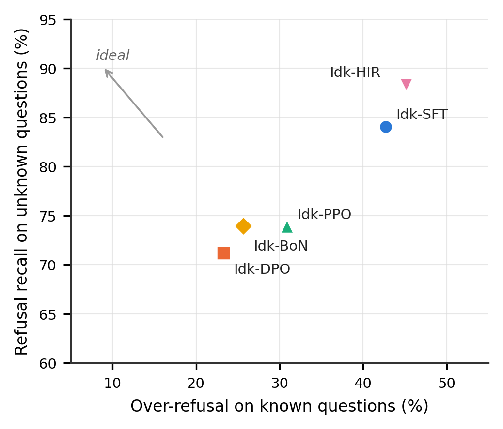
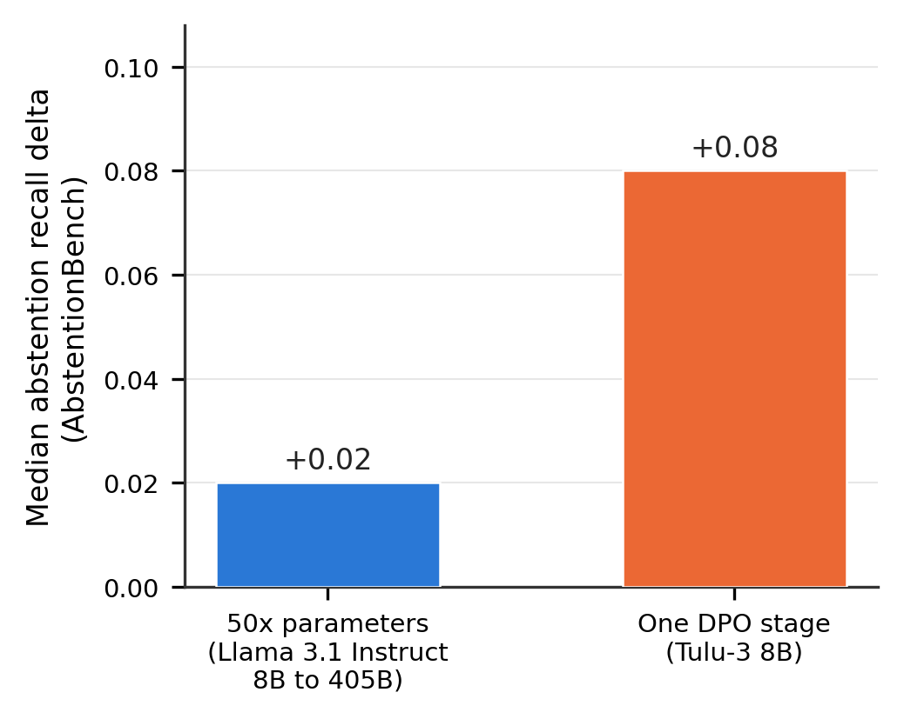
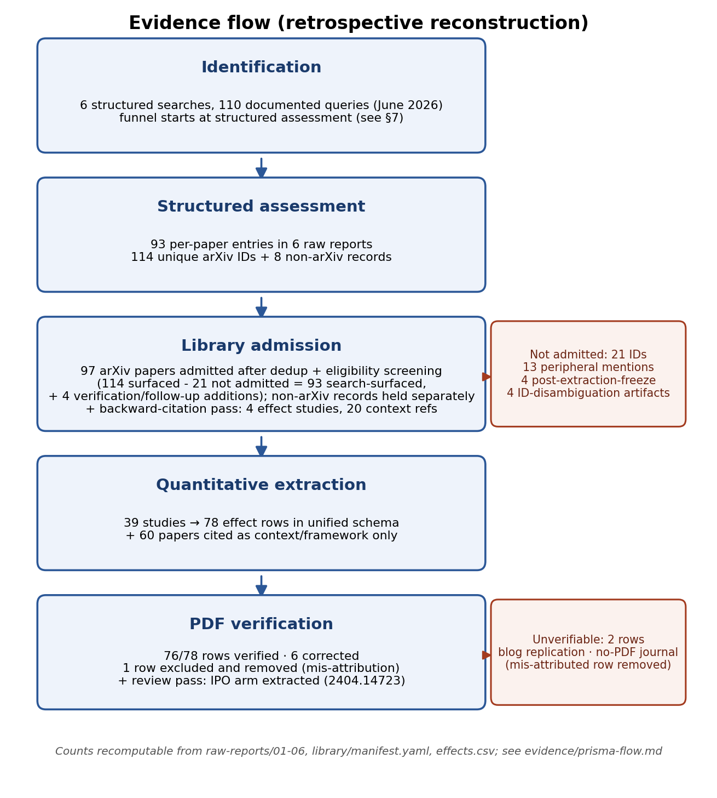

# The Depths of Ignorance: A Taxonomy, Systematic Evidence Synthesis, and Research Agenda for Epistemic Humility in Language Models

Joseph Rosenbaum
Synaptic Labs

*Draft v1. Not for distribution.*

> *"It is likely that neither of us knows anything worthwhile, but he thinks he knows something when he does not, whereas I, as I do not know, do not think I know either."*
>
> Plato, *Apology* 21d

## Abstract

Language models acquire most of their *expressed* epistemic character (how
confident they sound, when they refuse, how readily they capitulate) not from
pretraining but from post-training: the underlying signals are largely already
present in pretrained models, but post-training reshapes, and often degrades,
how they surface in behavior. We organize the evidence for that claim into a
single framework. First, a taxonomy: four *depths* at which a model can express
ignorance (scalar confidence, structured gap-naming, distributional failure
signatures, and uncertainty over the objective itself), crossed with a
*coherence* axis asking whether the model's stated, token-level, and
hidden-state signals agree. Second, a systematic synthesis: 78 quantitative
effects extracted from 39 studies (2021–2026) across the calibration,
abstention, hallucination, sycophancy, and method-comparison literatures,
synthesized by vote counting and exact binomial sign tests, with independent
reanalyses of three studies' released artifacts. Five claim families emerge,
with their study-level vote counts and exact sign tests: instruction tuning
and RLHF degrade token-level calibration (ECE 0.007 to 0.074 and 0.13 to 0.36
in the two clean head-to-heads; 2 supporting studies, 0 contradicting,
$p = 0.50$); a preference stage added after SFT beats SFT alone on abstention
quality, by a median relative gain of 5.0% on the truthfulness metric each
comparison reports (2 / 0, $p = 0.50$); that gain moves the
recall/over-refusal operating point, and whether any gain in known/unknown
discrimination rides on top of the move is unresolved at the one operating
point per method a single study's released outputs supply (1 / 0, one study);
scale alone does not produce humility (4 / 0, $p = 0.125$); and
targeted interventions reliably do (11 / 0, $p = 0.001$,
median |effect| 40.1%). The families combine into an unreconciled tension, one
that no study in the corpus measures within a single run: the methods that
best teach a model to *say* "I don't know" are the documented destroyers of
the signal that *knows*. We formalize this as a policy-versus-signal framework with four testable
propositions, verify six specific experiments the field has not run, and set
the agenda those propositions generate.

## 1. Introduction

A language model that answers fluently when it knows and abstains gracefully
when it does not would be, in a precise sense, aligned: its expressed epistemic
state would track its actual one. The models we deploy are not like this. They
assert falsehoods with high verbal confidence, refuse questions they could
answer, and abandon correct answers under trivial social pressure. A recent
theoretical account names the failure mode we adopt as framing: the **polite
liar** (DeVilling, 2025), a system that structurally misrepresents its own
epistemic state, not out of anything resembling malice, but because its
training rewarded the appearance of knowledge over the admission of ignorance
(cf. Kalai et al., 2025, who derive the same incentive from binary-graded
evaluation).

The contention of this paper is that these failures are primarily facts about
*training*, specifically post-training: not that pretraining leaves models
without epistemic signals (the first strand below shows the opposite), but
that post-training governs whether and how those signals are expressed in
behavior. Three strands of published evidence converge on training as the
causal locus of the expressed failures.

First, pretrained models already know how likely they are to be right, and
post-training breaks the readout. The GPT-4 technical report measures an
expected calibration error (ECE, the average gap between the probability a
model assigns to its answers and the rate at which those answers are actually
correct, so 0 is perfect and higher is worse) of 0.007 for the pretrained base model on a subset of MMLU (a broad multiple-
choice knowledge exam); after reinforcement learning from human feedback (RLHF), ECE on
the same subset rises tenfold to 0.074 (OpenAI, 2023). Kadavath et al. (2022)
identify the mechanism (RLHF concentrates probability mass on high-reward
outputs, sharpening every distribution whether or not the model's knowledge
warrants it) and show that a single temperature adjustment largely restores
calibration. That repairability is itself evidence: the signal survives in the
weights; it is merely expressed too confidently.

Second, the damage is not specific to reinforcement learning. A controlled
comparison on the same base model finds plain instruction tuning nearly
tripling ECE (0.13 to 0.36) while simultaneously *reducing* predictive entropy
(1.32 to 0.92), the spread of the model's output distribution, where lower
entropy means probability mass concentrated on fewer answers, a more decisive
model (Lithgow-Serrano et al., 2025): the tuned model becomes more decisive
and less reliable about its own reliability at the same time.

Third, the converse also holds: what training breaks, training can
deliberately improve. Refusal-aware tuning, factuality-aware DPO, calibrated
reward models, and listener-aware preference pairs consistently improve
humility metrics, often by large margins (Section 4, family C5).

What has been missing is a synthesis that treats the calibration, abstention,
hallucination, sycophancy, and method-comparison literatures as one evidence
base about a single underlying construct, together with a conceptual frame
precise enough to say what that construct *is*, which of its parts training
touches, and which experiments would decide between the readings the evidence
leaves open. This paper supplies both.

Contributions:

1. **A taxonomy of expressed ignorance** (four depths crossed with a
   coherence/faithfulness axis) that locates nearly all existing training
   work at the shallowest depth and exposes coherence as the unmeasured
   dimension (Section 2).
2. **A unified extraction of 78 quantitative effects from 39 studies** into a
   single schema, synthesized by vote counting and exact binomial sign tests,
   with independent reanalyses of three studies' released artifacts
   (Sections 3–4).
3. **Five claim families** with explicit support/contradict accounting, and
   the unifying tension they jointly produce: stated humility and calibrated
   humility are trained by the same methods in opposite directions, and no
   study measures both after the same run (Section 4).
4. **A verified gap analysis**: six specific, falsifiable claims about
   experiments absent from the literature, established by structured
   searches and re-verified by targeted spot-checks as this paper was
   finalized, with no closures found (Section 5).
5. **A theoretical framework** (expression policy over a fixed epistemic
   signal) stated as four testable propositions, with the research agenda they generate
(Section 6).

## 2. The Depths of Ignorance: a taxonomy

We use *epistemic humility* as an umbrella for behaviors and properties that
make a model's expressed epistemic state track its actual reliability:
token-probability and verbalized-confidence calibration; appropriate abstention
("I don't know") with low over-refusal; resistance to hallucination on
unfamiliar inputs; and resistance to sycophantic capitulation. *Post-training*
covers everything after pretraining: supervised/instruction fine-tuning (SFT);
preference optimization, including RLHF with PPO (Ouyang et al., 2022;
Schulman et al., 2017), direct preference optimization (DPO) (Rafailov et al.,
2023), and Kahneman-Tversky optimization (KTO) (Ethayarajh et al., 2024); and
RL with programmable rewards, including group relative policy optimization
(GRPO) (Shao et al., 2024).

A synthesis needs an organizing taxonomy, and the natural one is not a method
taxonomy (existing surveys of abstention (Wen et al., 2024) and honesty
(Li et al., 2024) provide those) but a *depth* taxonomy: a hierarchy of what,
exactly, is being formalized when a model "expresses ignorance."

- **L1: Confidence/calibration.** "How sure am I?" as a scalar: token
  probabilities and verbalized percentages (Lin et al., 2022; Tian et al.,
  2023a), scored by ECE, Brier score, and AUROC. This is the level of nearly
  all training work synthesized below.
- **L2: Structured ignorance.** "What am I missing?" as structure: gap-naming,
  knowledge-intersection identification, retrieval proposals (Sahoo, 2026;
  Taparia et al., 2026).
- **L3: Distributional/third-person signatures.** "What shape is my failure?"
  read from outside the model: population-level features of repeated failed
  attempts (Islah et al., 2026).
- **L4: Objective uncertainty.** "What should I even be optimizing?" as
  calibrated uncertainty over the reward itself (GX-Chen et al., 2026).

To the depths we add one **cross-cutting axis: coherence/faithfulness**. At any
level one can ask whether the model's *stated* signal, its *token-level*
signal, and its *hidden-state* signal agree. Token-probability, hidden-state,
and sampled-consistency estimators of internal confidence are documented to
diverge on the same reasoning traces (Gani et al., 2026). The coherence axis is
what distinguishes *possessed* humility from *performed* humility: Plato's
distinction, operationalized. The *Meno* closes on exactly this point: true
opinions, Socrates says, are like the statues of Daedalus, which run away
unless tethered by working out the reason (*Meno* 97d–98a; Plato, trans.
Grube, 1997). A humility behavior not anchored to the model's internal state
is an untethered statue: the right answer today, a runaway under
distribution shift. The mapping exercise below shows this axis is almost
entirely unmeasured in the training literature; measuring it is the first
item of the agenda in Section 6.

The taxonomy is stated over a model's expressed epistemic state,
and nothing in the four depths or the coherence axis is specific to text.
Every study synthesized in this paper is a language-model study, and we keep
the paper's claims to that evidence base, but the same questions arise
unchanged wherever a model must express ignorance about its input or its
knowledge: a vision-language model asked to identify an ambiguous image, to
name a person who does not exist, or to estimate an age from a photograph
faces L1 and L2 decisions of exactly the shape catalogued here. Extending the
synthesis and the agenda to multimodal settings is future work outside this
paper's scope.

## 3. Corpus and synthesis method

Evidence gathering began in 2026 with six structured searches (110
documented queries) plus a backward-citation pass over the full bibliography
(~4,000 referenced works ranked via the Semantic Scholar Graph API,
Appendix B), and the
corpus has been re-checked and updated on a rolling basis since, a necessity
given the speed at which this literature moves. The
corpus holds 78 effect rows from 39 studies (2021 to 2026) spanning calibration
(17 rows), abstention (26), hallucination/factuality (12), knowledge-boundary
(2), sycophancy (15), methods (4), and capability (2); 76 of 78 rows are
verified against a primary PDF or artifact, and headline claims rest on
verified rows only. Because the literature almost never reports variance (zero
error bars in any retrieved material from the twelve calibration studies in
our primary searches), we synthesize by vote counting with exact binomial sign
tests and descriptive normalization rather than formal pooling, following the
SWiM reporting guideline (Campbell et al., 2020) and the Cochrane Handbook's
sanctioned direction-based vote count (McKenzie & Brennan, 2023). The
underlying files are committed with the paper: an extracted evidence table
carrying one row per effect, a method-reanalysis table, and the deterministic
analysis scripts that regenerate every number reported here. Appendix A maps
each reported quantity to the artifact it comes from.

Three studies' released artifacts were additionally *reanalyzed* rather than
merely extracted: the released per-output files of the model-specific IDK
tournament of Cheng et al. (2024) ($n = 11{,}313$ outputs), the released
results of AbstentionBench (Kirichenko et al., 2025), and the released
generations behind FActScore (Min et al., 2023), reanalyzed descriptively for
the audit reported in Appendix D. The reanalyses matter because they expose
exactly the quantities the papers' aggregate metrics obscure, and two of the
five claim families below rest partly on them.

## 4. Five claim families

A claim family is a statement about the direction of an effect, backed by
counting the extracted rows that support or contradict it, with an exact
binomial sign test where the count permits. Five families, labeled C1 through
C5, survive the corpus.

### Claim 1 (C1): Instruction tuning and RLHF degrade token-probability calibration

The cleanest evidence for this claim comes from before-and-after pairs: take
one base model, measure its token-probability calibration, apply standard
post-training, and measure again. The corpus contains exactly two such head-
to-head pairs; both support the claim and neither contradicts it, a 2 / 0
tally that an exact two-sided sign test cannot separate from chance at that
count ($p = 0.50$). The damage itself is large. GPT-4's ECE
rises from 0.007 to 0.074, a 957% relative increase, after RLHF on the same
MMLU subset (OpenAI, 2023). The open-model pair tells the same story:
instruction tuning Pythia-7B into Dolly-v2-7B raises ECE from 0.13 to 0.36, a
177% increase, while predictive entropy falls, the signature of a model
growing more decisive without growing more correct (Lithgow-Serrano et al.,
2025). Three further studies corroborate the
direction without extractable pairs (Zhu et al., 2023; He et al., 2023;
Ye et al., 2024). The mechanism-level finding that matters most for training
design: what does the damage is the relationship between the tuning data and
*this model's* knowledge. Fine-tuning on facts the model does not know
causally drives hallucination (Gekhman et al., 2024); data aligned with prior
knowledge induces overconfidence, while genuinely novel data improves
calibration (Wang et al., 2025). Fitting unknowns teaches hallucination, and
fitting knowns teaches overconfidence, which is why every successful
abstention method builds *model-specific* training splits.

### Claim 2 (C2): A preference stage added after SFT beats SFT alone on abstention/truthfulness quality

In nearly every extracted comparison, the preference method is not an
alternative to SFT but a stage applied *after* it, scored against the SFT
model it started from. Two studies vote for the claim and none against it
($p = 0.50$), on a thin base: every such within-lineage comparison is
positive except one (identity preference optimization, IPO, underperforms SFT
by 5.4% (Saeidi et al., 2024)), and that exception sits inside one of the two
supporting studies, whose three arms net to a single supporting vote under
the one-study-one-vote rule of Appendix C.
The anchor is the only within-paper tournament on model-specific IDK data.
Cheng et al. (2024) build their training set by first testing which questions
the model itself can answer, labeling those known and the rest unknown, so the
dataset is specific to the model being trained. They then train
Llama-2-7b-chat with five methods and score truthful rate, the fraction of
questions the model handles correctly by either answering what it knows or
admitting what it does not. The preference arms build on the Idk-SFT stage,
and the ranking runs Idk-Prompting (simply instructing the model to refuse
when unsure) 66.93 < Idk-SFT 74.75 < Idk-HIR (hindsight instruction
relabeling) 75.91 < Idk-PPO 76.47 < Idk-DPO 77.89 < Idk-BoN (best-of-n
sampling against a reward model) 78.96. Our reanalysis of AbstentionBench (a benchmark suite that scores whether
models abstain on unanswerable questions; Kirichenko et al., 2025) adds an
independent lineage with the same staged structure. The Tulu-3 project
releases the intermediate checkpoints of its post-training pipeline, so
consecutive stages of one lineage can be compared directly: DPO is the stage
that follows SFT there, and it beats SFT on abstention recall by a paired
median of +0.08 at 8B ($p = 5.5 \times 10^{-4}$, our reanalysis).
The corpus contains exactly one comparison in which a preference method
skips SFT entirely: KTO applied directly to the pretrained base beats the SFT model on TruthfulQA
(a benchmark of questions people commonly answer falsely) by +9.3 points, versus +2.2 for KTO applied on top
of SFT (Saeidi et al., 2024), a suggestive but solitary data point. So the
evidence establishes that a preference stage *adds to* SFT; whether
preference optimization can *replace* SFT on this problem is measured once
in the corpus, and the within-run comparison that would settle it is part of
the missing experiment of Section 6. The magnitudes are small in the metrics
the studies themselves report: the median across the family is a 5.0%
relative gain, over a range from -5.4% to +21.2%, on truthful rate and
TruthfulQA score. The C1 damage is reported in a different metric on
different models and is not commensurable with these numbers: there, ECE
rises from 0.007 to 0.074 and from 0.13 to 0.36.

### Claim 3 (C3): Preference optimization reduces SFT-induced over-refusal

The evidence base for this family is one study's released artifacts: our
output-level reanalysis of Cheng et al.'s (2024) Llama-2-7b-chat outputs
($n = 11{,}313$), a within-model comparison of five training methods applied
to one base checkpoint. That is one supporting study and none contradicting,
so the sign test has nothing to work with ($n = 1$, $p = 1.00$) and the
family rests on the size and consistency of the within-model contrasts rather
than on replication. Those contrasts are the exact numbers the paper's
aggregate "truthful rate" obscures:

| Method | Refusal recall on unknown (%) | Over-refusal on known (%) | Youden's $J$ |
|---|---|---|---|
| Idk-SFT | 84.06 | 42.71 | 41.35 |
| Idk-DPO | 71.19 | 23.27 | 47.92 |
| Idk-PPO | 73.89 | 30.86 | 43.03 |
| Idk-BoN | 73.95 | 25.64 | 48.31 |
| Idk-HIR | 88.37 | 45.16 | 43.20 |

DPO cuts SFT's over-refusal nearly in half, but the improvement is a *trade*:
refusal recall on genuinely unknown questions falls 84.06 to 71.19. Whether
anything beyond a trade happened is what the third column asks. Youden's $J$,
refusal recall minus over-refusal, is the standard one-number summary of how
far an operating point sits above the chance diagonal, and DPO and BoN sit 6
to 7 points of $J$ above SFT (47.92 and 48.31 against 41.35), while PPO and
HIR sit within 2 points of it. A gap that size is not nothing. It is also not
adjudicable here: each method contributes exactly one operating point, and $J$
read at one operating point moves with the threshold, so with five points and
no ROC curves the data cannot tell a genuine frontier improvement apart from
movement along an asymmetric frontier whose two error rates trade at
different rates in different regions. Both readings fit these five numbers,
and nothing in the released artifacts separates them.

**Figure 1. The recall/over-refusal trade across five IDK training methods
on Llama-2-7b-chat (our reanalysis of Cheng et al.'s released outputs,
$n = 11{,}313$).** Higher refusal recall on unknown questions comes paired
with higher over-refusal on known questions; no method reaches the ideal
top-left corner. The preference methods (DPO, BoN, PPO) and the SFT-family
methods (SFT, HIR) occupy two ends of the same frontier, with one exception
inside the preference group: BoN dominates PPO outright, reaching slightly
higher refusal recall (73.95 against 73.89) at markedly lower over-refusal
(25.64 against 30.86).

Our second reanalysis bounds the claim: on the Tulu-3 ladder, where SFT is general-purpose rather than
abstention-targeted, there is no over-refusal deficit to repair, so
SFT-induced over-refusal is a property of abstention-targeted SFT data, not of
SFT per se (the same data-dependence appears in safety tuning, where added
safety examples induce exaggerated refusal of benign prompts; Bianchi et al.,
2023). Two further observations from the reanalyses discipline everything
downstream: single-scalar abstention metrics hide which failure a model makes
(recall and precision are decoupled across 20 models, Spearman
$\rho = -0.05$), and model-specific known/unknown labels are themselves noisy
(42.9 to 51.3% of answers on unknown-labeled questions were in fact correct).

C3 therefore claims less than that preference optimization leaves
discrimination untouched. What the corpus supports is that the trade dominates
the observed movement: the largest changes are the paired swings in refusal
recall and over-refusal, and the group-level statement that the preference
methods buy lower over-refusal with lower recall holds for every one of them,
even though within the group BoN dominates PPO on both error rates at once and
so is not on a shared frontier with it. Whether a discrimination gain rides on
top of that trade is unresolved at single-threshold resolution, and the label
noise makes it harder still: 42.9 to 51.3% of the answers these models gave on
unknown-labeled questions were correct, so the split both error rates are
computed against does not cleanly separate what the model knows from what it
does not. Settling the question needs threshold sweeps or ROC curves per
method, which no study in the corpus reports.

### Claim 4 (C4): Scale alone does not produce epistemic humility

Making a model bigger does not, by itself, make it better at knowing and
saying what it does not know. Four studies support this and none contradict
it ($p = 0.125$). Larger models are not more truthful: the
best GPT-3 model is truthful on 58% of TruthfulQA against a 94% human
baseline, and within a model family the larger variants are *less* truthful
(inverse scaling; Lin et al., 2021). Even frontier scale leaves a clear gap
to humans on recognizing unanswerable questions: GPT-4 detects them at
$F_1 = 75.47$ versus a human 84.93 (Yin et al., 2023; see also the
known-unknowns probing of Amayuelas et al., 2023). One failure mode actively
worsens with scale: sycophancy grows as models get larger (Perez et al.,
2022; Wei et al., 2023). And the direct size-versus-training comparison is
lopsided, though its two sides come from different lineages and different
estimators. The scale side is the Llama 3.1 Instruct family, whose median
abstention recall over the 30 AbstentionBench subsets all three sizes share
(UMWP dropped for want of a 405B result) runs 0.69 at 8B, 0.68 at 70B, and
0.71 at 405B: not monotone in size, and a difference of medians of +0.02
across a 50-fold parameter increase. The training side is the Tulu-3 8B
lineage, which releases consecutive post-training checkpoints, so the SFT and
DPO stages can be compared cell by cell: over the 30 subsets present at every
stage (MMLU History dropped), the paired median delta from SFT to DPO is
+0.08 ($p = 5.5 \times 10^{-4}$). One quantity is a between-model difference
of medians, the other a within-lineage paired median, on cell sets that
differ by one subset, so the four-to-one ratio is a rough juxtaposition of two
differently estimated numbers rather than one controlled measurement. The
practical consequence survives it: waiting for the next model
generation does not solve this problem; training design does or does not.

**Figure 2. Scale versus training on abstention recall (our AbstentionBench
reanalysis).** Multiplying Llama 3.1 Instruct's parameters 50-fold (8B to
405B) moves median abstention recall by +0.02, non-monotonically (0.69, 0.68,
0.71); a single DPO stage on the Tulu-3 8B lineage moves it +0.08, four times
as much. The left bar is a between-model difference of medians over 30 shared
subsets, the right bar a within-lineage paired median delta over a 30-subset
set differing by one subset, so the two bars are juxtaposed rather than
measured alike.

### Claim 5 (C5): Targeted training interventions improve humility metrics

When training aims directly at a humility behavior, it works. Eleven studies
in the corpus report a targeted training intervention, and all eleven moved
their chosen metric in the intended direction; none moved it the wrong way.
That eleven-for-eleven count is the corpus's only conventionally significant
sign test ($p = 0.001$), and the effects are not small: the median reported
change is 40.1%. Nor are the eleven interventions variations on one idea. SFT
variants teach refusal (Zhang et al., 2023) and honesty (Yang et al., 2023);
DPO variants target factuality (Tian et al., 2023b) and what a listener
actually takes away from the answer (Stengel-Eskin et al., 2024); PPO with a
calibrated reward tames overconfidence (Leng et al., 2024); and self-training
approaches teach the model to verbalize its own uncertainty (Xu et al., 2024;
Liu et al., 2024). Many different levers move the same construct, which is
what makes the signal credible. The catch is coverage: each study measures the
one behavior it trained, so the corpus never learns what any of these
interventions did to the humility behaviors it was not aimed at.

### What the families do not yet cover: verifiable-RL abstention

A sixth family cannot yet be stated, and not for lack of results. A rapidly
growing cluster trains abstention with RL against verifiable rewards, GRPO-
style, and its individual numbers are striking. None of those numbers cleared
this paper's verification protocol: the primary PDFs were unreachable at
extraction time, so what follows is secondary extraction, reported as its
sources report it, held out of the evidence table, and counted in no family
tally. TruthRL's ternary reward (answer right, abstain, answer
wrong, scored +1/0/-1) is reported to cut hallucination by 28.9% and raise
truthfulness by 21.1% against a vanilla-GRPO baseline across four QA
benchmarks with and without retrieval (Wei et al., 2025). RLCR's
correctness-minus-Brier reward is reported to reduce calibration error by up
to roughly 90% versus binary-reward RL at preserved accuracy (Damani et al.,
2025). Abstain-R1 pairs an SFT cold-start with GRPO and even
runs an SFT-only ablation arm (Zhai et al., 2026); reinforced hesitation
(Mohamadi et al., 2025) and newer 2026 entries (an RLVR ternary abstention
reward, Jha et al., 2026; trajectory-informed advantage reweighting, Pan et
al., 2026) extend the family. What keeps all of this out of the claim families
is comparison structure, not quality: every result above is measured against
its own prompting, vanilla-RL, or cold-start baseline, on its own dataset, and none against
the SFT and preference families on shared data (the Abstain-R1 ablation comes
closest and still has no preference arm). Standalone wins on disjoint
benchmarks cannot be vote-counted the way C1 through C5's within-lineage rows
can, so the cluster enters the synthesis as an absence (Gap 3, Section 5), and
any credible version of the missing comparison in Section 6 must now include a
verifiable-RL arm alongside SFT and the preference methods, and must ask the
same question of it that C2/C3 ask of preference optimization: new operating
point, or better discrimination?

### The unifying tension

Set C1 beside C2/C3: preference-based post-training
is the best available tool for abstention quality and over-refusal control,
and preference-based post-training is the documented destroyer of token-level
calibration. These findings come from disjoint studies measuring disjoint
metrics on disjoint models. **No study in our corpus measures calibration,
abstention quality, and factuality after the same preference-training run.**
It is therefore unknown whether the methods that teach a model to *say* "I
don't know" at the right times simultaneously degrade the signal that says the
same thing: whether we are buying stated humility by selling calibrated
humility.

## 5. What the field has not run

The gap analysis was run the opposite way from the rest of the synthesis:
instead of searching for what the literature contains, it searched for studies
that *should* exist and do not. Each gap is a falsifiable claim about absence
as of this writing: the structured searches established each absence, and
targeted recency spot-checks as the paper was finalized confirmed none had
closed. Six were verified:

- **Gap 1: KTO has never been applied to abstention, honesty, or calibration
  training** (high confidence; zero hits across targeted searches, and the KTO
  paper's own application list contains none). The KTO results in C2 do not
  close this gap, and the distinction is worth being precise about: Saeidi et
  al. (2024) train KTO on general-purpose alignment data and then evaluate on
  TruthfulQA, and evaluating on a truthfulness benchmark is not the same as
  training on abstention, honesty, or calibration data. Those results sit
  adjacent to the gap, not inside it. The gap matters because KTO's
  structure fits the problem unusually well: it consumes exactly the unpaired
  binary desirable/undesirable labels a known/unknown split naturally
  produces, and its prospect-theoretic loss weights losses asymmetrically, as
  this domain's costs are (a confident hallucination typically does more
  damage than an unnecessary abstention).
- **Gap 2: No SFT vs. DPO vs. KTO three-way comparison exists on the same
  abstention dataset** (high confidence). Cheng et al. (2024) compare five
  methods but not KTO; the one SFT/DPO/KTO comparison that exists uses generic benchmarks, not
abstention training (Saeidi et al., 2024). Every component of the experiment
  exists in print; no study assembles them.
- **Gap 3: GRPO-for-abstention exists, but no controlled comparison against
  SFT/DPO/KTO does.** The verifiable-RL cluster surveyed at the end of
  Section 4 (Wei et al., 2025; Zhai et al., 2026; Mohamadi et al., 2025;
  Damani et al., 2025; Jha et al., 2026; Pan et al., 2026) demonstrates the
  approach works, but none of it is benchmarked against the SFT and
  preference families on shared data, so the
  field cannot say where verifiable-RL abstention sits relative to the
  methods it would replace.
- **Gap 4: No study tests whether humility training changes representations
  or only behavior.** This holds across every training family in the corpus,
  preference and verifiable-RL alike: the calibration-damage literature (C1)
  and the linear-probing literature both exist, but no study fits probes
  before and after abstention training on the same checkpoints to ask what
  the training actually moved. The nearest miss to date (Srey et al., 2026)
  factorises probe design and out-of-distribution transfer of uncertainty
  probes under matched conditions, but never crosses a training run: probes
  are never fit to the same checkpoints before and after abstention or
  preference training. One caution from the RL literature binds any study
  that would close this gap: probes placed *inside* RL reward loops get gamed
  (Cundy & Gleave, 2025), so representation probes must remain held-out
  evaluation, never reward.
- **Gap 5: Nobody has measured how the abstention-training mixture controls
  the trained behavior.** Every model-specific abstention method builds its
  training set by choosing what fraction of examples demonstrate "I don't
  know," and every one fixes that fraction by fiat at a single value. No
  study varies the fraction and traces the resulting behavior, so the most
  basic dose-response fact is unknown, where the dose here is the IDK
  fraction of the training mixture and the response is the trained model's
  refusal behavior: whether abstaining more or less can be
  dialed in through the data mixture, at what rate over-refusal rises as
  refusal recall does, and whether the chosen fixed points in the literature
  are anywhere near anyone's preferred trade-off.
- **Gap 6: Small-model and OOD coverage is thin.** The abstention-training
  literature concentrates on 7B-and-larger chat models evaluated
  in-distribution; whether the methods transfer down-scale and out of
  distribution is asserted rather than measured.

## 6. A framework, four propositions, and the agenda

The five families and six gaps compress into a single conceptual picture.
Distinguish two objects inside a trained model:

- the **epistemic signal**: whatever function of the input and the model's
  internal state actually tracks "can this model answer this correctly?"
  (the thing calibration is calibration *of*);
- the **expression policy**: the learned mapping from that signal (and
  everything else) to observable behavior, that is, answering, refusing,
  hedging, and the confidence the model verbalizes.

We use "epistemic signal" here as a working simplification: nothing below
requires it to be a single one-dimensional object, and whether it is one
signal or several is itself an empirical question the agenda leaves open.

Restated in these terms, the five claim families stop being separate findings
and become one story.

Start with C1, the calibration damage. Kadavath et al. (2022) supply the
mechanism: RLHF concentrates probability mass on high-reward outputs, so the
model's stated probabilities come out overconfident everywhere. But a single
temperature adjustment, one scalar applied at inference time with no
retraining, largely restores calibration. That repair is the telling fact. If
post-training had destroyed the model's internal sense of what it knows, no
one-parameter correction could bring it back: information that is gone cannot
be recovered by rescaling. So what RLHF damaged is the readout, the mapping
from internal signal to expressed confidence. The signal itself survived.

Now C2 and C3, the preference-stage gains. A preference stage makes the model
abstain more where it should and over-refuse less, which sounds like the model
got better at knowing its limits. Figure 1 shows the movement that dominates:
the methods slide along a shared frontier, trading refusal recall against
over-refusal. Whether anything moved besides the operating point is a question
these data leave open. Improving both error rates at once would be a clear
sign that a model had genuinely become better at telling what it knows from
what it does not, and none of these methods does it; but that test is
sufficient rather than necessary, and the one summary sensitive to a smaller
gain, Youden's $J$, is read here at a single operating point per method, where
it cannot separate a frontier shift from a trade along an asymmetric frontier.
Sliding along a fixed curve is what it looks like to change the policy while
the signal stays put, and it is the reading this corpus best supports without
being the only reading it permits.

C4 fits the same picture from the other side. Making the model bigger
plausibly grows the signal: larger models know more, and their internals
encode more. Yet abstention behavior barely moves with scale. A larger signal
with no policy to express it produces no visible humility. And C5 completes
the story: when training targets a humility behavior directly, it reliably
works, because installing an expression policy is exactly the thing output-
side training is good at.

Read this way, the families converge on one claim: everything post-training
does here, the gains and the damage alike, is accounted for by changes to the
expression policy, and no study in the corpus demonstrates a training
intervention improving the signal itself. That is an absence of demonstration
rather than a demonstrated absence, and the measurement that would turn one
into the other is missing from the literature. The coherence axis of Section 2 becomes the natural
measurement: how well do the policy's outputs track the signal? That question,
almost entirely unmeasured in the literature, is what the propositions below
make precise.

The picture reduces to four propositions, each falsifiable:

- **P1 (locus).** A model's expressed epistemic character (its calibration,
  abstention, and capitulation behavior) is predominantly set by
  post-training, not by scale or pretraining; pretraining supplies the
  signal, post-training decides how it is expressed. *(Supported directly by
  C1, C4, C5; falsified if base models before any post-training already
  differ in expressed character as much as post-trained models do.)*
- **P2 (policy, not signal).** Post-training objectives act on the expression
  policy and leave the underlying epistemic signal approximately fixed:
  different objectives select different operating points on a frontier the
  signal defines, and no output-side objective moves the frontier itself.
  *(Consistent with C2/C3's trade structure, which does not test it: the
  corpus reports one operating point per method and no ROC curves, so it can
  neither fire this falsifier nor clear it. Falsified by a training objective
  demonstrated to improve known/unknown discrimination itself, which requires
  a measurement across thresholds rather than at one.)*
- **P3 (readout).** If P2 holds, the binding constraint on epistemic humility
  is not training pressure but *readout*: the internal signal is present and
  linearly accessible, and coupling behavior and stated confidence to it,
  rather than training the output channel harder, is the productive
  engineering target. *(Motivated by the temperature-repair result and the
  probing literature; falsified if the internal signal proves weak,
  incoherent across estimators (Gani et al., 2026), or non-transferable across the error populations a deployed model actually faces.)*
- **P4 (control without training).** If P1 through P3 hold, improving
  epistemic humility should not require further training at all. The signal
  is already in the model, and the binding constraint is the readout, so
  reading the internal state directly and coupling behavior to what is read
  (answer when the signal says known, abstain when it says unknown, state
  confidence in proportion) should recover from a frozen model the benefits
  that targeted training installs. The strong form adds the write direction:
  a state that can be read should also be settable, so that expression
  follows internal state in both directions rather than merely reporting it.
  *(The constructive consequence of P2 and P3; falsified if a training-free
  readout cannot reach the operating points that targeted training reaches
  under C5, or if the state can be read but behavior cannot be coupled to
  it.)*

The propositions generate a concrete agenda, ordered by the gaps:

1. **Run the missing comparison** (Gaps 1–3): every major post-training
   objective, SFT, the preference family, and a verifiable-RL arm, on the
   same base model and the same model-specific abstention data, measuring
   behavior, stated confidence, and hidden-state signal after the same runs,
   and replicated across scales and at least a second model family so the
   result is not a fact about one checkpoint. This is the direct within-run
   test of the C1-versus-C2/C3 tension and of P2.
2. **Measure the coherence axis directly** (Gap 4): quantify the gap between
   internal and stated confidence on identical rows, and test whether any
   training regimen closes it.
3. **Test the readout constructively** (P3 and P4): if the signal is present and the
   channel is the problem, a training-free readout should recover calibrated
   gating and trust from frozen models, and the test of the claim is whether
   that readout transfers across datasets, scales, and model families. The
   complementary causal question, whether the state a readout reads can also
   be *written*, is what separates a diagnostic from a control surface.
4. **Fill the remaining measurement gaps** (Gaps 5–6): sweep the IDK
   fraction of the training mixture and trace the recall/over-refusal
   operating point it produces (the dose-response curve of Gap 5); rerun the
   winning methods on models well below 7B; and evaluate every trained
   abstention behavior out of distribution, where Gap 6 notes transfer is
   currently asserted rather than measured.

The framework also disciplines interpretation in advance: if the missing
comparison finds that objectives merely relocate operating points, league
tables comparing "which objective wins" are category errors: the right
comparanda are *regimens* (inducer + repositioner + amplifier stages), and the
right report is an operating point with both error rates, never a single
scalar.

## 7. Limitations

This synthesis inherits the limitations of its corpus. Extraction was
single-pass with a ~13% first-pass correction rate caught by verification
(Appendix C);
vote-count synthesis was forced by a variance-free literature (zero error bars
in any retrieved material from the twelve calibration studies in our primary
searches); and the claim families were articulated after seeing the raw
reports (confirmatory in form, exploratory in origin). Coverage is
English-language and arXiv-centric, though not unexamined: a five-language
probe (Chinese, Japanese, Korean, French, German) found surveys, detection
methods, and inference-time mitigation work in native-language venues, but no
original quantitative training-intervention study on these outcomes published
only outside English-language venues, consistent with this subfield
publishing on arXiv in English regardless of lab origin; non-archival
native-language theses and proceedings remain unscreened. The reanalyses
cover three studies' artifacts, not the corpus. The propositions of Section 6 are a reading of observational syntheses, not
established results: this program's empirical work treats P2, P3, and P4 as
hypotheses with pre-registered falsifiers, not as conclusions.

Finally, reflexivity, disclosed in the spirit of the paper's subject: this
synthesis was produced with a large language model in the loop at nearly
every stage. The structured searches were executed by LLM search agents, with
the human author directing the program: framing the research questions,
setting the inclusion criteria and provenance rules, and adjudicating
disputed items. The evidence extraction and the synthesis code (vote
counting, sign tests, figures, the output-level reanalyses) were AI-written
and human-reviewed, with every statistic recomputable from the committed data
files. The PDF verification pass was carried out by LLM agents reading the
primary sources, with figure-only values confirmed visually from rendered
page images after two text-extraction misreads. The prose was AI-drafted
under human editorial control. Every number traces to a named artifact, the
audit trail of corrections is preserved in the evidence store, and the ~13%
first-pass correction rate is reported here rather than smoothed over. The
procedural version of this disclosure is Appendix C, and the corrections
themselves are logged with the evidence tables listed in Appendix A.

## 8. Conclusion

The published evidence, read as one corpus, says that epistemic humility is
made and broken in post-training: calibration is damaged by the same stages
that install useful behavior, targeted interventions work but are evaluated a
slice at a time, scale does not save us, and the field has never measured
whether its best abstention-training methods pay for stated humility with
calibrated humility, because no study measures both in the same run. The
Depths of Ignorance taxonomy locates nearly all of this work at the
shallowest depth, with the coherence between what a model knows and what it
says almost entirely unmeasured. We propose treating the trained model as an
expression policy over a fixed epistemic signal, offer four falsifiable propositions, and derive the experiments that decide them. Running those
experiments is the work of this research program.

## References

Amayuelas, A., Wong, K., Pan, L., Chen, W., & Wang, W. Y. (2023). *Knowledge
of Knowledge: Exploring Known-Unknowns Uncertainty with Large Language
Models*. arXiv:2305.13712.

Bianchi, F., Suzgun, M., Attanasio, G., Röttger, P., Jurafsky, D.,
Hashimoto, T., & Zou, J. (2023). *Safety-Tuned LLaMAs: Lessons From Improving
the Safety of Large Language Models that Follow Instructions*.
arXiv:2309.07875.

Buscemi, N., Hartling, L., Vandermeer, B., Tjosvold, L., & Klassen, T. P.
(2006). *Single data extraction generated more errors than double data
extraction in systematic reviews*. Journal of Clinical Epidemiology, 59(7),
697–703.

Campbell, M., McKenzie, J. E., Sowden, A., Katikireddi, S. V., Brennan,
S. E., Ellis, S., Hartmann-Boyce, J., Ryan, R., Shepperd, S., Thomas, J.,
Welch, V., & Thomson, H. (2020). *Synthesis without meta-analysis (SWiM) in
systematic reviews: reporting guideline*. BMJ, 368, l6890.

Cheng, Q., Sun, T., Liu, X., Zhang, W., Yin, Z., Li, S., Li, L., He, Z.,
Chen, K., & Qiu, X. (2024). *Can AI Assistants Know What They Don't Know?*
arXiv:2401.13275.

Cundy, C., & Gleave, A. (2025). *Preference Learning with Lie Detectors can
Induce Honesty or Evasion*. arXiv:2505.13787.

Damani, M., Puri, I., Slocum, S., Shenfeld, I., Choshen, L., Kim, Y., &
Andreas, J. (2025). *Beyond Binary Rewards: Training LMs to Reason About
Their Uncertainty*. arXiv:2507.16806.

DeVilling, B. (2025). *The Polite Liar: Epistemic Pathology in Language
Models*. arXiv:2511.07477.

Ethayarajh, K., Xu, W., Muennighoff, N., Jurafsky, D., & Kiela, D. (2024).
*KTO: Model Alignment as Prospect Theoretic Optimization*. arXiv:2402.01306.

Gani, A., Meskin, A., Liu, G. K.-M., & Cohan, A. (2026). *Quantifying
Faithful Confidence Expression in Large Reasoning Models*. arXiv:2606.03969.

Gekhman, Z., Yona, G., Aharoni, R., Eyal, M., Feder, A., Reichart, R., &
Herzig, J. (2024). *Does Fine-Tuning LLMs on New Knowledge Encourage
Hallucinations?* arXiv:2405.05904.

GX-Chen, A., Anand, A., Comanici, G., Abbas, Z., Aygün, E., Smalling, D.,
Mourad, S., Precup, D., & Barreto, A. (2026). *Using Reward Uncertainty to
Induce Diverse Behaviour in Reinforcement Learning*. arXiv:2606.03962.

He, G., Cui, P., Chen, J., Hu, W., & Zhu, J. (2023). *Investigating
Uncertainty Calibration of Aligned Language Models under the Multiple-Choice
Setting*. arXiv:2310.11732.

Islah, N., Abbes, I., Rish, I., Chandar, S., & Muller, E. B. (2026). *Failed
Reasoning Traces Tell You What Is Fixable (But Not by Reading Them)*.
arXiv:2606.05145.

Jha, R., et al. (2026). *Rewarding Intellectual Humility: Learning When Not
To Answer in LLMs*. arXiv:2601.20126.

Kadavath, S., et al. (2022). *Language Models (Mostly) Know What They Know*.
arXiv:2207.05221.

Kalai, A. T., Nachum, O., Vempala, S. S., & Zhang, E. (2025). *Why Language
Models Hallucinate*. arXiv:2509.04664.

Khraisha, Q., et al. (2024).
*Can large language models replace humans in systematic reviews? Evaluating
GPT-4's efficacy in screening and extracting data from peer-reviewed and grey
literature in multiple languages*. Research Synthesis Methods.
doi:10.1002/jrsm.1715.

Kirichenko, P., Ibrahim, M., Chaudhuri, K., & Bell, S. J. (2025).
*AbstentionBench: Reasoning LLMs Fail on Unanswerable Questions*.
arXiv:2506.09038.

Leng, J., Huang, C., Zhu, B., & Huang, J. (2024). *Taming Overconfidence in
LLMs: Reward Calibration in RLHF*. arXiv:2410.09724.

Li, S., Yang, C., Wu, T., Shi, C., Zhang, Y., Zhu, X., Cheng, Z., Cai, D.,
Yu, M., et al. (2024). *A Survey on the Honesty of Large Language Models*.
arXiv:2409.18786.

Lin, S., Hilton, J., & Evans, O. (2021). *TruthfulQA: Measuring How Models
Mimic Human Falsehoods*. arXiv:2109.07958.

Lin, S., Hilton, J., & Evans, O. (2022). *Teaching Models to Express Their
Uncertainty in Words*. arXiv:2205.14334.

Lithgow-Serrano, O., Kanjirangat, V., & Antonucci, A. (2025). *Causal
Understanding by LLMs: The Role of Uncertainty*. arXiv:2509.20088.

Liu, S., Li, Z., Liu, X., Zhan, R., Wong, D. F., Chao, L. S., & Zhang, M.
(2024). *Can LLMs Learn Uncertainty on Their Own? Expressing Uncertainty
Effectively in A Self-Training Manner*. In *Proceedings of EMNLP 2024*.
doi:10.18653/v1/2024.emnlp-main.1205.

McKenzie, J. E., & Brennan, S. E. (2023). *Synthesizing and presenting
findings using other methods*. In J. P. T. Higgins, J. Thomas, J. Chandler,
M. Cumpston, T. Li, M. J. Page, & V. A. Welch (Eds.), *Cochrane Handbook for
Systematic Reviews of Interventions* (version 6.4, chapter 12). Cochrane.

Min, S., Krishna, K., Lyu, X., Lewis, M., Yih, W.-t., Koh, P. W., Iyyer, M.,
Zettlemoyer, L., & Hajishirzi, H. (2023). *FActScore: Fine-grained Atomic
Evaluation of Factual Precision in Long Form Text Generation*.
arXiv:2305.14251.

Mohamadi, M. A., Wang, T., & Li, Z. (2025). *Honesty over Accuracy:
Trustworthy Language Models through Reinforced Hesitation*. arXiv:2511.11500.

OpenAI (2023). *GPT-4 Technical Report*. arXiv:2303.08774.

Ouyang, L., et al. (2022). *Training language models to follow instructions
with human feedback*. arXiv:2203.02155.

Page, M. J., McKenzie, J. E., Bossuyt, P. M., et al. (2021). *The PRISMA 2020
statement: an updated guideline for reporting systematic reviews*. BMJ, 372,
n71.

Pan, M., et al. (2026). *TIAR: Trajectory-Informed Advantage Reweighting for
LLM Abstention Learning*. arXiv:2605.25850.

Perez, E., Ringer, S., Lukošiūtė, K., Nguyen, K., et al. (2022).
*Discovering Language Model Behaviors with Model-Written Evaluations*.
arXiv:2212.09251.

Plato. *Apology* (21d) and *Meno* (80a–86c, 97d–98a). Translations by
G. M. A. Grube, in *Plato: Complete Works*, ed. J. M. Cooper, Hackett, 1997.

Rafailov, R., Sharma, A., Mitchell, E., Ermon, S., Manning, C. D., & Finn, C.
(2023). *Direct Preference Optimization: Your Language Model is Secretly a
Reward Model*. arXiv:2305.18290.

Saeidi, A., Verma, S., Uddin, M. N., & Baral, C. (2024). *Insights into
Alignment: Evaluating DPO and its Variants Across Multiple Tasks*.
arXiv:2404.14723.

Sahoo, S. (2026). *Calibration of Structured Ignorance Certificates for
Diagnosing Unknown Unknowns in Reasoning Models*. arXiv:2606.08571.

Schulman, J., Wolski, F., Dhariwal, P., Radford, A., & Klimov, O. (2017).
*Proximal Policy Optimization Algorithms*. arXiv:1707.06347.

Shao, Z., et al. (2024). *DeepSeekMath: Pushing the Limits of Mathematical
Reasoning in Open Language Models* (GRPO). arXiv:2402.03300.

Srey, P., Wu, X., Nguyen, C.-D., Nguyen, Q. M., Vu, D. A., & Luu, A. T.
(2026). *From Signals to Transfer: A Factorised Study of Probe-Based
Uncertainty Estimation in Large Language Models*. arXiv:2606.27679.

Stengel-Eskin, E., Hase, P., & Bansal, M. (2024). *LACIE: Listener-Aware
Finetuning for Confidence Calibration in Large Language Models*.
arXiv:2405.21028.

Taparia, A., Senanayake, R., Thopalli, K., & Narayanaswamy, V. (2026). *The
Anatomy of Uncertainty in LLMs*. arXiv:2603.24967.

Tian, K., Mitchell, E., Zhou, A., Sharma, A., Rafailov, R., Yao, H.,
Finn, C., & Manning, C. D. (2023a). *Just Ask for Calibration: Strategies for
Eliciting Calibrated Confidence Scores from Language Models Fine-Tuned with
Human Feedback*. arXiv:2305.14975.

Tian, K., Mitchell, E., Yao, H., Manning, C. D., & Finn, C. (2023b).
*Fine-tuning Language Models for Factuality*. arXiv:2311.08401.

Wang, Z., Shi, Z., Zhou, H., Gao, S., Sun, Q., & Li, J. (2025). *Towards
Objective Fine-tuning: How LLMs' Prior Knowledge Causes Potential Poor
Calibration?* arXiv:2505.20903.

Wei, J., Huang, D., Lu, Y., Zhou, D., & Le, Q. V. (2023). *Simple synthetic
data reduces sycophancy in large language models*. arXiv:2308.03958.

Wei, Z., Yang, X., Sun, K., Wang, J., Shao, R., Chen, J., et al. (2025).
*TruthRL: Incentivizing Truthful LLMs via Reinforcement Learning*.
arXiv:2509.25760.

Wen, B., et al. (2024). *Know Your Limits: A Survey of Abstention in Large
Language Models*. arXiv:2407.18418.

Xu, T., Wu, S., Diao, S., Liu, X., Wang, X., Chen, Y., & Gao, J. (2024).
*SaySelf: Teaching LLMs to Express Confidence with Self-Reflective
Rationales*. arXiv:2405.20974.

Yang, Y., Chern, E., Qiu, X., Neubig, G., & Liu, P. (2023). *Alignment for
Honesty*. arXiv:2312.07000.

Ye, F., Yang, M., Pang, J., Wang, L., Wong, D. F., Yilmaz, E., Shi, S., &
Tu, Z. (2024). *Benchmarking LLMs via Uncertainty Quantification*.
arXiv:2401.12794.

Yin, Z., Sun, Q., Guo, Q., Wu, J., Qiu, X., & Huang, X. (2023). *Do Large
Language Models Know What They Don't Know?* arXiv:2305.18153.

Zhai, S., Liang, J., & Kang, D. (2026). *Abstain-R1: Calibrated Abstention
and Post-Refusal Clarification via Verifiable RL*. arXiv:2604.17073.

Zhang, H., Diao, S., Lin, Y., Fung, Y. R., Lian, Q., Wang, X., Chen, Y.,
Ji, H., & Zhang, T. (2023). *R-Tuning: Instructing Large Language Models to
Say "I Don't Know"*. arXiv:2311.09677.

Zhu, C., Xu, B., Wang, Q., Zhang, Y., & Mao, Z. (2023). *On the Calibration
of Large Language Models and Alignment*. arXiv:2311.13240.

---

## Appendix A: The synthesis apparatus, file by file

The apparatus this paper describes is committed with it, one directory per
kind of artifact, and every number in Sections 3–5 traces to one of the files
below. Appendices B, C, and D state the protocols these files record.

- [The evidence
  table](https://github.com/ProfSynapse/Epistemic-Humility-Research/blob/main/papers/paper-1-taxonomy-framework/evidence/effects.csv):
  78 extracted effect rows from 39 studies, one row per effect, with
  comparison structure, baseline and treatment conditions, and per-row
  verification status. Each row's free-text notes field carries its audit
  trail, so the corrections reported in Section 7 and Appendix C are logged
  against the rows they changed. Schema in Appendix C.
- [The IDK method
  reanalysis](https://github.com/ProfSynapse/Epistemic-Humility-Research/blob/main/papers/paper-1-taxonomy-framework/evidence/idk-method-reanalysis.csv):
  output-level reanalysis of Cheng et al.'s (2024) released outputs
  ($n = 11{,}313$), the refusal-recall and over-refusal decomposition behind
  C3.
- [The AbstentionBench
  reanalysis](https://github.com/ProfSynapse/Epistemic-Humility-Research/blob/main/papers/paper-1-taxonomy-framework/evidence/abstentionbench-reanalysis.md):
  the Tulu-3 post-training ladder, the scale sweep behind C4, and the
  recall/precision decoupling.
- [The FActScore
  reanalysis](https://github.com/ProfSynapse/Epistemic-Humility-Research/blob/main/papers/paper-1-taxonomy-framework/evidence/factscore-reanalysis.md):
  operating points, the fact-rarity curve, and label-agreement reliability
  across 12 models (Appendix D).
- [The reward-calibration contamination
  audit](https://github.com/ProfSynapse/Epistemic-Humility-Research/blob/main/papers/paper-1-taxonomy-framework/evidence/rewardcal-contamination-audit.md):
  the template inventory and pre-existing-hedging rates of the released
  calibration preference mixture (Appendix D).
- [Flow
  accounting](https://github.com/ProfSynapse/Epistemic-Humility-Research/blob/main/papers/paper-1-taxonomy-framework/evidence/prisma-flow.md):
  the PRISMA-style funnel condensed in Appendix B, plus the deduplication
  log, the per-paper exclusion rationale, and the revision-candidate list.
- [Analysis
  scripts](https://github.com/ProfSynapse/Epistemic-Humility-Research/tree/main/papers/paper-1-taxonomy-framework/analysis):
  deterministic scripts that regenerate every reported number:
  `synthesize.py` (vote counts and sign tests, emitting
  `synthesis-summary.md`), the three reanalysis scripts, and the
  reward-calibration contamination audit, plus the generated figures and
  summary tables.
- [Raw search
  reports](https://github.com/ProfSynapse/Epistemic-Humility-Research/tree/main/papers/paper-1-taxonomy-framework/evidence/raw-reports):
  the six structured searches' raw outputs, preserved as the audit trail
  from query to inclusion decision.

## Appendix B: Search protocol and corpus construction

Every count in this appendix is recomputable from the files in Appendix A.

### The six structured searches

Evidence was gathered in June 2026 through
five structured fan-out searches, one per evidence area, executed by
independent LLM search agents, plus a sixth follow-up search covering the
mechanistic-interpretability, probing, and verifiable-RL literature for the
coherence axis. Per-search query counts are recorded in each raw report's
frontmatter: calibration versus RLHF (15 queries), abstention and IDK
fine-tuning (16), hallucination and dataset inventory (15), sycophancy (12),
SFT versus preference methods plus the gap analysis (24), and the probing and
GRPO follow-up (28), for 110 documented queries. Each search produced a raw
evidence report of per-paper structured entries (model, intervention, metric,
numbers, quotes, URLs) with an explicit provenance flag on every number. The
corpus has been re-checked on a rolling basis since.

### Three retrieval passes

Initial extraction drew on official paper
repositories treated as primary artifacts, on datasets and model outputs
downloaded into the local evidence store, and on search-snippet extraction
from arXiv and ACL pages, the last flagged unverified until checked. A
verification pass then checked every quoted value against the primary PDFs
(Appendix C). A third pass ran backward citation checking over the completed
bibliography: the reference lists of all 69 cited arXiv papers were retrieved
from the Semantic Scholar Graph API (about 4,000 referenced works),
aggregated, and ranked by how many of our cited sources cite them, yielding
143 candidates cited by at least three sources. Topically relevant candidates
absent from the bibliography were screened against the criteria below, six of
them by full-PDF screening agents. Four were admitted as effect studies
(8 rows) and 19 as context citations; two were screened in full and held out
with logged rationales, a pre-LLM dialogue-model result not commensurable
with this corpus and a synthetic deception-reward study cited instead as
methodological context in Gap 3.

### Inclusion criteria

A study was included if it (i) reports a quantitative
effect of a training condition (pretraining versus instruction tuning versus
RLHF or preference optimization, or a deliberate humility-targeted fine-tune)
on a calibration, abstention, hallucination, factuality, or sycophancy
metric; or (ii) supplies benchmark evidence needed to interpret such effects,
such as scale studies and knowledge-boundary benchmarks; or (iii) is a
method-comparison study (SFT versus DPO, KTO, or PPO) whose outcome metrics
are humility-adjacent. Pure prompting studies entered only where they
establish a property of trained models that the training studies rely on,
such as verbalized-confidence overconfidence.

### Gray-literature exceptions

Three admissions, each flagged where cited: a
production postmortem of a deployed sycophancy regression; a blog-published
replication of the Perez sycophancy evaluations on base models, admitted
because it is the only same-evaluation base-versus-feedback-tuned comparison
found and because it reports confidence intervals, which are rarer in this
literature than one would hope; and three provider system and model cards,
cited as evidence about frontier measurement practice rather than as effect
rows. The blog replication is one of the corpus's two unverified rows and is
excluded from headline claims and family votes.

### Language and venue probes

A five-language probe (Chinese, Japanese,
Korean, French, German) found surveys, detection methods, and inference-time
mitigation work in native-language venues, but no original quantitative
training-intervention study on these outcomes published only outside
English-language venues; CNKI and Wanfang theses and non-archival Japanese
NLP Society proceedings could not be searched directly and remain unscreened.
A parallel venue probe (ACL Anthology, OpenReview, clinical journals,
Nature-family journals, HCI venues) confirmed that an arXiv-centric pipeline
leaks a small identifiable set of in-scope studies, concentrated in Anthology
papers from groups that do not post preprints and in journal-first clinical
informatics work; those cases are logged as revision candidates in the flow
accounting rather than folded in silently.

### Flow accounting

The search agents logged queries and per-paper entries
but not snippet-level hit counts, so the earliest auditable stage is
structured assessment rather than the records-identified stage the PRISMA
2020 flow standard expects (Page et al., 2021), a disclosed deviation forced
by the agentic search design.

| Stage | Count |
|---|---|
| Structured searches | 6 (5 area searches, 1 follow-up) |
| Documented queries | 110 (15 + 16 + 15 + 12 + 24 + 28) |
| Snippet-level records identified | not logged |
| Structured per-paper entries across the reports | 93 |
| Unique arXiv IDs surfaced | 114 |
| arXiv IDs surfaced but not admitted | 21 |
| arXiv IDs admitted from the searches | 93 (114 - 21) |
| arXiv IDs added by verification and follow-up | 4 |
| Admitted to the project library after deduplication and screening | 97 arXiv (93 + 4) |
| Non-arXiv records admitted, counted separately | 8 |
| Studies with extracted effect rows | 39 studies, 78 rows |
| Library papers cited as context or framework only | 60 |
| Rows excluded after verification | 1 |
| Rows verified against a primary artifact | 76 of 78 |

**Figure 3. The evidence funnel, reconstructed retrospectively.** The
funnel starts at structured assessment rather than at records identified,
because the search agents logged per-paper entries but not snippet-level
hits. Of 114 unique arXiv IDs surfaced, 21 were not admitted and 93 were,
joined by 4 additions found during verification and follow-up for 97 admitted
arXiv papers; 8 non-arXiv records are admitted and counted separately. The 78
extracted rows come from 39 of those studies, 76 of them verified against a
primary artifact.

The 21 surfaced-but-not-admitted arXiv IDs break down as 13 peripheral
mentions never deeply extracted, 4 papers deeply extracted in the follow-up
search but arriving after the extraction freeze (logged as revision
candidates), and 4 artifacts of ID disambiguation. The corpus reached its
current size in four steps: 67 rows from 35 studies at the extraction freeze;
the backward-citation pass adding 8 rows from 4 studies; the removal of one
row excluded as a citation mis-attribution, its full record preserved in the
exclusion log, together with the extraction of one further within-paper
comparison arm (the IPO arm of the alignment-method comparison, promoted from
a notes field); and a later admission of three verified rows from one further
study, leaving 78 rows from 39 studies.

## Appendix C: Extraction schema and verification

Every quantitative claim in this paper was extracted into one table before it
was written about.

### Schema

`evidence/effects.csv` holds one row per (study, metric,
comparison) triple, in 22 columns: `study`, the arXiv ID or stable key;
`paper`, its short title; `year`; `area`, one of calibration, abstention,
hallucination, knowledge-boundary, sycophancy, methods, or capability;
`model`, the model or family evaluated; `size_b`, parameters in billions
where stated; `comparison`, the contrast the row encodes, such as
`pretrain_vs_rlhf`, `sft_vs_pref`, or `scale_inverse`; `method`, one of SFT,
DPO, KTO, PPO, RLHF, RL, prompting, or none; `metric`, the reported measure;
`direction`, whether lower or higher is better; `dataset`, the evaluation
set; `baseline_cond` and `baseline`, the reference condition and its value;
`treatment_cond` and `treatment`, the compared condition and its value;
`delta`, their difference in the metric's own units; `rel_change_pct`, that
difference as a percentage of the baseline; `n_eval`, evaluation sample size
where reported, which is rare; `variance_reported`, a boolean that is
almost uniformly false; `verified`, whether the value was confirmed against a
primary artifact rather than a search snippet; `source`, the raw report or
analysis script the row traces to; and free-text `notes` carrying the
per-row audit trail.

### Units and normalization

Metric units are the study's own and are never
rescaled; `direction` carries the polarity, so no improvement is inferred
from the sign of a delta alone. Magnitude is normalized only descriptively,
as relative percent change against the baseline, and only where a baseline
exists. We compute no pooled effect sizes, no weights, and no heterogeneity
statistics, because only six rows in the corpus carry any variance
information at all. Sign tests are exact two-sided binomials over independent
studies: a study contributing several rows casts one vote, and rows with zero
change are dropped as uninformative ties. A study whose rows point in both
directions is netted rather than split across both tallies: it votes with the
direction held by the majority of its informative verified rows, and a study
whose rows divide evenly casts no vote and is reported as mixed, the
study-level analogue of the zero-change tie. Netting matters because a study
entering a tally twice would break the independence the sign test assumes;
where it applies, the summary names the study and its per-row split so the
disagreement stays visible behind the single vote. Votes count verified rows
only; unverified rows are reported alongside their family and never counted.
Magnitude medians are computed over rows rather than studies, restricted to
rows with a computable relative change, so the vote and magnitude statistics
have different denominators and each family reports its own. No GRADE-style
certainty ratings are assigned: against that standard every family here would
sit at low or very low certainty given the unreported variances and the
single-pass extraction, which we state once rather than repeat per family.
Headline claims rest on verified rows alone.

### Verification protocol

A row is verified only if its value was reproduced
from a primary artifact under our control: the authors' released outputs
re-scored by our own script, an official repository table fetched directly,
or a dataset held locally in the evidence store and recomputable.
Snippet-derived values, however well corroborated across search extractions,
were held unverified until checked against the primary PDF. Of 78 rows, 76
are verified. Twelve are our own computed reanalysis rows, born verified; the
eight backward-citation rows, the review-extracted IPO row, and the three
rows from the later admission were taken from primary PDFs or HTML at
admission. The remaining 54 went through the retrospective verification pass,
which confirmed 52 of them. Figure-only values
were confirmed visually from rendered page images, a step added after two
text-extraction misreads showed that a PDF's text layer is not a sufficient
source when the number lives in a figure. The two rows that remain unverified
(the blog replication and a journal article with no accessible PDF) are
flagged where cited and excluded from headline claims and family votes. In
the vocabulary of the literature under review, the verified flag is this
paper's abstention mechanism.

### What verification caught

The retrospective pass examined 55 rows, the 54 that remain in the corpus
plus one it removed, and seven of them changed: a first-pass correction rate
of about 13%. Six were corrections: an
R-Tuning metric relabeled from accuracy to AP score; a sycophancy effect
re-attributed from Flan-PaLM-62B to the 8B model; the calibrated-reward-model
row re-anchored from the paper's abstract to its Table 1; the
honesty-alignment baseline re-identified as the unaligned condition at 50.06;
a KTO gain corrected once the circulating 17.5-point figure proved to belong
to a different setting; and a TruthfulQA scaling claim reinterpreted as a
generation-task comparison between the largest model in a family and one
about 60 times smaller. The seventh was an exclusion: a dose-response row
whose claim turned out to belong to a different paper was removed from the
corpus, its record preserved in the exclusion log, and the surviving
qualitative claim re-cited to its true source (Bianchi et al., 2023). Single
extraction is known to produce more errors than dual extraction (Buscemi et
al., 2006), and LLM-assisted review extraction has been benchmarked at
roughly 80% accuracy (Khraisha et al., 2024), which is why verification
status is carried per row rather than asserted for the corpus as a whole.

### Division of labor

The search, extraction, verification, and drafting
pipeline ran inside an agentic LLM environment. LLM agents executed the six
structured searches, wrote the extraction and the synthesis code (vote
counting, sign tests, figures, and the reanalyses), carried out the PDF
verification pass, and drafted the prose. The human author directed the
program: framing the research questions and the taxonomy, setting the
inclusion criteria and the provenance rules, adjudicating disputed items, and
reviewing and editing all output. The safeguards are built so as not to
require trusting the model: every number traces to a named artifact (a CSV
row, a repository table, released model outputs, or a PDF page), every
statistic is recomputable from the committed files, the correction audit
trail is preserved, and the correction rate above is reported rather than
smoothed over. Section 7 states the reflexive version of the same disclosure.

## Appendix D: Sensitivity analyses and audits

Everything in this appendix is regenerable from the scripts in `analysis/`.

### Per-family votes and boundary sensitivity

`analysis/synthesize.py`
regenerates `analysis/synthesis-summary.md`, which carries each family's vote
count, its exact sign-test $p$-value, and the median and range of relative
change over the rows with a computable one:

| Family | Supporting / contradicting studies | Sign test | Median absolute relative change | Range |
|---|---|---|---|---|
| C1 | 2 / 0 | $p = 0.50$ | 567.0% | 176.9% to 957.1% |
| C2 | 2 / 0 | $p = 0.50$ | 5.0% | -5.4% to 21.2% |
| C3 | 1 / 0 | $p = 1.00$ | 40.0% | -45.5% to -27.7% |
| C4 | 4 / 0 | $p = 0.125$ | 41.5% | -44.8% to 80.0% |
| C5 | 11 / 0 | $p = 0.001$ | 40.1% | -80.6% to 122.1% |

One study is netted inside these counts. C2's alignment-method comparison
(Saeidi et al., 2024) contributes two supporting arms (KTO from the SFT base
and KTO from the pretrained base) and one contradicting arm (IPO), so it
casts a single supporting vote and the contradicting arm is disclosed here
rather than counted as a second study. No other study in any family holds
rows in both directions. Nothing in the paper turns on the difference: C2 is
non-significant either way, and the only family whose sign test reaches
conventional significance is C5.

The tallies are near-unanimous partly because of where the family boundaries
fall, so the same summary lists every corpus row that matches no family.
Five of those unmatched rows run in the harm direction: reasoning fine-tuning
degrading abstention recall by 24%, satisfaction-targeted RLHF raising
deception, instruction tuning increasing sycophancy, a verbalized-uncertainty
method worsening under one distribution shift, and recipe-dependent
factuality degradation. Each sits outside its nearest family for a stated
reason (C5 is scoped to humility-targeted training, C2 to
preference-versus-SFT comparisons on shared data and metrics). The
sensitivity check admits the two nearest harms to C5, the reasoning-RL and
the satisfaction-RLHF rows, as training interventions: the family then
carries two contradicting votes, so its direction survives while its
unanimity does not.

### The FActScore audit

The authors of FActScore released 500 biography
generations for each of 12 models spanning post-training recipes, abstentions
included, plus 183 human-labeled generations for three of them
(`evidence/factscore-reanalysis.md`, recomputable from
`analysis/factscore_reanalysis.py`). Three patterns the original paper does
not analyze. The humility operating point belongs to the newer RLHF models:
GPT-4 responds on 88.2% of prompts at 61.2% atomic-fact precision and ChatGPT
on 84.2% at 60.5%, while InstructGPT, also RLHF-trained, responds on 99.8% at
41.5%, so the RLHF label alone does not buy the operating point. Abstention
tracks the knowledge frontier for five of the twelve models and not for the
other seven, and the split does not follow the post-training recipe. ChatGPT's
abstention rate falls from 46.0% on very-rare biography subjects to 0.0% on
very-frequent ones and GPT-4's from 35.0% to 0.0%, but so do three SFT-only
models: Vicuna-13B falls 46.0 to 1.0, Vicuna-7B 20.0 to 2.0, and MPT-Chat-7B
15.0 to 2.0. Six models abstain on essentially 0.0% of subjects at every
rarity tier (the three Alpacas, Dolly, Pythia, and the RLHF-trained
InstructGPT), and StableLM-alpha abstains heavily at every tier alike, 31.0%
on very-rare subjects and 28.0% on very-frequent ones. All of this holds even
though factual error rises steeply with rarity for every model measured. The
weakly tuned StableLM-alpha abstains the most overall (33.4%) at the lowest
precision (15.8%), abstention volume without knowledge selectivity; what
distinguishes the two newer RLHF models is not the presence of a rarity
gradient but pairing that gradient with high precision. And the release's
two automatic judges agree on only 79.8% of 37,654 atomic-fact labels, a
single-judge reliability floor. We register no effect rows from this audit:
the 12 models differ in scale, corpus, and vendor as well as post-training
stage, so the cross-model contrasts are not attributable interventions.

### The reward-calibration data audit

This audit looks at released
training data rather than model outputs: the calibrated-reward-modeling mixture
behind PPO-M (`evidence/rewardcal-contamination-audit.md`, recomputable from
`analysis/rewardcal_audit.py`). Every confidence-augmented variant in the
released 25,524-pair dataset is the base response plus one fixed suffix,
"Confidence: N.", with N drawn from 7 to 10 for high confidence and 0 to 3
for low; the template inventory has size one, with zero paraphrase diversity,
verified mechanically across all 102,096 variant responses with no
exceptions. Because some base responses already carry verbalized confidence
(1.9% of chosen responses overall, 10.8% in the UltraFeedback slice), 1.7% of
the augmented records stack two confidence statements; 326 base responses,
all of them from the UltraFeedback slice, already end in one, so their
augmented low-confidence variants read "Confidence: 95%" followed by
"Confidence: 2." A reward model trained on this contrast can
satisfy its objective by attending to a single literal token pattern, which
is this paper's central concern about buying stated humility cheaply, visible
here in a corpus study's training data rather than in a trained model. The
audit is regex-based, so its percentages are bounds rather than point
estimates.

### The L1-clustering mapping

Mapping the 78 rows onto the depths of
Section 2 yields the synthesis's simplest descriptive finding: the
literature's quantitative measurements live almost entirely at L1. Every
calibration row is L1 by definition; every abstention row formalizes "I don't
know" as a flat binary scored against a knowledge split, which is
L1-adjacent behavior with no gap structure; the sycophancy rows measure
capitulation, or in two rows belief-claim divergence, an L1-coherence hybrid
at best. L2 contributes training results from a single 2026 paper (Sahoo,
2026), L3 contributes diagnostic machinery but no training intervention at
all (Islah et al., 2026), and L4 contributes one result in an RL setting not
yet connected to any humility benchmark (GX-Chen et al., 2026). The
explanation is unflattering but practical: L1 is where the metrics are. ECE
and refusal rates are cheap, while gap-naming quality, failure-shape
prediction, and reward-distribution calibration need evaluation
infrastructure that mostly does not exist. The risk is a streetlight effect
at field scale, since a model that always emitted the same refusal template
would score well on every L1 abstention metric while having learned the form
of ignorance without the substance.
