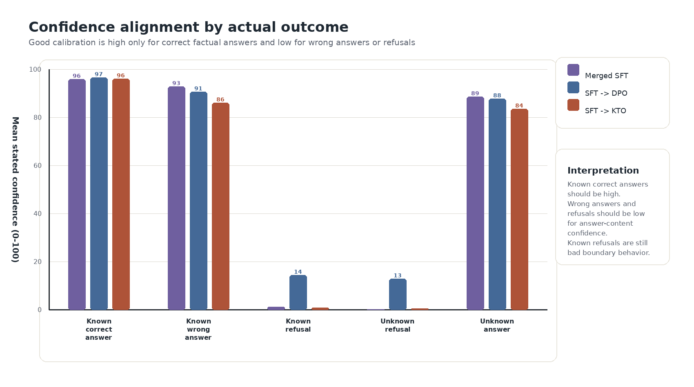

# Teaching Small Language Models to Say I Don't Know: A Controlled Comparison of SFT, DPO, KTO, and GRPO on Model-Specific Abstention Data

Joseph Rosenbaum
Synaptic Labs

*Draft v2. Not for distribution.*

> *"When you know a thing, to hold that you know it; and when you do not know a thing, to allow that you do not know it: this is knowledge."*
>
> Confucius, *Analects* 2.17

## Abstract

Teaching a small language model to say "I don't know" is a post-training
problem, and the field has four standard tools for it that have never been run
against each other under fixed conditions. We run that comparison: supervised
fine-tuning (SFT), direct preference optimization (DPO), Kahneman-Tversky
optimization (KTO), and group relative policy optimization (GRPO, a
reinforcement-learning method driven by a programmable reward). Each trains on
the same model-specific known/unknown dataset, meaning one whose labels record
what this particular model can and cannot answer, over the same small
open-weights base (Qwen3-4B), and each is evaluated on one surface with exact
paired row tests. The comparison yields a stage decomposition rather than a
winner. Trained from the base model, only SFT *induces* abstention (refusal
recall 87.9%, over-refusal 64.8%, three seeds); cold-start DPO and KTO refuse
essentially nothing, falsifying the natural hypothesis that KTO's unpaired
binary format makes it a native abstention trainer. Applied after an SFT
warm-up, preference optimization *repositions* the boundary along a
recall/over-refusal trade-off (DPO aggressively toward answering, KTO
conservatively; three seeds each), and GRPO under an appropriateness reward
*amplifies* the routine to near-ceiling recall while re-inflating
over-refusal, with truthfulness essentially flat under the shift (three
seeds; exploratory throughout); stacking GRPO with DPO or KTO, in either
order, does not escape the trade-off either.
No
objective, stack, or ordering moves the underlying discrimination frontier;
each selects an operating point on the frontier the SFT stage defines. Stated
confidence, measured after the same runs, carries a warning: every regimen's
emitted confidence tracks the *decision to answer*, not the truth of the
answer, so behavioral gains masquerade as confidence shifts. The practical
conclusion here: report abstention training as an operating point with both
error rates, choose the second stage by deployment cost asymmetry, and do not
read the confidence number as knowledge.

## 1. Introduction

Try this as a thought experiment. You ask a four-billion-parameter model for
the release date of an obscure regional album, and it gives you one, to the
day, in the same even tone it used a moment ago for the boiling point of
water. Then you ask it something it does know, and if it has been trained to
be careful, that is the one it declines. Nothing in either response marks
which case you are in. The model has no difficulty producing the words "I
don't know." What it lacks is any dependable coupling between those words and
the state of not knowing.

The field treats installing that coupling as a training problem: repair the
incentive during post-training and the coupling should follow. This paper
runs that premise to ground. Models that assert falsehoods confidently while
refusing questions they could answer have been described as polite liars
(DeVilling, 2025): systems that misrepresent their own epistemic
state, not out of anything resembling malice, but because the training signal
rewarded the appearance of knowledge over the admission of ignorance. Kalai
et al. (2025) trace the incentive further back than post-training: ordinary
cross-entropy pretraining already produces it whenever incorrect statements
are statistically indistinguishable from correct ones, and binary-graded
post-training evaluation then locks it in, since under that scoring a guess
strictly dominates an abstention. The incentive is set during pretraining and
sustained by evaluation practice, not installed by post-training;
post-training remains the more directly adjustable stage, and the practical
question becomes which post-training objective adjusts it best.

Two things are already established about that question. The first is that
post-training damages calibration, meaning the agreement between the
confidence a model attaches to an answer and the rate at which such answers
turn out to be right. The GPT-4 technical report puts expected calibration
error (ECE, the average gap between assigned probability and observed
accuracy, where 0 is perfect and higher is worse) at 0.007 for the pretrained
base model on a subset of MMLU, a broad multiple-choice knowledge exam; after
reinforcement learning from human feedback (RLHF), the same subset reads
0.074, ten times worse (OpenAI, 2023). Reinforcement learning is not the only
culprit. Plain instruction tuning on one base model nearly triples ECE, 0.13
to 0.36, while at the same time *reducing* predictive entropy from 1.32 to
0.92, so the tuned model gets more decisive and less reliable about its own
reliability in one step (Lithgow-Serrano et al., 2025). Kadavath et al. (2022)
name the mechanism, that post-training concentrates probability mass on
high-reward outputs and sharpens every distribution whether or not the model's
knowledge warrants it, and show that a single temperature adjustment largely
restores calibration. The signal survives in the weights. Only its expression
is broken.

The second established thing is the converse: what training breaks, training
can deliberately improve. Refusal-aware tuning (Zhang et al., 2023),
factuality-aware DPO (Tian et al., 2023), calibrated reward models, and
listener-aware preference pairs all move humility metrics in the right
direction, often by large margins.

Targeted training helps, then, and there are several objectives to target
with. Which of them to use has never been tested under fixed conditions. Our
own systematic synthesis of this literature, reported as a companion paper in
this research program (Rosenbaum, 2026), extracted 78 quantitative effects
from 39 studies across the calibration, abstention, hallucination, and
sycophancy work and verified the absence directly: no
published study runs supervised fine-tuning against the major preference
objectives on one abstention dataset, and none applies Kahneman-Tversky
optimization to abstention at all. This paper runs the missing comparison:
supervised fine-tuning (SFT), direct preference optimization (DPO),
Kahneman-Tversky optimization (KTO), and group relative policy optimization
(GRPO), over one small open-weights base, with one model-specific
known/unknown data construction and one measurement panel. In the depth
taxonomy a companion paper (Rosenbaum, 2026) synthesizes, this is the
shallowest and most direct approach available, L1: train the model's
expressed confidence and refusal decisions themselves, rather than any
deeper structure behind them.

What comes out is a decomposition by stage rather than a ranking. A single
objective that both taught abstention from the base model and improved the
model's underlying discrimination between answerable and unanswerable
questions would have refuted that reading; no arm and no ordering we trained
produced one. One prediction going in did fail, and its failure is the
cleanest result in the study. Kahneman-Tversky optimization consumes exactly
the unpaired binary labels a known/unknown split produces, which made it the
natural candidate for a native abstention trainer. Trained from the base
model, it refuses nothing at all.

Contributions:

1. The first SFT / DPO / KTO / GRPO comparison on shared abstention data and a
   shared small open-weights base, with seed-level intervals and exact
   row-level paired transitions (Section 4). This runs, at the behavioral
   level, three of the experiments Section 2 identifies as absent from the
   literature.
2. A stage decomposition of the regimen: SFT induces, preference optimization
   repositions, GRPO amplifies. No objective or sequence we tested escapes
   the recall/over-refusal trade-off; they select operating points on it
   (Section 4).
3. A stated-confidence measurement after the same runs showing that emitted
   confidence tracks the decision to answer, not the truth of the answer, so
   repositioning toward answering masquerades as confidence (Sections 4.2
   and 5).

## 2. Background: what the evidence says, and what was missing

What does the published record already settle about training a model to
abstain, and what does it leave open? Three findings from the synthesis
introduced above fix this experiment's design, and two of its measurement
lessons fix the reporting.

The four objectives compared here differ in what they consume. SFT trains on
target outputs directly: the model is shown the response wanted for each
prompt and learns to reproduce it. DPO (Rafailov et al., 2023) trains on
pairs, a preferred and a dispreferred response to the same prompt, shifting
probability mass toward the preferred one without a separate reward model.
KTO (Ethayarajh et al., 2024) drops the pairing requirement: each response is
labeled desirable or undesirable on its own, and the loss may weight the two
labels asymmetrically. GRPO (Shao et al., 2024) consumes no target outputs at
all, only a scalar reward applied to completions the model samples for itself.

### Three findings that fix the design

Instruction tuning and RLHF degrade token-probability calibration, and the
mechanism runs through the relationship between the tuning data and *this
model's* knowledge. Fine-tuning on facts the model does not know causally
drives hallucination (Gekhman et al., 2024); data aligned with what it already
knows induces overconfidence (Wang et al., 2025). That is why every successful
abstention method builds *model-specific* training splits, and why this one
does too.

Preference-based methods beat SFT on abstention and truthfulness quality. The
anchor result is the model-specific tournament of Cheng et al. (2024), which
compares ways of teaching a model to say "I don't know" on data labeled by
what that model in particular gets right, and the synthesis confirms it in a
reanalysis of AbstentionBench (Kirichenko et al., 2025), a benchmark of
questions that should not be answered at all. The margin is modest: the median
improvement is an order of magnitude smaller than the calibration damage
above.

The improvement is also a trade rather than a gain. Reanalyzing the outputs
Cheng et al. released, the synthesis finds DPO cutting SFT-induced
over-refusal nearly in half while giving up a third of refusal recall. That is
movement along a refusal ROC curve, the curve traced by sliding one threshold
between catching more unanswerable questions and wrongly refusing more
answerable ones, and not a better ability to tell the two kinds apart.

### Two measurement lessons that fix the reporting

A single abstention score hides which failure a model is making: refusal
recall and refusal precision come apart across 20 models in the synthesis's
reanalysis (Spearman $\rho = -0.05$, effectively no relationship). Every
result below reports both error rates rather than a summary of them.

Model-specific known/unknown labels are themselves noisy: in the released
artifacts of the lineage this study follows, 42.9 to 51.3% of answers to
questions labeled "unknown" were in fact correct. This study regenerates
known/unknown labels fresh against the model under study rather than
borrowing them, for exactly that reason (Section 3.2). The residual caveat
carries forward wherever a borrowed-label result is cited: label noise pulls
its recall/over-refusal numbers toward the middle of their range.

### The gaps this experiment closes

The same synthesis verifies six experiments as absent from the literature as
of this writing, by structured search and targeted spot-check; this study is
built on the first three of them.

The first is KTO. It has never been applied to abstention, honesty, or
calibration training, despite consuming exactly the unpaired binary labels a
known/unknown split produces and weighting losses asymmetrically, which is how
this domain's costs are shaped in the first place.

The second is the three-way comparison: no study puts SFT, DPO, and KTO on the
same abstention dataset.

The third is GRPO. Abstention trained by reinforcement learning with
verifiable rewards does exist (Wei et al., 2025; Zhai et al., 2026; Mohamadi
et al., 2025; Damani et al., 2025), but never as a controlled comparison
against SFT, DPO, and KTO. One caution from that literature binds the design
here: a probe placed *inside* an RL reward loop gets gamed by the policy it is
meant to measure (Cundy & Gleave, 2025), so representation probes stay
held-out evaluation and never enter a reward.

A fourth gap is closed by construction rather than by design. The synthesis
records that the abstention-training literature concentrates on chat models of
7 billion parameters and larger, leaving down-scale transfer asserted rather
than measured; everything in this study runs at 4 billion parameters.

## 3. Design and methods

### 3.1 Design logic

Everything is held fixed except the objective. One base model (Qwen3-4B), one
model-specific known/unknown data construction, four training objectives, one
shared evaluation surface, and a metric panel that covers both halves of every
trade-off the reanalyses in Section 2 exposed: refusal recall *and*
over-refusal, truthfulness *and* correct-on-known, plus stated confidence.

The study has three evidence layers:

1. Cold-start comparison (three seeds, confirmatory): SFT, DPO, and KTO
   trained from the base model, with seed-level intervals and exact paired row
   tests. Answers whether each objective can *induce* abstention.
2. SFT-warmed comparison (three seeds for DPO and KTO, confirmatory):
   preference optimization applied after SFT, with the same intervals and
   paired tests. Answers whether the preference objectives can *reposition* an
   existing boundary, which is the sequential reading the published
   preference-beats-SFT and trade-off results suggest (Section 2).
3. GRPO (three seeds, exploratory throughout): GRPO applied after SFT under a
   behavior-dominant appropriateness reward, plus the four two-stage
   combinations of GRPO with DPO and KTO on the SFT-warmed base, in both
   orders (GRPO then DPO, DPO then GRPO, GRPO then KTO, KTO then GRPO).
   Answers what reinforcement learning with a programmable reward adds,
   alone and stacked with preference optimization. To our knowledge, no
   prior work stacks a verifiable-reward RL stage with preference
   optimization for abstention, in either order.

### 3.2 Data construction

Which questions count as "unknown" is a property of the model, not of the
question, so the labels have to be made rather than borrowed. The data
construction follows the known/unknown lineage of Cheng et al. (2024),
regenerated for the model under study (borrowed labels carry the 42.9 to
51.3% label-noise rate reported in Section 2). The base model is probed on
factoid question
answering drawn from the TriviaQA lineage (Joshi et al., 2017), a large
collection of trivia questions with short factual answers; questions it
answers correctly under the probe protocol become "known," questions it
consistently fails become "unknown," ambiguous cases are excluded. SFT
receives direct targets (answer the known, refuse the unknown); DPO receives
chosen/rejected pairs; KTO receives the same rows as unpaired
desirable/undesirable examples; GRPO receives no supervised targets at all,
only a reward over sampled completions.

### 3.3 Training arms

All arms are trained on Qwen3-4B with low-rank adaptation (LoRA) and its
quantized variant (QLoRA), which train a small set of added parameters instead
of all of the model's weights and so fit the compute available here; recipes,
seeds, and per-run records are committed in the repository (Appendix A). All
four objectives run in their TRL-library implementations, with model
loading, 4-bit quantization, and LoRA adaptation handled through Unsloth.
The comparison should be read as a replication-style stress test of the
known/unknown supervision idea at small scale, not a bit-for-bit reproduction
of any prior stack.

#### SFT, DPO, KTO

SFT, DPO, and KTO are standard implementations of their objectives. Each is
trained both cold (from base) and SFT-warmed (from the merged SFT
checkpoint).

#### GRPO

GRPO (Shao et al., 2024) samples a group of completions per prompt and
reinforces each in proportion to how far its reward sits above the group
mean.

The appropriateness reward is built from a behavior term plus a
confidence-shaping term, and the behavior term dominates the confidence term
by design, respecting the reward-hacking caution from Section 2.

| Case | Reward |
|---|---|
| Known question answered correctly | +2.0 |
| Known question answered incorrectly | -0.8 |
| Known question refused (over-refusal) | -2.0 |
| Unknown question abstained | +1.2 |
| Unknown question answered (hallucination) | -1.2 |
| Ambiguous question answered correctly | +0.8 |
| Ambiguous question refused | +0.1 |
| Ambiguous question answered incorrectly | -0.8 |

The behavior term is asymmetric: it penalizes over-refusal hardest (-2.0),
harder than answering an unknown question (-1.2).

Malformed output is penalized: a completion that is not valid JSON loses
-2.4; a valid completion missing the confidence field loses -0.5.

The confidence-shaping term scores stated confidence against a per-case
target: 0.82 for a correct known answer or a correct unknown abstention,
0.18 to 0.22 for the penalized cases, 0.45 to 0.50 for ambiguous cases,
worth up to 0.6 in magnitude and falling linearly to zero one tolerance
(0.2) from target and to its floor two tolerances away. An exact 0.0 or 1.0
stated confidence is separately penalized (-1.0) to discourage collapsing to
the endpoints. A correct known answer hedged with generic uncertainty
language loses an additional 0.1.

A confidence-shaping variant that uses a proper scoring rule in place of
the heuristic term belongs to a separate line of work on the confidence
channel and is not evaluated here. We also trained the four two-stage
combinations of GRPO with
DPO and KTO on the SFT-warmed base, in both orders (Section 4.3).

### 3.4 Evaluation surface and metrics

The primary behavioral surface is SelfAware (Yin et al., 2023), a question set
built to separate questions with answers from questions that have none: 3,369
rows per seed, 1,032 unknown-labeled and 2,337 known-labeled. Scored rows
carry row identity, label, refusal flag, correctness flag, and truthfulness
flag, so two arms can be compared row by row rather than only in aggregate
(McNemar and exact binomial tests on the rows where the two arms disagree).
Primary metrics:

- *Refusal recall:* % of unknown rows refused (higher is better).
- *Over-refusal:* % of known rows refused (lower is better).
- *Correct-on-known:* among known rows the model chose to answer (i.e.,
  did not refuse), the % answered correctly. Its denominator is the answered
  subset, unlike over-refusal's, which is all known rows.
- *Truthful:* % of all rows either correctly answered (known) or correctly
  refused (unknown).

Seed-level summaries report means and t-based 95% intervals over seed-level
point estimates; with three seeds these are descriptive. Two output contracts
are used and never pooled: a *plain-answer* contract (layers 1 and 2) and a
*response-confidence* contract (layer 3) in which the model returns an
answer plus a numeric confidence in $[0, 1]$. The contract is itself an
intervention, so every GRPO-layer comparison is made against a clean-SFT
baseline re-evaluated under the same contract.

Confidence is scored against three targets, kept separate throughout: the
*known-label* target (1 for known rows, 0 for unknown, available before any
answer is produced), *response appropriateness* (1 when the model did the
right thing for the row: answered a known correctly or refused an unknown),
and, restricted to the rows the model chose to answer,
*correctness-given-answered* (1 when the answer given was actually right).
Four calibration metrics are reported against these targets. The standard
deviation of
emitted confidence detects collapse, the case where a model writes out the
same number on every row. AUROC, the area under the receiver operating
characteristic curve, asks how well confidence *ranks* rows, with 0.5
meaning chance and 1.0 a perfect ordering; it is computed against
appropriateness and against correctness-given-answered. ECE asks whether the
confidence levels are right in absolute terms, and the Brier score, the mean
squared error between the stated confidence and the outcome, penalizes both
errors at once.

## 4. Behavioral results: induce, reposition, amplify

Can an objective teach abstention to a model that has none, can it move an
abstention boundary that already exists, and what does a programmable reward
add on top of one?

### 4.1 Only SFT induces abstention from the base model

Across three seeds on SelfAware, cold-start SFT reaches refusal recall 87.88%
(95% seed interval 77.36 to 98.41) at over-refusal 64.77% (63.60 to 65.94),
truthfulness 39.19%. Cold-start DPO and KTO do not learn the behavior at all:
DPO refusal recall is 0.03% and KTO 0.00%, with over-refusal near zero only
because the models refuse nothing. Paired rows make the difference exact: per
seed, SFT refuses 865 to 953 unknown rows that DPO answers, and 866 to 953
relative to KTO; all paired differences are overwhelming under exact tests.
Direct DPO-vs-KTO paired tests show no difference in unknown refusal (exact
$p = 1.0$ in all three seeds): on cold-start abstention, DPO and KTO are the
same failure mode.

**Figure 1. Cold-start SelfAware refusal trade-off.** Each faint point is one
seed and each outlined point is the mean across seeds. SFT occupies the
high-recall/high-over-refusal corner; cold-start DPO and KTO sit at the
answer-everything origin (inset). Trained from scratch, only SFT teaches the
model to refuse at all, and it overshoots; DPO and KTO leave it answering
essentially everything. The green quadrant marks the direction of the ideal
operating point (high unknown-question refusal, low over-refusal); its
boundaries are the panel midlines, illustrative rather than quantitative.

**Figure 2. Paired row transitions from SFT to the cold-start preference
arms.** Bars are seed means. For each pair, the left bar is unknown
abstentions the preference arm loses; the right bar is known-question
over-refusals the preference arm converts to an attempted answer, split into
the wrong share (orange, bottom) and the correct share (green, top). Both
pairs convert hundreds of over-refusals, and in both pairs the correct share
is a small fraction of the total: the conversions are mostly new wrong
answers, not new correct ones.

This falsifies the hypothesis that motivated including KTO at all: that its
unpaired binary format, which matches the shape of known/unknown data exactly,
would make it a native abstention trainer (Section 2). Fit between data format
and objective is not sufficient. In this setting the preference objectives
cannot conjure a refusal routine that the policy does not already express.
That gives the first half of the stage decomposition: abstention
has to be induced, and among these objectives only SFT induces it.

### 4.2 Preference optimization repositions the boundary, on a trade-off

Applied after SFT, the preference methods do real work, but the work is
repositioning, not free improvement. From the merged-SFT operating point
(refusal recall 82.85%, over-refusal 61.62% on the seed-1 plain-answer
surface):

- DPO is the aggressive mover: over-refusal 61.62% to 13.99%, but refusal
  recall 82.85% to 48.84%. Exact transitions show the price: DPO answers 377
  unknown rows that SFT had correctly refused, and converts 1,113 known
  refusals into answers of which only 95 become correct.
- KTO is the conservative mover: over-refusal to 48.22% with recall
  preserved at 75.68%. It answers only 91 previously-refused unknown rows and
  converts 322 known refusals (37 correct).

**Figure 3. SFT-warmed operating points on SelfAware (plain-answer
contract).** DPO moves far toward low over-refusal at heavy recall cost; KTO
stays near the merged-SFT abstention policy. Neither arm improves
discrimination between the two kinds of question. The green quadrant marks
the direction of the ideal operating point (high unknown-question refusal,
low over-refusal); its boundaries are the panel midlines, illustrative
rather than quantitative.

Across the available seeds the pattern is stable (three-seed SFT-DPO means:
recall 52.81%, over-refusal 14.59%, truthfulness 31.18%; three-seed SFT-KTO:
77.75%, 45.68%, 37.72%). This is the published trade-off of Section 2
reproduced at 4B on an independent model family, with the two preference
objectives landing on opposite ends of it. DPO buys back usefulness at the
cost of abstention; KTO keeps the abstention and most of the tax. Neither
improves the underlying discrimination; both move along the ROC curve the
SFT stage defined.

Under the stated-confidence contract, the same geometry reappears with a
confidence signature attached: mean stated confidence is 0.423 for merged
SFT, 0.761 for SFT-DPO, and 0.508 for SFT-KTO. Which of those looks
best-calibrated depends entirely on what the confidence is scored against.
Against the known/unknown label, DPO beats SFT (mean absolute error, MAE,
0.294 vs 0.417), because DPO is confident on more of the known rows and the
known rows are the ones the label calls confidence-worthy. Against whether the
answer it gave was actually right, DPO is far worse (MAE 0.615 vs 0.287;
Brier 0.566 vs 0.260), because a large share of those confident answers are
wrong. The same checkpoint therefore reads as better calibrated or worse
calibrated depending on the target, and repositioning toward answering *feels*
like rising confidence from the outside. That is the overconfidence failure
the first of the three background findings predicts (Section 2).

**Figure 4. Stated-confidence profile of the SFT-warmed arms
(answer/confidence contract, six runs pooled per arm).** Confidence coverage is near 100%
for all arms; the differences are behavioral and confidence-level shifts, not
parse failures. Judged against actual answer correctness (the two rightmost
metric groups, where lower is better), DPO's confidence is the least
trustworthy of the three.

**Figure 5. Stated confidence by actual outcome.** All three regimens are
highly confident whenever they *answer*, including on wrong answers and on
unknown questions; refusals get near-zero confidence. Confidence tracks the
decision to answer, not the truth of the answer: a calibrated model would
show a tall first bar group and short answer groups, and instead every
answer sits near 0.9 whether it is right, wrong, or unanswerable.

### 4.3 GRPO amplifies the routine to near-ceiling recall

GRPO is the third behavioral profile, distinct from both preference methods.
Every GRPO number in this section is exploratory and single-seed, except the
three-seed replication reported below. All
figures here use the response-confidence contract only, against a clean-SFT
baseline re-evaluated under that same contract (recall 87.02%, over-refusal
57.51%, truthful 40.58%). The same-contract DPO and KTO arms land at (87.11%, 56.18%, 40.69%)
and (81.01%, 52.37%, 39.36%). Because the contract differs from the one used
in Sections 4.1 and 4.2, these rows are comparable to each other and not to
the seed-level numbers above.

| Arm (response-confidence contract, seed 1) | Truthful % | Refusal recall % | Over-refusal % | Correct-on-known % |
|---|---|---|---|---|
| clean SFT (baseline) | 40.58 | 87.02 | 57.51 | 47.23 |
| SFT then DPO | 40.69 | 87.11 | 56.18 | 46.09 |
| SFT then KTO | 39.36 | 81.01 | 52.37 | 44.03 |
| SFT then GRPO | 41.08 | 93.41 | 66.62 | 53.85 |

*Correct-on-known is the filtered-denominator metric (correct answered /
answered known), not a fraction of all known rows; per-arm denominators are
in the underlying run records, and these seed-1 values rest on the committed
aggregate CSV rather than raw per-row counts.*

**Figure 6. GRPO amplifies the abstention routine; stacks stay on its
frontier.** Operating points of all response-confidence-contract arms
(seed 1, exploratory), including the four two-stage GRPO/preference stacks.
The preference arms cluster with the SFT baseline; the GRPO arms and every
stack shift up-right: more recall, more over-refusal. No combination of
stages escapes the bargain; each picks a spot on the same curve. The green
quadrant marks the direction of the ideal operating point (high
unknown-question refusal, low over-refusal); its boundaries are the panel
midlines, illustrative rather than quantitative.

GRPO *amplifies* the abstention routine. Refusal recall rises to 93.41%, the
highest of any arm; truthfulness moves far less, 40.84 to 41.64% across GRPO
and its stacks, against 40.58% for the same-contract SFT baseline, a margin
the three-seed replication below confirms is essentially flat rather than a
truthfulness gain. The appropriateness reward pays for refusing unknowns and
the policy obliges, hard.

The amplification drags over-refusal back up with it, to 66.62% against 52
to 56% for the preference arms. GRPO undoes precisely the repositioning that
DPO buys. This happens despite the reward's own asymmetry working against
it: known-question refusal is the single worst-penalized behavior in the
table (-2.0), yet the policy still generalizes its rewarded
unknown-question refusal habit onto known questions.

Stacking a preference stage with GRPO does not escape the trade-off in either
order. All four two-stage stacks (DPO then GRPO, GRPO then DPO, KTO then GRPO,
GRPO then KTO) land within 1.1 truthfulness points and about 6 over-refusal
points (6.03 at the widest) of plain SFT-GRPO, and all of them sit on the same
curve as every other arm (Figure 6). Ordering is a marginal adjustment to the
operating point GRPO defines, at least at a resolution this layer can see:
each stack was one run at one seed at this pass; the three-seed replication
below sharpens the ordering comparison.

Two further limits belong on the GRPO result while it is being read. The
truthfulness margin over the same-contract SFT baseline is small; at this
single-seed pass it is measured without an interval around it (the
three-seed replication below reports one). And every GRPO conclusion is
conditional on the reward family tested, appropriateness-dominant with a
confidence-shaping term. What this layer establishes is a direction rather
than a magnitude: a programmable reward pushes the abstention routine
further out along the frontier the SFT stage set, rather than off it.

#### The shift and the recovery replicate across three seeds

A single seed invites the obvious objection: is this a shift or a fluke?
A pre-registered replication retrained the entire GRPO-touching lineage,
from clean SFT through the GRPO arm and all four
two-stage stacks, at two fresh seeds, with two outcomes fixed before any
seed-2 or seed-3 result existed. For the DPO-touching arms this is a partial
replicate: the DPO trainer exposes no random-state flag, so its LoRA
initialization stays at the trainer's baseline across seeds while the source
model and data order still vary. The first asked whether GRPO's move away
from unknown-answering, measured against its own same-seed clean-SFT base,
would reproduce in direction by at least 3.0 percentage points; it did at
both new seeds, answer-on-unknown falling 4.36 and 6.78 points against a
seed-1 magnitude of 6.39. The second asked whether a preference stage
applied after GRPO would keep recovering known-row over-refusal without
reopening unknown-answering by more than 2.0 points; it also held at both
new seeds, over-refusal falling 0.77 points (18 rows) and 1.84 points (43
rows) while unknown-answering moved -0.39 and +0.29 points. Neither
threshold moved after a result existed.

Across all three seeds, the plain SFT-then-GRPO arm reads truthful 41.17%
(95% interval 41.08 to 41.35), refusal recall 94.25% (93.41 to 95.06),
over-refusal 67.35% (66.62 to 68.68). Measured like for like against the
same-seed clean-SFT bases (40.58%, 41.17%, 40.55%, mean 40.77%), the
three-seed GRPO mean is +0.40 percentage points, within a flat band rather
than a truthfulness gain; one two-stage stack, GRPO
followed by DPO, reads truthful 41.49% (41.29 to 41.64) at over-refusal
65.48% (63.63 to 66.84), inside the same band.

| Arm (response-confidence contract, mean [95% interval] across 3 seeds) | Truthful % | Refusal recall % | Over-refusal % | Correct-on-known % |
|---|---|---|---|---|
| SFT then GRPO | 41.17 [41.08, 41.35] | 94.25 [93.41, 95.06] | 67.35 [66.62, 68.68] | 54.32 [53.85, 55.05] |
| DPO then GRPO | 41.19 [40.87, 41.50] | 93.41 [92.54, 94.38] | 65.26 [64.66, 65.81] | 52.19 [51.09, 53.07] |
| KTO then GRPO | 41.01 [40.84, 41.26] | 92.99 [92.54, 93.31] | 65.70 [64.23, 66.50] | 52.67 [51.08, 53.56] |
| GRPO then DPO | 41.49 [41.29, 41.64] | 94.25 [93.31, 94.77] | 65.48 [63.63, 66.84] | 52.71 [51.76, 53.29] |
| GRPO then KTO | 41.02 [40.84, 41.32] | 91.08 [89.63, 91.86] | 61.90 [60.59, 64.01] | 49.68 [48.95, 50.89] |

*Correct-on-known is the filtered-denominator metric (correct answered /
answered known); per-seed denominators are in the experiment notebook, and
the seed-1 values rest on the committed aggregate CSV since raw per-row
counts are not available for that seed.*

This table shows the five GRPO-touching arms among the eight arms retrained
for this replication; the two retrained arms that never touch GRPO sit in
the same truthful band (clean_sft_dpo reads 41.32% at seed 2), so no
truthfulness ordering is supportable at this resolution.

Whether a preference stage placed before GRPO beats the same stage placed
after it, on over-refusal, was registered as a secondary, descriptive
pattern, and the two orderings resolve differently. For KTO the direction
holds at all three seeds: GRPO-first beats GRPO-last by 5.78, 3.13, and 2.49
points, shrinking but never crossing zero. For DPO it does not: the seed-1
margin favored GRPO-first by 1.67 points, but both new seeds favor
GRPO-last, by 0.17 and 2.18 points. The DPO-pairing claim is retracted; only
the KTO-pairing pattern is reported, and only as descriptive.

A small overlap between this replication's training prompts and a slice of
the evaluation questions inflates the absolute known-row numbers above
without changing any of the deltas or outcomes reported here; Section 7
states the size of the overlap and its bound.

**Figure 7. The three-seed replication holds the seed-1 shift.** Exploratory
response-confidence-track evidence, never pooled with the plain-answer
headline (Section 4.1); n = 3 seeds per arm. Each arm's three-seed mean
(filled diamond) carries a 95% seed-level bootstrap CI, a descriptive
interval bounded by the seed minimum and maximum rather than an inferential
one; the open circle is the original seed-1-only point (Figure 6) for the
same arm. Every seed-1 point sits inside or near its arm's three-seed
interval: the operating points measured at seed 1 are not a single-seed
artifact. The green quadrant marks the direction of the ideal operating
point (high unknown-question refusal, low over-refusal); its boundaries are
the panel midlines, illustrative rather than quantitative.

SFT induces the behavior, preference optimization repositions it, GRPO
amplifies it. Every objective selects an
operating point on the same recall/over-refusal frontier; nothing we trained
moves the frontier itself.

### 4.4 What the decomposition means for method choice

A naive league table would crown GRPO (largest abstention shift) or DPO (best
over-refusal), but the decomposition says the question "which objective wins"
is malformed. The objectives do different jobs: an inducer is mandatory
(without SFT nothing abstains), and the second stage is a policy knob whose
setting depends on the deployment's asymmetric costs. What the field should
compare is not objectives but *regimens*, and regimens should be reported as
operating points with both error rates, never as single scalars. The
synthesis motivated two-rate reporting from a cross-model decoupling of
recall and precision (Section 2); this experiment adds the within-lineage
reason for it. Here the two error rates do not decouple: they trade off
along a single frontier, so a scalar cannot distinguish moving along that
frontier from moving it, and hides which failure a regimen bought. That is a
policy choice about behavior, not a change in what the model can tell known
from unknown.

## 5. Stated confidence tracks the decision, not the truth

Behavior is half the construct. The other half is whether the model can *say
how sure it is*, and the same runs supply one clean observation about it,
already visible in Figure 5: emitted confidence tracks the decision to answer,
not the truth of the answer. Every regimen is highly confident whenever it
answers, including on wrong answers and on unanswerable questions; refusals
get near-zero confidence. Under the response-confidence contract the
best-behaved checkpoint in the study, GRPO, emits confidence
with standard deviation 0.013 across 3,369 rows: a near-constant value around
0.8 whose AUROC against response appropriateness is 0.520, a coin flip. The
confidence token is decorative. Section 4.2's DPO signature is the same fact
from the other side, where repositioning toward answering *looks like* rising
confidence while correctness-conditioned calibration worsens.

The practitioner's warning holds regardless of what produces it: under every
regimen tested here, the stated confidence number reports what the model
*did*, not what it *knows*: performed, not possessed, in the vocabulary a
companion paper (Rosenbaum, 2026) uses for exactly this gap.

## 6. Discussion

### The regimen, not the objective

The three missing experiments this study was built on (no KTO for abstention,
no three-way comparison, no controlled GRPO comparison) all presumed the
interesting question was *which objective*. The answer here is that objectives
are stages with different jobs: induce (SFT only), reposition (DPO
aggressively, KTO conservatively), amplify (GRPO). League tables that rank
them against each other as alternatives, including the ones in the literature
surveyed in Section 2, are asking which of the rough cut and the final sanding
makes a board flat. One has to happen first, and the other has nothing to work
on until it does.

### A policy, not epistemic humility

This study is the strongest version of one way to install epistemic humility:
pick the post-training objective that shapes the model's *expressed*
epistemic state directly, and iterate. In the depth taxonomy synthesized in a
companion paper (Rosenbaum, 2026), that is the shallowest level, L1: humility
as a scalar (a confidence number or a refuse/answer decision), scored against
how well it tracks the model's actual reliability. Training the expression
directly, at L1, with four objectives and a controlled comparison, is close
to as strong a test of that level as post-training currently allows.

What four objectives buy, decomposed by stage, is a *policy*, not a
discovery. SFT installs a gross refuse-or-answer routine; DPO and KTO
reposition it along the recall/over-refusal trade-off; GRPO amplifies it.
Every regimen we trained lands somewhere on the same fixed frontier, and
every model we shipped, whatever the regimen, sits at some point along it:
under-refusing or over-refusing relative to that frontier, never off it.
None of the four objectives moved the frontier itself (Section 4), and the
companion paper's cross-cutting *coherence axis* names exactly what none of
them touched: whether the expressed state is tethered to something real
inside the model, or merely produced on cue. Untethered, it is Plato's
version of the same problem, restated for language models: a true belief not
anchored by reasoning is one of Daedalus's statues, correct today and free to
wander tomorrow (companion paper, Section 2, after *Meno* 97d-98a). Four
rounds of policy tuning at L1 never tests whether the statue is tied down; it
only rearranges where the statue stands.

The companion paper's definition gives that test a verdict rather than a
question: epistemic humility is an expressed epistemic state that tracks the
model's actual reliability (Rosenbaum, 2026). Measured against that
definition, this study's two expressed channels fail in different ways. The
confidence channel fails outright: under the best-behaved regimen in the
study, stated confidence sits at a near-constant 0.8 whether the answer is
right, wrong, or refused, and its AUROC against response appropriateness is
0.520, a coin flip (Section 5). That is not weak tracking; by the definition
above, it is no tracking at all. The behavior channel does better, but only
by inheritance, not improvement: the refuse-or-answer decision separates
known from unknown well above chance, yet that separation is the frontier
SFT installed once, from nothing, at the start (Section 4). Nothing applied
after it, not DPO, not KTO, not GRPO, not any stack of them, raised that
frontier by a point; three further stages only respent it.

By this program's own definition, then, these four regimens did not produce
epistemic humility. What they produced is a refusal policy with a fixed,
inherited discrimination boundary, wearing a confidence number that tracks
nothing. If humility as tracking was not installed by any of this, the
question that remains is whether the model carries an internal signal that
could support it anyway. Nothing in these regimens was designed to measure
that, and behavior alone cannot answer it.

That verdict is exactly as fenced as the evidence behind it: four
objectives, one model, one data construction. It says nothing about whether
some other regimen, at some other scale, could install coherence between
expression and internal state; that stronger claim, that behavioral
post-training at L1 cannot do so no matter the objective or scale, is not
this paper's result. It is the open question this paper hands to the
research agenda the companion paper lays out.

### Deployment reading

For a practitioner training a small model to abstain, four things follow from
the results above. An SFT inducer stage is mandatory; without it nothing
abstains. The second stage is chosen by cost asymmetry, DPO if over-refusal is
the expensive error and KTO or GRPO if hallucination is. The model's stated
confidence should not be trusted under any of these regimens (Section 5), and
an RL reward did not fix it here. And if you control the weights, the
question above is the one worth starting from: whether the signal absent
from the model's own words exists somewhere in its internals.

## 7. Limitations

This is a small-model, single-family study: Qwen3-4B with low-rank adaptation
recipes, evaluated centrally on SelfAware. The cold-start and SFT-warmed
layers, and the GRPO layer with its four two-stage stacks, all carry three
seeds (descriptive t-intervals for the confirmatory layers, exploratory
response-confidence track for GRPO, never pooled with the headline); the
stated-confidence observations of Section 5 remain single-seed and
exploratory. Every exploratory result is labeled as such wherever it
appears. Negative cold-start DPO/KTO results are claims
about this setting and recipe family, not contradictions of sequential
preference results in the literature. The two output contracts
(plain-answer and response-confidence) are never pooled, but each is an
intervention in its own right, and stated-confidence results are conditional
on the contract. GRPO conclusions are conditional on the reward family
tested (appropriateness-dominant with confidence shaping); a reward designed
around a different decomposition could behave differently. The refusal
classifier counts hedged answers as refusals, so every refusal-family metric
reported here (refusal recall, over-refusal, refusal rate) absorbs hedged
answers along with outright abstentions.

The pre-registration behind this study's design also specified evidence
layers this paper does not report: three-seed confirmation of the same
headline matrix at 8B (nine runs at the pre-registered default config, no
sensitivity panel) and a two-run bridge replication of SFT and DPO on
Llama-2-7b-chat, checked against a published baseline as a pipeline
validation step. The registered 4B matrix also specified a learning-rate
sensitivity panel (six runs: SFT, DPO, and KTO each at two non-default
learning rates) and a beta sensitivity panel (four runs: DPO and KTO each
at two non-default beta values), both single-seed and robustness-only per
the pre-registration. None of these four evidence layers ran for this
paper; no result exists for any of them, so there is nothing to selectively
report. All are deferred to a planned follow-on paper examining how the
stage decomposition here generalizes
across model size and model family, and the pre-registration covering them
remains standing until that paper either runs them or supersedes it.

The three cold-start preference seeds were not all trained on the same file. A
mid-study fix to the dataset builder made the held-out dev split group by
normalized question text, so that duplicate source rows carrying identical
prompts could no longer land on opposite sides of the split. The fix also
resampled where the train and dev boundary falls. Seed 1 of both preference arms
predates it; seeds 2 and 3 postdate it and are identical to each other. The
question budget, the known set, and the unknown set are the same in both builds,
so no question was added or removed, but 1,460 of the 14,395 training questions,
10.1% of them, swapped sides. The consequence is bounded and worth stating: the
three-seed intervals reported for cold-start DPO and KTO span one pre-fix run and
two post-fix runs, so part of their spread may be the dataset version rather than
training-seed variation. The original seed-1 cells also differ from the
seed 2/3 cohort on a second axis, the trainer submodule vintage: the two
preference seed-1 runs predate a training-library update that both seed 2/3
cohorts already trained under (exact revisions are recorded in Appendix A).
The three SFT seeds are unaffected, all three having
trained on the corrected build. The two affected seed-1 runs were rerun:
both arms retrained cold-start on the corrected build, at the same
training-library version as their seed 2/3 cohort, pinning both the dataset
build and the trainer vintage together, and re-evaluated on the same
SelfAware surface. Because both axes moved at once,
the rerun is a commensurability check against the cohort rather than an
isolation of the dataset variable alone. Both land inside every replication
band drawn from the seed 2/3 cohort (four metrics per arm). Those bands
carry a disclosed power limitation, stated at pre-registration: the same
bands pass 8 of 8 metric-arm combinations when applied to the original
pre-fix rows, because this is a low-power confirmation gate rather than a
discovery gate. The result therefore reads as no effect detectable at this
instrument's resolution, not as a demonstration that the dataset version
did not matter; on that reading the conclusions in Section 4.1 stand. A
reproducibility note follows from the rerun: an earlier attempt that omitted
the training-library version pin ran against a newer library build than the
cohort by construction, and its results differed from the pinned rerun by 2
to 4 percentage points on truthfulness and correct-on-known, though both
attempts landed inside the same bands. Pinning the training library's exact
version, not only the base model and the hyperparameters, measurably matters
at this scale.

Model-specific known/unknown labels are noisy (the synthesis measured 42.9
to 51.3% of "unknown" answers being correct in released artifacts of the
lineage we follow), which flattens all recall/over-refusal numbers toward
the middle; our labels are regenerated per-model but not immune to the same
effect. The design premises carried over from the evidence synthesis inherit
that synthesis's own limitations, which it documents alongside the evidence
tables named in Appendix B.

A small slice of the evaluation surface used in the three-seed GRPO
replication of Section 4.3 also appears, verbatim, among that replication's
own training prompts. Of the 3,369 SelfAware rows, 128 distinct known
(answerable) questions, all drawn from the answerable half of the set,
appear as training examples: 117 verbatim in every gradient-training file
the replication's four objectives consume, and 11 more only in the file
used to pick a checkpoint. No unknown (unanswerable) question leaks
anywhere. That bounds the consequence precisely. The abstention-shift result
in Section 4.3 is computed only over unknown-labeled rows, so it is
unaffected by construction. The recovery result was checked stratum by
stratum and holds uniformly whether or not a row is contaminated, so the
delta it reports is not an artifact of memorization. What is affected is the
absolute level of any known-row number: contaminated rows are easier for the
model (roughly 30% over-refusal against roughly 71% on the rest of the known
rows), so the full population reads over-refusal roughly 1.5 to 2.3 points
lower, and correct-on-known roughly 4 to 5 points higher, than the
decontaminated population does. Recomputing on the decontaminated remainder
(3,241 of 3,369 rows) changes no direction and no outcome: the
abstention-shift deltas are identical to the second decimal, the recovery
deltas match within 0.01 points, and the ordering deltas move by at most
0.13 points with every sign preserved.

| Check (clean-subset recompute, non-gating) | Seed 2 | Seed 3 | Full-population value |
|---|---|---|---|
| Abstention shift (answer-on-unknown delta, GRPO vs. same-seed SFT base) | unchanged to two decimals | unchanged to two decimals | -4.36 / -6.78 pp |
| Post-GRPO recovery (over-refusal delta, GRPO-then-DPO vs. GRPO) | -0.77 pp | -1.85 pp | -0.77 / -1.84 pp |
| Post-GRPO recovery (unknown reopening) | -0.39 pp | +0.29 pp | -0.39 / +0.29 pp |
| Stage-ordering, KTO pairing (over-refusal delta) | -3.21 pp | -2.62 pp | -3.13 / -2.49 pp |
| Stage-ordering, DPO pairing (over-refusal delta) | +0.19 pp | +2.31 pp | +0.17 / +2.18 pp |

The numbers reported in Section 4.3 are the full-population numbers,
carrying this caveat; the decontaminated cross-check above changes no
conclusion.

### What would overturn this

The stage decomposition is a claim about what each objective can and cannot
do, so it breaks on one counterexample of the right shape. A preference
objective that induced abstention from a base model would falsify the
induction half. An objective, ordering, or stack that raised refusal recall
without paying for it in over-refusal on the same evaluation surface would
falsify the claim that nothing here moves the frontier. Neither appeared in
any arm we trained, at one scale, in one model family, on one benchmark, and
that is the scope the claim is fenced to.

## References

Cheng, Q., Sun, T., Liu, X., Zhang, W., Yin, Z., Li, S., Li, L., He, Z.,
Chen, K., & Qiu, X. (2024). *Can AI Assistants Know What They Don't Know?*
arXiv:2401.13275.

Cundy, C., & Gleave, A. (2025). *Preference Learning with Lie Detectors can
Induce Honesty or Evasion*. arXiv:2505.13787.

Damani, M., Puri, I., Slocum, S., Shenfeld, I., Choshen, L., Kim, Y., &
Andreas, J. (2025). *Beyond Binary Rewards: Training LMs to Reason About
Their Uncertainty*. arXiv:2507.16806.

DeVilling, B. (2025). *The Polite Liar: Epistemic Pathology in Language
Models*. arXiv:2511.07477.

Ethayarajh, K., Xu, W., Muennighoff, N., Jurafsky, D., & Kiela, D. (2024).
*KTO: Model Alignment as Prospect Theoretic Optimization*. arXiv:2402.01306.

Gekhman, Z., Yona, G., Aharoni, R., Eyal, M., Feder, A., Reichart, R., &
Herzig, J. (2024). *Does Fine-Tuning LLMs on New Knowledge Encourage
Hallucinations?* arXiv:2405.05904.

Joshi, M., Choi, E., Weld, D. S., & Zettlemoyer, L. (2017). *TriviaQA: A
Large Scale Distantly Supervised Challenge Dataset for Reading
Comprehension*. arXiv:1705.03551.

Kadavath, S., et al. (2022). *Language Models (Mostly) Know What They Know*.
arXiv:2207.05221.

Kalai, A. T., Nachum, O., Vempala, S. S., & Zhang, E. (2025). *Why Language
Models Hallucinate*. arXiv:2509.04664.

Kirichenko, P., Ibrahim, M., Chaudhuri, K., & Bell, S. J. (2025).
*AbstentionBench: Reasoning LLMs Fail on Unanswerable Questions*.
arXiv:2506.09038.

Lithgow-Serrano, O., Kanjirangat, V., & Antonucci, A. (2025). *Causal
Understanding by LLMs: The Role of Uncertainty*. arXiv:2509.20088.

Mohamadi, M. A., Wang, T., & Li, Z. (2025). *Honesty over Accuracy:
Trustworthy Language Models through Reinforced Hesitation*. arXiv:2511.11500.

OpenAI (2023). *GPT-4 Technical Report*. arXiv:2303.08774.

Rafailov, R., Sharma, A., Mitchell, E., Ermon, S., Manning, C. D., & Finn, C.
(2023). *Direct Preference Optimization: Your Language Model is Secretly a
Reward Model*. arXiv:2305.18290.

Rosenbaum, J. (2026). *The Depths of Ignorance: A Taxonomy, Systematic
Evidence Synthesis, and Research Agenda for Epistemic Humility in Language
Models*. Companion paper, this research program.

Shao, Z., et al. (2024). *DeepSeekMath: Pushing the Limits of Mathematical
Reasoning in Open Language Models* (GRPO). arXiv:2402.03300.

Tian, K., Mitchell, E., Yao, H., Manning, C. D., & Finn, C. (2023).
*Fine-tuning Language Models for Factuality*. arXiv:2311.08401.

Wang, Z., Shi, Z., Zhou, H., Gao, S., Sun, Q., & Li, J. (2025). *Towards
Objective Fine-tuning: How LLMs' Prior Knowledge Causes Potential Poor
Calibration?* arXiv:2505.20903.

Wei, Z., Yang, X., Sun, K., Wang, J., Shao, R., Chen, J., et al. (2025).
*TruthRL: Incentivizing Truthful LLMs via Reinforcement Learning*.
arXiv:2509.25760.

Yin, Z., Sun, Q., Guo, Q., Wu, J., Qiu, X., & Huang, X. (2023). *Do Large
Language Models Know What They Don't Know?* arXiv:2305.18153.

Zhai, S., Liang, J., & Kang, D. (2026). *Abstain-R1: Calibrated Abstention
and Post-Refusal Clarification via Verifiable RL*. arXiv:2604.17073.

Zhang, H., Diao, S., Lin, Y., Fung, Y. R., Lian, Q., Wang, X., Chen, Y.,
Ji, H., & Zhang, T. (2023). *R-Tuning: Instructing Large Language Models to
Say "I Don't Know"*. arXiv:2311.09677.

---

## Appendix A: Provenance (internal labels to artifacts)

Reader-facing prose above uses no internal amendment labels. Every
experimental claim in this paper traces to one of the files below, each named
with the internal label it carries in the repository.

- [The registered protocol](https://github.com/ProfSynapse/Epistemic-Humility-Research/blob/main/archive/docs/protocols/phase1/PROTOCOL.md):
  version 0.3, signed 2026-06-10, governing the three-seed cold-start block of
  Section 4.1 as the pre-registered headline surface. Internal label: headline
  matrix.
- [Cold-start scored runs](https://github.com/ProfSynapse/Epistemic-Humility-Research/tree/main/archive/experiment/phase1/eval):
  the three seeds behind Section 4.1, in
  `results_selfaware_full_seed{1,2}_all_arms_4b_20260615_2148/` and
  `results_selfaware_full_seed3_all_arms_4b_20260616_0615/`.
- [The cold-start results tables](https://github.com/ProfSynapse/Epistemic-Humility-Research/blob/main/papers/paper-2-training-regimen/analysis/paper1_results_analysis.md):
  seed-level summaries and the exact paired row tests reported in Section 4.1.
- [SFT-warmed preference runs](https://github.com/ProfSynapse/Epistemic-Humility-Research/tree/main/archive/experiment/phase1/eval):
  the plain-answer operating points of Section 4.2, in
  `results_amendment_a_selfaware_full_*`. Internal label: Amendment A, whose
  lineage is legacy session and artifact records; no governed amendment
  document was found during migration.
- [The stated-confidence amendment](https://github.com/ProfSynapse/Epistemic-Humility-Research/blob/main/experiments/stated-confidence-grpo/AMENDMENT.md):
  the registered extension behind Section 4.2's confidence contract, scored in
  `results_amendment_b_stated_confidence_*`. Internal label: Amendment B.
- [The GRPO reward implementation](https://github.com/ProfSynapse/Epistemic-Humility-Research/tree/main/archive/experiment/phase1/grpo):
  `humility_reward_v2.py`, the source of the appropriateness reward
  specification reported in Section 3.3.
- [The probe-scaled response-confidence amendment](https://github.com/ProfSynapse/Epistemic-Humility-Research/blob/main/experiments/probe-scaled-response-confidence/AMENDMENT.md):
  the clean-SFT baseline, DPO, KTO, and GRPO arms of Section 4.3, scored
  in
  `results_amendment_e_response_confidence_selfaware_clean_sft_{merged,dpo,kto,grpo_v2}_seed1_*_full_4b/`.
  Internal label: Amendment E.
- [The GRPO-centered stacking amendment](https://github.com/ProfSynapse/Epistemic-Humility-Research/blob/main/experiments/grpo-centered-stacking/AMENDMENT.md):
  the four two-stage stacks of Section 4.3, scored in
  `results_amendment_f_response_confidence_selfaware_clean_sft_{dpo_grpo,grpo_dpo,grpo_kto,kto_grpo}_seed1_full_4b/`.
  Internal label: Amendment F.
- [The GRPO three-seed replication and its contamination finding](https://github.com/ProfSynapse/Epistemic-Humility-Research/blob/main/experiments/grpo-three-seed-confirmatory/AMENDMENT.md):
  the registered two-seed extension of the GRPO layer, its notebook of
  record, and its resolved verdict, behind the three-seed table, the
  stage-ordering pattern, and the SelfAware overlap caveat and
  clean-subset sensitivity check of Sections 4.3 and 7. Internal label: the
  GRPO three-seed confirmatory block.
- [The seed-1 dataset-version rerun](https://github.com/ProfSynapse/Epistemic-Humility-Research/blob/main/experiments/headline-seed1-postfix-rerun/AMENDMENT.md):
  the registered replication behind Section 7's resolution of the cold-start
  preference dataset-version confound and the training-library pinning
  observation. Internal label: the headline seed-1 postfix rerun.
- [The contamination mechanism note](https://github.com/ProfSynapse/Epistemic-Humility-Research/blob/main/library/concepts/mechanisms/selfaware-known-question-contamination-inflates-known-row-metrics.md):
  the canonical wording for the SelfAware training/evaluation overlap
  caveat in Section 7.
- [The confidence-collapse diagnostics](https://github.com/ProfSynapse/Epistemic-Humility-Research/blob/main/experiments/grpo-v3-proper-scoring-confidence/RUNBOOK.md):
  the runbook covering the emitted-confidence collapse reported in Section 5.
  Internal label: Amendment J diagnostics.
- [The calibration-gap record](https://github.com/ProfSynapse/Epistemic-Humility-Research/blob/main/archive/experiment/phase1/eval/analysis/calibration_gap_clean_sft_grpo_v2_seed1.json):
  the emitted-confidence standard deviation and AUROC figures of Section 5.
- [The grouped run inventory](https://github.com/ProfSynapse/Epistemic-Humility-Research/blob/main/archive/experiment/phase1/eval/analysis/selfaware_full_run_comparison_grouped.csv):
  every arm in the study on one behavioral surface, the source of the
  cross-arm comparisons in Section 4.
- [Training recipes](https://github.com/ProfSynapse/Epistemic-Humility-Research/tree/main/archive/experiment/phase1/recipes)
  and [per-run records](https://github.com/ProfSynapse/Epistemic-Humility-Research/tree/main/archive/experiment/phase1/run_records):
  the objective configurations, seeds, and run provenance for every arm in
  Section 3.3. The base build loaded through Unsloth is
  `unsloth/Qwen3-4B-bnb-4bit`.
- [The release record](https://github.com/ProfSynapse/Epistemic-Humility-Research/blob/main/docs/public-artifacts.md)
  and [the checkpoint staging registry](https://github.com/ProfSynapse/Epistemic-Humility-Research/blob/main/docs/checkpoint-staging.md):
  which checkpoints are public, at which revision, and the mapping from each
  published repository back to the local run directory that produced it. The
  adapter weights behind Sections 4.1, 4.2, and 4.3 are released on the Hugging
  Face Hub at the revisions listed below. Pin the revision, because a
  repository's head commit also carries its model card, and each card states the
  same status label the governance notes below assign.
- Cold-start adapters, the pre-registered headline surface of Section 4.1.
  Internal label: headline matrix.
  - [`eh-qwen3-4b-headline-sft-seed1-lora`](https://huggingface.co/professorsynapse/eh-qwen3-4b-headline-sft-seed1-lora) at `535dfabec0365b80663df618880ac2ad0976eb51`
  - [`eh-qwen3-4b-headline-sft-seed2-lora`](https://huggingface.co/professorsynapse/eh-qwen3-4b-headline-sft-seed2-lora) at `23ae0043bd794be8ede1122effd9ccfecb9d85aa`
  - [`eh-qwen3-4b-headline-sft-seed3-lora`](https://huggingface.co/professorsynapse/eh-qwen3-4b-headline-sft-seed3-lora) at `b3efd6e7aa133c8ad17d35ec569335b6a858d423`
  - [`eh-qwen3-4b-headline-dpo-seed1-lora`](https://huggingface.co/professorsynapse/eh-qwen3-4b-headline-dpo-seed1-lora) at `9d503e1937d361c97abae6480ecafaac19a0668f`
  - [`eh-qwen3-4b-headline-dpo-seed2-lora`](https://huggingface.co/professorsynapse/eh-qwen3-4b-headline-dpo-seed2-lora) at `21326cbcd8a975ca3b89f8552f053392281af23e`
  - [`eh-qwen3-4b-headline-dpo-seed3-lora`](https://huggingface.co/professorsynapse/eh-qwen3-4b-headline-dpo-seed3-lora) at `dc95b05729a9b45e9335d3ac5ed84cc55f84ac81`
  - [`eh-qwen3-4b-headline-kto-seed1-lora`](https://huggingface.co/professorsynapse/eh-qwen3-4b-headline-kto-seed1-lora) at `ebfa75363afe9a92c97b7032acd608359b2026f6`
  - [`eh-qwen3-4b-headline-kto-seed2-lora`](https://huggingface.co/professorsynapse/eh-qwen3-4b-headline-kto-seed2-lora) at `5153f05b96f70314dab796d79b006ee5236680db`
  - [`eh-qwen3-4b-headline-kto-seed3-lora`](https://huggingface.co/professorsynapse/eh-qwen3-4b-headline-kto-seed3-lora) at `ce68f04723cd9cad30ff58d8037a8629a6adb486`
- SFT-warmed sequential adapters, the operating points of Section 4.2. Each one
  trains on a 16-bit merge of its own seed's cold-start SFT adapter above. That
  merge is not itself published; each card gives the rebuild recipe. Internal
  label: Amendment A.
  - [`eh-qwen3-4b-seq-sft-dpo-seed1-lora`](https://huggingface.co/professorsynapse/eh-qwen3-4b-seq-sft-dpo-seed1-lora) at `45138e73be9d28fcf9537a9d2de49d90ebf8601b`
  - [`eh-qwen3-4b-seq-sft-dpo-seed2-lora`](https://huggingface.co/professorsynapse/eh-qwen3-4b-seq-sft-dpo-seed2-lora) at `62c2cf65d93509ee86bdedb257512f9055a4ff1a`
  - [`eh-qwen3-4b-seq-sft-dpo-seed3-lora`](https://huggingface.co/professorsynapse/eh-qwen3-4b-seq-sft-dpo-seed3-lora) at `9cdd0d292c1b0309c3ced096c057697c8fc969d9`
  - [`eh-qwen3-4b-seq-sft-kto-seed1-lora`](https://huggingface.co/professorsynapse/eh-qwen3-4b-seq-sft-kto-seed1-lora) at `2ccb2ec3883bf004feb545fb555ea3846e8c39fb`
  - [`eh-qwen3-4b-seq-sft-kto-seed2-lora`](https://huggingface.co/professorsynapse/eh-qwen3-4b-seq-sft-kto-seed2-lora) at `c9b38352ba852f427e0c3ed802d038f94ebf9997`
  - [`eh-qwen3-4b-seq-sft-kto-seed3-lora`](https://huggingface.co/professorsynapse/eh-qwen3-4b-seq-sft-kto-seed3-lora) at `cb6c246e0e566908f7a4e4844a892d811667cf2d`
- Response-confidence checkpoints, the reinforcement-learning arm of Section 4.3
  and the emitted-confidence figures of Section 5. The adapter loads on the
  merged base below, not on the foundation model. Internal label: Amendment E
  clean mainline.
  - [`eh-qwen3-4b-clean-sft-seed1-merged-16bit`](https://huggingface.co/professorsynapse/eh-qwen3-4b-clean-sft-seed1-merged-16bit) at `ac361232c001af0ed5b0386b06dafc35d5cd31ea`
  - [`eh-qwen3-4b-clean-sft-grpo-v2-seed1-lora`](https://huggingface.co/professorsynapse/eh-qwen3-4b-clean-sft-grpo-v2-seed1-lora) at `8914081dfcec4f1f025f2dbe4195d4f7aa8d210e`

Dataset-version note for the cold-start preference seeds. The dev-split fix
described in Section 7 is commit
[`3dc58e9b`](https://github.com/ProfSynapse/Epistemic-Humility-Research/commit/3dc58e9bfc5bbe1ade318f698936236edcd2112e),
2026-06-14, which made the builder group the dev split by
`norm_question(question)` and regenerated the frozen question split. The audit
that prompted it found 188 normalized prompt texts on both the train and the dev
side under different source row keys, all carrying the same known or unknown
label on both sides; the re-audit after the rebuild found zero. Comparing
`questions_frozen.json` across that commit, the budget of 15,995 distinct
questions and the known and unknown sets are unchanged, 1,460 of 14,395 train
questions were replaced, and the dev split retains 140 of its 1,600. The
post-fix training files are `sft_train.jsonl` at `714577a8ce6d32ac...`,
`dpo_train.jsonl` at `39e2ba8c9bc1b41e...`, and `kto_congruence_train.jsonl` at
`9cb291ee45c8dd58...`; the run record for each arm records the SHA its run
consumed, and the two preference seed-1 runs consumed the pre-fix builds
`22669d2c8c0b19df...` and `4d79fa505f5ae424...` respectively. All three SFT seeds
consumed the post-fix build. The trainer submodule vintage named in Section
7 is the second axis distinguishing the original preference seed-1 runs from
their seed 2/3 cohort: DPO seed 1 ran at synaptic-tuner commit `3a3d7a26`,
KTO seed 1 at `04005402`, and both seed 2/3 cohorts at `089fa9b7`. The rerun of the two affected seed-1 runs is
registered separately.

Governance notes: the three-seed cold-start block is the pre-registered
headline surface (PROTOCOL v0.3, signed 2026-06-10); Amendments A/B are signed
prospective extensions; Amendments D/E/F/J are exploratory single-seed
evidence cells with pre-stated predictions and falsifiers, reported here as
exploratory and never pooled with the headline block. The GRPO three-seed
replication and the seed-1 dataset-version rerun are both signed, resolved
registrations built on that same exploratory response-confidence track;
neither is promoted to the headline surface, and both are reported above
with that status stated. The confidence-channel
training variants (proper-scoring GRPO, contrastive SFT, RL-on-contrastive,
and their descendants), the probe program, the readout work, and the steering
work are outside the scope of this paper and are not reported here.

## Appendix B: The evidence synthesis this experiment was designed against

The background findings, measurement lessons, and verified gaps of Section 2
come from our own systematic synthesis of the calibration, abstention,
hallucination, and sycophancy literatures, committed in this repository.

- [The evidence tables](https://github.com/ProfSynapse/Epistemic-Humility-Research/tree/main/papers/paper-1-taxonomy-framework/evidence):
  78 extracted effect rows from 39 studies, the reanalyses of released
  artifacts behind the trade-off and label-noise numbers quoted in Section 2,
  and the raw search reports behind the gap verification.
- [The synthesis analysis scripts](https://github.com/ProfSynapse/Epistemic-Humility-Research/tree/main/papers/paper-1-taxonomy-framework/analysis):
  deterministic scripts that regenerate every synthesis number cited here.
- [The synthesis write-up](https://github.com/ProfSynapse/Epistemic-Humility-Research/blob/main/papers/paper-1-taxonomy-framework/manuscript.md):
  the taxonomy, the five claim families, and the six-gap analysis, including
  the limitations the design premises of Section 2 inherit.
- [The superseded standalone draft](https://github.com/ProfSynapse/Epistemic-Humility-Research/blob/main/archive/meta-analysis/paper/draft-v0.md),
  retained for provenance only.
