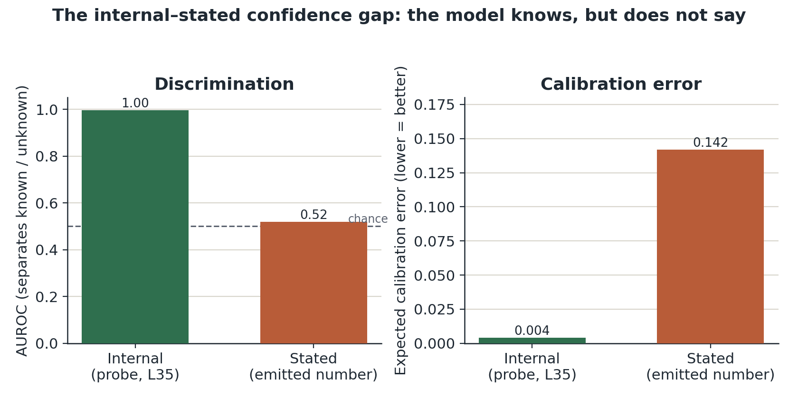
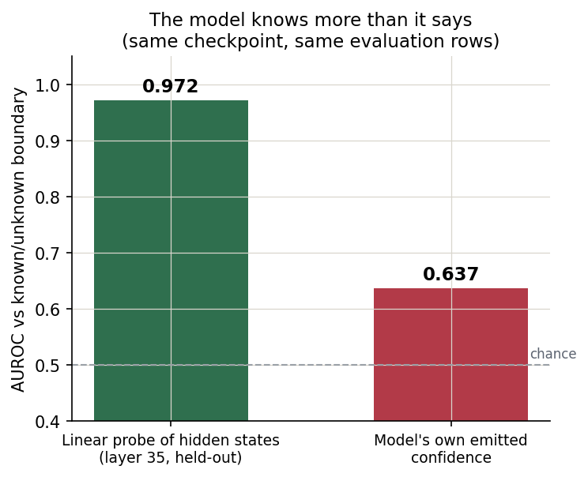
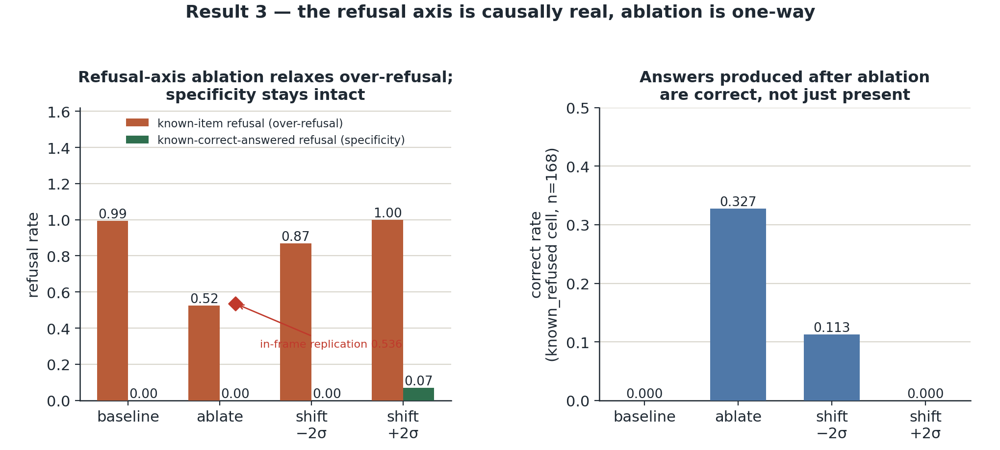
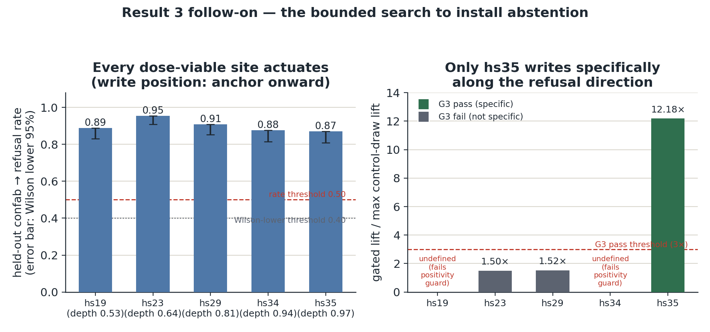
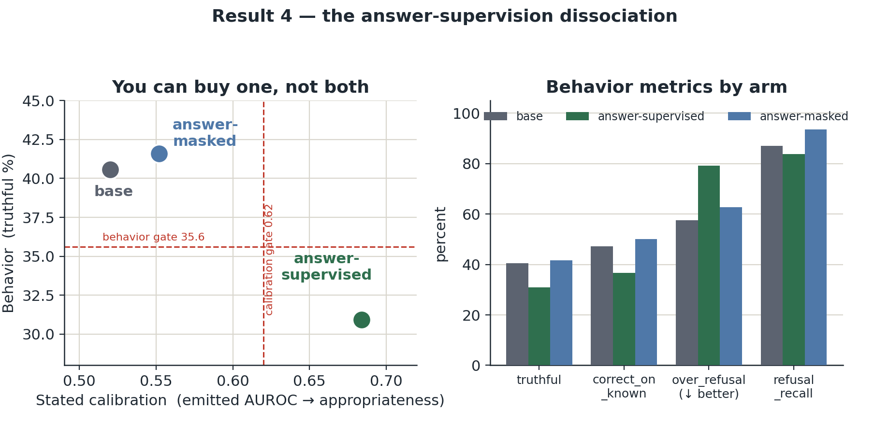
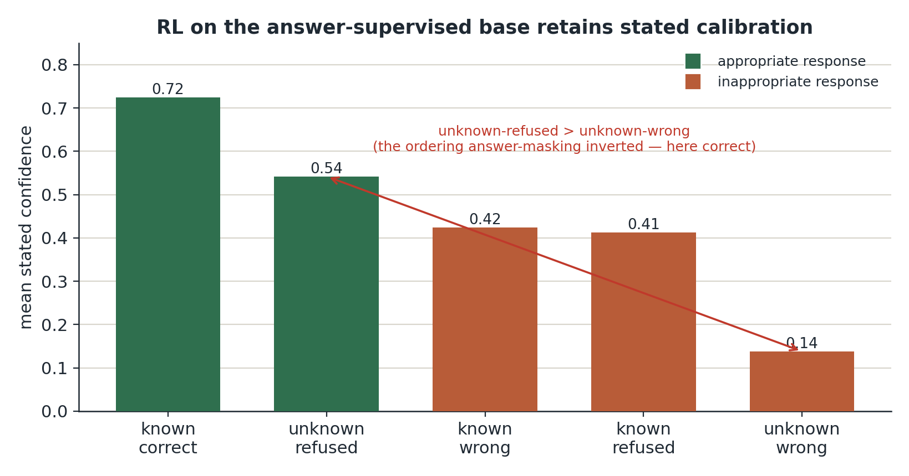
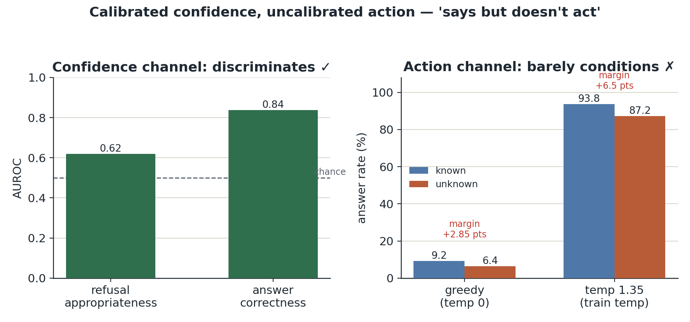
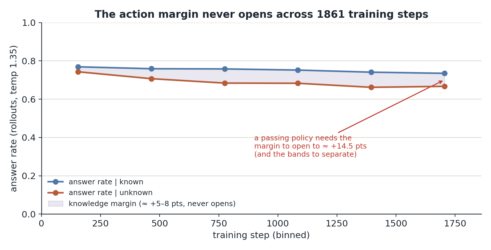
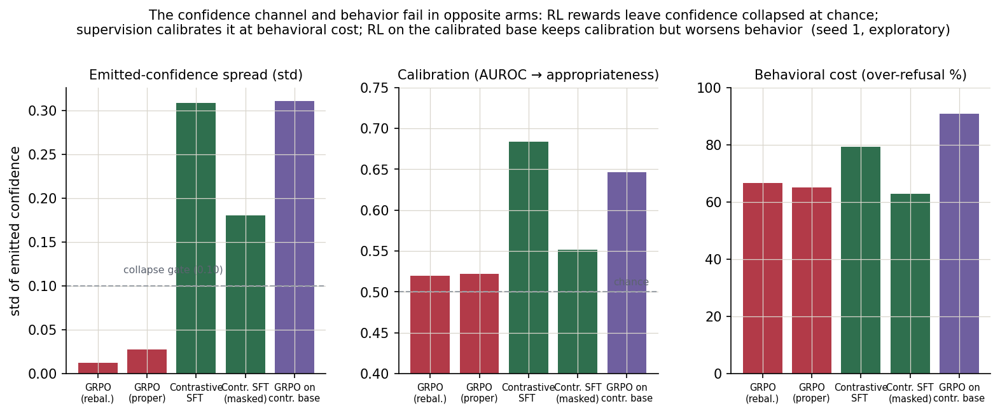

# Knows but Doesn't Say: A Training-Resistant Gap Between Internal and Stated Confidence in a Small Language Model

> *"We can know more than we can tell."*
>
> Michael Polanyi, *The Tacit Dimension*

## Abstract

A model that says "I don't know" appropriately may still be performing humility
rather than possessing it. We separate the two in a small instruction-tuned model
(Qwen3-4B) by reading three signals on the same questions: an *internal* confidence
axis recovered by a linear probe on hidden states, the *stated* confidence the
model verbalizes as a number, and the *behavior* it commits to (answer or abstain).
On a known/unknown question split (SelfAware, n = 3369), the internal axis
separates known from unknown items at AUROC 0.997 and is near-calibrated in
aggregate (ECE 0.047 raw), while the stated confidence ranks appropriateness at
AUROC 0.52 to 0.56, collapsed near a constant (0.82, std 0.01 to 0.03). The model
represents what it does not know and does not report it. By "knows" we mean recognition of which questions are
answerable, not verified self-knowledge that its own answer is correct.

Four results follow. Questions the model over-refuses despite knowing them sit at
an internal "known" position, so the failure is verbalization, not representation.
The internal signal resolves into two separable axes, a graded known-unknown axis
and a refusal axis that still predicts refusal at AUROC 0.80 once the first is
projected out. Their origins differ: the known-unknown axis reads 0.997 on the raw
untrained base and on four pretrain-only bases, while the refusal axis appears only
after abstention training. A separate actuation study finds that axis causally real
but one-way: steering relaxes over-refusal and cannot install abstention. The
readout covers overtly unanswerable questions and falls to 0.63 where ambiguity is
covert. Seven training interventions across preference, reinforcement-learning and
supervised objectives leave the gap open, and one single-variable comparison shows
why: contrastive fine-tuning installs stated calibration only by
supervising the wrong-answer text, which breaks behavior, and masking that text
restores behavior and destroys the calibration. Current objectives move behavior or
stated confidence without coupling either to the internal signal.

## 1. Introduction

The dominant way to teach a language model epistemic humility is to teach it to
*act* humble: to abstain when it should, to hedge, to say "I don't know." A review
of that training literature (Rosenbaum, 2026a) finds that almost all of it is
measured at a single depth, a scalar confidence or a binary abstention, and that
one axis goes almost entirely unmeasured: *coherence*, whether the model's stated
epistemic signal, its token-level signal, and its hidden-state signal actually
agree.

Try the distinction as a thought experiment. You ask a model a question that has no
settled answer, and it declines to answer. From the decline alone you cannot tell
whether the model recognized the question as unanswerable or whether declining is a
habit it acquired in training that happens to fire here. The two are
indistinguishable at the output and come apart the moment the input distribution
shifts. Rosenbaum (2026a) names this with Plato's image from the *Meno*: a true
opinion not tethered to a reason is like one of the statues of Daedalus, apt to run
away. A humility behavior not anchored to the model's internal state is an
untethered statue, right today and a runaway tomorrow.

This paper measures the tether directly in one small instruction-tuned model. We
read three signals on the same questions (a linear probe on hidden states, the
confidence number the model states, and the answer-or-abstain decision it commits
to), establish how far apart the internal and stated signals are, resolve the
internal signal into the two axes that produce that gap, and then ask whether any
of seven training interventions brings the stated number into agreement with the
internal one. The short answer is that the tether is missing and that ordinary
training does not install it.

Two outcomes would have overturned that thesis. If the probe had failed to separate
known from unknown questions any better than the model's own stated confidence
does, there would be no gap to explain. If any of the seven interventions had
produced a checkpoint that both behaved well and stated calibrated confidence, the
gap would be an unsolved training problem rather than a property of the channel
itself. Neither happened. Every result below was judged against a threshold fixed
before the run, and Section 9 states those thresholds and which of them were missed.

A scope note before the results: this is a deep within-model mechanistic study of a
single model (Qwen3-4B) at a single seed. We are explicit throughout about which
numbers are robust population reads (n ≈ 3369) and which are directional small-sample
estimates, and Section 9 collects the threats to validity. The claims we stand
behind are qualitative and large in magnitude (0.997 vs 0.52; the
answer-supervised to answer-masked direction flip); the claims we flag are the
precise effect sizes.

## 2. Related work and positioning

### The coherence axis

Rosenbaum (2026a) introduces a "Depths of Ignorance" taxonomy (L1 calibration, L2
structured ignorance, L3 distributional signatures, L4 objective uncertainty) and a
cross-cutting coherence/faithfulness axis, and documents that the training
literature clusters at L1 and almost never measures coherence. The first systematic
framework for "faithful calibration" finds that token-probability, hidden-state,
and sampled-consistency estimators of internal confidence diverge on the same
traces (Gani et al., 2026), and multiple groups find that more inference-time
reasoning impairs calibration rather than helping (Lacombe et al., 2025; Mei et
al., 2025). This paper is the empirical instantiation of that coherence axis on one
model: we measure stated against internal directly and ask whether training couples
them.

### Latent knowledge and probing

A line of work shows that a model's hidden states linearly encode whether it is
being truthful or whether it knows an answer (Azaria and Mitchell, 2023; Burns et
al., 2022; Marks and Tegmark, 2023; Kadavath et al., 2022), with theoretical
grounding for why such directions are linear (Jiang et al., 2024) and evidence that
truth directions generalize across tasks (Liu et al., 2024); a mechanistic
literature localizes factual recall itself to identifiable components (Meng et al.,
2022; Dai et al., 2021; Cunningham et al., 2023). Two findings are directly
concurrent with ours: a linear probe reads answerability even while the output
hallucinates (Slobodkin et al., 2023), and internal truthfulness readouts exceed
what outputs express (Orgad et al., 2024); a complementary result shows fine-tuning
*suppresses* rather than destroys the boundary-tracking structure (Shi et al.,
2025). Our internal axis is in this family (a logistic probe on residual
activations). Our question is downstream of probing: granting that the knowledge is
decodable, *why does the model not say it*, and can training make it say it? The
training-resistance depth (seven objectives on one model, with refit probes held
fixed) is the part this literature has not measured.

### Activation steering

Inference-time intervention along a learned direction can change model behavior (Li
et al., 2023; Turner et al., 2023; Panickssery et al., 2023), and humility-adjacent
behaviors such as sycophancy live in steerable internal subspaces (Sun et al.,
2026). Closest to our result, refusal itself is mediated by a single causally
steerable direction (Arditi et al., 2024), though single-direction framings deserve
caution (Joad et al., 2026) and intervention conclusions are sensitive to
methodological choices (Zhang and Nanda, 2023). A separate pre-registered actuation
study in this program uses steering as a causal probe of our two-axis
decomposition; Section 6 imports its conclusion, an asymmetry that, to our
knowledge, has not been isolated for the abstention behavior specifically.

### Abstention and preference training

The program's training-regimen experiment (Rosenbaum, 2026b) establishes, on the
same model and data, that cold-start SFT induces abstention (and over-refusal), and
that DPO and KTO reposition the abstention boundary rather than inducing the
behavior. The broader literature agrees that training moves *abstention behavior*:
fine-tuning on "I don't know" labels and honesty alignment install refusal, with
over-refusal as the standard side effect (Yang et al., 2023; Cheng et al., 2024;
Uluoglakci and Taskaya Temizel, 2026), while reasoning-focused post-training
degrades it (Kirichenko et al., 2025); surveys catalogue the design space (Wen et
al., 2024). A separate line trains models to *verbalize* confidence (Lin et al.,
2022; Xiong et al., 2023; Xu et al., 2024; Stengel-Eskin et al., 2024; Kapoor et
al., 2024), typically reporting improved calibration on the trained distribution
without testing whether the emitted scalar tracks the model's internal state, which
is the coherence question this paper measures. Two newer reinforcement-learning
variants sharpen the contrast: Bani-Harouni et al. (2025) optimize a logarithmic
scoring rule for direct confidence expression, and Liu et al. (2026) use
metacognitive self-judgment to improve faithful uncertainty expression over
standard reinforcement learning. We treat these as positive controls for what
output-policy training can move, not as evidence that the emitted channel is
coupled to a hidden-state answerability or correctness signal. Consistent with our
own negative reinforcement-learning results, ternary abstention rewards under GRPO
also fail to couple abstention to confidence (Mohamadi et al., 2025), and there are
structural reasons to expect the output channel to resist: calibrated models must
hallucinate at a floor set by their miscalibration (Kalai and Vempala, 2023),
alignment stages degrade calibration (Zhu et al., 2023), and fine-tuning perturbs
overlapping representations rather than writing new signal (Kaplan et al., 2026).
This paper builds on Rosenbaum (2026b) by asking what happens to the *confidence*
channel under those and further objectives, and by adding the GRPO and
contrastive-SFT arms.

## 3. Setup

### Model and data

All experiments use `unsloth/Qwen3-4B-bnb-4bit` with LoRA
adapters (r = 32, α = 64, dropout = 0.05, all-linear targets). Training data for the
abstention and confidence arms is built from TriviaQA-RC, a reading-comprehension
set of trivia questions used here without its evidence passages (Joshi et al.,
2017), following the data-construction recipe of Cheng et al. (2024) rather than
their released labels. The out-of-distribution evaluation is SelfAware (Yin et al.,
2023), a benchmark of questions labeled answerable or unanswerable (n = 3369; 1032
unknown-labeled, 2337 known-labeled), scored with the program's pinned evaluation
harness. Probe and geometry work
uses hidden-state extractions from the merged models, best layer L35 unless
noted (Appendix A pins the harness, extraction, and artifacts).

### Three readouts on the same questions

- *Internal confidence (known-unknown axis).* A logistic probe fit on residual-stream
  activations to separate known-answerable from unknown questions, read at the
  generation position. Reported as known/unknown AUROC and as the calibration (ECE)
  of a 1-D readout along the axis.
- *Stated confidence.* The model is prompted to return JSON with an `answer` and a
  `response_confidence` ∈ [0,1] (its stated probability that its response is
  appropriate). We read the emitted scalar directly from scored rows.
- *Behavior.* Whether the model answered or abstained, and whether the answer was
  correct, summarized as truthful_rate, correct_on_known, over_refusal (refusal on
  known), and refusal_recall (refusal on unknown).

### Calibration metrics

For the stated channel we report: AUROC of the emitted
scalar at ranking *response appropriateness* (the headline coherence number), the
standard deviation of the emitted scalar (a collapse detector), expected
calibration error against appropriateness (ECE), and the mean emitted scalar within each
outcome group (does the model state higher confidence when it is actually
right/appropriate?). For the internal channel we report known/unknown AUROC and the
1-D readout's ECE.

### Scope

Single seed (seed 1), single model. We treat large qualitative contrasts
as the findings and flag precise effect sizes as single-seed estimates (Section 9).

## 4. Result 1: The model represents what it does not know, and does not report it

The headline contrast is between two readouts of the same model on the same
questions.

### The internal readout

The known-unknown-axis probe separates known from unknown questions at
**AUROC ≈ 0.997** at the best layer (L35), and this is a property of the internal
state rather than surface vocabulary: the residual probe beats a lexical baseline
(≈ 0.964) by +0.033. A one-dimensional logistic
readout along the known-unknown axis, refit fold-wise to avoid anchor leakage
(5-fold stratified CV, held-out projections), is **calibrated in aggregate
(ECE ≈ 0.047 raw)** on a powered re-estimate (below), and its projection is
monotone across outcome groups (correct > wrong > refused > unknown; the
correct-minus-wrong step stays positive with a CI that excludes zero under an
out-of-fold reading of the axis). This monotone
ordering, like the answerability identity below, is a single-model/single-population
reading (Qwen3-4B, SelfAware); a pre-registered, methodologically parallel
evidence-responsiveness test on a different Qwen lineage and a different error class
(confident wrongness on answerable, world-known questions, rather than KUQ ignorance)
found the analogous KUQ-fit direction's projection reverses in sign instead of
ordering monotonically there, and a pre-registered constructive search for a portable
evidence-responsive axis on that population recovered only generic retrieval-family
geometry, not a specific evidence axis, so this ordering should not be assumed to
transfer before it is tested directly.

### The stated readout

The same model's emitted `response_confidence` is collapsed near a
constant (mean ≈ 0.8212 with std ≈ 0.0175 on the 780 answered-known rows at
deployment rendering) and ranks its own correct vs wrong answers at
**AUROC ≈ 0.5207 with ECE ≈ 0.2847**, on 420 correct / 360 wrong rows, a
24-fold increase in the wrong-answered group over the original n = 16 estimate
(AUROC ≈ 0.559, ECE ≈ 0.142). That original estimate's extraction manifest was
95.9% correct on its answered-known population; the deployment population is
53.8% correct, so the two are not comparable as a pure power correction. On the
full SelfAware evaluation the trained models' emitted scalar
ranks appropriateness at **AUROC ≈ 0.52–0.56** (Section 7). Within each outcome
group the emitted number is nearly flat (≈ 0.81 whether the model was right, wrong,
or refused).

So for the known-versus-unknown question, the discriminating signal exists
internally and the verbalized number is a collapsed near-constant: the model
*knows* what it does not know, but does not *say* it.

Whether it also knows which of its own answers is right is a narrower claim, and a
powered re-estimate overturns it at the axis level. We had predicted, before
running it, that the known-unknown axis would rank the model's correct answers
above its wrong ones. It does not, or at least not by any margin over what the
model already says out loud: the axis reads correct against wrong at AUROC 0.5597
(CI 0.5185 to 0.5993) where the emitted scalar reads 0.5207, a gap of +0.0390 whose
confidence interval includes zero, measured on 360 wrong-answered rows at
deployment rendering against the 16 rows the original estimate rested on. The
prediction was wrong. The correctness signal is not absent from the model: an
exploratory probe fit directly on the same hidden states reaches AUROC 0.6769, so
correct-versus-wrong is linearly present in the residual stream at this position.
The known-unknown axis specifically does not carry it forward to deployment.

The calibration side of the original contrast survives and widens under power: the
axis's own readout stays near-calibrated (ECE 0.0474 raw) against the emitted
scalar's ECE 0.2847, a gap of +0.2373 (CI 0.1853 to 0.2769) that excludes zero. One
comparison we do not make: the original internal-channel numbers were extracted
under the harness's neutral default prompt on a population that was 96% correct,
while the re-estimate renders under the deployment prompt on one that is 54%
correct. Render surface and statistical power move together between the two, so the
drop from the earlier 0.649 internal comparator to 0.5597 is confounded and is never
differenced as a pure power correction.

**Figure 1. The internal–stated confidence gap.** Two readouts of the same model
on the same SelfAware questions (n=3369). *Left:* the internal known-unknown-axis probe
(L35) separates known from unknown questions at AUROC ≈ 0.997, while the emitted
`response_confidence` scalar ranks appropriateness barely above chance
(AUROC ≈ 0.52). *Right:* on a powered re-estimate (360 wrong-answered rows at
deployment rendering, up from the original 16), the internal axis's own readout
stays near-calibrated (ECE ≈ 0.047 raw) where the stated scalar is badly
miscalibrated (ECE ≈ 0.285); this calibration contrast survives and widens
under power. The same re-estimate found that this axis does not rank the
model's own correct versus wrong answers any better than the collapsed stated
scalar does (AUROC 0.56 vs 0.52, gap CI includes zero); the correctness signal
is linearly present elsewhere in the residual stream (an exploratory probe fit
on the same states, AUROC 0.68) but is not carried by this axis at deployment.

### The gap is like-for-like, not a scoring artifact

A skeptic could object
that Figure 1 scores the two channels against different labels (the probe
against known/unknown, the stated scalar against appropriateness). On the
deployed GRPO-trained checkpoint (Section 7, intervention 4), both channels can
be scored against the *same* known/unknown label on the *same* joined rows
(n = 1233): the L35 probe reads the boundary at AUROC 0.972 while the same
checkpoint's own emitted confidence reads it at 0.637. The
calibration side of the contrast is equally stark: a linear readout along the
internal axis is near-calibrated (ECE ≈ 0.047 raw, measured on Section 4's
correct/wrong population rather than on this paragraph's joined rows), while the emitted
channel's ECE against appropriateness on the full evaluation is 0.403. The
emitted scalar does carry *some* boundary information when scored against the
label it is best at (0.637 > chance): the gap is not that the stated channel
is empty, but that it says a fraction of what the states contain.

**Figure 2. The model knows more than it says: like-for-like on one
checkpoint.** On the same GRPO-trained checkpoint and the same evaluation rows,
a held-out linear probe of layer-35 hidden states reads the known/unknown
boundary at AUROC 0.972 while the model's own emitted confidence reads it at
0.637. The knowledge is in there; training never wired it to the output.

### The gap is not internal confusion

A natural objection is that the model
over-refuses items it is genuinely unsure of. It does not: the known-but-refused
items sit at an internal "known" position. On the 0 (known) to 1 (unknown)
known-unknown scale, known-answered items sit at ≈ 0.001 and unknown-refused at ≈ 0.999, while
known-*refused* items sit at ≈ 0.25–0.28, far from the unknown pole. Over-refusal is a behavioral-threshold
phenomenon over items the model internally recognizes as known, not suppression of
a genuine internal "I don't know."

### The internal signal survives training

Re-fitting the probe on each fine-tuned
model's own activations gives essentially identical separation: clean SFT 0.9968,
SFT→GRPO-DPO 0.9972, SFT→GRPO-v2 0.9971, all vs base 0.997. Training does not damage or move the internal
representation; it leaves the gap intact.

### The known-unknown axis is the answerability readout, and it predates our training

One identity, stated explicitly so the research program does not count a single
signal twice: the known-unknown axis is the same known-versus-unknown separation
that a separate training-free readout line in this program uses to sort answerable
questions from unanswerable ones, read here as graded confidence instead.

The separation is not something our training created. The same known/unknown probe
reads at 0.997 untrained on the raw Qwen3-4B base (no instruction tuning, no
adapter) and at 0.997 or higher on four pretrain-only base models spanning families
and eras. That test was pre-registered, with a threshold each base had to clear
before the run, and all four cleared it. We fit the axis on trained checkpoints
because that is where this paper's questions live; the signal itself is a property
of pretraining. Its scope is narrower than answerability in general: it covers
questions whose surface marks them as unanswerable, and not questions whose
ambiguity is covert, a boundary Section 8 reports.

## 5. Result 2: The internal signal is two axes, a graded known-unknown axis and a separable refusal axis

Reading "how known is this item" and "did the model refuse" as one axis would be
the parsimonious story, and the first measurement appears to support it: the raw
mass-mean cosine between the refusal direction (refuse vs answer among knowns) and
the knowledge/known-unknown direction is **−0.83**, i.e. nearly collinear, opposite sign.
Under that reading,
refusal is simply the low-known tail of a single graded known-unknown axis.

That reading is an artifact of the instrument. Raw cosine in high-dimensional
activation space is dominated by a few shared high-variance dimensions and
overstates collinearity. Whitening the covariance (shrinkage λ = 0.1) drops the
cosine to **−0.61** on the full sample (subsampling to 300/300 for the AUROC
protocol gives −0.56 to −0.61 depending on subsample seed), and the refusal
direction retains a substantial component off the known-unknown axis: its **residual
fraction is 0.557** (≈ 55.7% of the refusal direction's length, ≈ 31% of its
variance, is known-unknown-orthogonal; subsample-invariant). Class counts for the
geometry are 168 known-refused, 373 known-answered, and 676 unknown-refused, with
the two large classes subsampled to 300/300 for the AUROC protocol; the covariance
is pooled within-class and shrinkage-whitened; all discriminability numbers are
5-fold held-out.

The decisive test is held-out discriminability after orthogonalization. Predicting
refuse (1) vs answer (0) among known items:

| direction | held-out refuse/answer AUROC, mean (range over 4 fold seeds) |
|---|---|
| knowledge/known-unknown axis alone | 0.866 (0.861–0.872) (strong: refuse = less-known) |
| refusal orthogonalized to the known-unknown axis (`caution_perp`) | **0.798 (0.788–0.826)** |
| full refusal axis | 0.885 (0.881–0.892) |

Removing the *entire* rank-1 known-unknown direction barely dents refuse/answer
separability (0.885 → 0.798, means over fold seeds), so the refuse/answer decision
is not confined to the known-unknown axis: a genuine refusal-specific mechanism exists (an
independent reconstruction reproduces the pipeline and supplies the fold-seed
spread). The two are correlated
(both are elevated on the low-known tail) but separable.

### Method lesson

Raw cosine said "one axis" (−0.83); held-out discriminability
after orthogonalization says "two axes." The reliable instrument for "is direction
B reducible to direction A" is not cosine but whether B still discriminates its
target after A is projected out. Stronger whitening monotonically pushes the cosine
−0.83 → −0.61 → toward 0, re-validating an independent near-orthogonality estimate
(≈ 0.02) from a separate analysis. The stronger reducibility test, certified
linear erasure of the full answerability concept (LEACE), confirms this: erasing
everything a linear probe can use to read known/unknown (probe AUROC 0.996 to
0.496 post-erasure) costs the refusal readout 5.4 ± 0.6 points of 91, leaving
refuse/answer discrimination at 0.858 held-out. The refusal axis's linear separability is not carried
by the knowledge readout, which contributes only a small quantified share.

### The refusal axis is shared across training regimens

The refusal direction
recovered independently from SFT, GRPO-DPO, and GRPO-v2 models points the same way
(mean cross-regimen |cos| = 0.701 vs a random floor of 0.014; GRPO-DPO ↔ GRPO-v2 =
0.857) and is approximately orthogonal to the knowledge axis within each model
(|cos| ≈ 0.04–0.09). The refusal axis is a single,
stable, knowledge-orthogonal internal mechanism, not an artifact of one training
run. Each of those readings is fit on its own checkpoint's activations; no single
common checkpoint carries all of them.

### The refusal axis is a trained-checkpoint construct, and cannot be anything else

The
refusal direction is defined by a refuse-versus-answer contrast among items the
model knows, and that contrast only exists once a model over-refuses. The raw base
never does: on the 1,233-question known/unknown surface of the base-model readout,
it refused zero questions, so there is no base-model refusal direction to fit, for
this model or for any model that never abstains (Appendix A). The asymmetry
between the two axes is therefore itself a finding about what abstention training
adds. Training does not create the known-unknown axis (the answerability separation is already at
ceiling in the raw base and in pretrain-only bases, Section 4); it does create
the refusal axis. Every refusal-axis number in this paper is a property of the trained,
post-abstention checkpoints, and we make no base-model claim for the refusal axis.

The program has also examined a third candidate direction, a
confabulation-propensity read (which unanswerable items draw a fabricated answer
rather than a refusal, residualized against the refusal axis). It is checkpoint-specific to
the program's most-trained checkpoint, and in the pre-registered actuation study
writing along it does not causally convert confabulations into refusals; we
therefore do not include it among this paper's internal-confidence signals.

## 6. Result 3: The refusal axis is causally real, and the leverage is one-way

The two-axis decomposition makes a causal prediction: intervening on the refusal
axis should change the refuse/answer decision without changing what the model
knows. A separate actuation study in this program establishes that the refusal
axis is causally real but asymmetric: ablating it cuts over-refusal on
known items from 0.994 to 0.524, a result that replicated at 0.536 with
specificity intact, while no intervention tried there installs appropriate
abstention on genuine unknowns. The leverage is one-way: over-refusal can be relaxed; appropriate
abstention cannot be written in.

**Figure 8. Ablating the refusal axis relaxes over-refusal one-way.** Left:
known-item refusal (over-refusal, orange) and known-correct-answered refusal
(specificity control, green) across the baseline, ablate, and ±2σ shift arms
of the KU-orthogonalized ("caution_perp") residual intervention at L35 on
clean_sft_grpo_v2_seed1 (known_refused n=168, known_correct_answered n=373).
Ablation collapses known-item over-refusal from 0.994 to 0.524 while
known-correct-answered refusal stays at 0.00; the diamond marks the in-frame
replication at 0.536 on a fresh registered cell with the same recipe. Right:
answers produced by the ablated model are not just present but correct,
peaking at a 0.327 correct rate over the full known_refused cell under
ablation. Exploratory tier-2 evidence, single seed each; not part of the
locked headline matrix.

The one-way statement has since been stress-tested where it is most exposed. A
pre-registered search tried to install abstention on this paper's trained
checkpoint (clean SFT to GRPO-v2) by writing along the refusal axis: seven write
sites spanning relative depth 0.361 to 0.972 at three-block resolution, two write
positions, an eight-rung dose ladder at each site, and three magnitude-matched
two-site combinations, of which two ran and one was abandoned for want of usable
sites. Overturning the one-way statement required a single condition to do three
things at once: actuate the behavior, do so specifically along the refusal
direction, and leave answers the model should have given intact. None did, so the
one-way statement stands.

The search was nonetheless wrong about what it would find, and wrong in the
opposite direction from a null. We had predicted that no site would actuate at all.
Every site that reached a usable dose actuated: five of the seven, all at the write
position running from the pre-answer anchor token onward, none at the anchor
position alone. Those five converted held-out confabulations into clean refusals on
87.0% to 95.5% of items, with lower confidence bounds of 80.8% to 90.9%, against
thresholds of 50% and 40% set before the run. What they did not do is why the null
still holds. Only one of the five wrote specifically along the refusal direction
rather than along a generic perturbation, and at none of them could we tell whether
the write damaged answers the model should have given: it fired on 4 to 20
known-correct rows apiece, too few to measure harm against the floor of 35 rows
fixed beforehand. The actuation is a lead worth following, not an installed
capability, and turning it into a claim requires a replication registered before it
runs.

**Figure 9. The bounded search to install abstention actuates everywhere, but
is specific nowhere it can be measured.** Left: held-out confabulation-to-refusal
conversion rate (error bar: Wilson lower 95%) at each of the five sites that
cleared dose viability, all at the anchor-onward write position, against the
registered thresholds of 0.50 (rate) and 0.40 (Wilson lower bound). All five
clear both thresholds by a wide margin. Right: the direction-specificity ratio
(gated lift over the best permuted or positional-control draw lift) against
the registered 3x pass threshold. Only hs35 clears it (12.18x); hs23 and hs29
fail (1.50x, 1.52x); hs19 and hs34 have zero measured control-draw lift and so
fail the pre-registered positivity guard outright. This is exploratory,
single-seed evidence from a pre-registered search, not a headline result: the
one site that writes specifically along the refusal direction (hs35) is the
one site where the specificity guard on known-correct rows could not be
adjudicated for want of rows, so the falsifier does not fire but the search
does not overturn the one-way statement either.

Two consequences carry forward. The causal dissociation confirms that the refusal
axis is a mechanism of its own and not a re-reading of the known-unknown axis,
closing from the intervention side the case Section 5 made from the reading side.
And the asymmetry narrows what is left to try: if inference-time control can relax
over-refusal but cannot install the abstention humility actually needs on novel
unknowns, the remaining lever is training.

## 7. Result 4: Training does not close the stated-confidence gap, and a dissociation shows why

If behavior is steerable and the internal signal is calibrated, the open question is
whether *training* can make the model's *stated* confidence track appropriateness.
We ran seven interventions. None closes the gap, and the last two close it from
opposite sides in a way that localizes the mechanism.

### The seven interventions

#### Interventions 1–2: DPO and KTO

Rosenbaum (2026b) shows that direct preference optimization (DPO; Rafailov et al.,
2023) and Kahneman-Tversky optimization (KTO; Ethayarajh et al., 2024) reposition
the abstention boundary rather than inducing abstention. On the confidence channel
the emitted scalar remains a flat high value across outcome groups (known-wrong
answers, for instance, draw ≈ 0.83): repositioned behavior, unchanged stated
confidence.

#### Interventions 3–4: GRPO v1 and v2

Reward shaping over the behavior with group relative policy optimization (GRPO, a
reinforcement-learning method driven by a programmable reward; Shao et al., 2024)
leaves the stated scalar
collapsed: on the full evaluation GRPO-v2 emits mean ≈ 0.813 with std ≈ 0.013
(a near-constant ~0.8 regardless of input), ranks appropriateness at
AUROC ≈ 0.520 with ECE ≈ 0.403, and ranks its own correct vs wrong among
answered knowns at AUROC ≈ 0.521 (chance). The diagnosis is an
incentive analysis, and it generalizes beyond this particular reward. The
reward's confidence term shaped confidence toward fixed per-group targets (high
when answering correctly, low when wrong), but the model cannot observe its own
correctness at generation time, and on the held-in distribution it is trained
against, roughly 96% of its answered known rows are correct (373/388 in the
behavior subset of the same artifact); emitting the constant that fits the majority of rows is therefore reward-optimal.
Collapse is not a training accident. It is the optimum of the objective as
specified.

The collapse has since replicated beyond this seed. A pre-registered extension
retrained the same arm at two fresh seeds and checked, against a threshold set
beforehand, whether the emitted scalar would spread out: any retrained arm
producing more than 200 distinct confidence values would have counted as a
non-collapse. None came close, with distinct-value counts ranging from 4 to 85, so
the emitted scalar stays collapsed at every seed tested. This is exploratory
three-seed evidence, reported separately from the single-seed results elsewhere in
this section.

#### Intervention 5: GRPO v3, proper scoring

If the fixed-target confidence term makes a constant reward-optimal, the obvious
repair, and the one the verifiable-reward literature reaches for (Damani et al.,
2025; Bani-Harouni et al., 2025), is to make calibration itself the optimum:
replace the fixed targets with a Brier proper score (a scoring rule whose expected
value is best when the stated probability equals the true one) of emitted
confidence against realized appropriateness,

$$r_{\text{conf}} = 1 - (c - a)^2, \qquad c \in [0, 1],\; a \in \{0, 1\},$$

where $c$ is the emitted confidence and $a$ is the realized appropriateness of
the completion. The expected reward $\mathbb{E}[r_{\text{conf}}]$ is uniquely
maximized at $c = p(a = 1 \mid x)$: emitting the true probability of being
appropriate is not merely encouraged but is the optimum, so a near-constant is
provably sub-optimal. v3 adds exactly this term; by design it is sub-dominant
to the behavior reward (confidence
weight 1.2, explicitly kept below the behavior magnitudes so behavior is not traded
away). The failure here is not a degenerate target. A preflight re-scoring of
19,904 real rollouts confirmed the per-prompt targets have real dynamic range
(group-target std 0.320 over 4211 prompts, 65.6% in [0.2,0.8]) and that emitting
the calibrated target strictly beats a flat 0.82 on all 4211 prompts (mean Brier
gain +0.394). Yet after training,
behavior is fine (truthful 40.99, correct_on_known 52.52, over_refusal 65.13,
refusal_recall 92.34) while the stated scalar stays high and flat (mean ≈ 0.849,
std ≈ 0.027) and still ranks appropriateness at AUROC ≈ 0.522 with ECE 0.440.
Take that result one step at a time. The reward's optimum is a calibrated
confidence, and we verified that the per-prompt targets vary enough for the optimum
to be worth reaching. The policy nonetheless does not reach it. It begins training
already emitting a near-constant, and from that starting point the confidence term
offers only a small local gradient, while the behavior terms it is simultaneously
earning are satisfied where it already sits. So it stays put. The optimum exists in
theory and gradient ascent does not find it from this initialization. That is the
cleanest form of the negative result: **even a reward for which calibrated
confidence is the mathematical optimum fails to elicit it through reinforcement
learning from a collapsed starting point.**

#### Interventions 6–7: contrastive SFT, answer-supervised and answer-masked

These two variants are the
dissociation, treated in full below.

### The answer-supervision dissociation (the localizing result)

Contrastive SFT
supervises matched high-confidence appropriate completions and low-confidence
inappropriate completions. The *answer-supervised* variant supervises the entire
assistant turn on inappropriate rows, including the wrong-answer text. The
*answer-masked* variant is identical except a generic per-row sub-span loss mask
removes the wrong-answer text from the loss, so inappropriate rows supervise only the
low confidence, not the wrong answer. This is a clean single-variable comparison: the
only difference is whether the wrong answer is in the loss.

Table 1. The answer-supervision dissociation (SelfAware, n = 3369). Every
threshold in the second column was fixed before the runs; Section 9 states them
together with what each would have overturned.

| metric | threshold | clean-SFT base | **answer-supervised** | **answer-masked** |
|---|---|---|---|---|
| emitted AUROC → appropriateness | ≥ 0.62 | ≈ 0.52 | **0.684 ✓** | **0.552 ✗** |
| emitted std (collapse detector) | ≥ 0.10 | ≈ 0.05 | 0.309 | 0.180 |
| ECE → appropriateness | < 0.30 | 0.40–0.44 | 0.183 | 0.277 |
| known_correct mean > known_wrong mean | (none) | fails | 0.670 > 0.306 ✓ | 0.756 > 0.742 ✓ (barely) |
| unknown_refused mean > unknown_wrong mean | (none) | fails | 0.581 > 0.156 ✓ | **0.666 < 0.696 ✗ (inverted)** |
| truthful_pct | ≥ 35.6 | 40.58 | **30.93 ✗** | **41.59 ✓** |
| correct_on_known_pct | ≥ 42.2 | 47.23 | **36.63 ✗** | **50.06 ✓** |
| over_refusal_pct | ≤ 67.5 | 57.51 | **79.2 ✗** | **62.73 ✓** |
| refusal_recall_pct | ≥ 82.0 | 87.02 | 83.72 ✓ | 93.51 ✓ |

The answer-supervised variant installs stated calibration (AUROC 0.684, wide separations between
outcome groups, the only arm to beat chance at ranking correct vs wrong among answered
knowns at AUROC 0.789) but breaks behavior (over-refuses, correctness falls). The
answer-masked variant recovers behavior fully (it matches or exceeds the
clean-SFT base on every behavior metric) but the stated calibration collapses
back toward
baseline (AUROC 0.552; the unknown group-mean ordering inverts, the model stating
*higher* confidence when it answers an unknown wrong, 0.696, than when it correctly
refuses, 0.666). Note that the answer-masked variant is not collapsed to a constant
(std 0.180 ≫ base 0.05): it emits *spread* confidence that does not *discriminate*.
Variance is not calibration.

A small verbatim overlap between these arms' training prompts and the known
half of the evaluation set inflates absolute known-row levels without moving
any Table 1 verdict; Section 9 states the overlap, its bounds, and the
decontaminated recomputation.

### Mechanistic reading

The wrong-answer supervision carried the
stated calibration, not merely a behavior-breaking side effect. When the
answer-supervised variant supervises "{wrong answer} + low confidence" jointly, the
low-confidence token is bound to the act of producing that (wrong) answer, and that
binding is what makes the stated scalar track appropriateness. Remove the answer from
the loss (the answer-masked variant) and behavior heals, but the confidence token
loses the thing it was conditioned on, so discrimination returns to baseline. Under a
single SFT lever, stated calibration and behavior are in tension: you can buy one or
the other, not both. The answer-masked variant is therefore a behavior success and a
calibration failure, and we score it that way rather than counting the recovered
behavior as a win.

**Figure 3. The answer-supervision dissociation: a single SFT lever cannot buy
calibration and behavior together.** *Left:* the calibration–behavior trade-off.
Each arm is one point: x = stated calibration (emitted AUROC → appropriateness,
threshold 0.62), y = behavior (truthful %, threshold 35.6). The answer-supervised
variant sits bottom-right (good calibration, broken behavior); the answer-masked
variant sits top-left (good behavior, calibration back at baseline); base is bad on
both. The quadrant lines are the two thresholds; no arm reaches the passing
quadrant (top-right). *Right:* the four behavior metrics by arm, showing the answer-supervised
over-refusal spike and correctness drop that masking the answer recovers. Data:
Table 1.

### The SFT→RL follow-on: a second dissociation, confidence vs action

The
answer-supervision result says a single SFT lever cannot buy calibration and
behavior together. The obvious next move is a *division of labour*: keep the
answer-supervised calibration and repair its behavior with reinforcement learning,
which is built for behavior shaping. We ran GRPO v3 (the same proper-scoring reward
as intervention 5) on the answer-supervised base rather than the clean-SFT base, so
that the KL anchor now references a *calibrated* policy and the dominant behavior
reward attacks its over-refusal. This is an exploratory single-seed experiment,
reported on its own and never pooled with the program's confirmatory results.

The calibration half of the bet pays: training on the answer-supervised base *retains* stated
calibration even as the policy moves well off its reference (final KL ≈ 0.97).
The emitted scalar keeps AUROC → appropriateness 0.646, std 0.311, ECE 0.214, and
the full ordering across outcome groups, including the very ordering the answer-masked variant
inverted: unknown-refused (0.542) > unknown-answered-wrong (0.138). RL on a calibrated base preserves
calibration where RL on the flat base (intervention 5) could not manufacture it;
the base, not the reward, was the binding constraint for the confidence channel.
This is the first direct evidence in this study that RL does not intrinsically
*destroy* a calibrated stated-confidence channel: it fails only to create one.

**Figure 4. GRPO on the answer-supervised base retains stated calibration: the
emitted scalar tracks outcome.** Mean emitted `response_confidence` per outcome
group (greedy). The full ordering is preserved (high for known-correct, low for
unknown-wrong), including the exact ordering the answer-masked variant inverted:
unknown-refused (0.54, an appropriate abstention) sits *above* unknown-wrong (0.14,
a confident error). RL on a calibrated base preserves the confidence channel that
RL on the flat base could not manufacture.

But behavior does not repair, and *why* it does not is the result. Over-refusal
gets *worse*, not better (90.76%, vs the answer-supervised arm's 79.2%; truthful 31.9, below the 35.6
threshold). Decomposing the answer/abstain decision from the confidence scalar (Table
2) shows the two channels have come apart. The confidence channel discriminates:
among refusals, the stated scalar separates a correct refusal (an unknown) from a
mistaken one (a known the model should have answered) at AUROC 0.62, and among
answers it separates correct from wrong at AUROC 0.84. The *action* channel barely
conditions on knowledge at all: the model answers knowns only 2.85 points more
often than unknowns (9.2% vs 6.4%; p = 0.006, statistically real but practically
negligible). The decision is ~97% a single knowledge-independent propensity and
~3% knowledge.

Table 2. GRPO-v3 on the answer-supervised base: calibrated confidence,
uncalibrated action (SelfAware, n = 3369; greedy unless noted).

| channel | measurement | value |
|---|---|---|
| confidence | refusal-appropriateness AUROC (unknown-refused vs known-refused) | **0.62** |
| confidence | answer-correctness AUROC (correct vs wrong, among answers) | **0.84** |
| action | answer-rate margin, P(answer\|known) − P(answer\|unknown) | **+2.85 pts** (p = 0.006) |
| action | same margin at temperature 1.35 (training temperature) | +6.5 pts |
| action | same margin over training (1861 steps, binned) | +2.5 → ~+7 pts, never opens |
| action | same margin, lower-KL re-run (β 0.05, greedy); needed ≥ ~14.5 pts to survive as a KL artifact | **+3.02 pts** (p = 0.004): decoupling recorded as structural |

**Figure 5. Calibrated confidence, uncalibrated action.** The two channels of the
policy from GRPO on the answer-supervised base have come apart. *Left:* the confidence channel discriminates:
the emitted scalar separates appropriate from mistaken refusals (AUROC 0.62) and
correct from wrong answers (AUROC 0.84), both above chance. *Right:* the action
channel barely conditions on knowledge: the answer-rate margin between knowns and
unknowns is only +2.85 pts greedy and +6.5 pts at the training temperature 1.35.
The decision is ~97% a single knowledge-independent propensity. "Knows but doesn't
say" becomes "says but doesn't act."

Temperature confirms this is not a decoding artifact. Greedy decoding refuses
almost everything (over-refusal 91%); sampling at the training temperature 1.35
answers almost everything (refusal 8%, and it now answers 87% of *unknowns* too);
at neither operating point does the decision discriminate known from unknown, and
at the high temperature even the confidence channel breaks (refusal-appropriateness
AUROC falls to 0.33, below chance). Temperature slides a single global
answer/refuse propensity; it does not create knowledge-conditioned action that
isn't there. And across all 1861 training steps the action margin never opened
(Table 2, row 5): the strong reward differential between refusing a known
(−1.28 mean reward) and refusing an unknown (+2.10) moved the *global* answer rate,
not the conditioning.

**Figure 6. The action margin never opens during training.** Answer rate for
known vs unknown rollouts (temperature 1.35) binned across the 1861-step run of
GRPO on the answer-supervised base. Both bands drift down together as the global answer rate falls; the knowledge
margin between them (shaded) stays at ≈ +5–8 points throughout and never widens.
A policy that passed the behavior threshold would need the margin to open to ≈ +14.5
points and the bands to separate; neither happens. The reward differential
between refusing a known and refusing an unknown moved the *global* propensity,
not the knowledge conditioning.

The reading extends this paper's thesis by one layer. The model knows internally
(Section 4) and, after answer-supervised SFT, *says* it: the confidence scalar tracks
knowledge. But it does not *act* on it: the answer/abstain decision is decoupled
from the very signal the model is now able to verbalize. "Knows but doesn't say"
becomes, here, "says but doesn't act." That leaves one obvious alternative
explanation: the KL anchor may simply be pinning the action to the
answer-supervised model's over-refusing mode. We fixed the test for it in advance.
Loosen the anchor, and the action margin must open to at least about 14.5 points,
the separation a passing behavior score implies, or the decoupling is not an anchor
artifact.

### Loosening the anchor: the decoupling is structural

Halving the KL anchor
(β 0.1 → 0.05) demonstrably loosened the policy: train-time KL roughly doubled
(≈ 0.97 → ≈ 1.91), so the policy moved markedly further from the
answer-supervised base. Yet the greedy eval is a near-exact overlay of the β 0.1 run: truthful 31.9%
(unchanged), over-refusal 90.59% (vs 90.76%), and the confidence channel still
calibrated (AUROC 0.648 vs 0.646, ECE 0.212 vs 0.214, the same ordering across
outcome groups). The action margin moved by **0.17 points**, from +2.85 to **+3.02
pts** (z = 2.90, p = 0.004), against the ~14.5 it would have needed, and the
training-trajectory margin stayed in the same +5 to +9 pt band throughout, never
trending toward opening. The β knob was the one lever that could have explained the
action decoupling as a KL artifact; it moved the policy and did not move the
conditioning. We therefore record "says but doesn't act" as a **structural**
property of the objective and the decode, not of the KL anchor. The implication is
the experiment Section 8 sets out: the action and the stated scalar must be
supervised against the model's own internal known-unknown axis directly, which no
outcome or preference reward does. Tuning the reinforcement-learning knob is
closed.

### Where this leaves confidence training

Across the five confidence-channel
arms so far (GRPO-v2, proper-scoring GRPO, the two contrastive variants, and
RL on the answer-supervised base), no combination produced a checkpoint that
both behaves well and states calibrated confidence, and the pattern is
internally consistent: supervision can install a calibrated channel
(the answer-supervised variant), RL preserves an installed channel (the
follow-on above), RL cannot install one (interventions 3–5), and behavior and
stated confidence move on separate channels throughout. The stated channel is
never coupled to the epistemic state in the first place unless supervision
explicitly constructs the coupling, and the one supervision that constructs it
does so by a binding (the wrong-answer text) that breaks behavior.
This is a local claim about coupling in this model and channel: it does not deny
that RLMF-style objectives can improve faithful uncertainty metrics, but it says
that output-level improvement is not yet the same thing as wiring the model's
internal signal to both action and stated confidence.

**Figure 7. The confidence channel and behavior fail in opposite arms.**
Emitted-confidence spread (left), calibration against response appropriateness
(center), and over-refusal (right) for the five confidence-channel arms
(seed 1, exploratory). The RL arms (red) sit below the collapse threshold and at
chance calibration with moderate over-refusal; the contrastive arms (green)
calibrate the channel at behavioral cost; RL on the answer-supervised base
(purple) keeps the calibration and worsens the behavior. No arm gets both halves
right.

### The SFT-distillation mirror: a third dissociation, action vs stated confidence

The RL follow-on gives "says but doesn't act." Its mirror is the obvious
SFT route to the same goal from the other side: instead of installing the scalar
and repairing behavior, *preserve* the clean-SFT behavior and install the scalar by
distilling the model's own calibrated internal axis into it directly. We supervised
the stated `response_confidence` on clean-SFT data with a scalar-only loss whose
target is the probe's factual confidence $P(\text{answer correct})$ per row
(AUROC ≈ 0.997 internally), clamped to $[0.02, 0.98]$; no balancing, no abstention
inversion. The assistant *answer* text is byte-identical to clean SFT, so the
knowledge-conditioned action is preserved by construction; only the confidence token
is retargeted. This too is an exploratory single-seed experiment, reported on its
own. Before running it we fixed what would count: the emitted scalar had to rank
its own correct answers above its wrong ones at AUROC 0.70 or better to succeed,
and anything below 0.60 would count as a clear negative.

The behavior half holds trivially and the calibration half lands below the negative
threshold (Table 3). Because the answer text is untouched, the action channel conditions
on knowledge *strongly*: the answer-rate margin is **+31.2 pts** (known 37.7% vs
unknown 6.5%; z = 18.6), the widest in this paper and a full behavior pass 4/4. But
the distilled scalar did not learn correctness. It collapsed onto the **action**:
across 3369 rows it emits essentially two values (0.9706 whenever it answers,
0.0294 whenever it abstains) regardless of whether the answer is right. Ranking answered
knowns correct-vs-wrong gives AUROC 0.504 (means 0.9706 vs 0.9651); refusal
appropriateness 0.501; emitted → appropriateness 0.526; ECE 0.408. The emitted std
is large (0.42) precisely *because* it splits on the answer/abstain action, not
because it discriminates correctness: the same "variance is not calibration" caution
as the answer-masked variant, in its sharpest form. A scalar-only SFT loss with a
genuinely calibrated, per-row-varying target (the source axis separates known
from unknown at AUROC 0.997; its correct-vs-wrong discrimination on answered
knowns re-estimates at 0.5597, per the Section 4 revision) still installs only a
re-description of the action the model already takes, not the state the target
encodes.

Table 3. Probe-axis distillation: distilling the calibrated internal axis into
the stated scalar by SFT (SelfAware, n = 3369; greedy).

| channel | measurement | value |
|---|---|---|
| action | answer-rate margin, P(answer\|known) − P(answer\|unknown) | **+31.2 pts** (z = 18.6); behavior 4/4 ✓ |
| confidence | emitted AUROC → correctness (set in advance: success ≥ 0.70, clear negative < 0.60) | **0.504**; clear negative ✗ |
| confidence | distinct emitted values across 3369 rows | **3** (0.9706 answer / 0.0294 abstain, correctness-blind) |
| confidence | ECE → appropriateness | 0.408 |

### The symmetry, and what it localizes

The two follow-ons are mirror images.
RL on the calibrated base keeps the *stated* calibration and cannot
install knowledge-conditioned *action*: "says but doesn't act." SFT distillation
into the scalar keeps the knowledge-conditioned *action* and cannot
install *stated* calibration: "acts but doesn't say." Neither the RL route nor the
scalar-SFT route succeeds in routing the calibrated internal known-unknown axis (AUROC 0.997)
into the verbalized single-token confidence readout. That the same channel resists
two opposite training pressures (an outcome-aligned proper-scoring reward and a
direct distillation of the very axis that is calibrated) localizes the bottleneck to
the channel itself: a single confidence token trained by next-token cross-entropy
collapses onto the lowest-entropy correlate available (the answer/abstain action),
not the higher-entropy correctness signal. This is the motivation for Section 8's
engine change: a dedicated confidence head supervised by a regression (proper-score)
loss against the internal axis, rather than a token emitted by the language head.

## 8. Discussion

### Possessed vs performed humility, measured

Rosenbaum (2026a) framed the distinction between humility a model possesses
(tethered to its internal state) and humility it merely performs (untethered
behavior). Section 4 makes the distinction concrete: the internal tether exists and
its readout is near-calibrated in aggregate (ECE 0.047 raw), the performed behavior
can be shaped (Sections 6 and 7), and the *stated* confidence, the channel a user
actually reads, is tied to neither. The model is, in the precise sense of the
*Meno*, giving true opinions without the tether. Our seven interventions are
attempts to install the tether, and they fail.

### Why the stated channel is the stubborn one

The internal axis survives training
untouched (Section 4) and behavior is cheaply steerable (Section 6, established in
the actuation study), yet the stated
scalar resists every objective we tried. The dissociation explains why: outcome and
preference rewards (DPO/KTO/GRPO) move behavior and leave the scalar collapsed
because the scalar is a tiny part of the supervised signal; the one objective that
moved the scalar (contrastive SFT) did so by entangling it with answer text, which
trades behavior. No objective we tried supervises the stated scalar *against the
right target directly*.

### Distilling the internal axis into the stated channel does not route it there

The model already contains a near-calibrated aggregate estimate of
appropriateness: the internal known-unknown axis (ECE 0.047 raw). The natural objective is
therefore not to induce calibration from outcomes, but to *distill the internal axis
into the stated channel*: supervise the emitted `response_confidence` toward the
model's own known-unknown-axis readout, so the model learns to *say* what it already
*represents*. This decouples the confidence target from the answer text (avoiding the
answer-supervised trade) and supplies a dense, per-item, calibrated target (avoiding
GRPO's out-competed confidence term). We ran it (Section 7, Table 3), and it
failed in an informative way. This framing treats the known-unknown axis's
calibrated appropriateness estimate as a stand-in for factual confidence,
$P(\text{answer correct})$; that identification, like the axis's monotonicity in
Section 4, is a single-model/single-population reading on Qwen3-4B/SelfAware, and the
pre-registered constructive search for a portable evidence-responsive
axis on a different model and error-class population found only generic
retrieval-family geometry rather than a specific evidence/correctness axis, so the
identification should not be assumed to hold outside this population without a
direct test.

Two properties of the target are what make the result interpretable. A target that
merely rescales the probe's appropriateness estimate
(response_confidence = 0.1 + 0.8·appropriateness_p) collapses to a single emitted
value (0.8765), because that target distribution is imbalanced: most known items
are answerable, so most targets land in a high band, and cross-entropy is minimized
by emitting that mode. Quantile-balancing the target onto a spread band would
penalize a constant, but the source axis it would balance (appropriateness scored
on all-appropriate clean-SFT completions) is itself near-degenerate, with 85% of
rows at one ceiling value, so balancing fabricates variance uncorrelated with
knowledge. The design therefore distills the probe's factual-correctness axis
$P(\text{answer correct})$ *directly*: a genuinely per-row-varying, internally
calibrated target (AUROC 0.997), with no balancing.

That target is exactly what the objection above asks for, and the model still did not
learn to say it. With the answer text held byte-identical to clean SFT, behavior
passed 4/4 and the action conditioned on knowledge strongly (+31.2 pts), but the
distilled scalar collapsed onto the *action*: two values, answer↔0.97 / abstain↔0.03,
correctness AUROC 0.504 (Section 7, Table 3). Distilling a calibrated target into the
single confidence token does not install calibration; it installs a re-description of
the answer/abstain decision. Combined with the RL mirror, this is what
moves the conclusion past "we have not yet found the right objective": two opposite
training pressures on the same channel both fail, which points at the *channel*, not
the objective.

### The next experiment: an engine change, not another loss on the same token

If a single confidence token trained by next-token cross-entropy collapses
onto the lowest-entropy correlate available regardless of the target, the remedy is to
stop emitting confidence from the language head: add a dedicated confidence head that
reads the same hidden state the internal axis is fit on and is supervised by a
regression (proper-score) loss against that axis, so the calibrated representation is
routed to the readout directly rather than relayed through a token the language
modeling objective keeps collapsing. Like every training experiment here it would
be registered before it runs and judged on this paper's measurements: success means
the stated channel finally clears both thresholds at once, ranking appropriateness
at AUROC 0.62 or better with genuine discrimination rather than mere spread, while
behavior stays where it was. That is the combination none of the seven
interventions achieved.

### Three readings of the gap, in increasing strength

First, as *measurement*:
any evaluation of "does the model know what it knows" that reads only output
channels understates what the model knows, badly: the same checkpoint scores
0.637 or 0.972 on the same rows depending on whether one reads its statements
or its states (Section 4, Figure 2). Second, as *mechanism*: the training arms
decompose as *policy over a fixed epistemic signal*. SFT installs a refusal routine
that keys on the signal; preference and reward objectives move the threshold that
routine fires at (Rosenbaum, 2026b); none of them touches the signal, which is why
the refit probes are identical across arms (Section 4) while refusal rates move by
tens of points. Third, as *strategy*: the expensive part of epistemic humility (the
internal knowledge-boundary signal) is already paid for by pretraining:
the same answerability readout is present in pretrain-only base weights, before
any instruction tuning or preference training, replicated across four bases
spanning families and eras (Appendix A). What pretraining pays for is bounded,
though: the readout covers overt unanswerability and not covert ambiguity, where
base and trained checkpoints alike read at ≈ 0.63 (see *Where the internal readout
fails* below).
The unsolved part is the *readout*: coupling stated confidence and action to a
signal that is linearly available inside. Training the readout failed here in
seven variants; reading it directly with a probe trivially succeeds. Whether a
training-free probe readout can supply the calibrated filter and dial that output
training could not, and whether it transfers across datasets, model sizes, and
families, is the question this result opens and this single-model study does not
settle; the standard probing cautions carry over to it, that a probe can read
knowledge recall rather than truth-tracking (Cheang et al., 2025), and that
transfer must be tested rather than assumed.

### Implications beyond this model

If the pattern generalizes (Section 9 is honest
that we have not shown this), it reframes a common assumption in abstention training:
that teaching better behavior will produce better-calibrated confidence. Here the two
are dissociable, and the confidence channel needs its own, internally-anchored
supervision. It also tempers the "steer in humility at inference" hope: the easy
steering direction (less over-refusal) is the opposite of what novel unknowns
require (appropriate abstention), and the actuation study could not install the
hard direction.

### Where the internal readout fails: covert ambiguity

Three follow-on experiments map the boundary of the readout reported here, and it
is narrower than "unanswerability." A pre-registered breadth test extended the
internal panel to AmbigQA, a set of naturally occurring questions whose
unanswerability is referential underspecification (the question does not pin down
which of several things it is asking about) rather than an absent fact. The same
probe protocol at the same position reads the answerability boundary there at only
0.6279 (clean SFT) and 0.6349 (SFT to GRPO-v2), held out on a 2,748-row panel,
against a floor of 0.90 set in advance that both arms missed by a wide margin.

An exploratory atlas on the raw base then locates the boundary. Probes fit on each
of six labeled categories of unanswerable question (the ambiguous, controversial,
counterfactual, false-assumption, future-unknown and unsolved-problem strata of the
Known-Unknown Questions dataset) separate their own unknowns from the known pool at
0.98 to 0.999 best-layer held-out AUROC, and each of them reads every other
category, and SelfAware, at 0.83 or better. AmbigQA is the exception in both
directions: it peaks at 0.6590 across all 37 layers, and transfers into it and out
of it sit near chance. The dividing line is therefore not the category of
unanswerability but whether it is *overt or covert*. The readout is reliable
wherever the question's surface marks it as unanswerable, including questions
labeled ambiguous when that ambiguity is overt, and it is close to uninformative
where the ambiguity is covert.

This failure is not something training did. In a pre-registered replication on the
identical panel, position and probe protocol, the raw pretrained base reads AmbigQA
at 0.6338, within 0.006 of both trained checkpoints, so post-training neither
installed the information nor destroyed it. The pretraining-origin reading of
Section 4 survives with its scope corrected: what pretraining supplies is an
overt-unanswerability signal, not an answerability signal in general. Covert referential ambiguity is a distinct and harder
hallucination surface, and plausibly so. Judging a question overtly unanswerable
can be done from the question itself, whereas judging it covertly ambiguous
requires retrieving the competing answers the question admits, which is a
retrieval act rather than a reading of the prompt. A model that never notices the
ambiguity has nothing about it to represent.

Two caveats bound this. The atlas is exploratory and carries a confound we recorded
before running it: the labeled unknown categories are stylistically distinctive
question types, so a within-dataset known-versus-unknown probe may ride surface
style in part, and while free cross-dataset transfer argues against a pure dataset
artifact it does not eliminate style as a shared carrier. A style-controlled
experiment, matching surface form while varying the category, is the natural
confirmatory follow-up, and none of the atlas becomes a claim before it runs.
Second, nothing here
tests whether the gap is trainable. We did not attempt to install the missing
signal, so whether targeted training or a retrieval-augmented read could supply it
is open, and it is a different question from this paper's, which is whether a
signal the model already carries reaches its output.

## 9. Limitations

- Single seed, single model. Every number is seed 1 on Qwen3-4B. The large
  qualitative contrasts (0.997 vs 0.52; the answer-supervised →
  answer-masked direction flip) are
  unlikely to be seed noise, but the precise effect sizes are single-seed estimates
  and the whole pattern needs replication across seeds and at least one other model
  family/size before any claim of generality. One component has since cleared
  that bar: the GRPO confidence collapse of Section 7 replicated at two
  further seeds under a pre-stated non-collapse guard that did not trigger
  (Section 7, interventions 3-4). The rest of the pattern remains single-seed.
- Seed dependence of the ablation geometry, now measured directly. How far the
  refuse/answer decision concentrates onto a single direction is a property of
  the individual training run, not the recipe. On this paper's seed, an
  exploratory stronger variant of the Section 6 edit (removing the full raw
  refusal direction rather than the knowledge-orthogonalized component behind
  the 0.524/0.536 numbers) collapses over-refusal to 0.030. A pre-registered
  replication of that collapse on a second seed of the identical recipe,
  run with the same surgery on that seed's own lineage and with the
  instrument passing every integrity check, instead left over-refusal at
  0.553, meeting the replication's pre-stated failure criterion. The axis is
  causally load-bearing at both seeds: the second seed still sheds 45.7
  points of over-refusal and recovers correct answers on 29 percent of
  formerly refused known items. But the near-total collapse is seed-specific,
  and no cross-seed claim about it is made here. Why the second seed's
  full-axis residual (0.553) lands almost exactly where this seed's
  component-ablation residual does (0.524) is an open decomposition question
  we flag for future work rather than pursue
  (`experiments/refusal-axis-ablation-confirmatory`).
- Training/evaluation overlap on known questions. Of the 3,369 SelfAware
  evaluation rows, 117 known (answerable) questions appear verbatim as
  training prompts in every gradient-training file the Section 7
  interventions consume (115 of the same 117 for the probe-distilled arm);
  no unknown (unanswerable) question leaks. The consequence is bounded the
  same way as in Rosenbaum (2026b): metrics computed over
  unknown-labeled rows are identical on the decontaminated population by
  construction (verified per run), while absolute known-row levels shift
  (correct-on-known falls 3.7 to 5.2 points, over-refusal rises 0.7 to 2.0
  points across the eight Section 7 runs). Recomputing every thresholded
  entry of Table 1 on the decontaminated population (n = 3,252) flips no
  reading: all twelve pass/fail entries stay on the same side of their
  thresholds, the tightest surviving margin being the clean-SFT base's
  correct-on-known at 43.03 against its 42.2 threshold. The dissociation
  story is unaffected.
- Correct-versus-wrong discrimination, resolved against us. A powered,
  pre-registered re-estimate
  replaced the original n = 16 directional read with 360 wrong-answered / 420
  correct rows at deployment rendering. At the axis level the prediction
  fails: the known-unknown axis's own readout ranks the model's correct
  versus wrong answers at AUROC 0.5597 (CI 0.5185-0.5993), a gap of only
  +0.0390 over the emitted scalar (CI includes zero), so this axis does not
  discriminate the model's own correctness any better than what it states.
  The correctness signal is not absent from the model: an exploratory probe
  fit directly on the same hidden states, outside the registered design, reaches AUROC
  0.6769, so correct-versus-wrong is linearly present in the residual stream;
  the known-unknown axis specifically does not carry it forward to
  deployment. The calibration contrast survives and widens under power
  (internal ECE 0.0474 raw vs emitted ECE 0.2847 raw, gap +0.2373, CI
  0.1853-0.2769, excludes zero). The full-eval AUROC numbers (n ≈ 3369, known
  versus unknown) are unaffected. Old and new internal-channel numbers are
  not differenced as a pure power correction: the original n = 16 extraction
  was rendered under the harness's neutral default prompt on a 96%-correct
  strata-selected population, while the re-estimate renders under the
  deployment prompt on a 54%-correct population, so render surface and power
  are confounded in any before/after comparison of the internal channel.
- SelfAware-only OOD surface. Behavior and stated-calibration numbers are on one
  OOD benchmark. Generalization to other known/unknown surfaces is untested.
- Knowledge erasure is linear-only. The stronger reducibility test is now
  done: certified linear erasure (LEACE) of the full answerability concept
  leaves the refusal readout at 0.858 held-out (baseline 0.912), with the
  knowledge subspace contributing a small quantified share (5.4 ± 0.6 points
  across 24 fold assignments). The
  remaining caveat is that the erasure certificate is linear: a nonlinear
  probe could still read answerability from the erased states, so the
  independence claim is about linear readouts, matching the linear
  instruments used throughout.
- Probe could read outcome leakage. The internal axis is fit on activations; we
  control for lexical baselines and fit the readout without correct/wrong leakage,
  but probe-based "knowledge" claims always carry the risk that the probe reads a
  correlate. The causal steering results summarized in Section 6 (from the
  actuation study) partly mitigate this for the
  refusal axis but not for the known-unknown axis.
- The search for an abstention install is bounded, not exhaustive. The causal
  results Section 6 summarizes rest on the actuation study's interventions plus
  a pre-registered search over the clean-SFT to GRPO-v2 checkpoint: seven write
  sites spanning relative depth 0.361 to 0.972 at three-block resolution, two
  write positions, an eight-rung dose ladder at each site, and three
  magnitude-matched two-site combinations, of which two ran and one was
  abandoned for want of usable sites. "Cannot install appropriate abstention"
  is therefore a statement about that searched space, not a proof of
  impossibility. Within the search the behavior actuated at all five sites that
  reached a usable dose, while only one of those wrote specifically along the
  refusal direction and none of them fired on enough known-correct rows to
  measure harm, so what remains open is an exploratory lead rather than a
  demonstrated install (Section 6).
- The reinforcement-learning follow-on is single-seed and exploratory. The
  GRPO-v3-on-answer-supervised result (Section 7, Table 2) is one seed of one
  pre-registered exploratory experiment, reported on its own and never pooled with
  the program's confirmatory results; the confidence/action decoupling
  should be read as a lead, not an established claim, until replicated. Its central
  open question, whether the decoupling is structural or an artifact of the KL
  anchor, was settled within the experiment by a lower-KL (β 0.05) re-run whose
  threshold was fixed beforehand: the action margin had to reach about +14.5 points
  to survive as an anchor artifact, and it moved only +0.17 pts (to +3.02) while
  the policy demonstrably loosened, so the decoupling is recorded as structural.
  That resolves the artifact-versus-structural question here but does not lift the
  single-seed caveat: the structural reading itself still wants replication across
  seeds and a larger model.
- The probe-distillation result is single-seed and exploratory. It (Section 7,
  Table 3) is one seed of one pre-registered exploratory experiment, reported on
  its own; "acts but doesn't say" and the channel-bottleneck
  reading it supports should be read as a lead, not an established claim, until
  replicated. The emitted scalar landed below the 0.60 negative threshold fixed
  beforehand, so the negative is on the record, but the *interpretation* (that the
  collapse is a property of a single token trained by cross-entropy rather than of
  this particular target or recipe) is what the proposed confidence-head experiment
  is designed to test, and is not yet established.
- A naming caution from a different model lineage. A pre-registered test of
  whether a mentalistic "doubt" name is earned, run on a
  different model and direction lineage (Qwen3.5-4B, hidden state 20, not this
  paper's Qwen3-4B L35 known-unknown axis) found that it is not, at least on
  responsiveness to evidence. The transfer test was voided because the direction
  read reversed on the new population, one of confident wrong answers to
  world-known questions rather than of ignorance; the direction refit natively on
  that population discriminated its target but failed to collapse under evidence,
  and the margin measurement was instrument-void. A follow-on search for a
  direction built to maximize the evidence contrast separated the classes at
  baseline but was indistinguishable from random directions shaped by the same
  covariance, recovering generic retrieval-family geometry rather than a specific
  evidence axis. Neither result is a direct test of this paper's known-unknown
  axis; they transfer as a caution about naming, by methodology, not as a
  refutation of the identity or monotonicity claims made here.

### What would overturn this

Each result below was judged against a number fixed before its run, and none of
those numbers moved afterward.

The central claim is that the internal and stated channels are decoupled, and it
breaks on one counterexample of the right shape: a training run that produced a
checkpoint both behaving well and stating calibrated confidence. The two thresholds
were set together in advance. Stated calibration required the emitted scalar to
rank appropriateness at AUROC 0.62 or better while spreading out (standard
deviation at or above 0.10, since spread without discrimination is not
calibration), and behavior required truthfulness at or above 35.6%, correctness on
known questions at or above 42.2%, over-refusal at or below 67.5%, and refusal
recall at or above 82.0%. Seven interventions ran against those numbers. The
answer-supervised arm cleared the calibration side and missed three of the four
behavior numbers; the answer-masked arm cleared all four behavior numbers and
missed calibration at 0.552. No arm cleared both, which is what Table 1 records.

Four further predictions were registered and three of them were wrong, in ways that
are part of the result rather than around it. We predicted the known-unknown axis
would rank the model's own correct answers above its wrong ones; on 360
wrong-answered rows it reads 0.5597 against the stated scalar's 0.5207, a gap whose
interval includes zero, so the prediction failed and the correctness claim is
withdrawn at the axis level. We predicted that distilling the calibrated internal
axis into the stated confidence token would lift the emitted scalar to AUROC 0.70
or better against correctness, and set 0.60 as the level below which the attempt
counted as a clear negative; it came in at 0.504. We predicted no site in the
bounded actuation search would move the behavior at all; five of seven did.
Overturning the one-way reading of the refusal axis needed something stronger,
a single condition that actuated the behavior, did so specifically along the
refusal direction, and left known-correct answers intact, and no condition did all
three, so that reading stands. The one prediction that held was that the
answerability separation predates our training: all four pretrain-only bases
cleared the threshold set for them, at 0.997 or higher.

Three outcomes would overturn the paper now. A training objective that couples the
stated channel to the internal axis without paying for it in behavior would break
the central negative directly, and the confidence-head design of Section 8 is the
version of that test we would run first. A demonstration that the internal axis is
reading a lexical or stylistic correlate rather than answerability, on a
surface-matched population, would undercut the gap by removing one of its two
terms; the covert-ambiguity boundary of Section 8 is already the strongest evidence
that the readout is narrower than it looks. And a replication at other seeds, or in
another model family, in which the stated channel is not collapsed would confine
this paper's finding to one checkpoint, which is the outcome its single-seed scope
leaves most open.

## 10. Conclusion

In one small instruction-tuned model, epistemic humility is three things that do not
agree: a calibrated internal estimate of what the model knows, a behavior that the
actuation study shows can
be cheaply steered down (but not up) along a separable refusal axis, and a stated
confidence number that tracks neither and resists every training objective we tried
to fix it with. The decisive evidence is a single-variable dissociation: contrastive
SFT can install stated calibration only by supervising the wrong-answer text, which
breaks behavior, and masking that text restores behavior while destroying the
calibration. The model knows but does not say, and current objectives move what it
says or what it does without coupling them. Two mirror follow-ons sharpen rather than
close the gap: reinforcement learning on a calibrated base keeps the stated signal but
not knowledge-conditioned action, and distilling the calibrated internal axis directly
into the stated confidence token keeps the action but collapses the scalar onto
it: two opposite pressures, the same channel, the same failure. Because the calibrated
signal already exists inside the model and the obstruction is now localized to the
single-token confidence channel, the route this paper motivates is not another
objective on that token but an engine change: a dedicated confidence head, reading the
hidden state the internal axis is fit on, supervised by a regression loss against it.

## Data and code availability

All training configs, eval configs, reward definitions, probe/geometry/steering
scripts, registered protocol documents, and per-run calibration reports are in the
repository [https://github.com/ProfSynapse/Epistemic-Humility-Research] under
`archive/experiment/phase1/`, `docs/protocols/`, and `experiments/<slug>/`. The
per-run stated-confidence
calibration reports are at `archive/experiment/phase1/eval/analysis/calibration_gap_*.json`;
the internal-axis and steering artifacts are under
`archive/experiment/phase1/probe/analysis/`.

Published dataset releases on Hugging Face (the repo-side manifest with pinned
revisions is `docs/public-artifacts.md`):
`professorsynapse/epistemic-humility-phase1` (training/dev data),
`professorsynapse/epistemic-humility-phase1-labels` (frozen question split and
knowledge labels), `professorsynapse/epistemic-humility-phase1-evals` (eval
analysis layer), `professorsynapse/eh-probe-directions` (per-layer probe
directions with fit metadata; replicate the internal-axis readout without GPU
extraction), and `professorsynapse/eh-readout-rows` (per-question
question/answer/grade rows behind the readout results).

Restricted or gitignored datasets (bridge sets, for instance) are not
redistributed. Numbers are current as of this writing and are refreshed in the
repository as further replications resolve.

## References

Arditi, A., Obeso, O., Syed, A., Paleka, D., Panickssery, N., Gurnee, W., &
Nanda, N. (2024). *Refusal in Language Models Is Mediated by a Single
Direction*. arXiv:2406.11717.

Azaria, A., & Mitchell, T. (2023). *The Internal State of an LLM Knows When
It's Lying*. arXiv:2304.13734.

Bani-Harouni, D., Pellegrini, C., Stangel, P., Ozsoy, E., Zaripova, K., Navab,
N., & Keicher, M. (2025). *Rewarding Doubt: A Reinforcement Learning Approach
to Calibrated Confidence Expression of Large Language Models*.
arXiv:2503.02623.

Burns, C., Ye, H., Klein, D., & Steinhardt, J. (2022). *Discovering Latent
Knowledge in Language Models Without Supervision*. arXiv:2212.03827.

Cheang, C. S., Chan, H. P., Zhang, W., & Deng, Y. (2025). *Do LLMs Really Know
What They Don't Know? Internal States Mainly Reflect Knowledge Recall Rather
Than Truthfulness*. arXiv:2510.09033.

Cheng, Q., Sun, T., Liu, X., Zhang, W., Yin, Z., Li, S., Li, L., He, Z.,
Chen, K., & Qiu, X. (2024). *Can AI Assistants Know What They Don't Know?*
arXiv:2401.13275.

Cunningham, H., Ewart, A., Riggs, L., Huben, R., & Sharkey, L. (2023). *Sparse
Autoencoders Find Highly Interpretable Features in Language Models*.
arXiv:2309.08600.

Dai, D., Dong, L., Hao, Y., Sui, Z., Chang, B., & Wei, F. (2021). *Knowledge
Neurons in Pretrained Transformers*. arXiv:2104.08696.

Damani, M., Puri, I., Slocum, S., Shenfeld, I., Choshen, L., Kim, Y., &
Andreas, J. (2025). *Beyond Binary Rewards: Training LMs to Reason About
Their Uncertainty*. arXiv:2507.16806.

Ethayarajh, K., Xu, W., Muennighoff, N., Jurafsky, D., & Kiela, D. (2024).
*KTO: Model Alignment as Prospect Theoretic Optimization*. arXiv:2402.01306.

Gani, A., Meskin, A., Liu, G. K.-M., & Cohan, A. (2026). *Quantifying Faithful
Confidence Expression in Large Reasoning Models*. arXiv:2606.03969.

Jiang, Y., Rajendran, G., Ravikumar, P., Aragam, B., & Veitch, V. (2024). *On
the Origins of Linear Representations in Large Language Models*.
arXiv:2403.03867.

Joad, F., Hawasly, M., Boughorbel, S., Durrani, N., & Sencar, H. T. (2026).
*There Is More to Refusal in Large Language Models than a Single Direction*.
arXiv:2602.02132.

Joshi, M., Choi, E., Weld, D. S., & Zettlemoyer, L. (2017). *TriviaQA: A
Large Scale Distantly Supervised Challenge Dataset for Reading
Comprehension*. arXiv:1705.03551.

Kadavath, S., et al. (2022). *Language Models (Mostly) Know What They Know*.
arXiv:2207.05221.

Kalai, A. T., & Vempala, S. S. (2023). *Calibrated Language Models Must
Hallucinate*. arXiv:2311.14648.

Kaplan, G., Gekhman, Z., Zhu, Z., Rozner, L., Reif, Y., Swayamdipta, S.,
Hoiem, D., & Schwartz, R. (2026). *Why Fine-Tuning Encourages Hallucinations
and How to Fix It*. arXiv:2604.15574.

Kapoor, S., Gruver, N., Roberts, M., Collins, K., Pal, A., Bhatt, U., Weller,
A., Dooley, S., Goldblum, M., & Wilson, A. G. (2024). *Large Language Models
Must Be Taught to Know What They Don't Know*. arXiv:2406.08391.

Kirichenko, P., Ibrahim, M., Chaudhuri, K., & Bell, S. J. (2025).
*AbstentionBench: Reasoning LLMs Fail on Unanswerable Questions*.
arXiv:2506.09038.

Lacombe, R., Wu, K., & Dilworth, E. (2025). *Don't Think Twice! Over-Reasoning
Impairs Confidence Calibration*. arXiv:2508.15050.

Li, K., Patel, O., Viégas, F., Pfister, H., & Wattenberg, M. (2023).
*Inference-Time Intervention: Eliciting Truthful Answers from a Language
Model*. arXiv:2306.03341.

Lin, S., Hilton, J., & Evans, O. (2022). *Teaching Models to Express Their
Uncertainty in Words*. arXiv:2205.14334.

Liu, G. K.-M., Caciularu, A., Yona, G., Szpektor, I., & Cohan, A. (2026).
*Reinforcement Learning with Metacognitive Feedback Elicits Faithful
Uncertainty Expression in LLMs*. arXiv:2606.32032.

Liu, J., Chen, S., Cheng, Y., & He, J. (2024). *On the Universal Truthfulness
Hyperplane Inside LLMs*. arXiv:2407.08582.

Marks, S., & Tegmark, M. (2023). *The Geometry of Truth: Emergent Linear
Structure in Large Language Model Representations of True/False Datasets*.
arXiv:2310.06824.

Mei, Z., Zhang, C., Yin, T., Lidard, J., Shorinwa, O., & Majumdar, A. (2025).
*Reasoning about Uncertainty: Do Reasoning Models Know When They Don't Know?*
arXiv:2506.18183.

Meng, K., Bau, D., Andonian, A., & Belinkov, Y. (2022). *Locating and Editing
Factual Associations in GPT*. arXiv:2202.05262.

Mohamadi, M. A., Wang, T., & Li, Z. (2025). *Honesty over Accuracy:
Trustworthy Language Models through Reinforced Hesitation*. arXiv:2511.11500.

Orgad, H., Toker, M., Gekhman, Z., Reichart, R., Szpektor, I., Kotek, H., &
Belinkov, Y. (2024). *LLMs Know More Than They Show: On the Intrinsic
Representation of LLM Hallucinations*. arXiv:2410.02707.

Panickssery, N., Gabrieli, N., Schulz, J., Tong, M., Hubinger, E., & Turner,
A. M. (2023). *Steering Llama 2 via Contrastive Activation Addition*.
arXiv:2312.06681.

Rafailov, R., Sharma, A., Mitchell, E., Ermon, S., Manning, C. D., & Finn, C.
(2023). *Direct Preference Optimization: Your Language Model is Secretly a
Reward Model*. arXiv:2305.18290.

Rosenbaum, J. (2026a). *The Depths of Ignorance: A Taxonomy, Systematic
Evidence Synthesis, and Research Agenda for Epistemic Humility in Language
Models*. Companion paper, this research program.

Rosenbaum, J. (2026b). *Teaching Small Language Models to Say I Don't Know: A
Controlled Comparison of SFT, DPO, KTO, and GRPO on Model-Specific Abstention
Data*. Companion paper, this research program.

Shao, Z., et al. (2024). *DeepSeekMath: Pushing the Limits of Mathematical
Reasoning in Open Language Models* (GRPO). arXiv:2402.03300.

Shi, Z., Wang, Z., Chen, T., Gao, S., Zhou, H., Sun, Q., & Li, J. (2025).
*Fine-Tuned LLMs Know They Don't Know: A Parameter-Efficient Approach to
Recovering Honesty*. arXiv:2511.12991.

Slobodkin, A., Goldman, O., Caciularu, A., Dagan, I., & Ravfogel, S. (2023).
*The Curious Case of Hallucinatory (Un)answerability: Finding Truths in the
Hidden States of Over-Confident Large Language Models*. arXiv:2310.11877.

Stengel-Eskin, E., Hase, P., & Bansal, M. (2024). *LACIE: Listener-Aware
Finetuning for Confidence Calibration in Large Language Models*.
arXiv:2405.21028.

Sun, L., Yan, L., Lu, X., Lee, A., Zhang, J., & Shao, J. (2026).
*Valence-Arousal Subspace in LLMs: Circular Emotion Geometry and
Multi-Behavioral Control*. arXiv:2604.03147.

Turner, A. M., Thiergart, L., Leech, G., Udell, D., Vazquez, J. J., Mini, U.,
& MacDiarmid, M. (2023). *Steering Language Models With Activation
Engineering*. arXiv:2308.10248.

Uluoglakci, C., & Taskaya Temizel, T. (2026). *Inducing Epistemological
Humility in Large Language Models: A Targeted SFT Approach to Reducing
Hallucination*. arXiv:2603.17504.

Wen, B., Yao, J., Feng, S., Xu, C., Tsvetkov, Y., Howe, B., & Wang, L. L.
(2024). *Know Your Limits: A Survey of Abstention in Large Language Models*.
arXiv:2407.18418.

Xiong, M., Hu, Z., Lu, X., Li, Y., Fu, J., He, J., & Hooi, B. (2023). *Can
LLMs Express Their Uncertainty? An Empirical Evaluation of Confidence
Elicitation in LLMs*. arXiv:2306.13063.

Xu, T., Wu, S., Diao, S., Liu, X., Wang, X., Chen, Y., & Gao, J. (2024).
*SaySelf: Teaching LLMs to Express Confidence with Self-Reflective
Rationales*. arXiv:2405.20974.

Yang, Y., Chern, E., Qiu, X., Neubig, G., & Liu, P. (2023). *Alignment for
Honesty*. arXiv:2312.07000.

Yin, Z., Sun, Q., Guo, Q., Wu, J., Qiu, X., & Huang, X. (2023). *Do Large
Language Models Know What They Don't Know?* arXiv:2305.18153.

Zhang, F., & Nanda, N. (2023). *Towards Best Practices of Activation Patching
in Language Models: Metrics and Methods*. arXiv:2309.16042.

Zhu, C., Xu, B., Wang, Q., Zhang, Y., & Mao, Z. (2023). *On the Calibration of
Large Language Models and Alignment*. arXiv:2311.13240.

---

## Appendix A: Provenance (internal labels to artifacts)

Reader-facing prose above uses no internal amendment labels. For
reproducibility, the mapping from each training-cell claim to its governing
protocol document and scored artifact:

| Paper section | Internal label | Protocol / notes | Primary artifacts |
|---|---|---|---|
| §3 setup (locked eval harness; stated-scalar readout; hidden-state extraction `55254a04aa1f`) | probe program / locked eval harness | `archive/experiment/phase1/eval/run_eval.py`; `archive/experiment/phase1/eval/analysis/calibration_gap_report.py` | `experiments/selfaware-latent-knowledge-controls/artifacts/latent_knowledge_controls/` |
| §4 internal-vs-stated gap; like-for-like on the GRPO-v2 checkpoint (Fig. 2) | probe program (Amendments L/M lineage; refusal-vs-known-unknown note); session 20260627T093723Z | `archive/notes/experiments/caution-vs-doubt-knowledge-gate.md`; `docs/sessions/20260627T093723Z-caution-vs-doubt-knowledge-gate.md` checkpoints 002–004 | `experiments/selfaware-latent-knowledge-controls/artifacts/latent_knowledge_controls/` (`a3_h_base_probe.json`, `c2_*.json`, `a1a2_h_lora.json`); `archive/experiment/phase1/eval/analysis/calibration_gap_clean_sft_grpo_v2_seed1.json` (`B_internal_vs_emitted`: internal AUROC 0.972 vs emitted 0.637) |
| §5–6 geometry; §6 imported steering summary (actuation study) | probe program | `archive/experiment/phase1/probe/paper3_section5_geometry.py`; independent reconstruction `papers/paper-3-knows-but-doesnt-say/analysis/provenance/p3_section5_provenance_20260704/reconstruct_section5_geometry.py`; `caution_direction_L35.json`; `caution_perp_direction_L35.json`; `caution_axis_transfer.json` | `archive/experiment/phase1/probe/analysis/current_clean_grpo_v2_*` (interventions, coefficient sweeps, generation panels; reported as results of the actuation study) |
| §4 known-unknown-axis origin (raw base 0.997); §5 refusal axis unreadable on base (0 refusals in 1,233) | Amendment W | `experiments/base-model-training-free-mechanism/AMENDMENT.md` §7 | `papers/paper-4-two-signal-readout/analysis/source-artifacts/probe/amendment_w_base_model_result.json` |
| §5 knowledge-subspace erasure (LEACE) | Amendment AJ | `experiments/knowledge-subspace-erasure/AMENDMENT.md`; `archive/experiment/phase1/probe/amendments/amendment_aj_subspace_erasure.py`; `amendment_aj_addendum_gap_distribution.py` | `archive/experiment/phase1/probe/analysis/amendment_aj_subspace_erasure/` (`result.json`, `addendum_a1_gap_distribution.json`) |
| §7 interventions 1–2 (DPO/KTO stated-confidence contract) | Amendment B | `experiments/stated-confidence-grpo/AMENDMENT.md` | `papers/paper-2-training-regimen/analysis/amendment_b_confidence_alignment_by_outcome.csv` |
| §7 interventions 3–4 (GRPO v1/v2 collapse + incentive analysis) | Amendment E cells; Amendment J diagnostics / session 0026 | `experiments/grpo-v3-proper-scoring-confidence/RUNBOOK.md` | `archive/experiment/phase1/eval/analysis/calibration_gap_clean_sft_grpo_v2_seed1.json` |
| §7 intervention 5 (proper-scoring GRPO) | Amendment J (GRPO-v3) | `experiments/grpo-v3-proper-scoring-confidence/RUNBOOK.md`; reward `archive/experiment/phase1/grpo/humility_reward_v3.py`; preflight `archive/notes/experiments/computed-confidence-alignment-regimen.md` | `archive/experiment/phase1/eval/analysis/calibration_gap_clean_sft_grpo_v3_seed1.json`; `results_amendment_j_*` |
| §7 interventions 6–7 (contrastive SFT, answer-supervised / answer-masked) | Amendments K and L | `experiments/contrastive-sft-behavior-conditional-confidence/AMENDMENT.md`; `experiments/answer-subspan-masked-contrastive-sft/AMENDMENT.md` | `calibration_gap_contrastive_sft_seed1.json`; `calibration_gap_contrastive_masked_sft_seed1.json`; `results_amendment_k_*`; `results_amendment_l_*` |
| §7 RL-on-calibrated-base follow-on, incl. the β 0.10 → 0.05 falsifier re-run (Table 2, Figs. 4–6; Fig. 7 spans arms) | Amendment N (incl. β 0.05 arm) | `experiments/grpo-v3-on-contrastive-sft-base/AMENDMENT.md` (results tables §7) | result tables embedded in the amendment document; `results_amendment_n_*`; `action_conditioning_report.py`; run records under `archive/experiment/phase1/run_records/` |
| §7 probe-axis distillation mirror (Table 3) | Amendment M, Revision 3 | `experiments/quantile-balanced-probe-distilled-sft/AMENDMENT.md` | `results_amendment_m_*_probe_factual_sft_seed1_merged_full_4b` |
| §4 pretraining-origin test (four pretrain-only bases at 0.997+); §8 "paid for by pretraining" | Amendment Y | `experiments/pretrain-only-base-readout/AMENDMENT.md` (SUPPORTED 4/4) | `archive/experiment/phase1/probe/amendment_y_results/` |
| §4, §9 wrong-answer-cell power fix (axis-level correct-vs-wrong discrimination re-estimate; falsifies the n=16 read, calibration contrast survives) | Tier-2 exploratory amendment, wrong-answer-cell-power-fix | `experiments/wrong-answer-cell-power-fix/AMENDMENT.md` (resolved falsified 2026-08-09; render-vs-power confound, §2.6) | `experiments/wrong-answer-cell-power-fix/analysis-committed/real_run_results.{json,md}` |
| §4 monotonicity transfer caution (0.997-axis ordering not assumed portable); §8 the $P(\text{answer correct})$ identification caution; §9 naming caution from a different lineage (Qwen3.5-4B hs20) | evidence-responsiveness rebase (M4-WK) and constructive direction search (M4c), both null-result | `experiments/margin-evidence-responsiveness-worldknown/AMENDMENT.md` (Outcome); `experiments/evidence-response-direction-search/AMENDMENT.md` (Outcome) | `experiments/margin-evidence-responsiveness-worldknown/analysis-committed/`; `experiments/evidence-response-direction-search/analysis-committed/` |
| §8 covert-ambiguity boundary: AmbigQA held-out 0.6279 / 0.6349 against the registered 0.90 floor; per-flavor atlas (six KUQ strata at 0.98–0.999, AmbigQA peak 0.6590 across 37 layers); raw-base replication at 0.6338 | OOD breadth cell (G7); flavor atlas (Tier-3 exploratory); raw-base AmbigQA readout (Tier-3) | `experiments/ood-breadth-beyond-selfaware/AMENDMENT.md` (G7 FAIL on both arms); `experiments/flavor-atlas-rawbase/AMENDMENT.md`; `experiments/rawbase-ambigqa-boundary-readout/AMENDMENT.md` | `experiments/ood-breadth-beyond-selfaware/analysis-committed/`; `experiments/flavor-atlas-rawbase/analysis-committed/`; `experiments/rawbase-ambigqa-boundary-readout/analysis-committed/` |
| §6 bounded abstention-install site sweep (falsifier silent, one-way statement stands; exploratory anchor-onward actuation lead); §9 searched-space bound | Tier-2 exploratory amendment, `caution-install-bounded-site-sweep` | `experiments/caution-install-bounded-site-sweep/AMENDMENT.md` (Outcome; resolved 2026-08-13: falsifier silent, the registered prediction's no-actuation clause failed at all five dose-viable cells) | `experiments/caution-install-bounded-site-sweep/analysis-committed/gate_report.json`; `experiments/caution-install-bounded-site-sweep/analysis-committed/trained/` |
| §9 training/evaluation overlap sensitivity (decontaminated n = 3,252; twelve gated cells unchanged) | this paper's own pinned sensitivity script | `papers/paper-3-knows-but-doesnt-say/analysis/clean_subset_sensitivity_p3.py` | `papers/paper-3-knows-but-doesnt-say/analysis/clean_subset_sensitivity_p3.csv` |

Vocabulary note: reader-facing prose in this paper follows the program-wide rename
in `papers/common/terminology.md`, the canonical mapping from the prior
"doubt"-family names (doubt axis, doubt direction, doubt readout) to the
known-unknown vocabulary used throughout. Governed filenames, artifact names, and
internal labels in the table above keep their original names verbatim per that
file's usage rule 1.

Governance notes: Amendments B/E/J/K/L/M/N are exploratory single-seed evidence
cells with pre-stated predictions and falsifiers, reported here as exploratory
and never pooled with the pre-registered headline matrix (PROTOCOL v0.3, signed
2026-06-10), whose confirmatory surface belongs to Rosenbaum (2026b). The
Section 7 seed-robustness citation for the GRPO confidence collapse comes from
the signed, resolved three-seed extension
(`experiments/grpo-three-seed-confirmatory/AMENDMENT.md`, G4 non-collapse guard
not triggered, distinct-value range 4 to 85 against a 200-value trigger),
likewise exploratory and never pooled. The Section 9 overlap sensitivity is
computed by this paper's own pinned script
(`analysis/clean_subset_sensitivity_p3.py`), reusing that experiment's
exclusion-set derivation.
