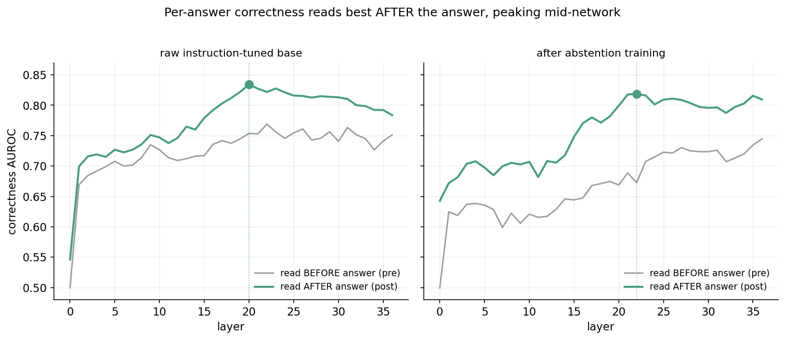
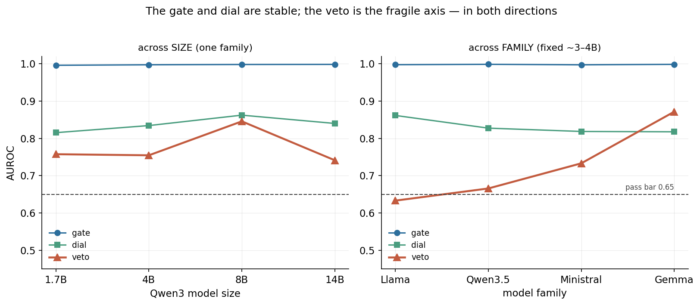
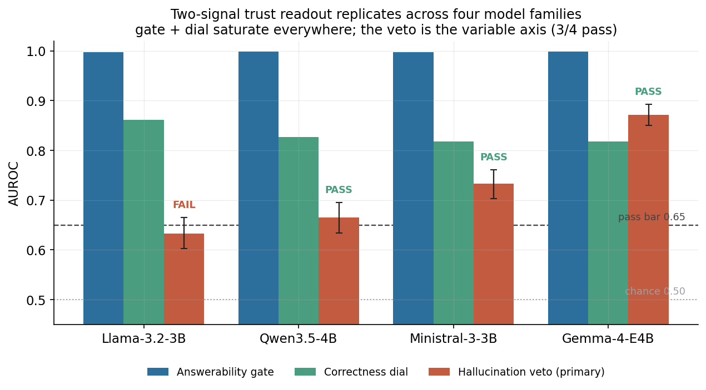
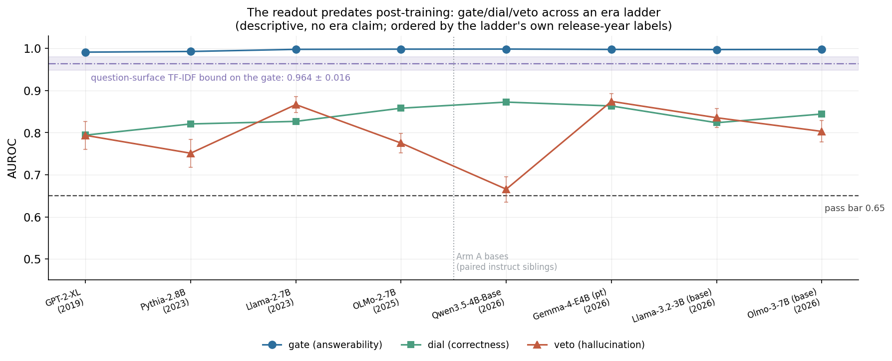
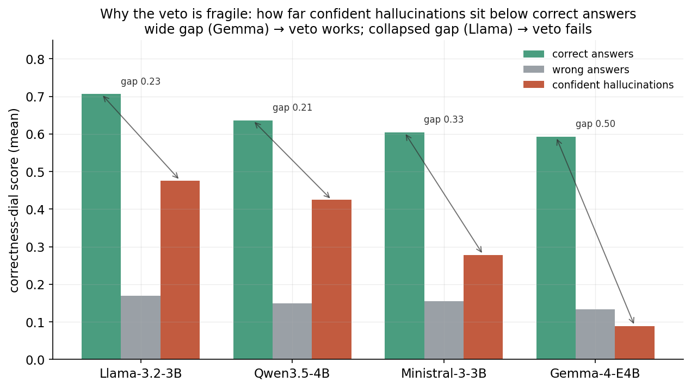
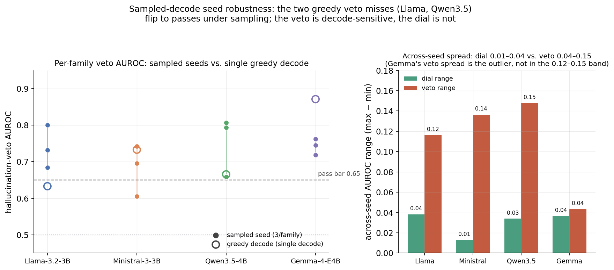
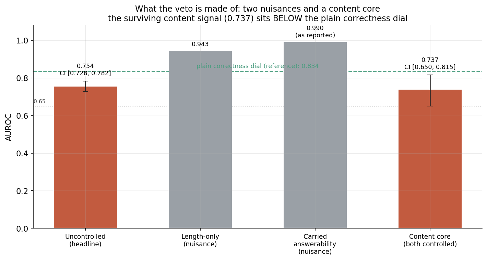
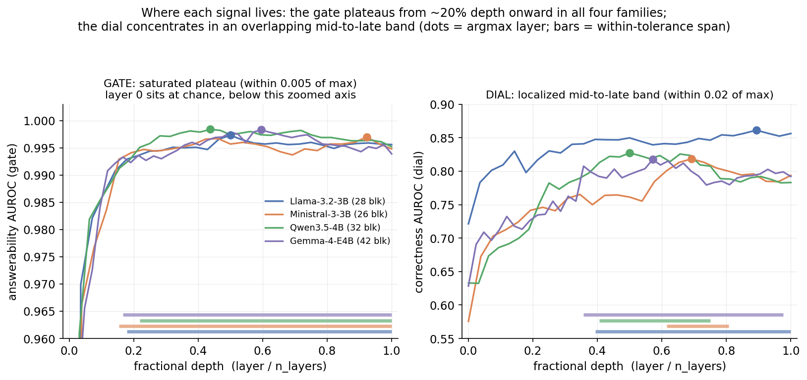
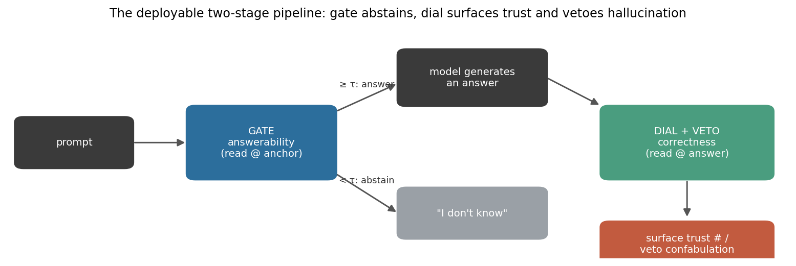
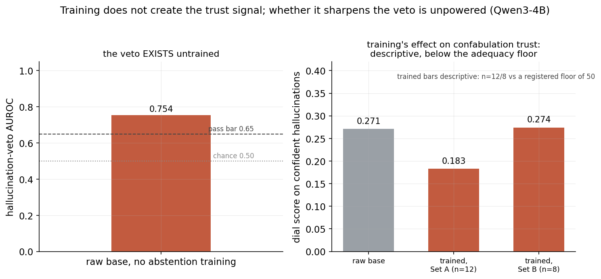

# It's What's on the Inside That Counts: A Training-Free Two-Signal Readout for Epistemic Humility in Small Language Models

---

> *"Look within. Within is the fountain of good, and it will ever bubble up, if thou wilt ever dig."*
>
> Marcus Aurelius, *Meditations* 7.59

## Abstract

A small language model's trust signal does not have to be trained in. It is already in the
representation, and it can be read out of a frozen model with a linear probe. Two axes carry
it, at two different moments: an **answerability gate** read at the last prompt token, before
generation, separates answerable from overtly unanswerable questions at AUROC 0.997, and a
**correctness dial** read at the last answer token, after generation, ranks whether the answer
just produced is right (0.834), reading better after the answer than before it (+0.065, CI
[0.040, 0.090]). The two axes are non-redundant: they sit at different token positions, fall
into different robustness classes, and fusing them into one scalar costs correctness ranking,
so they deploy as two sequential stages rather than one score. Neither axis is an artifact of
training: the readout holds on the raw instruction-tuned base with no adapter, from 1.7B to
14B, on four independent model families, on four pre-instruction bases, and descriptively as
far back as GPT-2-XL, though a question-surface text classifier reads the same gate pool at
0.964, so the gate's honest effect size is its margin over that bound rather than its raw
AUROC. The dial's third readout, a **veto** on confident fabrication, is a different and more
fragile thing: it passes on all four families across three sampled-decoding seeds, but with
across-seed spread reaching 0.15 on one family, and once answer length and the question's own
answerability are controlled its content core is AUROC 0.737 (CI [0.650, 0.815]). Every
question in this paper is either answerable or *overtly* unanswerable, the pools are English
short-answer QA, and the deployed-checkpoint readings carry a hallucination-label correction
and a train/eval contamination disclosure that the body states in full.

---

## 1. Introduction

An epistemically humble model does two things a fluent one does not: it declines questions
it cannot answer, and it attaches an honest confidence to the answers it does give. Small
open models are good at neither. They confabulate plausible answers to unanswerable
questions (Slobodkin et al., 2023; Kirichenko et al., 2025), and the confidence they
verbalize is nearly flat regardless of whether they are right (Xiong et al., 2023;
Shrivastava et al., 2023).

Try this as a thought experiment. You ask a small open model who won a chess tournament
that never took place. It answers fluently, names a winner, and when you ask how
confident it is, it gives you a number in the mid-fifties. You then ask it the capital of
France, and it gives you nearly the same number. The confidence on the outside is
useless. The question this paper answers is whether there is a number on the inside
worth reading instead.

The natural first hypothesis is that this is an *ignorance* problem (the model does not
represent its own uncertainty) and the natural fix is *training*: fine-tune it to abstain
(Zhang et al., 2023; Yang et al., 2023; Cheng et al., 2024), or optimize a
preference/reward signal toward calibrated confidence (Lin et al., 2022; Liu et al., 2026).
Our companion diagnosis, [*Knows but Doesn't Say*](../paper-3-knows-but-doesnt-say/manuscript.md),
tests and rejects the first hypothesis and finds the second insufficient. A linear probe on
the base model's internal activations separates answerable from *overtly* unanswerable
questions almost perfectly (AUROC 0.997) with a well-calibrated readout (ECE 0.004), while
the model's *verbalized* confidence stays near 0.52 to 0.56 across the board. The internal
estimate is there; the emitted one is not a faithful copy of it, and the gap is
*training-resistant*, surviving supervised fine-tuning, DPO (Rafailov et al., 2023), KTO
(Ethayarajh et al., 2024), and three generations of GRPO (Shao et al., 2024). The
bottleneck is not knowledge; it is the single confidence token that a language-model head
emits under next-token cross-entropy.

That diagnosis has a direct engineering consequence, and it is the subject of this paper.
**If the signal cannot be reliably trained into the emitted token, read it out of the
representation instead.** The practitioner version of the result is concrete: a useful,
thresholdable trust number for a small language model is available today, from a model you
already have, with a cheap linear probe, and no fine-tuning run is required.

The paper's vocabulary, used consistently throughout: **two axes** (answerability,
correctness), which yield **three readouts** (a gate, a dial, and the dial's veto on
confident confabulation), which fall into **two robustness classes** (the gate and dial are
family-general; the veto is decode-, seed-, and model-sensitive). Those two classes are
defined across *models*. Robustness has a second dimension, the **evaluation surface**,
which we have since measured separately: the gate and dial travel across sizes, families,
and pretraining stages, and the gate's breadth stops at questions whose unanswerability is
covert rather than marked on their surface, where the same readout reads roughly 0.63
(companion diagnosis, *Where the internal readout fails*). Three contributions over the
diagnosis:

1. A second axis. Answerability ("*can* this be answered?") is not the same as
   correctness ("is *this answer* right?"). Correctness is *also* linearly readable, at a
   different token position (after the answer, not before it), and the two axes are
   non-redundant: separable enough that combining them into one number costs correctness
   ranking. This yields a two-stage pipeline: a **gate** that abstains on overtly
   unanswerable questions, and a **dial** that surfaces a trust number on what is answered.

2. The dial's veto on confident confabulation, as its own readout. The same correctness
   dial, applied to confident answers on unanswerable questions, pushes them toward the
   bottom of the trust ranking. This is not a third axis: in every cross-model cell the veto
   is the identical dial probe read against a third contrast. It is a third *readout*, and
   it earns separate billing because it is its own robustness class: decode- and
   seed-sensitive, model-dependent, non-monotonic in scale, and a blend of a content core
   (about 0.74) with the question's carried answerability. The gate/dial-versus-veto split
   is the paper's central finding.

3. A generality claim. The companion diagnosis established its gap on a single model from a
   single family; this paper breaks that boundary. The readout is training-free (it reads
   off the raw instruction-tuned base), size-robust (1.7B to 14B), replicates across four
   model families, and predates post-training entirely. The two axes generalize across every
   *model* dimension we varied, and not across every *evaluation surface*: the gate's
   separation is near-saturated on overtly unanswerable questions and collapses on covertly
   ambiguous ones (companion diagnosis, *Where the internal readout fails*). The veto is the
   readout that must be validated per model.

Four facts fence those claims. The dial has a cheap internal competitor, the model's own
answer-span log-probabilities, and its margin over that competitor is checkpoint-dependent. So every deployed-checkpoint quantity carries two disclosures: a
hallucination-label re-grade that leaves that cell's veto below its own adequacy floor, and
SelfAware train/eval contamination in that checkpoint's training lineage. And where in the
network the two axes sit is characterized descriptively, with no gate and no claim resting
on it.

The framing throughout is *readout, not training*. Our training does not create the trust
signal. It installs behavioral abstention, and whether it also sharpens one part of the
signal, the veto, is unresolved under corrected labels (§4.4).

---

## 2. Related work

### Verbalized confidence

Can a model simply say how sure it is? A line
of work asks exactly that, eliciting confidence in words or tokens and measuring the
result. The miscalibration is well documented: vanilla verbalized confidence reaches ECE
of roughly 0.38 to 0.52 for GPT-3-class and open models (Xiong et al., 2023), and the
emitted numbers are coarse as well as inflated: GPT-4 states 0.9 on fully half of
examples, producing 8 unique confidence values across 12 datasets (Shrivastava et al.,
2023). For RLHF-tuned models the verbalized channel is nonetheless often better
calibrated than the token probabilities, which RLHF itself degrades (Tian et al., 2023).
The channel is trainable in at least one setting: GPT-3 can be fine-tuned to verbalize
calibrated uncertainty on arithmetic (Lin et al., 2022), the trained-calibration
precedent whose small-model analog our companion paper tests and finds wanting. Recent
faithful-uncertainty work makes the target sharper by asking whether expressed
uncertainty tracks intrinsic uncertainty, and shows that metacognitive RL can improve
that output metric (Gani et al., 2026; Liu et al., 2026; Yona et al., 2026). Our
companion diagnosis localizes why the channel fails in this model family (the internal
estimate is calibrated; the emitted token is not), and this paper is the constructive
complement: bypass the token.

### Probing internal states

If the stated confidence is unreliable,
is a reliable one nonetheless sitting in the activations? A large body of work says yes
for truth-related structure: unsupervised truth directions (Burns et al., 2022), the
linear geometry of true/false statements (Marks et al., 2023), truthfulness classifiers
on hidden states (Azaria and Mitchell, 2023), and a single truthfulness hyperplane fit
across 49 datasets (Liu et al., 2024). The probe-generation gap has external precedent:
a probe reads truth from LLaMA-7B activations at 84% while the model generates
truthfully on about 32% of the same items (Li et al., 2023), an external "knows but
doesn't say." Closest to our answerability gate (the pre-generation readout this paper
thresholds to abstain), Slobodkin et al. (2023) show instruction-tuned models linearly
encode a question's *answerability* even while hallucinating an answer to it (probe F1
above 75% across nine model-dataset pairs, with causal LEACE erasure), and Ferrando et
al. (2024) find sparse-autoencoder entity-recognition directions ("do I know this
entity?") that causally gate refusal: knowledge-boundary signals, not answer-truth
signals. Prompted self-evaluation is a related but distinct channel: P(True) is prompted
self-grading and P(IK) a trained value head (Kadavath et al., 2022); neither reads
activations, but both anticipate the finding that models carry usable self-knowledge
(answerability recognition, specifically; not verified self-knowledge of whether a given
produced answer is itself correct).
The strongest counter-result gets its full weight: Cheang et al. (2025) argue internal
states mainly encode knowledge *recall* rather than truthfulness, and show that
hallucinations drawing on parametric associations evade probe detectors (AUROC 0.46 to
0.69) that catch unassociated ones; our construct decomposition (§4.5) applies the same
discipline to our own headline, separating carried nuisance from the smaller content
core that survives control. What differentiates this paper from the probing line: we
read *answerability* (a property of the question, before generation) and *per-answer
correctness* (a property of the produced answer, after it) as distinct axes at distinct
token positions, and we measure that readout's robustness surface (size, family, decode,
seed, pretraining stage) under pre-registered gates.

### Reading after the answer

Does a model know more about its answer after producing it
than before? External evidence says the answer tokens are where the signal concentrates:
truthfulness information peaks at the exact answer tokens (probe AUC 0.85 to 0.95 across
datasets; Orgad et al., 2024), semantic-entropy probes trained at both a post-response
token and a pre-generation token give a direct external post-vs-pre contrast (Kossen et
al., 2024), and Azaria and Mitchell (2023) likewise probe the statement's own tokens. We
test this contrast directly, as a within-run paired comparison on the same rows (§4.2).

### Abstention and selective prediction

A model that knows its limits should sometimes
refuse to answer. How do you get that behavior: train it in, or find it already present?
Selective prediction predates LLMs: SelectiveNet trains a rejection head jointly with
the classifier for a target coverage (Geifman and El-Yaniv, 2019). In LLMs the dominant
posture *trains abstention in*: R-Tuning fine-tunes "I don't know" onto the questions
the model gets wrong (Zhang et al., 2023), Cheng et al. (2024) build model-specific IDK
training sets, alignment-for-honesty formalizes refusal training (Yang et al., 2023),
and multi-LLM collaboration flags knowledge gaps to abstain on (Feng et al., 2024); Wen
et al. (2024) survey the space. AbstentionBench finds abstention unsolved across twenty
frontier models and *degraded* by reasoning fine-tuning (Kirichenko et al., 2025). Our
gate takes the other branch of the opening question: it installs selective prediction
without training, by thresholding an answerability axis the base model already carries.

### Steering

Reading a direction out of activations is
one half of representation engineering (Zou et al., 2023) and writing along it
(steering) is the other (Turner et al., 2023); this paper is strictly the *reading*
half, and what is known about writing along these axes is taken up in the discussion
(§5).

---

## 3. Methods

### Models

The core mechanism is developed on Qwen3-4B in two conditions: the raw
instruction-tuned base (`unsloth/Qwen3-4B-bnb-4bit`, no adapter) and our deployed
checkpoint (clean supervised fine-tune → GRPO). The size study uses the raw Qwen3 bases at
1.7B / 4B / 8B / 14B. The cross-family study uses four ungated instruction-tuned bases at
comparable scale (Llama-3.2-3B, Ministral-3-3B, Qwen3.5-4B, and Gemma-4-E4B), read
training-free, exactly as the base-model condition.

The pretraining contrast reads four *pre-instruction* bases matched to those families
(Qwen3.5-4B-Base, Gemma-4-E4B-pt, Llama-3.2-3B, and Olmo-3-7B) plus one instruct sibling
run through the identical pipeline (Olmo-3-7B-Instruct). The era ladder adds four
historical bases below them, GPT-2-XL, Pythia-2.8B, Llama-2-7B, and OLMo-2-7B, so its
eight rungs are those four plus the four pre-instruction bases at the modern end.

Pretrained bases mostly ship no chat template, so every base cell is prompted on the same
plain-completion surface: a fixed 5-shot block of five hand-written general-knowledge
question/answer exemplars, none of them drawn from any evaluation pool, followed by the
target question and a bare answer cue, with the continuation parsed at the first line
after that cue. Instruct cells use their own chat template. The base-versus-instruct
contrast therefore differs in prompt surface as well as in weights, which is why one
pre-instruction base is also read under its shipped chat template as a dual-render
control.

### Data and labels

Answerable questions come from PopQA (Mallen et al., 2022) and
TriviaQA (Joshi et al., 2017), graded against gold
answer aliases into *correct* / *wrong*. Intrinsic answerable-vs-unanswerable structure and
the hallucination class come from SelfAware (Yin et al., 2023): questions it marks unanswerable, when the model
answers them anyway, are labeled *hallucinations* (a structural label: the model produced
a confident answer to a question with no answer; whether the model "answered" is itself
detected by a refusal classifier, and §4.5 and Limitation 4 discuss an audited artifact in
that detection specific to one checkpoint). This gives three groups for the
correctness axis: correct answers, wrong answers, and confident confabulations.

Whether the model answered at all is therefore an instrument reading, and both the
hallucination class and every answered-row count depend on it. The detector that produced
the labels is narrow by construction: a case-insensitive match against four fixed refusal
phrases, widened for the stated-confidence answer format by three first-person patterns
(two spellings of "I do not know", and a leading "abstain"). A generation that matches
none of them and parses to a non-empty answer counts as an answer. That instrument has a
blind spot, and on the deployed checkpoint it dominates: a re-grade of that checkpoint's
archived answer text against a second, wider refusal instrument (a literal re-scoring of
the stored strings, nothing regenerated) flips 109 of the 121 rows the narrow detector had
counted as answers into explicit refusals, a flip rate of 90.1% (95% CI [84.3%, 95.0%])
reproduced row for row by an independent re-derivation. The mechanism is a contraction the
narrow marker list does not carry, and 108 of the 109 are one verbatim trained refusal
template. Neither detector contains the other: 125 rows run the opposite way, refused
under the narrow instrument and answered under the wide one. That is why the deployed
checkpoint has two row censuses (Appendix B.1): the *inclusive* census keeps the rows both
detectors call answers, and the *strict* census removes four further rows carrying one
refusal template that both detectors miss. The same re-grade on the generations behind the
raw-base, cross-size, and cross-family numbers flips between 0.05% and 3.82% of rows,
because the untrained bases never emit the template that defeats the narrow detector.

### Probe fitting and readout protocol

For each item we run a single forward pass over the concatenated
[prompt + answer] sequence and cache residual-stream activations at every layer at two
positions: the **last prompt token** (the *pre-generation anchor*, used for the gate) and
the **last answer content token** (the *post-generation* position, used for the dial).
Probes are standardized logistic regressions (StandardScaler + LogisticRegression, C=1.0);
reference scores are 5-fold stratified out-of-fold AUROC with a 2000-sample bootstrap
confidence interval. When a dial fit on one condition is evaluated on another, it is applied
*cold* (fit on the source, scored on the target, no refitting). Decoding is greedy
(deterministic) except where sampled decoding is named. Each cell enforces a data-adequacy
floor (at least 30 wrong answers and at least 50 hallucinations) before a probe verdict is
reported.

The dial's score on an answer is the
fitted P(correct) in [0,1], out of fold for the correct and wrong rows it was fit on, and
from the same probe fit on all of them and applied cold for rows outside that fit
(confabulations, known-answered rows on another pool). A **dial mean** for a group is the
arithmetic mean of that probability over the group's rows, which is why group means are
directly comparable to each other and to the 0-to-1 scale of a trust number.

Layer selection is part of the fit, and it is not held out. Every layer's probe is fit
under one 5-fold split fixed by a pinned seed, so all layers are scored on identical folds;
the out-of-fold AUROC is computed at every layer, and the reported readout is the maximum
of that per-layer surface. The gate's best layer and the dial's best layer are selected
independently this way, and in the post-versus-pre comparison each position is taken at its
own argmax. A reported best-layer AUROC is therefore a maximum over layers evaluated on the
same folds that selected it, not a score on layers held out from selection: it carries the
optimistic bias that implies, and no multiplicity correction is applied across the sweep.
The veto does not sweep its own layer; it reads the dial at the layer the dial's own sweep
selected.

One scoring asymmetry runs through every veto number.
The veto contrast is scored by a dial fit on that same model's correct-versus-wrong rows,
so the correct side is scored out-of-fold while the confabulation side, for which the dial
was never given a label, is scored cold. The two sides of the veto contrast are not held
out under the same protocol. The dial's own correct-versus-wrong AUROC is out-of-fold on
both sides.

### Baselines and controls

Three comparators fence the readouts: what the question's words alone predict, what the
answer's length alone predicts, and what the model's own output probabilities already
supply. Each is computed on exactly the rows of the readout it bounds.

The **question-surface bound** asks how much of the gate a text classifier can recover with
no access to the model. Questions are turned into TF-IDF features (term frequency-inverse
document frequency: each word is weighted by how often it occurs in the question against
how rare it is across the pool), using word unigrams and bigrams that appear in at least
two questions, and fed to a logistic regression (C=1.0). It is scored by stratified 5-fold
cross-validation over the same frozen pool of 1,233 questions (556 answerable, 677
unanswerable) that the gate cells read. The reported **0.964 ± 0.016** is the mean and
standard deviation of AUROC across those five folds, not a bootstrap interval; a
character-n-gram variant of the same classifier reads 0.965 ± 0.017, so the bound does not
turn on the feature choice. Run instead from question text against answer correctness, the
same classifier gives the dial's corresponding bound of 0.75 to 0.78 per family.

The **length-only baseline** asks whether the veto is reading how long an answer is rather
than what it says. Because the dial reads a hidden state at the last answer content token,
that token's position encodes answer length, so answer length is itself usable as a score:
its AUROC is computed directly from the answer's token count, with the failure class as the
positive class, on exactly the rows the veto is scored on. Where a contrast is
length-matched, the matching is 1:1 nearest-neighbour on answer token count within a
3-token caliper, with unmatched rows dropped, so the two classes hold near-identical length
distributions and the same baseline has no length signal left to read. The probe refit on a
matched slice follows that construction's own recipe rather than the one above: principal
components of the same post-answer hidden states, then a logistic regression with balanced
class weights, fit inside each fold with nothing carried across folds.

The **answer-span log-probability competitor** is the cheapest internal trust number a
practitioner already has: the model's own probability of the answer it just produced. Both
comparisons run on a fresh single-pass generation that returns, from one call, the
generated token identifiers, the log-probability of each sampled token, and the hidden
states the dial reads, so the string graded for correctness, the span the log-probabilities
cover, and the vector the dial reads are the same object rather than three re-tokenizations
of it. The primary score is length-normalized, the mean per-token log-probability over the
answer span, delimited at the same last content token the dial reads; the sum and the
minimum over that span are computed alongside it and carry no gate. The dial is refit out
of fold on those same rows, so both scores rank an identical set of answered rows.

### Statistical analysis

Every interval on a single AUROC in this paper is a nonparametric percentile bootstrap over
rows: 2,000 resamples drawn with replacement, the AUROC recomputed on each resample from
the fixed out-of-fold scores, and the 2.5th and 97.5th percentiles reported as the 95%
interval, with resamples that lose a class discarded. The resampling seed is pinned per
cell. Two cells depart from that count: the veto-decomposition confirmatory draws 1,000
resamples within each class, and the deployed checkpoint's label re-grade draws 10,000.

The three differences the paper reports with an interval (post-generation minus
pre-generation, dial minus answer-span log-probability, combined minus dial) are all one
set of rows scored two ways, so each is a **paired** bootstrap: every iteration resamples
the row indices once and recomputes both AUROCs on that identical resample, and the
interval is the 2.5th and 97.5th percentiles of the per-iteration difference. Resampling
the two scores independently would discard the correlation between them and overstate the
uncertainty on the difference. The veto's margin over the length-only baseline is
constructed the same way.

Expected calibration error (ECE), the gap between the probability the dial states and the
accuracy it delivers, is computed on the out-of-fold P(correct) at the selected
post-generation layer: the scores are sorted into 15 equal-width bins spanning 0 to 1, each
non-empty bin contributes the absolute difference between its mean predicted probability
and the fraction of its answers that are correct, and the bins are averaged weighted by how
many rows each holds.

### Pre-registered gates

Every evidence cell locked its gates, success rule, and
falsifier before running, and none moved afterward. The cross-size and cross-family cells
shared three identical gates: gate, dial, and veto readouts each at AUROC at or above 0.65
with a bootstrap CI excluding 0.50, the veto primary; cross-family success was pre-defined as
the veto passing on at least 3 of 4 families, falsified by failure on 2 or more. The
seed-robustness replication gated only the dial and veto, because the gate reads a
position sampling never touches and was declared an invariance check in advance; its
seed-stability rules were locked too (a family is a seed-stable dial pass at 3 of 3
seeds, a seed-stable veto pass at 2 of 3 or better, and the per-seed veto majority may
never drop below 3 of 4). The pretrain-only contrast set a stricter gate bar (0.90), with
the falsifier that a base reads below 0.75 while its instruct sibling reads 0.95 or
above. The one registered threshold this paper's own cells missed is the dial's
calibration threshold (ECE below 0.15), missed on both checkpoints: 0.151 on the raw base
and 0.168 on the deployed checkpoint. Both dial cells registered
that threshold as reported-only rather than as a green-light gate, so neither miss changes
a verdict; we report the dial as a ranker, not a probability, and those misses are part of
why. Scaling sharpness was declared descriptive-only in advance.

### How this research was conducted with AI

This program is run by a human principal investigator working with a frontier language
model (Claude, Anthropic) acting as a research orchestrator, which dispatches specialized
AI agents for bounded tasks. We describe the arrangement because it is part of the
method: the division of authority keeps the parts of science that require accountability
human, and delegates the parts that benefit from tireless, parallel, adversarial labor,
under controls that make the delegation auditable.

The unit of work is a governed experiment: a self-contained directory holding a signed
design document (the design in prose), a machine-readable manifest, and the instrument
code. Before anything runs, the design registers a hypothesis, gates with numeric floors,
a falsifier stating what outcome would kill the claim, and predictions recorded before
the run. At signing, every instrument file is pinned by content hash (SHA-256). After
signing, gates and thresholds cannot move, and post-outcome changes to the registered
surface are prohibited outright. Every *gated confirmatory* cell in this paper ran under
that regime; one descriptive exception is named where it appears and never treated as
gated evidence: the Jacobian-lens workspace localization (§4.6) is a read-only lab
diagnostic with no registered gates.

The trust boundary is explicit. The AI side builds harnesses against the locked design,
runs and monitors experiments, computes results, drafts documents (including this one),
red-teams findings, and proposes interpretations. The human side holds everything with
consequence: approving and signing designs, authorizing every compute launch,
adjudicating gate outcomes when judgment is required, merging evidence into the record,
and deciding verdicts.

Three controls do most of the work of keeping the AI honest:

1. Adversarial review before any verdict. Results, especially good ones, go to a
   separate red-team agent briefed to refute: oracle leaks, circular evaluation, goalpost
   drift, provenance holes, statistical errors. Section 4.5's decomposition is this control
   operating in public: a too-good margin triggered the audit that found the length confound
   behind a pair of passing gates, and the audit of the pre-registered fix found the
   answerability carry that cut an inflated headline to an honest 0.74.

2. Read-before-cite. Signed design documents are the sole source of truth for what
   any prior experiment showed. No agent, including the orchestrator, may state a prior
   result from memory; the claim must trace to the document. This exists because language
   models pattern-match plausible histories, and a plausible-but-wrong account of your own
   prior experiment is the most dangerous artifact in an AI-run lab.

3. Provenance by construction. Instruments are content-hashed at signing, model
   weights are pinned by revision, and every number in this paper has a row in Appendix A
   tracing it from the text to its source. Most rows go from a signed design to a
   result JSON to the instrument bytes that produced it; a small number of diagnostics cited
   only by a repository pull-request number have no signed design or result JSON of their
   own, and Appendix A says so plainly rather than implying a trace that is not there.

We make no claim that this workflow removes the need for human scientific judgment. The
claim is narrower and testable: it makes AI participation in research auditable, keeps a
durable line from every published number to the bytes that produced it, and forces the
participants to say, in advance and in writing, what would prove them wrong.

---

## 4. Results

### 4.1 The answerability gate reads off the anchor, before generation

At the last prompt token, before any answer is generated, a linear probe separates
answerable from unanswerable questions at **AUROC 0.997** on the raw Qwen3-4B base. This is
the readable form of the internal estimate the diagnosis identified: the model represents
"can this be answered?" at the moment it is about to answer, and the representation is
almost perfectly separable. Thresholding this axis gives an abstention gate that needs no
training to install.

The raw number overstates the effect, and the honest version is a margin. A TF-IDF
classifier reading the *question surface alone*, with no access to the model at all,
separates the same pool at **0.964 ± 0.016**. Much of what the gate reads on this pool is
predictable from the words in the question, on any model of any era, so the gate's effect
size is its roughly 0.03 margin over that bound and not its raw AUROC.

External precedent says an axis like this should exist: Slobodkin et
al. (2023) probe answerability from hidden states at F1 above 75% even while the model
hallucinates an answer, and Ferrando et al. (2024) find entity-recognition directions
that causally gate refusal at the knowledge boundary. What is new here is the strength at
which it saturates and how far it travels. Of the three readouts this
axis is the most robust: it reads 0.996 to 0.999 on every instruction-tuned
model in this paper, across four sizes and four families, and 0.991 on the oldest base in
the era ladder (§4.4). It is not a single-layer phenomenon anywhere either, saturating by
roughly 20% of depth and holding to the last block in every family we profiled (§4.6).

That travel is across models, and it has a known edge across
evaluation surfaces: every unanswerable question in this pool is *overtly* unanswerable,
and on naturally occurring questions whose ambiguity is covert the same readout falls to
roughly 0.63 at the same locus, on pretrained and trained checkpoints alike.

### 4.2 The correctness dial reads off the answer, and reads better *after* it

Answerability is a property of the question. Whether a *specific produced answer* is correct
is a different property, and it is legible at a different place. A linear probe at the last
answer token ranks correct-vs-wrong answers at **AUROC 0.834** on the Qwen3-4B base
(layer 20). Reading *after* the answer beats reading *before* it: the
post-generation position scores **+0.065** over the pre-generation position (CI [0.040,
0.090], excludes zero). The model's representation of "was that right?" is sharper once it
has committed to the answer than at the moment it begins: a self-evaluation effect
localized to token position, and one that peaks in the middle of the network rather than at
the final layer (Figure 1). The position matters in external work too: truthfulness
signal concentrates at exact answer tokens (Orgad et al., 2024), and semantic-entropy
probes read better at the post-response token than at the pre-generation one (Kossen et
al., 2024).

**Figure 1. Correctness reads best after the answer.** Pre-generation (gray) versus
post-generation (green) dial AUROC by layer, on the raw base (left) and the deployed
checkpoint (right); the post-generation curve sits above the pre-generation curve at
every layer on both checkpoints and is marked at its argmax layer (20 raw, 22 deployed).

The dial survives deployment, and it has to be refit to do so. On our clean-SFT → GRPO
checkpoint the same post-generation readout scores **AUROC 0.819** (layer 22), with the same
post-beats-pre ordering (post 0.819 vs pre 0.745), but a dial *fit on the base* and applied
*cold* to that checkpoint transfers only partially (0.679). Two exploratory follow-ups tried
to say what moves, and each returned a null: the correctness direction's
cross-checkpoint rotation cannot be told apart from estimation noise, because refitting the
same direction on two disjoint halves of one checkpoint's own data agrees at only 0.17
cosine while the readout's ranking accuracy stays flat near AUROC 0.80; and the transferable
part of the signal is a single weak shared direction rather than a shared low-dimensional
subspace, since an arbitrary eight-dimensional slice of the base model's activation span
recovers about as much of the deployed checkpoint's correctness signal (AUROC 0.70) as the
base model's own top eight discriminative directions do (0.74). The operational consequence
is the one the practitioner needs: the axis exists on both checkpoints, and the probe should
be refit per checkpoint rather than transported (detail in Appendix B).

The dial is also worth reading against the cheapest internal competitor a practitioner
already has, the model's own length-normalized log-probabilities over the answer span. On the raw base the dial's margin over the answer-span logprob is
**+0.012**, with a paired 95% CI of [-0.012, +0.036] that spans zero: on this checkpoint
sequence probability captures essentially all of the dial's separation, and the dial's
value there is its cross-model geometry, its post-answer read advantage, and its veto
behavior, not a margin over logprobs. On the deployed abstention-trained
checkpoint the dial's measured advantage is large: AUROC 0.796 against the logprob's 0.657,
a margin of **+0.139** with a paired 95% CI of [+0.103, +0.176] at n=1,501 answered rows,
which passed its pre-registered gate.

One honest caveat carried from the start: the dial *ranks* correctness well but is not a
calibrated *probability* (ECE 0.151 on the raw base and 0.168 on the deployed checkpoint,
against the 0.15 threshold of §3), and the ranking-versus-calibration distinction is standard
(Guo et al., 2017; Ulmer et al., 2024), so we claim the ranking and not the probability.

### 4.3 The two axes are non-redundant: a pipeline, not a fused scalar

Gate (answerability, at the anchor) and dial (correctness, post-generation) are separable
axes, and two dissociations show it before any fusion test is needed. They
read at different token positions, one before the answer exists and one after it, and the
post-beats-pre gain (+0.065) says the two positions are not interchangeable. They also fall
into different robustness classes: the gate is invariant to decoding (across-seed range
under 0.003), while the readouts taken from the generated answer are not (§4.5). Two
quantities that live at different positions and respond differently to the same perturbation
are not one quantity measured twice.

A registered fusion test corroborates that reading. The fusion is not a hand-chosen
weighting: a second logistic regression is fit out of fold over two scalars, the gate
probe's P(answerable) read at the prompt anchor (fit on the answerability pool and applied
cold to these items) and the dial's out-of-fold P(correct) read after the answer, and its
out-of-fold score is what the paired bootstrap compares against the dial alone. Folding the
gate score into the dial
changes correctness triage by Δ **−0.0142** (bootstrap CI [−0.0214, −0.0074]), a
degradation rather than a gain: the combined score triages correctness strictly worse than
the dial alone (0.8044 vs 0.8186). Correctness triage is the only quantity this measures; it is
corroboration on one checkpoint for one task, not a geometric measurement, and we make no
orthogonality claim on it.

Keeping uncertainty sources separate has external support: Taparia et al. (2026)
decompose LLM uncertainty into input, knowledge, and decoding components and argue that
single scores hide the actionable structure. The countervailing result is output-level:
Shrivastava et al. (2023) improve confidence estimates by *mixing* surrogate and
linguistic scores. We read no tension between the two: their mixture combines two noisy
views of one quantity (answer correctness), while our axes measure different quantities
(question answerability, answer correctness).

The deployment consequence is to keep the two axes as **two sequential stages** rather than
one score:

- Stage 1, the gate: at the prompt anchor, threshold the answerability axis. If below
  threshold, abstain ("I don't know") and stop.
- Stage 2, dial + veto: for questions that pass the gate, generate the answer, then read
  the correctness dial at the post-answer token and surface it as the trust number.
  Confident confabulations that slipped the gate tend to land at the bottom of the dial,
  partly on answer content and partly on carried answerability (§4.5).

### 4.4 The readout is a property of the representation, not of training

The gate and the dial do not depend on any training of ours, on model scale, on model
family, or on post-training having happened at all.

#### Training-free

Every result above reproduces on the **raw** Qwen3-4B instruction-tuned
base, with no adapter and no abstention training of ours: gate **0.997**, dial **0.834**,
veto **0.754**. We scope "training-free" precisely: the raw base is the *instruction-tuned*
release, so the phrase means "no abstention fine-tuning and no reinforcement learning of
ours," **not** "no training ever." What our training adds is behavioral abstention, not the
readable signal. Whether it also *sharpens* the veto is unresolved: the mean trust the dial
assigns to confident confabulations reads **0.271** on the base and **0.183** after
training, but the trained side rests on twelve rows under the inclusive census, below that
cell's own adequacy floor of 50, so the comparison is descriptive and cannot settle the
question (the strict census and its disclosure are in Appendix B).

#### Flat across scale

Across the Qwen3 family at 1.7B, 4B, 8B, and 14B, the training-free
readout passes all three gates at every size, with the gate saturated near 0.997 and the
dial between 0.82 and 0.86 throughout (Figure 2, left). The veto is the series that moves
(§4.5).

**Figure 2. Gate and dial are flat across scale and family; the veto is not.** Left: gate,
dial, and veto AUROC across Qwen3 model sizes (1.7B to 14B); gate and dial stay flat while
the veto is non-monotonic, peaking at 8B and dipping at 14B. Right: the same three readouts
across four model families at a fixed 3 to 4B scale, against the 0.65 pass bar; gate and dial
again stay flat while the veto ranges from 0.63 (Llama) to 0.87 (Gemma). Veto values in both
panels are single greedy decodes; the sampled-decoding veto is Figure 6.

#### Flat across families

A cross-family read of four independent
families training-free (Llama-3.2-3B, Ministral-3-3B, Qwen3.5-4B, Gemma-4-E4B). The gate is
near-saturated in all four (0.997 to 0.998) and the dial ranges 0.818 to 0.861 (Table 1,
Figure 3). These two axes are *family-general*: the ability to read "can I answer this?" at
the anchor and "is this answer right?" after the answer is not a Qwen idiosyncrasy, it is a
property of instruction-tuned small language models across four independent lineages.

**Figure 3. Cross-family training-free readout.** Gate, dial, and hallucination-veto
AUROC for each of the four families, with bootstrap 95% CI error bars, the 0.65 pass
bar, and the 0.50 chance line; PASS/FAIL is annotated on each family's veto bar. Gate
and dial saturate near 1.0 and roughly 0.82 to 0.86 in every family; the veto is the bar
that varies under this single greedy decode, failing only on Llama.

**Table 1. Cross-family training-free gate and dial (AUROC; 95% bootstrap CI).**

| Model | hidden dim | Gate | Dial |
|---|---|---|---|
| Llama-3.2-3B | 3072 | 0.997 [.995,.999] | 0.861 [.844,.879] |
| Ministral-3-3B | 3072 | 0.997 [.995,.999] | 0.818 [.797,.839] |
| Qwen3.5-4B | 2560 | 0.998 [.997,.999] | 0.827 [.806,.848] |
| Gemma-4-E4B | 2560 | 0.998 [.997,.999] | 0.818 [.794,.840] |

#### Present before post-training

Every base above is a vendor *post-trained* instruct
release, which leaves open that instruction tuning installs the signal. A
contrast separates the hypotheses: the identical three-readout panel on four
**pre-instruction** bases matched to the four families (Qwen3.5-4B-Base, Gemma-4-E4B-pt,
Llama-3.2-3B, Olmo-3-7B), with the primary hypothesis that the answerability gate is already
present before any post-training, and the falsifier that a base reads below 0.75 while its
instruct sibling reads 0.95 or above. One dual-render control and one same-pipeline
instruct sibling complete the design.

**Table 2. Pretrain-only bases (greedy, single pipeline; AUROC at each model's best layer).**

| Model | Gate | Dial | Veto | within-SelfAware control |
|---|---|---|---|---|
| Qwen3.5-4B-Base (k-shot) | 0.9984 | 0.8725 | 0.6657 | 0.6196 |
| Qwen3.5-4B-Base (chat-render control) | 0.9977 | 0.8511 | 0.8672 | 0.7961 |
| Gemma-4-E4B (pt) | 0.9975 | 0.8633 | 0.8743 | 0.7824 |
| Llama-3.2-3B (base) | 0.9972 | 0.8235 | 0.8354 | 0.7712 |
| Olmo-3-7B (base) | 0.9975 | 0.8442 | 0.8029 | 0.7912 |
| Olmo-3-7B-Instruct (same pipeline) | 0.9979 | 0.8103 | 0.7306 | 0.6741 |

The hypothesis is supported 4 of 4 and the falsifier fired on 0 of 4 pairs. Every
pre-instruction base reads the gate at 0.997 or above, indistinguishable from the instruct
releases, and the veto clears its bar on all four bases (0.666 to 0.874). The boundary
signal is not installed by post-training; it is already in the pretrained representation,
and instruction tuning at most re-renders it. What pretraining supplies is specifically an
*overt*-unanswerability signal rather than an answerability signal in general: the same
pretrained base reads covertly ambiguous questions at roughly 0.63, within 0.006 of the
trained checkpoints (companion diagnosis, *Where the internal readout fails*). This
confirms, in hidden states and under a pre-registered falsifier, a pattern reported at the
output level: pretraining builds calibration and post-training erodes it (OpenAI, 2023; Zhu
et al., 2023; He et al., 2023; Xiao et al., 2025), and knowledge-boundary directions found
in a base model causally control the chat sibling's refusals (Ferrando et al., 2024).

Generic post-training does not sharpen the readout, and can dull it. The one clean
base→instruct pair read under a single pipeline (Olmo-3, same seed, scorer, and render
class) moves the veto **0.803 → 0.731** and the within-SelfAware control 0.791 → 0.674; the
render-confounded cross-run pairs sit at or below their bases too. Whatever sharpening the
Qwen3-4B veto may have gained would therefore trace to *targeted abstention training*, not
to post-training as such. The dual-render control adds a second qualification that belongs
to the veto and not the gate: Qwen3.5-Base's veto is render-sensitive (k-shot 0.666 versus
chat-render 0.867) while its gate is render-invariant (0.998 under both).

#### Descriptively, back to 2019

Read the same panel down a ladder of historical bases and
all three readouts stay above the 0.65 bar as far back as **GPT-2-XL** (gate 0.9911, dial
0.7940, veto 0.7936), with Pythia-2.8B, Llama-2-7B, and OLMo-2-7B filling the rungs to the
modern bases (Figure 4). The raw gate is nearly era-flat (0.991 to 0.998) and sits just
above the question-surface text bound the whole way down. What improves across eras is the
*within-SelfAware* control (roughly 0.59 on the two oldest rungs, rising to 0.71 to 0.82
from Llama-2 onward): the in-distribution separation of confident hallucinations from known
answers, not the gross answerable/unanswerable split.

**Figure 4. All three readouts predate post-training, and the gate's margin over surface
text is thin throughout.** Gate, dial, and veto AUROC across the eight-rung era ladder,
ordered by the ladder's own release-year labels, with the four pre-instruction bases of the
pretraining contrast grouped at the 2026 end (dotted divider). Bootstrap 95% CI error bars,
the 0.65 pass bar, and the question-surface TF-IDF bound on the gate (0.964 ± 0.016, shaded)
are drawn; the gate series is era-flat at 0.991 to 0.998 and clears the text bound by roughly
0.03 on every rung, while the veto is the series that moves (0.666 to 0.874). Descriptive
only: no era claim rests on this ladder.

One registered control package of ours pushes back on that bound, and it has weakened since.
It found that the latent known-versus-unknown readout on this pool survives lexical, over-refusal,
and cross-regimen controls, which reads the text bound as pool-difficulty context rather
than a full explanation of the hidden-state signal. The readout's measured boundary falls exactly where a question's surface stops marking it as
unanswerable, which is positive evidence that part of what the gate reads is the question's
surface, and the exploratory atlas that located the boundary carries its own registered
style confound, because the labeled unknown categories are stylistically distinctive
question types (companion diagnosis, *Where the internal readout fails*).

### 4.5 The veto: what it catches, where it holds, what it is made of

The dial has a third use. Applied to confident answers on unanswerable questions, it pushes
them toward the bottom of the trust ranking, which turns a correctness *ranker* into a
hallucination *veto*: a second line behind a gate that has already missed. It behaves nothing
like the gate and the dial.

#### What it catches, and what it does not

On the raw base the veto does **not** assign
confabulations the lowest trust of any group. On the Qwen3-4B raw base's own headline cell,
plain wrong answers to answerable questions read *lower* than hallucinations (dial mean
0.1407 for wrong versus 0.2710 for hallucination), and the same ordering holds in 7 of the 8
raw-base evidence cells in this paper; only Gemma-4-E4B inverts it. Both failure groups sit
far below correct answers, and the dial never mistakes a confabulation for a correct answer,
but the group it pushes furthest down is usually plain wrong answers. On the deployed
checkpoint the ordering reverses, descriptively: the hallucination dial mean reads 0.183
against a wrong-answer mean of 0.353. Which failure mode reads lowest is therefore a property
of the checkpoint, not a fixed property of the veto.

The size of the correct-to-confabulation gap in the dial's own distribution is what the veto
AUROC measures, and it is the descriptive quantity that predicts where the veto works
(Figure 5). Where a model's confabulations read as near-zero trust, the veto is strong
(Gemma, hallucination dial-mean 0.089 against correct 0.593); where they read almost as
trustworthy as correct answers, it is weak (Llama, 0.476 against 0.707). Ordering families
by that gap tracks the veto verdicts directionally but not strictly, since AUROC depends on
the full distribution overlap rather than the mean gap alone: Llama's gap (0.231) slightly
exceeds Qwen3.5's (0.212) while Llama reads lower.

**Figure 5. Dial distribution per family.** Mean correctness-dial score for correct
answers (green), wrong answers (gray), and confident hallucinations (orange) in each of
the four cross-family models, with the correct-minus-hallucination gap annotated. In
three of the four families shown, plain wrong answers, not confident hallucinations, are
the lowest-trust group; Gemma-4-E4B is the exception.

#### Where it holds

The veto passes on all four families under sampled decoding
(temperature 0.7, top-p 0.9) across three seeds, and the across-seed spread is the number to
carry with it (Table 3, Figure 6). Family means run 0.681 to 0.753, and the spread is not
uniform: Qwen3.5 ranges 0.15 across seeds, Ministral 0.14, Llama 0.12, and Gemma only 0.04,
against dial spreads of 0.01 to 0.04 on the same cells. Individual cells still dip below the
bar; Ministral reads 0.606 on one seed.

**Table 3. Sampled-decode seed-robustness (AUROC per seed; mean [min-max] across 3 seeds).**

| Model | Dial (3 seeds) | Veto (3 seeds) | Veto seed-stable? | Greedy veto (single decode) |
|---|---|---|---|---|
| Llama-3.2-3B | 0.848 [0.827–0.865], 3/3 pass | **0.739 [0.684–0.801], 3/3 pass** | **YES** | 0.633 |
| Ministral-3-3B | 0.806 [0.799–0.812], 3/3 pass | 0.681 [0.606–0.742], 2/3 pass | **YES** | 0.733 |
| Qwen3.5-4B | 0.852 [0.830–0.864], 3/3 pass | **0.753 [0.659–0.807], 3/3 pass** | **YES** | 0.666 |
| Gemma-4-E4B | 0.817 [0.802–0.839], 3/3 pass | **0.742 [0.718–0.762], 3/3 pass** | **YES** | 0.871 |

**Figure 6. The veto is decode-sensitive; the dial is not.** Left: per-family
hallucination-veto AUROC at each of three sampled-decoding seeds (filled markers) against the
single greedy decode (open marker) and the 0.65 pass bar; every family clears the bar on at
least two of three sampled seeds, and the two lowest greedy readings (Llama 0.633, below the
bar; Qwen3.5 0.666, marginal) both read higher under sampling. Right: across-seed AUROC range
per family for the dial and the veto; the veto's spread is 0.12 (Llama), 0.14 (Ministral) and
0.15 (Qwen3.5) but only 0.04 on Gemma, against dial spreads of 0.01 to 0.04 throughout.

Decode sensitivity is the thing to take from the greedy-versus-sampled comparison. A single
deterministic decode produces one specific set of confabulations: against the three-seed
sampled means, greedy understates the veto by 0.09 to 0.11 on two families and overstates it
by 0.05 to 0.13 on the other two, so a single-decode point estimate is not a model-level veto
measurement in either direction. That should not surprise: the sampling-based uncertainty
literature extracts its signal precisely from cross-sample variation (semantic entropy, Kuhn
et al., 2023; SelfCheckGPT, Manakul et al., 2023), Orgad et al. (2024) build an error
taxonomy from resample distributions, and Taparia et al. (2026) treat decoding randomness as
its own uncertainty component. What those methods exploit by sampling many times, a
single-decode readout is exposed to. Scale moves the veto too, and not monotonically: 0.757
at 1.7B, 0.754 at 4B, a peak of 0.846 at 8B, and a dip to 0.741 at 14B (Figure 2, left). The
"bigger sharpens the veto" expectation is not supported. The gate, by contrast, is decode-invariant: 0.996 to 0.999
across all completed cells, with a per-family across-seed range under 0.003. Sampling the
answer does not move an axis read before the answer exists.

#### What it is made of

What does the veto read when it pushes a confabulation to the
bottom? The headline contrasts cannot say: they compare correct answers against
confabulations on unanswerable questions, so any signal that differs between those groups
(the answer's content, the answer's length, the question's answerability) is available to
the probe. Two follow-ups decomposed the read into those three parts (Figure 7).

Both nuisances are real, and each is large where it applies. Confabulations run long and
good answers run short (median 94 answer tokens against 24), and the probe reads the hidden
state at the last answer token, whose position encodes length: on that population, answer
length alone separates the groups at AUROC **0.943**. Answerability carries into the
post-answer state: on confabulations whose questions are unanswerable, the veto separates
them from good answers at roughly **0.99** as reported, because the post-generation hidden
state still holds the gate's own axis.

A genuine content core survives both controls. On a fresh 192-token generation with 1:1
length matching within a 3-token caliper and both classes restricted to answerable questions, the
controlled contrast is wrong answers against correct answers on answerable questions, 65
matched pairs, out-of-fold, with length-only AUROC at chance on that slice (0.493). On that
slice the veto reads AUROC **0.737** (CI [0.650, 0.815]), a margin of **+0.244** over the
length-only baseline (CI [0.120, 0.367], excludes zero). So the larger,
uncontrolled contrasts must not be cited as the content-trust characteristic. The honest
content number is about 0.74.

**Figure 7. The veto is a blend, and its surviving content core sits below the plain
correctness dial.** Hallucination-veto AUROC uncontrolled on the raw base (0.754, CI [0.728,
0.782]), against answer length alone on the same population (0.943), against carried question
answerability (about 0.99 as reported; no CI exists in the source), and on the
length-matched, answerability-controlled slice where only content survives (0.737, CI [0.650,
0.815]), with the raw base's plain correct-versus-wrong dial (0.834) drawn as a reference
line. Bars without error bars are point estimates for which the source reports no interval.

Controlling answerability on both sides removes every confabulation: confabulations in this
population are answers to unanswerable questions, so the 65-pair slice holds **zero**
confabulation rows. What it measures is the dial's read on the model's own wrong answers to
answerable questions, not on confident fabrication. The controlled 0.737 also sits below the
raw base's own dial on the structurally matched contrast (correct versus wrong on answerable
questions, 0.834, §4.2), so controlling both nuisances does not merely shrink the veto's
headline, it puts the surviving content read below the plain correctness dial.

#### Scope of the deployed-checkpoint readings

Three fences apply to every deployed-checkpoint
veto quantity above, and none of them applies to the raw-base, cross-size, or cross-family
numbers, which are structurally immune because none of them trains on these questions.

First, the hallucination labels on that checkpoint were re-graded, and the count collapsed.
Of the 121 rows a narrow refusal detector had counted as answers, 109 were explicit trained
refusals, leaving twelve genuine hallucination rows under the inclusive census against that
cell's own pre-registered floor of 50. The signed experiment's primary verdict is
accordingly below its adequacy floor and descriptive, not a gated pass. At that n the dial
separates correct answers from confabulations at 0.9067 (CI [0.8133, 0.9705]), and the
within-SelfAware control (known-answered versus unknown-answered, same dataset) reads 0.8140
(CI [0.6953, 0.9127]), both descriptive. The dataset-shift rebuttal that control supplies
therefore rests on a separation of roughly 0.74 to 0.81. A stricter row census exists and is
reported in Appendix B, where its own recomputability limit is stated.

Second, the training lineage behind that checkpoint (clean supervised fine-tune → GRPO)
carries SelfAware train/eval contamination, resolved in a separate confirmatory block: 117
distinct SelfAware known/answerable evaluation questions appear verbatim in the training
prompts used across the SFT/DPO/KTO/GRPO stages, with zero unanswerable questions among
them. The within-SelfAware control and the deployed checkpoint's gate confirmation (0.999)
sit on the contaminated known-answered side. A clean-subset sensitivity computation
accompanies this paper: excluding the 61 contaminated rows among the 276 known-answered rows
moves the gate confirmation from 0.999 to 0.998 and the control from 0.814 to 0.804, and
every recomputable deployed-checkpoint quantity shifts by at most 0.011.

Third, the deployed checkpoint's veto has not been decomposed the way the raw base's was. We
read it as sharing that structure because its contrast is built identically, which is an
inference and not a measurement.

### 4.6 Where the readout lives, descriptively

Where in the network do the two axes sit? The cross-family runs carry the full per-layer
AUROC surface for the gate and the dial, and plotting them against fractional depth (layer
divided by block count, since the four families have 28, 26, 32, and 42 blocks) shows the
two axes occupying different parts of the network (Figure 8). The gate is not a single-layer
phenomenon anywhere: in all four families it rises from chance at the embedding to a
saturated plateau above 0.997 that covers most of the network, with onset by roughly 20% of
depth, so the per-family "best gate layer" differences in the result JSONs are argmax jitter
on a flat plateau rather than localization. The dial is different: the layers within 0.02 of
each family's maximum fall in a narrower, overlapping mid-to-late region, spanning L11-28 on
Llama, L16-21 on Ministral, L13-24 on Qwen3.5, and L15-41 on Gemma, two of which are sets of
layers with interior holes rather than unbroken bands. Read descriptively, answerability
appears to be computed early from the question and carried forward, while correctness
requires the formed answer and lives in a localized mid-to-late band.

**Figure 8. Cross-family depth profile of the two axes.** Per-layer AUROC for the
answerability gate (left, zoomed y-axis) and the correctness dial (right) against
fractional depth, one line per family; dots mark each family's argmax layer and the bars
under each panel run from its first to its last within-tolerance layer (gate: within 0.005
of max; dial: within 0.02), which for Gemma's gate and for Llama's and Gemma's dial encloses
interior layers that fall outside tolerance. The gate saturates by roughly 20% of depth and
stays saturated to the last block in all four families, so per-family best-layer differences
are jitter on a plateau; the dial concentrates in an overlapping mid-to-late region, with
Llama's argmax at L25/28 near the unembedding. Descriptive only, replotted from the
cross-family replication's per-layer AUROC surfaces.

Three exploratory observations from independent instruments give that picture context. A from-scratch Jacobian lens (Gurnee et
al., 2026), validated against the model's own logit lens before anything was read from it,
puts Qwen3-4B's *verbalizable workspace* at hidden states 23 to 29 of 36, which the dial's
band overlaps and the gate's saturation point sits far below. A capture-only atlas run on
four families (a different four, overlapping this paper's panel on Llama and Gemma only)
reproduces the same motif four times out of four: representation-variance dimensionality
peaks in the first 10 to 15% of depth and collapses, while the epistemic contrasts become
simultaneously readable across a wide mid-band that opens well after that collapse. And the
prediction that readability would instead coincide with the dimensionality peak, registered
before those runs, failed in all four families and fired one cell's pre-registered falsifier
at the peak itself (controls, per-family failure modes, and the reconciliation between the
two instruments are in Appendix B). None of this explains why the dial reads better after the
answer than before it. That mechanism question stays open.

---

## 5. Discussion

### Epistemic state as a readout, not a training outcome

The companion diagnosis
showed the internal answerability estimate is calibrated while the emitted one is flat, and
that our training cannot reconcile them through the confidence token. This paper's
constructive result is the other side of that coin: because the signal is *in the
representation*, it can be *read* even when it cannot be *trained into the token*. The most
useful part of epistemic humility for a small model (a thresholdable "should I answer, and
how much should you trust this?") is available from a frozen model with a linear probe.

### What training is for

Our training is not wasted, but its role is narrow and specific: it installs
autonomous behavioral abstention, and it may *sharpen the veto*, though that comparison sits
below its cell's adequacy floor and cannot settle the question (§4.4). It does
not create the gate, the dial, or the veto, and the pretrain-only contrast sharpens the
negative half further: the signal predates not just our training but *any* post-training
(gate 0.997+ on four pre-instruction bases), and generic vendor post-training does not
sharpen the readout either (the clean Olmo-3 base→instruct pair moves the veto 0.803 →
0.731). Sharpening is a property of *targeted* abstention training, not of post-training in
general. This reframes the calibration-training question: the goal is not to teach the model
what it knows (pretraining already put that there), but to make its *behavior* and its
*emitted signal* faithful to what it already represents; and, for the veto specifically, to
sharpen a signal that is present but weak on some models out of the box.

### Model-general axes vs a high-variance capability

The cleanest scientific result is the
split. "Can I answer this?" and "is this answer right?" are readable across four families,
four sizes, and pretrained weights that have had no post-training at all; over that range
they look like general properties of small language models. The range has an outer edge on
the third dimension, the evaluation surface: the gate's separation holds wherever the
question's own surface marks it as unanswerable and falls to roughly 0.63 where the
ambiguity is covert (companion diagnosis, *Where the internal readout fails*). "Can I
distrust my own confident fabrication?" is present across the same families (seed-stable 4
of 4 under sampled decoding) but far noisier: strong on Gemma, decode- and seed-sensitive
elsewhere, and non-monotonic in scale. And the construct decomposition says what the fragile
capability is made of: a content-trust core of about 0.74 plus carried answerability. This
is an actionable map for practitioners (the gate is safe to rely on across models on
overtly unanswerable inputs, and covert ambiguity is an open failure surface for it; the
veto must be validated per model and reported with seed spread) and a pointed question for
future mechanistic work (why do some models' confabulations read as low-trust to their own
correctness axis on any decode, while others' depend on which confabulation the decoder
happens to produce?).

### Why not just steer?

Our registered actuation experiments found the answerability axis is causally
steerable, but *asymmetrically*: excess refusal could be relaxed, and pushing along the
axis did not install missing abstention under an ungated write. Whether a write *gated* on
the model's own answerability readout escapes that asymmetry is actuation work, not
reading work, and outside this paper's scope; the registered result there is conditional,
ungated steering could not install missing abstention, but a gated write can, on one model.
This paper deploys a *gate* (threshold-and-abstain) rather than a write because
of that scope, not because writing is impossible: the read-and-threshold pipeline
developed here is validated across four families and four sizes, while the gated-write
result is validated on one model at one scale.

### The deployable pipeline

Putting the pieces together (Figure 9), a small language model can carry a training-free
trust mechanism with no fine-tuning. Stage 1 reads the answerability axis at the prompt
anchor and abstains below threshold; this is the most robust component (0.996 to 0.999 on
every instruction-tuned model here), and it is validated only on questions that are
answerable or *overtly* unanswerable. Stage 2 generates, reads the correctness dial at the
post-answer token, and surfaces it as a *ranked* trust number, not a calibrated probability.
The veto rides inside stage 2 as the backstop for confabulations that slipped the gate, and
it inherits both qualifications from §4.5: validate it per model and per decode
configuration and report it with seed spread, and do not read its headline separation as a
pure content signal.

**Figure 9. The deployable two-stage pipeline.** Prompt enters the gate (answerability,
read at the anchor); below threshold the model abstains, at or above threshold it
generates an answer, which then passes through the dial and veto (correctness, read at
the post-answer token) to surface a trust number or flag a vetoed confabulation.

Two engineering notes fall out of the results. Keep the axes *separate*: fusing them costs
correctness ranking (§4.3). And *refit the dial per checkpoint*: the correctness direction
does not transport cold (0.679, §4.2) even though the axis persists. The gate is the cheaper
half in both senses, since a gate probe fit on one dataset applies cold to another at 0.983
in a registered cross-dataset transfer, though both endpoints of that transfer are
overt-unanswerability surfaces and the transport stops there (companion diagnosis, *Where the
internal readout fails*). Two cautions from the literature bound the whole pipeline: the
probe must stay a held-out *readout* and never a training signal, because training a model
against a lie detector can teach evasion instead of honesty (Cundy and Gleave, 2025); and the
readout is the cheap option, a linear probe in place of the 5-to-10-fold sampling cost of
consistency-based detectors (Kossen et al., 2024). To our knowledge no published system yet
deploys an internal-state probe as its production abstention gate.

---

## 6. Limitations

To reach this point we needed to perform a lot of exploratory and failed experiments, as well as problems we found when red-teaming our results::

1. Seed coverage is partial. The three-seed sampled-decoding replication makes the
   *cross-family* dial and veto magnitudes seed-robust and quantifies their spread. The core
   Qwen3-4B deep-dive numbers (dial 0.834, veto deltas, the +0.065 post-beats-pre gain) rest
   on a single pinned decode seed: the near-saturated effects (gate 0.997) are low seed-risk,
   and §4.5's spread measurements bound how much the seed-sensitive axes move, but a
   multi-seed pass on the deep-dive checkpoint itself has not been run.
2. Base-model reads are render-sensitive, and the text baseline is high. The
   scoping worry that the axes might reflect upstream instruction tuning is closed by the
   pretrain-only contrast (gate 0.997+ on four pre-instruction bases). What remains:
   base-model veto numbers depend on the prompt render (k-shot versus chat, 0.666 versus
   0.867 on Qwen3.5-Base), and a question-surface TF-IDF baseline reads the gate pool at
   0.964, so margins over that baseline, not raw AUROCs, are the honest effect sizes for the
   gate.
3. The dial ranks, it does not calibrate. ECE 0.151 on the raw base and 0.168 on the
   deployed checkpoint, against a 0.15 threshold each cell registered as reported-only
   (§3). We claim a *ranked* trust number, not a stated probability; a probability
   deliverable would need a downstream calibration map. We have built such a map on the
   *gate* axis in a registered companion experiment (a trained head reaches cold-transfer
   AUROC 0.983 with ECE 0.023; that figure is a different measurement from the cross-dataset
   probe transfer in §5, which happens to read the same value); an equivalent calibrated head
   for the dial has not been built.
4. Structural hallucination label, decomposed but ungraded. "unanswerable question and
   model answered = hallucination" is structural, not human-graded. Two pre-registered
   follow-ups decomposed what the veto reads on that label (answer length and carried
   answerability, around a 0.74 content core; §4.5). A re-grade of this label partly
   closes that gap on the deployed checkpoint, and shows the detector
   failure is severe but checkpoint-specific: 109 of that cell's 121 labeled hallucination
   rows were trained refusals misread as answers by a narrow detector, leaving its primary
   verdict below its adequacy floor. The same re-grade on the sibling lineages behind this
   paper's raw-base and cross-family numbers found forward flip rates of 0.05% (the
   base-model dial cell, gold-answerable QA only, no unknown population, so an
   instrument-agreement figure rather than one comparable to the deployed-checkpoint rate),
   2.36% (the raw-base whole-mechanism cell), and 1.75%, 3.82%, and 2.54% (the cross-size
   sweep at 1.7B, 8B, and 14B), so those numbers stand uncorrected. A human-graded audit of a
   sample of the structural labels themselves, as opposed to a second detector, remains
   undone.
5. Cross-dataset reference in the veto, and carried answerability. The headline veto
   contrasts PopQA/TriviaQA *correct* against SelfAware *hallucinations*. The
   within-SelfAware control on the trained checkpoint reads 0.74 to 0.81 (descriptive at the
   corrected n; see Limitation 4; distinct from the §4.5 content-trust core 0.737, a raw-base
   number) and bounds the dataset-shift concern only that far; it also shares the
   unanswerable-question structure, so it does not control answerability carry. The
   answerability-controlled contrast exists only at small scale (65 matched pairs, veto
   0.737) and on a single seed, so a multi-seed replication could pull it below its own
   gates. A within-source, answerability-controlled correct-versus-hallucination contrast at
   headline scale has not been run.
6. Deployed-checkpoint train/eval contamination. The training pipeline behind the
   deployed checkpoint (clean supervised fine-tune → GRPO) carries SelfAware train/eval
   contamination, resolved in a separate confirmatory block: 117 distinct
   SelfAware known/answerable evaluation questions appear verbatim in the training
   prompts used across the SFT/DPO/KTO/GRPO stages, with zero unanswerable questions
   among them. Every deployed-checkpoint quantity whose contrast includes the
   SelfAware known/answerable side, most sharply the within-SelfAware control and
   Limitation 5's 0.74 to 0.81 range, and the deployed checkpoint's gate
   confirmation (0.999), carries this caveat. A clean-subset sensitivity computation
   accompanies this paper: under the 128-question union exclusion
   (61 of 276 known-answered rows), the gate confirmation moves 0.999 to 0.998 and the
   control 0.814 to 0.804, and no recomputable quantity shifts by more than 0.011. The
   strict-census figures could not be recomputed (Appendix B). The raw-base numbers, the
   cross-size ladder, and the cross-family panel are structurally immune: none of them
   trains on these questions.
7. Forced-answer surface. The dial is measured on forced or answer-encouraging prompts. Its
   behavior on the model's *own natural* (un-forced) answers is untested, which is the
   relevant surface for a live deployment and a known gap rather than a solved case. The
   instrument for closing it is signed with locked gates but shelved unlaunched, and a
   failure there would confine the dial to forced surfaces.
8. Correctness-axis causality is untested. The gate has causal (steering) evidence; the
   dial is correlational. Whether steering along the correctness axis moves actual correctness
   is future work.
9. The dial's margin over the model's own logprobs is checkpoint-dependent, and small on
   the raw base. The dial is bounded below by a question-surface text baseline (0.75 to 0.78
   per family). The cheapest internal competitor, the model's own length-normalized
   log-probabilities over the answer span, is measured under registered gates on both
   checkpoints (§4.2). On the raw base the margin is **+0.012** (paired 95%
   CI [-0.012, +0.036]), inside the band the cell had pre-registered as ambiguous: sequence
   probability captures essentially all of the dial's separation there, and what this paper
   establishes on the raw base is the readout's cross-model geometry, its post-answer read
   advantage, and its veto behavior, not a win over logprobs. Zenn and Geiping (2026)
   predicted a real within-dataset signal from sequence probability, and that prediction
   held against the cell's own pre-registered call of 0.60 to 0.72 for the base-arm logprob
   AUROC, which was wrong and is recorded as such. On the deployed abstention-trained
   checkpoint the picture reverses: the dial reads 0.7962 against the logprob's 0.6569, a
   margin of **+0.139** (paired 95% CI [+0.103, +0.176]) at 1,501 answered rows and zero
   capture-integrity failures, passing its pre-registered gate. The
   checkpoint dependence is therefore gated on both sides: ambiguous on the raw base, large
   on the deployed checkpoint, where abstention training has reshaped output probabilities
   while the internal read retains its separation.
10. Evaluation-surface breadth. Every gate number in this paper is measured on questions
    that are either answerable or *overtly* unanswerable, meaning the question's own surface
    marks it as having no answer. The same axis has since been read on a
    surface where it does not (AmbigQA, naturally occurring questions whose unanswerability
    is referential underspecification rather than an absent fact) and found close to
    uninformative there, at roughly 0.63 on pretrained and trained checkpoints alike, with
    transfer near chance in both directions
    ([*Knows but Doesn't Say*](../paper-3-knows-but-doesnt-say/manuscript.md), *Where the
    internal readout fails*). The dividing line is overt versus covert, not ambiguity as
    such: questions explicitly labeled ambiguous still separate cleanly when their ambiguity
    is marked on the surface. Those cells read a different prompt render and the bf16 build
    of this paper's Qwen3-4B substrate rather than the 4-bit build read here, and this
    paper's own gate probe has not been rerun on that surface, so what is established is
    that this readout has such a boundary, not the exact height of *our* gate at it. Covert
    referential ambiguity is a demonstrated failure surface for the readout class this paper
    deploys, and an untested one for this paper's specific probes.
11. A knowledge-recall failure class is untested. Cheang et al. (2025) predict a class of
    wrong answers drawn from strong parametric associations that internal-state probes miss,
    and our decomposition has not tested that class. If it holds here, the dial's ranking
    would degrade precisely on the confident, well-associated errors a deployment most wants
    caught.

The tiers, in one place. Confirmatory and gated: the cross-size sweep, the cross-family replication, the sampled-decode seed-robustness
replication, the pretrain-only contrast, the veto-decomposition follow-ups, and both
dial-versus-logprob comparisons, each with its gates, falsifier, and predictions fixed before
its run. Descriptive or exploratory, never pooled with the above and labeled where they
appear: the era ladder, the scale-sharpness observation, every deployed-checkpoint veto
quantity (below its adequacy floor after the label re-grade), the depth and workspace
profiles, the cross-checkpoint rotation and subspace follow-ups, and the atlas material in
Appendix B. The gate-dial fusion result of §4.3 comes from a registered re-run (Δ −0.0142,
CI [−0.0214, −0.0074]) of an earlier unregistered diagnostic, which it reproduces to full
precision. Single-seed: every Qwen3-4B deep-dive number and both
veto-decomposition follow-ups. Appendix A maps each of these to its artifact.

---

## 7. Conclusion

A small language model's trust signal does not have to be trained in: it is already present
in the representation and can be read out. An answerability **gate** at the prompt anchor
(AUROC 0.997 on overtly unanswerable questions, roughly 0.03 above what the question's
surface text alone supplies) and a per-answer correctness **dial** after the answer (0.834,
better after the answer than before it) compose into a two-stage pipeline that needs no
fine-tuning, is size-robust from 1.7B to 14B, replicates across four model families, and, by
the pre-registered pretrain-only contrast, is present *before any post-training at all*,
readable descriptively as far back as GPT-2-XL. That breadth runs across models and not
across evaluation surfaces: on covertly ambiguous questions the same readout falls to roughly
0.63.

The dial's **veto** on confident confabulation is real and belongs to a different class. It
passes on all four families across three sampled-decoding seeds, with across-seed spread
reaching 0.15; it is render-sensitive, non-monotonic in scale, the one axis a vendor's own
post-training moved the wrong way, and a blend rather than a pure content read, its core
about 0.74 once answer length and question answerability are controlled. Training's
contribution, when it is aimed at abstention specifically, is to install behavioral
abstention; post-training in general neither creates nor improves the underlying signal.

The confidence is already there from pretraining. The task is to read it, keep the two axes
separate, and know which model's veto you can trust.

---

## References

- Azaria and Mitchell (2023). The Internal State of an LLM Knows When It's Lying. arXiv:2304.13734.
- Burns et al. (2022). Discovering Latent Knowledge in Language Models Without Supervision. arXiv:2212.03827.
- Cheang et al. (2025). Do LLMs Really Know What They Don't Know? Internal States Mainly Reflect Knowledge Recall Rather Than Truthfulness. arXiv:2510.09033.
- Cheng et al. (2024). Can AI Assistants Know What They Don't Know? arXiv:2401.13275.
- Cundy and Gleave (2025). Preference Learning with Lie Detectors can Induce Honesty or Evasion. arXiv:2505.13787.
- Ethayarajh et al. (2024). KTO: Model Alignment as Prospect Theoretic Optimization. arXiv:2402.01306.
- Feng et al. (2024). Don't Hallucinate, Abstain: Identifying LLM Knowledge Gaps via Multi-LLM Collaboration. arXiv:2402.00367.
- Ferrando et al. (2024). Do I Know This Entity? Knowledge Awareness and Hallucinations in Language Models. arXiv:2411.14257.
- Gani et al. (2026). Quantifying Faithful Confidence Expression in Large Reasoning Models. arXiv:2606.03969.
- Geifman and El-Yaniv (2019). SelectiveNet: A Deep Neural Network with an Integrated Reject Option. arXiv:1901.09192.
- Guo et al. (2017). On Calibration of Modern Neural Networks. arXiv:1706.04599.
- Gurnee et al. (2026). Verbalizable Representations Form a Global Workspace in Language Models. Transformer Circuits. https://transformer-circuits.pub/2026/workspace/index.html.
- He et al. (2023). Investigating Uncertainty Calibration of Aligned Language Models under the Multiple-Choice Setting. arXiv:2310.11732.
- Joshi et al. (2017). TriviaQA: A Large Scale Distantly Supervised Challenge Dataset for Reading Comprehension. arXiv:1705.03551.
- Kadavath et al. (2022). Language Models (Mostly) Know What They Know. arXiv:2207.05221.
- Kirichenko et al. (2025). AbstentionBench: Reasoning LLMs Fail on Unanswerable Questions. arXiv:2506.09038.
- Kossen et al. (2024). Semantic Entropy Probes: Robust and Cheap Hallucination Detection in LLMs. arXiv:2406.15927.
- Kuhn et al. (2023). Semantic Uncertainty: Linguistic Invariances for Uncertainty Estimation in Natural Language Generation. arXiv:2302.09664.
- Li et al. (2023). Inference-Time Intervention: Eliciting Truthful Answers from a Language Model. arXiv:2306.03341.
- Lin et al. (2022). Teaching Models to Express Their Uncertainty in Words. arXiv:2205.14334.
- Liu et al. (2024). On the Universal Truthfulness Hyperplane Inside LLMs. arXiv:2407.08582.
- Liu et al. (2026). Reinforcement Learning with Metacognitive Feedback Elicits Faithful Uncertainty Expression in LLMs. arXiv:2606.32032.
- Mallen et al. (2022). When Not to Trust Language Models: Investigating Effectiveness of Parametric and Non-Parametric Memories. arXiv:2212.10511.
- Manakul et al. (2023). SelfCheckGPT: Zero-Resource Black-Box Hallucination Detection for Generative Large Language Models. arXiv:2303.08896.
- Marks et al. (2023). The Geometry of Truth: Emergent Linear Structure in Large Language Model Representations of True/False Datasets. arXiv:2310.06824.
- OpenAI (2023). GPT-4 Technical Report. arXiv:2303.08774.
- Orgad et al. (2024). LLMs Know More Than They Show: On the Intrinsic Representation of LLM Hallucinations. arXiv:2410.02707.
- Rafailov et al. (2023). Direct Preference Optimization: Your Language Model is Secretly a Reward Model. arXiv:2305.18290.
- Shao et al. (2024). DeepSeekMath: Pushing the Limits of Mathematical Reasoning in Open Language Models. arXiv:2402.03300.
- Shrivastava et al. (2023). Llamas Know What GPTs Don't Show: Surrogate Models for Confidence Estimation. arXiv:2311.08877.
- Slobodkin et al. (2023). The Curious Case of Hallucinatory (Un)answerability: Finding Truths in the Hidden States of Over-Confident Large Language Models. arXiv:2310.11877.
- Taparia et al. (2026). The Anatomy of Uncertainty in LLMs. arXiv:2603.24967.
- Tian et al. (2023). Just Ask for Calibration: Strategies for Eliciting Calibrated Confidence Scores from Language Models Fine-Tuned with Human Feedback. arXiv:2305.14975.
- Turner et al. (2023). Steering Language Models With Activation Engineering. arXiv:2308.10248.
- Ulmer et al. (2024). Calibrating Large Language Models Using Their Generations Only. arXiv:2403.05973.
- Wen et al. (2024). Know Your Limits: A Survey of Abstention in Large Language Models. arXiv:2407.18418.
- Xiao et al. (2025). Restoring Calibration for Aligned Large Language Models: A Calibration-Aware Fine-Tuning Approach. arXiv:2505.01997.
- Xiong et al. (2023). Can LLMs Express Their Uncertainty? An Empirical Evaluation of Confidence Elicitation in LLMs. arXiv:2306.13063.
- Yang et al. (2023). Alignment for Honesty. arXiv:2312.07000.
- Yin et al. (2023). Do Large Language Models Know What They Don't Know?. arXiv:2305.18153.
- Yona et al. (2026). Hallucinations Undermine Trust; Metacognition is a Way Forward. arXiv:2605.01428.
- Zhang et al. (2023). R-Tuning: Instructing Large Language Models to Say "I Don't Know". arXiv:2311.09677.
- Zenn and Geiping (2026). When are Likely Answers Right? On Sequence Probability and Correctness in LLMs. arXiv:2606.27359.
- Zhu et al. (2023). On the Calibration of Large Language Models and Alignment. arXiv:2311.13240.
- Zou et al. (2023). Representation Engineering: A Top-Down Approach to AI Transparency. arXiv:2310.01405.

---

## Appendix A: Provenance and reproducibility

Every figure and number is generated from tracked result artifacts. Figures are produced by
`papers/paper-4-two-signal-readout/scripts/build_figures.py` and
`papers/paper-4-two-signal-readout/scripts/build_redo_figures.py`, which read the per-cell
result JSONs directly:

| Result surface | Artifact (under `papers/paper-4-two-signal-readout/analysis/source-artifacts/probe/`) |
|---|---|
| Correctness dial, base model (§4.2) | `amendment_s_stage2_result.json` |
| Correctness dial, deployed checkpoint (§4.2) | `amendment_t_stage2_result.json` |
| Correctness-direction cross-checkpoint rotation, null result (§4.2, Appendix B) | `experiments/correctness-direction-rotation/AMENDMENT.md` (Outcome section; repo-root path, not under the probe dir) |
| Correctness discriminative-subspace overlap across checkpoints, null result (§4.2, Appendix B) | `experiments/correctness-subspace-overlap/AMENDMENT.md` (Outcome section; repo-root path, not under the probe dir) |
| Hallucination veto, deployed checkpoint (§4.5, Appendix B) | `amendment_u_two_signal_result.json` |
| Training-free whole mechanism, raw base (§4.4) | `amendment_w_base_model_result.json` |
| Cross-size sweep, 1.7B/8B/14B (§4.4, §4.5) | `amendment_x_qwen3-{1.7b,8b,14b}-bnb-4bit_result.json` |
| Cross-family replication (§4.4, §4.5) | `amendment_z_{llama-3.2-3b,ministral-3-3b,qwen3.5-4b,gemma-4-e4b}_result.json` |
| Pretrain-only bases + era ladder (§4.4) | `amendment_y_results/` (per-cell result JSONs + extraction manifest), with the signed design and Outcome in `experiments/pretrain-only-base-readout/AMENDMENT.md` (repo-root path, not under the probe dir); the era-ladder year labels and the TF-IDF bound 0.964 ± 0.016 are that document's Arm B table and report rule |
| Sampled-decode seed-robustness (§4.5) | `experiments/sampled-decode-seed-robustness/artifacts/` (per family × seed JSONs `amendment_sr_{family}_seed{N}_result.json`; repo-root path, not under the probe dir); per-family across-seed ranges 0.04 to 0.15 are that document's summary table |
| Veto construct decomposition, residual-coverage + length-balanced confirmatory (§4.5) | `experiments/residual-catch-veto-coverage/` and `experiments/ap-veto-length-balanced-confirmatory/` (AMENDMENT.md outcome sections; repo-root paths) |
| Veto decomposition numbers table (Figure 7) | `papers/paper-4-two-signal-readout/analysis/veto_decomposition_numbers.csv` (one row per component with its source file and line; the carried-answerability row carries no CI because the source reports none) |
| SFT-rotation timeline diagnostic (§4.2, Appendix B) | `experiments/diag-item9-caution-assembly-timeline/analysis-committed/diag_item9_caution_timeline.md` (committed CV AUROC and rotation-cosine tables); harness `diag_item9_caution_timeline.py`, commit `a354ad73`; extraction commit `d5a90b3b` |
| Jacobian-lens workspace localization (§4.6, Appendix B) | `experiments/j-space-localization-qwen3-4b/analysis-committed/results/jspace-jlens-r1/` (`smoke_full.json`, `h1_full.json`, `profile_full.json`; repo-root path, not under the probe dir) |
| Jacobian-lens profile on the trained checkpoint (Appendix B scope fence) | `experiments/jlens-trained-checkpoint-midband-ablation/` (AMENDMENT.md Outcome and `experiment.yaml` verdict: falsifier fired on both clauses; the trained profile is flattened and deepened relative to raw base, the hs26 peak suppressed by roughly 35% with the peak relocated to hs29; repo-root path) |
| Gate-dial fusion, registered re-run (§4.3) | `experiments/fusion-nonredundance-redo/AMENDMENT.md` Outcome (FR-G0 parity and FR-G1 both pass; dial 0.8186, combined 0.8044, Δ −0.0142, CI [−0.0214, −0.0074]; byte-identical instrument snapshot pinned in the cell); supersedes and reproduces to full precision the unregistered Stage-1.5 diagnostic cited as prior fact in `experiments/unified-two-signal-dial-veto/AMENDMENT.md` §1.1 |
| Boundary push (dosed write), §5 discussion (single-model steering result from our registered actuation experiments; no effect size is restated here) | `experiments/doubt-gated-caution-tighten/AMENDMENT.md` (G1/G2 Outcome) and `experiments/j-space-layer-contrast-rep2-multisource/AMENDMENT.md` (exploratory multi-source replication; its registered endpoint is a write-*site* contrast on a fresh 221-confabulation pool, hs29 tightening 92.8% against hs34's 73.8%, exact two-sided McNemar p = 4.5e-13, known-correct cost delta +1.43pp, not a re-measurement of the gated-write effect) |
| Dial versus answer-span logprob, raw base, confirmatory (§4.2, §6 limitation 9) | `experiments/dial-logprob-baseline-v3/` (AMENDMENT.md Outcome and `experiment.yaml` verdict: LP3-G0 pass, LP3-G1 ambiguous band, margin +0.0118, paired 95% CI [-0.0122, +0.0359]; its T arm stopped at the registered power floor and reported no descriptive stats; repo-root path) |
| Dial versus answer-span logprob, deployed checkpoint, confirmatory (§4.2, §6 limitation 9) | `experiments/dial-logprob-t-deployed-confirmatory/` (AMENDMENT.md Outcome and `experiment.yaml` verdict: LT-G0 and LT-G1 both pass, dial 0.7962 against logprob 0.6569, margin +0.1393, paired 95% CI [+0.1031, +0.1755], n = 1,501 answered rows; repo-root path) |
| Predecessor logprob-baseline cells, superseded by the two rows above and not cited in the text (§6 limitation 9) | `experiments/dial-logprob-baseline/` and `experiments/dial-logprob-baseline-v2/` (both stopped at their own pre-registered answer-span round-trip integrity gate; retained for provenance only; repo-root paths) |
| Corrected hallucination labels behind the §4.4 and §4.5 deployed-checkpoint descriptives and the Appendix B figure | `experiments/unified-two-signal-dial-veto/analysis-committed/ug3_corrected_rescore.json`, snapshotted for the figure build at `papers/paper-4-two-signal-readout/analysis/source-artifacts/probe/ug3_corrected_rescore.json`; the inclusive (n=12) and strict (n=8) census rows are that experiment's corrigendum table |
| Cross-dataset gate transfer, KUQ → SelfAware (§5) | `experiments/xdataset-probe-transfer/` (repo-root path) |
| Latent-knowledge control package (§4.4) | `experiments/selfaware-latent-knowledge-controls/` (repo-root path) |
| Calibrated gate head (§6, limitation 3) | `experiments/aux-head-trainable-readout/` (repo-root path) |
| Natural-answer generalization instrument, signed and shelved (§6, limitation 7) | `experiments/natural-answer-generalization/` (repo-root path) |
| Deployed-checkpoint SelfAware train/eval contamination (§4.5, §6 limitation 6) | `experiments/grpo-three-seed-confirmatory/` (NOTEBOOK.md RED-TEAM PASS Finding 1 and the 2026-08-07 clean-subset sensitivity addendum; `analysis/clean_subset_sensitivity.py`; repo-root path) |
| Clean-subset contamination sensitivity (§4.5, §6 limitation 6) | `papers/paper-4-two-signal-readout/analysis/clean_subset_sensitivity_p4.py` with results in `clean_subset_sensitivity_p4.csv` (repo-root paths) |
| Cross-family workspace-geometry atlas, four families (§4.6, Appendix B) | `experiments/jspace-family-atlas/`, `experiments/gemma-4-e4b-family-atlas/` (including the 2026-07-20 anisotropy-control lab-notebook reanalysis), and `experiments/qwen3-4b-family-atlas/` (AMENDMENT.md Outcome sections; repo-root paths) |
| Prompt-surface residualization control and the four surface-matched sibling controls (Appendix B) | `experiments/family-atlas-surface-residualization-control/` plus `experiments/family-atlas-surface-{diversity,matched-pool,matched-json-completion,matched-vllm}-control/` (AMENDMENT.md Outcome sections; repo-root paths) |
| Evaluation-surface boundary of the answerability readout, overt vs covert (§6 limitation 10; reported in full by the companion diagnosis) | `experiments/ood-breadth-beyond-selfaware/`, `experiments/rawbase-ambigqa-boundary-readout/`, and `experiments/flavor-atlas-rawbase/` (AMENDMENT.md and NOTEBOOK.md adjudication entries; repo-root paths) |
| Companion manuscript (references) | `papers/paper-3-knows-but-doesnt-say/manuscript.md` (repo-root path) |

Provenance note: every `amendment_z_*.json` result file, every sampled-decode
seed-robustness (`amendment_sr_*`) artifact, and every pretrain-only (`amendment_y_*`)
artifact is internally stamped `"amendment": "X"` with `"analysis":
"cross_size_training_free_two_signal"`, a harness-reuse label left over from a shared
scoring script; the internal stamp is not the amendment identity. The rows in this table,
not the JSON's own `amendment` field, are authoritative for which experiment each number
belongs to.

Governance: each result surface is a signed exploratory amendment under
`docs/protocols/` and `experiments/<slug>/` referencing the locked pre-registration; the cross-size and
cross-family confirmatories (`AMENDMENT-X-*`, `AMENDMENT-Z-*`) pre-stated their prediction,
falsifier, and gates before running, and their Outcome verdicts record the result with bootstrap
CIs and no post-hoc goalpost changes; the pretrain-only contrast (`AMENDMENT-Y-*`)
pre-registered its primary hypothesis, falsifier, and the descriptive-only status of the era
ladder the same way. Extraction tensors and per-row artifacts remain local
(gitignored `*_tag/` subtrees); the tracked result JSONs carry the full per-layer AUROC
surfaces, CIs, and dial descriptives.

### Figure index

Figures are numbered in order of first citation in the text.

- **Figure 1.** Correctness reads best after the answer: pre- vs post-generation dial AUROC by
  layer, base and deployed. (`fig-p4-01-post-beats-pre.png`)
- **Figure 2.** Gate and dial flat across Qwen3 sizes and across four families; the veto
  non-monotonic in scale and variable across families, at a single greedy decode.
  (`fig-p4-04-fragile-axis.png`)
- **Figure 3.** Cross-family training-free readout: gate/dial/veto per family, veto-ascending,
  with CIs and the 0.65 pass / 0.50 chance lines. (`fig-p4-05-cross-family-readout.png`)
- **Figure 4.** Era ladder: gate/dial/veto across eight rungs ordered by release-year label,
  with the 0.65 pass bar and the question-surface TF-IDF bound drawn on the gate series.
  Descriptive only. (`fig-p4-09-era-ladder.png`)
- **Figure 5.** Dial distribution per family: mean trust of correct / wrong / confident-
  confabulation groups, with the correct−hallucination gap annotated. (`fig-p4-02-dial-distribution.png`)
- **Figure 6.** Sampled-decode seed robustness of the veto: per-family AUROC at three seeds
  against the greedy decode and the 0.65 bar, plus per-family across-seed spread for dial and
  veto. (`fig-p4-08-seed-robustness-veto.png`)
- **Figure 7.** Veto decomposition: uncontrolled, length-only, carried answerability, and the
  length- and answerability-controlled content core, against the plain correctness dial as a
  reference line. (`fig-p4-10-veto-decomposition.png`)
- **Figure 8.** Cross-family depth profile: gate vs dial per-layer AUROC against fractional
  depth, with argmax dots and within-tolerance bars; descriptive, from the cross-family
  replication's `auroc_surface` blocks. (`fig-p4-06-depth-profile.png`)
- **Figure 9.** The deployable two-stage pipeline: gate (abstain) → generate → dial+veto
  (surface trust). (`fig-p4-07-pipeline.png`)
- **Figure A1.** The veto exists untrained (raw-base AUROC 0.754, above the 0.65 pass bar);
  whether training sharpens it is unresolved. (`fig-p4-03-training-sharpens.png`)

---

## Appendix B: Extended descriptive material

Nothing recorded here carries a gate or supports a claim in the body.

### B.1 The hallucination-label census on the deployed checkpoint

The re-grade of that checkpoint's hallucination labels produced two corrected row sets. The
inclusive census (rows counted as answers by *both* detectors) holds twelve rows: veto 0.9067
(CI [0.8133, 0.9705]), hallucination dial mean 0.183, within-SelfAware control 0.8140 (CI
[0.6953, 0.9127]). The strict census removes four further rows carrying one refusal template
that both detectors miss, leaving eight: veto 0.8639 (CI [0.7384, 0.9498]), hallucination
dial mean 0.274, within-SelfAware control 0.7369 (CI [0.5947, 0.8549]). A fully corrected
within-SelfAware control reads 0.7500 (CI [0.6073, 0.8678]). All of these sit below the
cell's own adequacy floor of 50 and are descriptive. Against the deployed checkpoint's
wrong-answer dial mean of 0.353, the inclusive census puts confabulations clearly lower
(0.183) and the strict census puts them only marginally lower (0.274).

The strict census is reported here and not in the body for a specific reason: its row
selection is not independently recomputable. The template that identifies those four rows was
never recorded in a pinned artifact, and the script that produced the census is gitignored
and absent from disk, so the strict-census numbers rest on the committed corrigendum JSON
alone and could not be recomputed under the clean-subset contamination sensitivity analysis
(§6, limitation 6). The two censuses disagree on the direction of one comparison: under the
inclusive census the trained checkpoint's confabulation dial mean falls from the base's 0.271
to 0.183, and under the strict census it does not fall at all (0.274). That disagreement is
the reason §4.4 reports the training-sharpens question as unresolved rather than answered in
either direction.

**Figure A1. The veto exists untrained; training's effect on it is not resolvable at this
sample size.** Left: the raw-base hallucination-veto AUROC (0.754) clears the 0.65 pass bar
with no abstention training of ours. Right: the mean dial score on confident confabulations,
0.271 on the raw base against 0.183 (inclusive census, n=12) and 0.274 (strict census, n=8)
on the deployed checkpoint; both trained-side bars sit below this cell's adequacy floor of
50, so the before-after comparison is descriptive and the strict census shows no fall.

### B.2 Why a correctness probe must be refit per checkpoint

Three exploratory diagnostics stand behind the refit rule in §4.2. The first
tracked the known-versus-unknown (answerability) direction across four training stages in a
shared basis fit once on the raw checkpoint and found one dominant event rather than gradual
drift: the direction rotates nearly orthogonally at instruction SFT (raw-to-SFT cosine 0.05
to 0.29 at mid and late layers), the first GRPO stage rides that rotated direction almost
unchanged (cosine 0.909 and above), and a later preference-tuning stage drifts further at the
latest layers (down to 0.69). The readout's own strength does not improve at any later stage.

The second asked whether the *correctness* direction rotates the same way, and returned a
null on the single-rotation-at-SFT story: the raw-to-clean-SFT cosine (0.19) is low, as the
answerability account predicts, but the two later transitions that account predicts should be
stable (0.85 or above) come in at 0.45 and 0.33 instead. A reliability control run alongside
it shows why a single fitted axis struggles with the question at all: refitting the same
direction on two disjoint halves of one checkpoint's own data agrees at only 0.17 cosine,
even though ranking accuracy stays flat near AUROC 0.80 across every stage. A low
cross-checkpoint cosine therefore cannot, by itself, separate genuine rotation from
estimation noise.

The third asked whether the partial cold transfer rides on a shared low-dimensional subspace,
so that the single fitted axis is one arbitrary direction inside a wider shared region rather
than a direction that moves. That also returned a null, since the instrument built to
separate the two accounts saturates below its own detection threshold for any signal,
including a planted example of the exact pattern it was designed to find. Two findings stand
on their own from it. Comparing the base model and the deployed checkpoint, exactly one
shared direction clears a label-permutation chance level with a clear margin; two dimensions
clear it only marginally, and four to thirty-two do not clear it at all. And the transferable
part of the signal is spread across the base model's activation span rather than concentrated
in its top discriminative directions: an arbitrary eight-dimensional slice of that span
recovers about as much of the deployed checkpoint's correctness signal (AUROC 0.70) as the
base model's own top eight discriminative directions do (0.74). All three are exploratory,
single model, and never pooled with the confirmatory numbers.

### B.3 The workspace band and the four-family atlas

The Jacobian lens (Gurnee et al., 2026) is a first-order estimate of how a layer's
residual-stream state causally shapes the final-token logits, unembedded into vocabulary
space. We implemented it from scratch and validated it against the model's own logit lens at
the final layer before reading anything from it (mean cosine 0.9811, mean top-10 overlap
0.82, n = 1000 prompts). On Qwen3-4B the effective dimensionality of the readout stays near
floor through the first half of the network, rises sharply at hidden state 23, peaks at
hidden state 26, and falls back toward the output layers: a workspace-like band at hidden
states 23 through 29 of 36, roughly 60 to 80% of depth. The profile was sampled on a coarse,
roughly-every-third-layer grid, so onset and peak are read off the nearest sampled point and
are unresolved to within about ±3 layers.

Four scope fences apply. The run characterized the refusal and known-unknown directions used
in our registered actuation experiments, not this paper's gate and dial probes, so the claim
is band overlap and never that the dial itself was verbalized under the lens. The run used
the bf16 sibling of the bnb-4bit base (same architecture and configuration, different
quantization). The profile is a raw-base reading that does not carry to a trained checkpoint:
a later experiment recomputed it on the deployed abstention-trained checkpoint and found the
profile flattened and deepened, the raw base's hs26 peak suppressed by roughly 35% and the
peak relocated to hs29, and that experiment's registered falsifier fired on both clauses when
a write was attempted at the read-side band. And it is exploratory throughout.

A separate capture-only atlas instrument read four families, which are *not* the four
families of the cross-family panel: `unsloth/Llama-3.2-3B-Instruct`,
`mistralai/Mistral-7B-Instruct-v0.3`, `google/gemma-4-E4B-it`, and the raw `unsloth/Qwen3-4B`
base, so the two panels overlap on Llama and Gemma only, and the atlas's Mistral and Qwen
substrates differ from the readout panel's in size and generation. Every cell is exploratory,
each with its own registered prediction and falsifier. In each family the effective
dimensionality of representation variance over the epistemic pool peaks in the first 10 to
15% of depth (llama layer 4 of 28; mistral layer 3 of 32; gemma hidden state 4 of 42;
qwen3-4b hidden state 5 of 36, at 0.139 of depth) and collapses thereafter, while the three
epistemic contrasts, the known-unknown (answerability) readout, the
refusal-versus-confabulation contrast, and raw refusal, become simultaneously linearly
readable (held-out AUROC at or above 0.80) across a wide contiguous mid-band that opens well
after that collapse: llama 15-23, mistral 7-27, gemma 13-42, qwen3-4b hidden states 22-36.

The confinement to the post-collapse regime is not strict in every family. On gemma the three
axes also clear 0.80 marginally at hidden states 4 to 6, at the dimensionality peak itself,
carried by a raw-refusal read barely over the line (0.8005, 0.8087, 0.8015); raw refusal then
drops back under 0.80 across hidden states 7 to 12 before the contiguous band opens at 13.
What holds in all four families is that the sustained band lives after the collapse, not that
no layer before it ever clears. The registered prediction that readability would coincide
with a dimensionality peak (an interior "workspace band") failed in all four families, and on
the fourth it fired that cell's pre-registered falsifier on the profile limb: at the
dimensionality peak itself, two of the three axes read below the bar
(refusal-versus-confabulation 0.670, raw refusal 0.737).

One axis needs its own control read beside it, and the controls do not fail the same way in
every family. On llama, mistral, and qwen3-4b the confound is axis-specific: the known-unknown
axis is norm- and position-confounded, with a fixed random direction reading as high as 0.97
on that contrast, so the interior band in those three is carried by the
refusal-versus-confabulation and raw-refusal contrasts, which clear their own controls with a
wide margin. On gemma the confound is layer-patchy rather than axis-specific. There the random
direction reads 0.83 to 0.97 across much of the mid-band, which puts gemma's naive
best-per-axis layers squarely where the random baseline is also high, so those are not clean
reads. Gemma's clean layers are the ones where the control sits near chance and all three axes
still clear 0.80: hidden states 14 to 18 and 36 to 40. Layer coordinates do not transfer
across families, and neither do the control's failure modes, but the decoupling motif has
replicated four of four times.

The Qwen3-4B row reconciles with the Jacobian-lens picture rather than contradicting it, and
the reconciliation was registered before the atlas ran. The two instruments measure different
quantities: the lens profiles the dimensionality of what a layer can express in vocabulary
space, while the atlas profiles the dimensionality of representation variance over the
epistemic pool. The atlas cell's pre-run prediction was that the lens's interior peak at
hidden states 23 to 29 would not reproduce in the atlas profile, and it did not: the atlas
profile peaks early-exterior at hidden state 5. The two instruments dissociate on where the
peak sits and agree on where the axes read, since the atlas's own readable band on this model,
hidden states 22 to 36, sits on top of the lens band.

The observation constrains where a deployed readout should be fit (the compression regime,
not the dimensionality peak) and is consistent with the view that these readouts are late,
low-dimensional summaries of an already-made assessment rather than participants in a
high-dimensional deliberative workspace. Two deflationary alternatives have been tested
against it. The anisotropy-artifact account (mid-band outlier eigendirections suppressing the
dimensionality estimator) was rejected on the gemma captures: the early peak survives
whitening, top-k eigendirection removal (k up to 8), winsorizing, and a rank-based
spectral-entropy estimator, with its margin compressed but its location unmoved. The
prompt-surface account was then tested in a registered control that removes, by cross-fitted
linear residualization, the activation variance predictable from the prompt's surface form.
The peak did not move: gemma stays at hidden state 4 (0.095 of depth) and qwen3-4b at hidden
state 5 (0.139), in the full-fit and the 50% stability profiles alike, with the treatment's
strength established rather than assumed (early combined-surface out-of-fold R² of 0.672 on
gemma and 0.447 on qwen, against 20-permutation 95th percentiles of 0.204 and 0.042). What
that rejects is a *linear* prompt-surface encoding as the explanation of the early peak, not
every nonlinear encoding of the token sequence. Four sibling controls that would have varied
the prompt surface directly rather than residualizing it each stopped at their own registered
yield or surface-balance gate before any peak profile could be computed, and returned
indeterminate nulls, so the surface-matched arm of this question is open.
