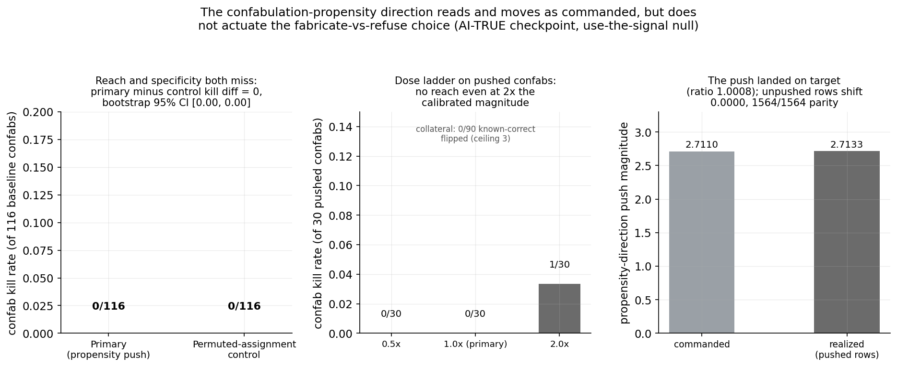
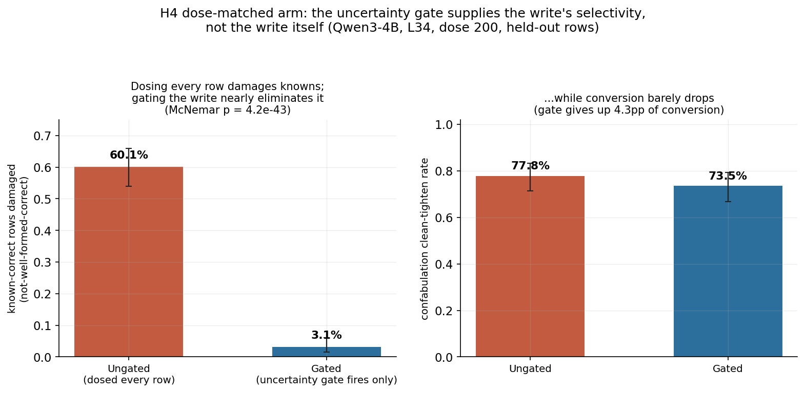
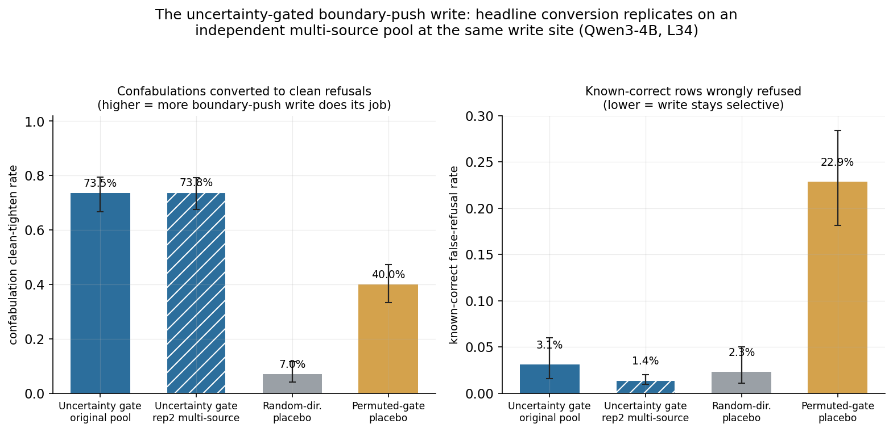
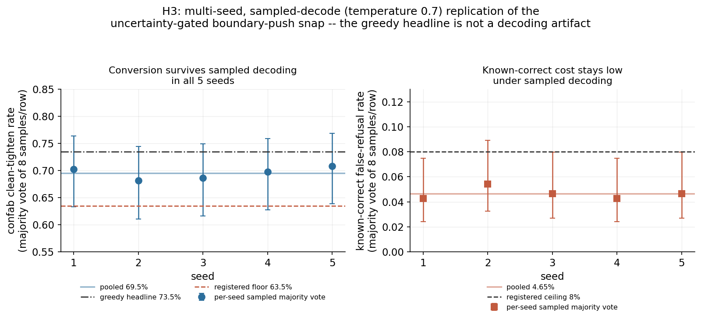
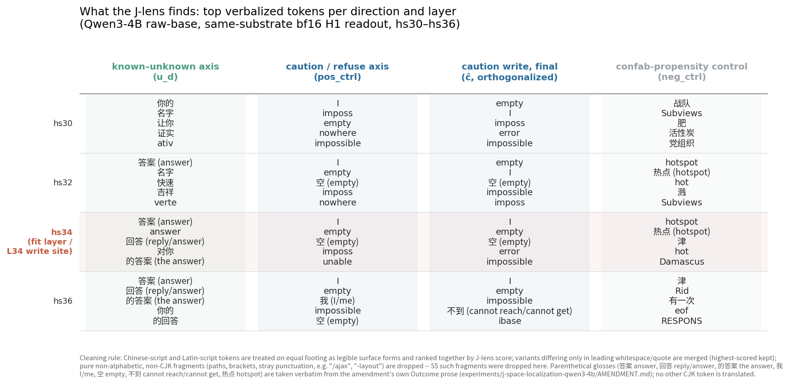
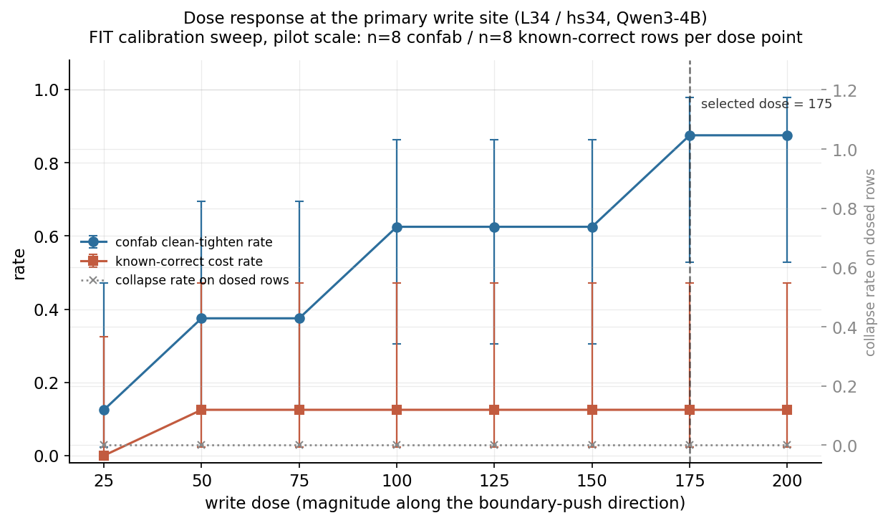
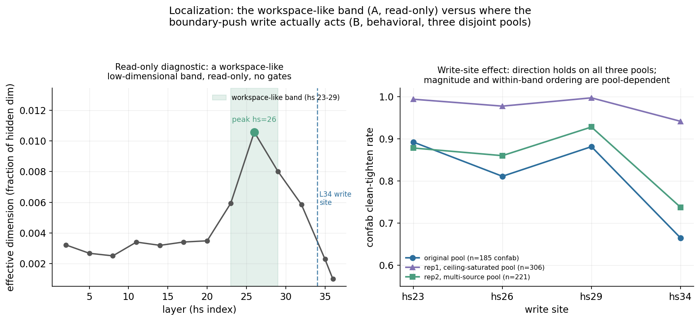
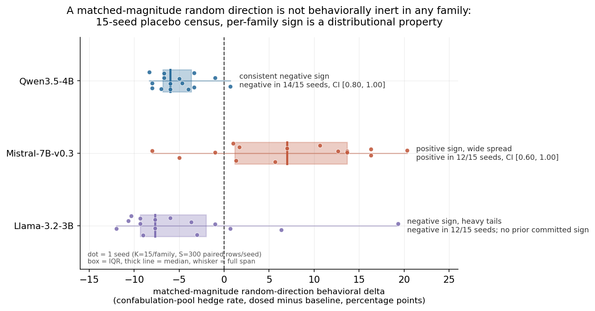
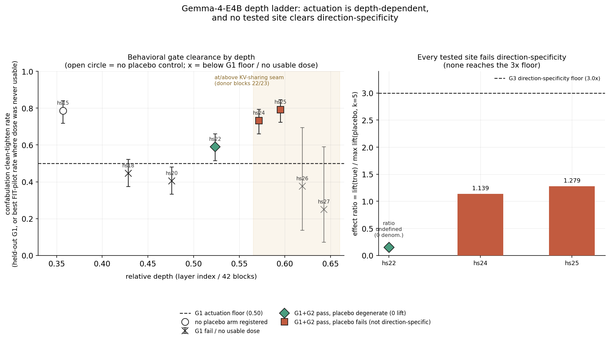

# Look Before You Speak: Operating-Point-Dependent Selectivity in Actuating Known-Unknown State

*Scope note on "epistemic state": throughout, the phrase names what a linear
readout of the hidden state reports about answerability and refusal, not a
claim that the model represents its own doubt as a mental state. Our earlier
work named these readouts mentalistically (the doubt direction, the doubt
gate, doubt-coupling); the vocabulary here is known-unknown (KU), which
describes how the readout was fit rather than what the model is supposed to
feel.*

---

> *"What I cannot create, I do not understand."*
>
> Richard Feynman

## Abstract

A frozen small language model carries a near-perfect answerability readout in its
hidden state before it generates. Reading is not writing. Can that signal be
written back so the model acts on it? We tested five ways of routing the readout
into behavior, all on frozen checkpoints.

Every route that asks the policy to consult its own readout fails. Activation
steering along the read directions and within-generation text injection produced no
behavioral effect. A push against a direction built to separate confabulations
(fluent answers to unanswerable questions) from honest refusals moved the
readout to within 0.1% of the commanded amount and
converted zero of 116 confabulations into refusals. High-authority system prompts
did move behavior, by obedience rather than self-consultation. A reward equal to the
model's own probe score left the true-sensor arm less congruent with its readout
(59.75%) than a permuted-sensor control (76.75%).

Actuation works when the readout gates an external write instead, and it needs no
training. On raw-base Qwen3-4B, a gated dosed write converted 136/185 held-out
confabulations into clean refusals (73.5%, 95% CI [66.7, 79.3]) at 8/258 false
refusals on known-correct answers (3.1%). Which component supplies selectivity
depends on the dose. At a high enough dose, an unconditional write damages 60.1% of
known-correct rows against 3.1% gated (57.0 points, p = 4.2e-43); at mid-band doses
the write already sorts by content, and the gate's own contribution to selectivity
is 0.148 on Qwen and 0.129 on Mistral. Where the write lands matters as much:
inside the workspace-like layer band it reached 89.2% clean refusals against 66.5%
just past it, +22.7 points for +0.78 points of cost.

---

## 1. Introduction

Ask a small language model a question it has no basis to answer, and its hidden
state, read before it emits a single token, will usually say so: a linear readout
separates answerable from unanswerable items at near-ceiling accuracy while
stated confidence stays flat and resists training (Rosenbaum, 2026c). The model
then answers anyway. The
failure is coherence between the stated and the hidden signal, not absence of
the signal (Rosenbaum, 2026a).

All of that is reading. This paper asks the other direction: if the signal is
there and accurate, can we make the model's generation policy consult it? We
tested five routes into behavior on frozen checkpoints, developing the work on
Qwen and stress-testing it on Mistral, Llama, and Gemma.

The answer is that we can read the model's known-unknown state and wire it to
the model's own refusal behavior, with no training and without the policy's
cooperation. In other words, we can build a thermostat: the model already carries a
working thermometer and never consults it to regulate its "temperature", so we supply the wiring from the
reading to the behavior it should govern. The wiring works only at the right operating point, meaning the
site in the network where the write lands and the dose it is applied at, and
those coordinates are model-specific. Done right, the wiring converts confabulations into
refusals without driving up refusal on the questions the model can answer.

The more conventional routes into that behavior all fail. Representation engineering treats
reading a direction and writing along it as one method (Zou et al., 2023), but
the two come apart: across five models a probe above 93% accuracy at every
layer produced near-zero steering effect at its own best layer (Billa, 2026).
Writing the two readout directions back into the hidden state where they read
best, and spelling the readout out in words as the model generates, each left
behavior short of the effect threshold (Section 4.1). A
direction fit for the job rather than for reading, separating fluent answers to
unanswerable questions from honest refusals, moved the internal signal by the
commanded amount and converted not a single one of those answers into an abstention
(Section 4.2). A system prompt handing the model a per-item certainty label did
move behavior, but it moved behavior in precisely the direction we prompted, and nothing to do with the internal signal
(Section 4.3). Lastly, rewarding the policy for agreeing with a frozen probe through training read from
its own pre-generation state left the true-sensor arm less congruent with its
own readout than a permuted-sensor control (Section 4.4). A readable direction
is not automatically a usable actuator, and what makes it usable is the
operating point rather than the direction.

Where the write lands matters as much as what is written. The J-space read, a
Jacobian-lens characterization of which layers carry a model's verbalizable,
workspace-like representations (Gurnee et al., 2026), locates that band well
upstream of the deeper site the original gated write had been using, and moving the same
write into the band converts substantially more confabulations at almost no
added known-correct cost (Section 4.6). Interestingly, a token-targeted J-space write, built to
raise refusal tokens and lower answer-continuation tokens, actuates on its own
but adds almost nothing on top of the gated write (Section 4.7).

Across families, we can consistently wire the readout (Known-Unknown or KU) to the behavior (the "I don't know" or IDK switch), but the coordinates do not. In practice, the build sequence is:

1. **Find the read spot.** A per-family read panel sweeps the model's depth and
   marks the band where its known-unknown state reads cleanly. That is where
   the sensor goes.
2. **Find the write spot and the dose.** Candidate write sites come from the
   workspace-like band, and the dose is calibrated on the fit split at the site
   you intend to use.
3. **Build the thermostat.** Threshold the readout, and where it fires, throw
   the refusal write. That is the IDK switch.
4. **Verify the wiring.** Check the write against a random direction judged
   against that family's own measured null, against a permuted gate, and
   against its cost on questions the model can answer, to confirm the effect
   belongs to the direction you fitted and not to perturbation at that
   magnitude.

---

## 2. Background: From Readout to Actuation

### 2.1 The prior readout result

Our diagnosis paper (Rosenbaum, 2026c)
separated three surfaces: the internal state, the stated confidence token, and
the generated behavior. On Qwen3-4B, an internal answerability axis separated
known from unknown items at about AUROC 0.997 (area under the receiver
operating characteristic curve, where 0.5 is chance and 1.0 is perfect
separation), while stated confidence was nearly flat. The readout paper
(Rosenbaum, 2026d)
then split the internal state into two deployable readouts: an answerability
**gate** before generation and a correctness **dial** after generation. The
gate/dial/veto pipeline is useful because it reads the model from outside
rather than asking the model to faithfully report itself. Both results sit
inside an established finding that hidden states carry knowledge and truth
structure the output channel does not express (Burns et al., 2022; Kadavath et
al., 2022; Marks et al., 2023; Orgad et al., 2024), including answerability
specifically, which is linearly readable even on items the model goes on to
hallucinate an answer for (Slobodkin et al., 2023), and entity-level knowledge
awareness, which is readable as a direction and causally gates whether the
model refuses or fabricates (Ferrando et al., 2024).

That distinction motivates the present study. External reading can support a
classifier, a monitor, or an abstention wrapper, but it does not prove the model's
own policy uses the signal.

### 2.2 What would count as use?

We treat "use of an internal readout" as stronger than behavior change. For example, a system
prompt that injects "you do not know this" and causes refusal is an actuator, but it
does not show the model consulted its own state. Likewise, a reward that improves
abstention behavior may train surface heuristics rather than readout alignment.

The cleanest positive evidence would satisfy three conditions:

- **alignment**: the intervention is computed from the model's own state, not
  from gold labels;
- **specificity**: a permuted or random control does not reproduce the effect;
- **selectivity**: the intervention moves target failures without imposing the
  same action on rows where it is inappropriate.

The specificity condition is the one the external literature has found hardest
to satisfy: a random unit vector orthogonal to a fitted steering vector can
produce behavioral effects statistically indistinguishable from the fitted
vector itself across several traits and models (Venkatesh and Kurapath, 2026).
Because intervention conclusions are also sensitive to metric and corruption
choices (Zhang et al., 2023), every control below was frozen before outcome
evaluation.

The successful cells below meet these conditions only when readout and write are
separated: the readout gates the intervention, and the write supplies a fixed
behavioral move.

---

## 3. Methods

Five intervention routes run below: the four channels of Section 3.1, and the
gated controller built from the first of them. Sections 3.5 through 3.8 are
shared apparatus and hold for all five, so the table names only where each
route's own machinery is defined and where its results appear.

| Intervention | Channel | Methods | Results |
|---|---|---|---|
| 1. Ungated write of a fitted direction | Activation writes | 3.2, 3.3, 3.4 | 4.1, 4.2 |
| 2. Readout rendered into the generation trace | Within-generation text injection | 3.1 | 4.1 |
| 3. Readout rendered as an instruction before generation | High-authority system prompts | 3.1 | 4.3 |
| 4. Reward computed from the policy's own readout during training | Reward coupling | 3.1 | 4.4 |
| 5. Gated hidden-state controller, its write site localized by the J-lens | Activation writes, gated | 3.2, 3.3, 3.4 | 4.5, 4.6, 4.7 |

### 3.1 Channels

We tested four ways to route an epistemic readout into behavior.

- Within-generation text injection: probe scores rendered into a thinking or
  revision trace as text, either as terse telemetry or as first-person prose
  with explicit action rules.
- High-authority system prompts: the same kind of state-derived label
  rendered as a second-person system instruction before generation.
- Reward coupling: a reinforcement-learning reward computed from a frozen
  probe score read from the policy's own pre-generation hidden state.
- Activation writes: interventions that modify the residual stream along a
  fitted direction at a specified layer and token scope, either by adding a
  scaled copy of the direction or, in the erase-write form used for most
  results here, by removing the state's existing component along that direction and
  writing a fixed setpoint in its place, following the activation-addition
  line (Turner et al., 2023) and its contrastive difference-of-means
  construction (Panickssery et al., 2023), within the broader read-and-write
  program of representation engineering (Zou et al., 2023). These are the
  closest analogue to turning the probe around, the strategy inference-time
  intervention makes explicit for a truthfulness probe (Li et al., 2023).
  Every activation write reported in this paper is
  timed to a fixed pre-generation position and persists through decode; a
  mid-generation write timed to the point where the model commits to an
  answer was also attempted, but is not reported as a result because an
  instrument-validity check found it uncertified (Section 6.4).

Two further operations on a fitted direction appear in the results on trained
checkpoints. **Ablation** removes the
state's component along the direction and leaves the rest of the residual
stream untouched, so the model runs without whatever that direction carries.
**Displacement** leaves that component in place and adds a fixed multiple of
the direction on top of it, the multiple counted in standard deviations of the
direction's own projection over the rows it was fit on, so a minus-two-sigma
displacement subtracts two such units without erasing anything. Ablation asks
what the model does when the direction is gone; displacement asks what it does
when the direction is moved. Both are reported on the same refusal axis in
Sections 6.3 and 6.6, and whether they agree turns out to depend on the site.

### 3.2 Readouts and directions

The core readouts are the known-unknown (KU) direction and a refusal
direction. In the gating experiments, the sensor is a standardized KU
projection: confabulation-prone rows project lower on it than known-correct
answered rows, so the gate fires when the negated projection exceeds a frozen
threshold. The actuator is a separate boundary-push direction, constructed by
orthogonalizing a raw refuse/control direction against the KU direction and
the classifier control described in Section 3.3. The raw direction is built the way refusal
directions are built elsewhere (Arditi et al., 2024); the orthogonalization is
a guard against the gate and the actuator collapsing into one axis, and it is
worth saying plainly that it does not buy representational independence, since
ablating one orthogonal refusal direction measurably changes another
(Wollschläger et al., 2025), and refusal is not well captured by any single
direction (Joad et al., 2026). Later J-space experiments reuse per-layer
versions of these gates and write directions.

The J-space line adds the Jacobian lens (J-lens) of Gurnee et al. (2026). For a
hidden-state vector at a layer, the J-lens estimates the first-order causal
effect of that vector on the model's final output, a Jacobian rather than a
fixed or learned linear map, and applies the unembedding matrix to the result
to give a vocabulary readout of what the model is poised to verbalize at that
point. Gurnee et al. find that workspace-like properties, meaning
representations available for report and for flexible internal use, emerge in
an intermediate band of layers rather than uniformly. We use the lens in two
ways: first as a read-only localization diagnostic, and then backward as a
source of token-target write directions.

### 3.3 Fitting the directions

Rows enter a fit by what the model does with them at baseline, in three roles:
confabulation-prone rows (unanswerable questions it answers anyway),
known-correct rows (answerable questions it answers correctly), and
unknown-refused rows (unanswerable questions it declines). The
confabulation-prone and known-correct roles are split, stratified by question
category under a fixed seed, into a fit split of 40% and a held-out split of
60%. Unknown-refused rows are never themselves gated or graded, so the whole
role stays in the fit split as scaffolding. On the raw-base Qwen3-4B controller
that split is 124 fit and 185 held-out confabulation rows, and 172 fit and 258
held-out known-correct rows.

Every direction here is read at one layer and one token position: the anchor,
meaning the last prompt token, taken before the model has generated anything.
The anchor is a function of the prompt alone, so the same position is defined
identically in every arm.

The known-unknown direction is a mass-mean contrast, meaning the difference
between two class means, normalized to unit length: the mean anchor state over
fit known-correct rows minus the mean over unknown-refused rows. On the
raw-base Qwen3-4B controller it is fit at hidden state 34.

The gate score turns that direction into one number per row. It is the row's
projection onto the direction, standardized by the fit pool's own mean and
standard deviation, clipped to plus or minus two, and then negated, so that
confabulation-prone rows, which sit lower on the raw projection, score high.

The firing threshold is where that score has to land for the gate to fire. We
take the Youden-J point, the score at which true-positive rate minus
false-positive rate is largest, chosen on the fit split alone and frozen
before a single held-out row is touched. Separating fit confabulation rows
from fit known-correct rows, the score reaches AUROC 0.9955; the selected
threshold catches 120 of 124 fit confabulations (96.8%) and flags 2 of 172 fit
known-correct rows (1.2%).

That is a fit-split figure and nothing more. Every number Section 4.5 reports
is measured on the held-out split that neither the direction fit nor the
threshold choice ever saw.

The raw direction the boundary push is built from is a second mass-mean
contrast in the same anchor states, and it is not the same contrast: the mean
over unknown-refused rows minus the mean over fit confabulation rows, which
separates declining from confabulating among questions the model cannot
answer. A third direction is a standardized logistic classifier of the confabulation
label over those same rows, with its solver seed pinned so that refitting
reproduces the vector exactly. The boundary-push write direction is that raw
refuse-versus-confabulate direction with its components along the other two
removed, by Gram-Schmidt against the plane the two span. That classifier
direction is carried only to define the plane for the orthogonalization; the
gate never reads it, and it is not the confabulation-propensity direction of
Section 4.2, which is a different fit on a different checkpoint.

The refusal axis of Sections 6.3 and 6.6 is a different direction with a
different fit, and it is fit on answerable questions rather than unanswerable
ones: a mass-mean contrast between known items the model refuses and known
items it answers correctly, taken at hidden state 35 on the trained checkpoint
and unit-normalized. Its sigma, the scale a displacement is counted in, is the
standard deviation of its own projection over those same rows.

Directions are refit at each site rather than ported. The mid-band Qwen3.5-4B
operating point carries its own directions, standardization constants, and
threshold fit at hidden state 20; the Mistral-7B site at hidden state 16
carries its own. No fitted vector
crosses a family boundary anywhere in this paper.

### 3.4 Write sites, dosing, and operating points

Write sites are named by their raw hidden-state index, hs followed by the
layer number. Raw indices are not comparable across families with different
block counts, and several comparisons here are cross-family, so we also give
relative depth, the layer index divided by the model's number of hidden
layers, wherever a site is compared against a site in another family. Block
counts, each read from the checkpoint's own configuration file, are:
Llama-3.2-3B 28, Mistral-7B-Instruct-v0.3 32, Qwen3.5-4B 32, Qwen3-4B 36,
Gemma-4-E4B 42. Llama's hs20 and Qwen3.5-4B's hs20 are the same integer and
not the same depth, relative depth 0.714 versus 0.625, and on present evidence
they fall on opposite sides of the band in which any family we tested has
actuated. A site together with the dose
written at it is an operating point.

Two write laws are worth enumerating that measure dose differently.

1. The erase-write law, which every gated controller result uses, removes the
state's existing component along the write direction and installs a fixed
setpoint in its place. The dose is therefore the realized projection onto the
write direction after the write, and it is read back on dosed rows to confirm
the write landed; every erase-write result below carries a read-back verified
within tolerance, and Appendix A names the governed record for each. That
single quantity is expressed two ways. At the raw-base
Qwen3-4B late site it is stated as a raw projection value, dose 200. At the mid-band sites it is stated as a multiple
of sigma, the standard deviation of that direction's projection over the fit
pool, which is what makes a setpoint comparable across layers and families
whose residual streams differ in scale: Qwen3.5-4B at hidden state 20 runs at
eight sigma, an absolute dose of 12.608, and Mistral-7B at hidden state 16 runs
at twelve sigma, an absolute dose of 3.665. The absolute figure and the sigma
multiple are one number written twice. The late-site dose has no sigma
expression, which is why it is quoted as the raw projection value throughout.

2. The additive law leaves the existing component alone and adds a fixed vector on
top of it. It is used by the push of Section 4.2, where the dose is the
raw-space projection gap between the confabulating mean and the refusing mean
along that direction, the amount that moves an average confabulating row's
reading onto the refusing population's mean; and by the displacements of
Sections 6.3 and 6.6, where the dose is a stated number of sigma.

Doses are chosen on the fit split, never on the rows a result is reported over,
under a single rule fixed before each run. A ladder of candidate setpoints is
applied to a small fit-split calibration subset at the candidate site, and a
rung is usable only if the read-back lands within tolerance on every dosed row,
no dosed row degenerates, and fit-split confabulation clean tightening clears
its floor; Appendix E gives the floors, which differ between the layer and
depth ladders and the cross-family fleet, and the rule for choosing among
usable rungs.

### 3.5 Outcome measures

Different channels move different things, so no single outcome covers the
results below.

**Clean tightening** is the primary behavioral outcome of the write results: a
row that previously confabulated now produces a single well-formed JSON object
with exactly one answer field, that field's value is a refusal, generation
terminated naturally before the token cap, and nothing follows the JSON. It is
the strictest outcome in the paper, since a row that refuses in prose but
breaks the output contract does not count.

**Known-correct false refusal** is the matching cost outcome: a row that was a
well-formed answer matching a gold alias at baseline is no longer one after the
intervention. It counts refusals, wrong answers, and broken output alike, which
is why Section 4.5 decomposes it once into those three parts.

**Refusal**, where the text says refusal rather than clean tightening, is a
format-agnostic reading of the same behavior: the generation contains one of
three fixed English refusal forms, anywhere in the text and regardless of
whether the JSON parses, with degenerate text excluded. Well-formedness is then
reported as its own separate rate, which is what lets a result state that
refusal and output corruption came apart.

**Abstention** in Section 4.1 is the rate at which the model declines on
unanswerable questions, read off the final output after a revision pass rather
than the first pass, with accuracy on answerable questions carried alongside as
a no-regression floor. The dial cells in the same section score
appropriate-revision discrimination instead: the probability of revising given
an initially wrong answer minus the probability of revising given an initially
correct one.

**Release** is baseline refusal rate minus the arm's refusal rate on the same
population, the share of rows an intervention un-refuses. **Induced refusal**
is its mirror, the arm's refusal rate minus baseline on a population that
answered at baseline, the share an intervention muzzles.

**Selectivity gap** is release on known items the model refused despite being
able to answer them, minus release on unanswerable items it refused. A prompt
that frees the first group without freeing the second scores high. Section
4.3's headline is the true prompt's gap minus the permuted prompt's gap.

**Congruence** is per-row agreement between what the policy did and what a
fresh probe reads from that policy's own pre-generation state on that same row:
either the probe reads unanswerable, at probability above one half, and the
model refused, or the probe reads answerable and the model answered. An output
that violates the schema counts as incongruent. It is the primary outcome of
the reward experiment in Section 4.4, and it is deliberately not an accuracy
measure: a policy can abstain well and still score low on it.

**Contribution to selectivity** is the quantity that decides whether the gate
or the write supplies selectivity at a given operating point. For one arm,
selectivity is the magnitude of its effect on confabulation-prone rows minus
the magnitude of its effect on known-correct rows, each effect being that arm's
rate minus the undosed baseline rate on that population, taken in absolute
value. The gate's contribution is then that quantity under the true gate minus
the same quantity under a permuted gate, with the write held fixed.
Magnitudes rather than raw rates are used because a mid-band write can suppress
hedging rather than induce it, and a raw contrast flips sign in that regime
while the underlying concentration of the effect on unknowns does not.

**Over-refusal**, in Section 6.6, is the refusal rate on questions the model can
answer, so a collapse in over-refusal is a release of behavior rather than a
cost.

**Degenerate output** is text that is empty, contains no alphanumeric
character, is a single repeated n-gram, or whose parsed answer field is a
dominant repeated unit. Degenerate rows never count as refusals or abstentions
under any instrument here. A rise in the degeneracy rate above 5 points against
baseline is a guard in the text and prompt channels, and zero
degeneracy on dosed rows is a precondition for a dose to be usable at all.

### 3.6 Scoring instruments

Refusal is scored two ways across this paper, and which one a result rests on
changes what the number means.

The narrow instrument reads refusal from the model's own output and nothing
else: a refusal value in the parsed JSON answer field, or one of three fixed
English refusal forms in the text. It is what Sections 4.5, 4.6 and 4.7 score
under, along with the gemma depth ladder reported in Section 4.8 and Appendix
F, including the random-direction and permuted-gate controls behind
the Section 4.5 headline and every clean-tightening rate in the layer and depth
ladders.

The wide instrument is a two-stage stack. First a frozen, deterministic pattern
detector, widened beyond those three forms with abstention vocabulary compiled
before launch from mined in-family idioms and published abstention phrase
inventories; its rates are reported but do not decide anything. Then the
primary lane: every row the detector marks non-refused is stripped of arm,
dose, role, and source labels, shuffled under a fixed permutation, and graded
as bare text by context-free LLM graders against a single rubric.
A text counts as an abstention only if it declines to give the queried answer,
or states unknowability or uncertainty as its answer, without also asserting a
specific answer value; a hedge followed by a committed answer is not an
abstention, and degenerate or empty text is not an abstention. The pool carries
clear-positive and clear-negative decoys to certify grader calibration
before unblinding, and the graded manifest is hashed and committed before
anything is unblinded. The final rate per row is detector-refused or
grader-marked abstention. The lane cannot widen the benefit vocabulary without
widening the cost vocabulary by the same rule, because a grader cannot
tell a confabulation-prone row from a known-correct one. This stack is what
every cross-family number in Section 4.8 rests on, apart from the gemma depth
ladder, and what the mid-band gate factorial reported in Sections 5 and 6.2
rests on.

Sections 4.1 through 4.4 score under neither: each of the text, prompt, and
reward channels uses the refusal grader defined in its own cell, applied to
that cell's own final output. The two stacks are not interchangeable, and the
size of the gap between them is itself measured in Section 4.8.

### 3.7 Populations and controls

Confabulation-prone rows come from the unanswerable split of
Known-Unknown Questions (Amayuelas et al., 2023), whose per-row subtype labels
(controversial, future-unknown, underspecified, and the rest) Section 4.8
uses for its subtype breakdown. Known-correct rows come from PopQA (Mallen et
al., 2022) and TriviaQA (Joshi et al., 2017), graded against gold answers.
Every experiment below draws its rows from these three sources unless the text
says otherwise.

Controls are matched to the mechanism, and each control's metric and
construction were declared before outcome evaluation, following the standard
caution that intervention conclusions are sensitive to exactly those choices
(Zhang et al., 2023):

- text-injection arms use placebo or permuted labels with the same prompt form;
- reward arms compare true-sensor and permuted-sensor rewards;
- hidden-state write arms use random-direction controls and permuted gates;
- J-space token-target arms use a matched random J-space direction.

A random-direction control writes a fixed random unit vector, drawn without
reference to any data, on the same rows the true gate fired, at a magnitude
matched to the realized projection the true write achieved. A permuted gate
holds the number of dosed rows fixed and permutes which rows they are,
assigning them uniformly at random across the combined confabulation-prone and
known-correct pool under a fixed seed, with the real write direction unchanged.
Permuting over the combined pool rather than over confabulation-prone rows
alone keeps the fired mix at deployment proportions; permuting within a
subsample would over-represent known-correct rows and flatter the gate.

The placebo census reported in Section 4.8 measures that random-direction
control's own distribution rather than drawing it once. For each family it
wrote the frozen random direction as an erase-write to that family's own
certified placebo setpoint, so every seed within a family is a draw at one
fixed magnitude, and drew fifteen fresh seeds, scored on a fixed 300-row
paired confabulation subsample through one blinded context-free grading pool.
The criterion was fixed before the run: a family's placebo sign holds if at
least 80% of its seeds carry that sign, with a bootstrap 95% lower bound above
0.50 and a median at least 3.0 points in that direction; it is dismissed as
seed noise if 60% or fewer carry it or if the interquartile range spans zero.

### 3.8 Statistical analysis

Every binomial rate in this paper carries a Wilson 95% interval, and the
gates are stated against both the point estimate and the relevant
end of that interval, so a rate can clear its floor and still miss its gate.

Paired binary comparisons between two interventions on the same rows use
McNemar's test, evaluated as an exact two-sided binomial test on the discordant
pairs. It certifies the gated versus unconditional contrast of Section 4.5,
where 149 of 258 known-correct rows are discordant, and the mid-band versus
late write-site contrast on the multi-source pool in Section 4.6, where 42 rows
are discordant and all 42 break the same way. The latter carries a
second clause the test alone does not supply: late-only failures had to
outnumber mid-only failures at least three to one.

A confidence interval on the difference between two independent proportions
uses the Newcombe hybrid score interval, built from the two rates' own Wilson
bounds rather than from a normal approximation, which is what Appendix F
reports for the well-formedness difference between the two key-value sharing
conditions.

Bootstrap intervals are percentile intervals, and the resampling unit follows
what the quantity is a distribution over rather than being uniform across the
paper:

- Section 4.2's primary-minus-control kill difference resamples rows, 1,000
  resamples;
- Section 4.3's quantities all resample rows within cell, at 10,000 resamples
  for the selectivity gap, the induced refusal, and the compliance asymmetry,
  and over rows for the divergent-pool release congruence;
- Section 4.4's congruence differential resamples rows in pairs matched across
  the two training arms, 10,000 resamples;
- Section 4.8's sign fractions resample seeds, not rows: each of the fifteen
  seeds contributes one signed delta, and 10,000 resamples of those fifteen
  signs give the interval. Each seed's own delta separately carries a row-level
  Wilson interval, and the two levels are never pooled.

### How this research was conducted with AI

This actuation program is run by a human principal investigator working with a
frontier language model acting as a research orchestrator, which dispatches
specialized AI agents for bounded tasks. We state the arrangement because it
is part of the method: an actuation claim is easy to get wrong in a way the
final numbers alone will not reveal, if the same process that builds an
intervention also grades it, and the division of labor below is built against
that risk specifically.

Every cell behind this paper is a governed unit of work. Before any row is
scored, a signed design fixes the channel, the write site, the dose law, the
controls, and the outcome gates, and every instrument file behind it is
pinned by content hash. After signing, thresholds do not move, and an outcome
cannot be reinterpreted to fit a different gate after the fact. The human
side holds everything with consequence: approving a cell's design before it
launches, authorizing the compute that runs it, ruling on any outcome that
requires judgment rather than arithmetic, merging a result into the record,
and deciding what the paper claims. The AI side builds each channel's
harness, runs the dose calibration and control sweeps, computes every
statistic reported below, drafts this manuscript, and red-teams its own
results before a human is asked to trust them.

Two controls carry most of the weight. Adversarial review is mandatory
before any positive result is trusted, and it runs separately from the agent
that produced the result, looking specifically for the failure modes an
actuation claim is prone to: a control that can see what it is supposed to
be blind to, a direction fit and evaluated on the same rows, and a placebo
that looks clean only because it was measured against the wrong baseline.
And every claim traces to its governed design document rather than to a
memory of what an earlier cell showed. No agent, including the orchestrator,
may assert what a prior experiment found without opening its signed record,
because a plausible but wrong account of a prior result is the error that
compounds silently across a program with this many cells behind it.

Provenance is enforced by construction. Every checkpoint is pinned by
revision, every instrument file is content-hashed at signing, and Appendix A
traces each claim in this paper to the document that governs it while
Appendix B traces it to the exact checkpoint. None of this removes the need
for human scientific judgment about what a pattern of null and positive
results means across the cells above. It keeps the AI's share of that
judgment auditable: a reader can follow any number in this paper back to the
bytes that produced it and the document that fixed its gates before a single
row was scored.

---

## 4. Results

### 4.1 Directly writing or telling the model its readout mostly fails

Start with the most direct question the readout results raise: if the gate and
dial directions are readable, can we write them back into the model, while it
is generating text, at the positions where they read best? As a reminder, the
gate is the answerability readout scored before generation, and the dial is
the correctness readout scored after a first answer and aimed at revision
behavior (Rosenbaum, 2026d). The grid below tests both because they are that
paper's two deployable readouts, and writing each back in at its own read
position is the direct test of whether the site that reads best is also the
site that writes best. The dial does not return after this section; the
controller work in the rest of the paper follows the gate lineage only. That
premise, that
the best read site is the best write site, is one an independent study has
since tested directly and rejected: probe
accuracy does not predict steering success, and the layer where a probe reads
best can produce no steering effect at all (Billa, 2026). Steerability also
tracks how separable the two activation clusters are along the fitted
difference direction rather than how accurately a classifier can be fit (Braun
et al., 2025).

On Qwen3.5-4B, an 8-cell steering grid crossed two signals (gate/dial), two
positions (anchor/end), and two channels (activation write/text injection).
Text injection means rendering the probe's own score as tokens and splicing
them into the model's thinking or revision trace, so the model's own
certainty reading about itself becomes part of what it is generating; the
first round used a terse, telemetry-style rendering, `[internal: {signal}
{score:.2f} — {interp}]`. None
of the eight cells produced an effect that met the threshold set for it in
advance. Gate-at-anchor activation steering was flat across
the alpha sweep; dial-at-end activation steering was flat; text-injection cells
were also flat under their own metrics. The signal is present and the
tested channels do not make the policy use it, which is the read/write split
in its simplest form.

A natural objection is that the text was phrased unnaturally: that terse
telemetry note reads like a log line, not something the model would say to
itself. We therefore tested stronger first-person phrasing in its place: "I am
X% sure..." plus an explicit action rule.
The result remained negative. The gate cell showed a small, real trickle of
rule-following (+2.0 points abstention, CI excluding zero) but missed the +10
point gate by a factor of five. Dial cells did not improve revision behavior:
the late-position metric was instrument-saturated, and the final-thought version
missed with a -2.7 point delta whose CI included zero. The strongest natural
language framing did not open the channel at useful magnitude.

The model can read the state, and an external system can read the state, but
placing a description of that state inside the generation trajectory does not
reliably make the model act on it.

### 4.2 A calibrated push against the confabulation-propensity direction moves the readout but not the behavior

The same question has a sharper form. Rather than reusing the gate and dial
directions, which were fit to read, ask it of a direction built for exactly
this purpose: a direction fit
to separate confabulations (fluent, specific answers to questions the model
has no basis to answer) from honest refusals among questions the model
cannot answer, residualized against the refusal axis so that it is not a
restatement of the model's general tendency to refuse. This is the
confabulation-propensity direction; it is
distinct from the known-unknown axis used everywhere else in this paper and
from the boundary-push write direction of Section 4.5. It was fit on a
checkpoint trained with reinforcement learning, the same checkpoint whose
reward-trained arm is evaluated in Section 4.4 below, where it produced 116
confabulations under the checkpoint's own generation policy on a fixed
question set.

If the direction is causally upstream of the fabricate-versus-refuse choice,
subtracting it from the residual stream at generation time, at a magnitude
calibrated to erase the average gap between confabulating and honestly
refusing rows, should convert some of those 116 into refusals. Ninety-eight
rows scored above the push threshold and were dosed from the first generated
token onward; a permuted-assignment control pushed the same number of rows,
chosen at random, at the same magnitude and direction. Collateral stayed
inside its floor: none of 90 baseline-correct rows flipped to
refusal, against a ceiling of 3. But the push converted zero of the 116
baseline confabulations, and a three-point dose ladder at half and double the
calibrated magnitude converted only one of 30 pushed confabulations at the
highest dose tested. The primary arm's kills minus the permuted control's
kills came to exactly zero, with a bootstrap 95% confidence interval of
[0.00, 0.00]. By the criteria fixed before the run, this is a negative
result on both the reach and the specificity leg.

The null is not an instrumentation failure. A read-back check on the pushed
rows found the confabulation-propensity projection moved by -2.7133 against a
commanded -2.7110, a ratio of 1.0008: the push landed almost exactly where it
was aimed. Unpushed rows showed a projection shift of exactly 0.0000, and
reproduced their unintervened grade on 1,564 of 1,564 rows. The direction
moves the readout by the commanded amount, and the behavior does not move at
all.

**Figure 6.** Confabulations converted to refusal under the calibrated
confabulation-propensity direction versus a permuted-assignment control at the
same magnitude, alongside the read-back check confirming the push landed
within 0.1% of the commanded amount on pushed rows and produced exactly zero
shift on unpushed rows.

The scope is deliberately narrow: one checkpoint, one seed, and the
confabulation-propensity direction itself does not transfer across checkpoints at
better than 0.17 cosine similarity to a reference axis on this substrate, so
the result licenses a claim about the injection channel on this trained
checkpoint, not about confabulation-propensity actuation in general.

### 4.3 System-prompt authority moves behavior, but not by own-readout consultation

The next question was whether the failure was text itself or text authority. A
second-person system-prompt directive gives the model a per-item certainty label
before generation: when certainty is HIGH, answer directly; when LOW, say "I
don't know." The true arm used the model's probe-aligned label; the placebo arm
permuted labels across rows while preserving marginal frequencies.

This high-authority channel moved behavior. On the raw-base Qwen3-4B substrate,
the true system prompt beat the permuted prompt on the selectivity gap by +18.0
points, with bootstrap CI [+11.8, +24.7]. It released some known-refused rows
without inducing unknown-refused rows to answer, and passed its specificity and
degeneracy guards.

However, this did not yet establish own-state consultation. On that pool, the
probe label and the gold answerability label agreed on every row, so a
probe-aligned instruction was also a correct oracle instruction. The follow-up
inverted the labels. The model obeyed the wrong muzzle strongly: induced refusal
on known-correct answered rows rose by +34.0 points, CI [+26.5, +41.5]. It
resisted the wrong pro-answer instruction more strongly: unknown-refused release
was +7.9 points. The asymmetry, +26.1 points, passed its locked gate.

Internal-state instrumentation sharpened the picture. The known-unknown
direction did not move semantically with the prompt; compliance traveled
primarily through a refusal/policy axis. A divergent-pool follow-up then separated rows where the
model's own readout and the gold label disagreed. Release congruence with the
model's own readout was a precise zero: -0.21 points, CI [-4.45, +4.10]. A
positive-control addendum verified that the instrument was live
(+50.98 point induced refusal on a refusal-representative stratum). The verdict:
system prompts move policy by compliance and boundary distance, not by making the
model consult its own readout.

Authority is an actuator, but it is not the self-monitoring channel this
section set out to find. It can install refusal behavior from outside, even
against the model's own knowledge. That models capitulate to authoritative
framing against their own prior answer is well documented: challenged on a
correct answer, models flip roughly 46% of the time on average, with
confrontational and persona-based challengers the most effective (Laban et
al., 2023). The steering analogue is equally well documented, in that an
externally supplied knowledge-awareness direction can force refusal on
entities the model does in fact know about (Ferrando et al., 2024).

### 4.4 Rewarding the readout also fails to train consultation

If prompting does not make the model consult its readout, perhaps training can.
Reward is known to move uncertainty behavior: proper scoring rules over
verbalized confidence improve calibration without an accuracy cost (Damani et
al., 2025), direct confidence expression responds to a logarithmic scoring
reward (Bani-Harouni et al., 2025), and metacognitive self-judgment as a
reward signal improves faithful uncertainty expression over standard RL (Liu
et al., 2026), and our own controlled comparison of supervised, preference,
and reinforcement-learning regimens for abstention takes up that question
directly (Rosenbaum, 2026b). The
question here is narrower and harder: not whether reward
moves the behavior, but whether it makes the policy consult its own
hidden-state readout. The probe-as-reward cell took two checkpoints that had
been supervised fine-tuned on clean data and trained both with the same
reinforcement-learning recipe, group-relative policy optimization (Shao et
al., 2024), which scores a group of sampled completions against each other
rather than against a learned value model. In
the TRUE arm, reward agreement was computed from a frozen probe read from the
policy's own pre-generation state. In the PERMUTED arm, each row's sensor score
was swapped with another row's from the same gold answerability class (seed
fixed), preserving the reward's per-class statistics while severing the link
between the score and the row's own state. The primary held-out metric was congruence between the
final policy behavior and the arm's own freshly refit eval probe.

The instrument was valid: both arms completed all 2934 scheduled steps, no
tripwire halted, and fresh probes on the final checkpoints still read gold at
out-of-fold AUROC 0.9948 and 0.9946. But the result went the wrong way. TRUE
congruence was 59.75% versus PERMUTED 76.75%, a -17.0 point differential with CI
[-21.5, -12.5]. The TRUE arm preserved some useful behavior, such as fewer
unknown hallucinations than the control, but it did
not learn to consult its own readout.

Reward can shape behavior correlated with the sensor, but this does not imply
policy-readout congruence. On rows where content and readout dissociate, the
policy sides with learned content and boundary behavior rather than with its
own current probe state. A ternary abstention reward under GRPO reaches a
compatible conclusion from a different direction, moving abstention behavior
without coupling it to confidence (Mohamadi et al., 2025).

### 4.5 A gated hidden-state controller succeeds, and the gate's role depends on the dose regime

The intervention form is what changes the outcome. Rather
than asking a single direction to be both sensor and actuator, the controller
that works separates them. The nearest published analogue is entity-level:
directions that detect whether a model can recall facts about a queried entity
causally gate refusal versus fabrication when written back in (Ferrando et
al., 2024). The controller below applies the same read-then-write logic at the
level of whole questions, and separates the two roles into two different
directions:

1. a KU readout gate decides which rows look like confabulations;
2. a fixed boundary push (dosed write) writes only those fired rows to a
   selected refusal setpoint.

At this write site (Qwen3-4B, L34) and dose (200), a separate comparison
later established why this separation matters: an unconditional write damages
60.1% of held-out known-correct rows versus 3.1% gated, a 57.0-point gap
(McNemar, p = 4.2e-43), while the gate
costs the controller only 4.3 points of confab conversion (77.8% ungated
versus 73.5% gated). The 60.1% figure is not a refusal rate; it decomposes as
55.8 points clean false-refusal, 3.9 points answered-wrong, and 0.4 points
degenerate output. At this specific write site and dose, the gate is the sole
source of selectivity: the write, left unconditional, damages most
known-correct rows. We label a dose this strong, high enough to flip
known-correct rows as well as confabulations, an overdrive operating point;
Section 6.2 gives the qualitative account behind the label. This is the collateral-damage trade-off that additive
steering methods are known to face at effective magnitudes (Nguyen et al.,
2026), and that norm-violating writes in particular incur as outright
capability collapse (Dang and Ngo, 2026). What the gate buys here is a way to
pay that cost only on rows the readout has already flagged.

**Figure 2.** Dosing every held-out row unconditionally versus dosing only
where the KU readout gate fires, at the same write site and dose. The
ungated arm damages most known-correct rows; the gated arm holds cost near
its floor while giving up only 4.3 points of confab conversion.

On held-out rows, the raw-base Qwen3-4B controller passed every gate.
Gated clean
tightening was 136/185 = 73.5%, Wilson 95% confidence interval [66.7, 79.3],
clearing the >=60%
floor and the lower CI >50% requirement. Known-correct false refusal was
8/258 = 3.1%, CI [1.6, 6.0], clearing the <=5% point floor and <10% upper CI
requirement. A random-direction write on the same fired rows produced only
13/185 clean tighten, and a permuted gate produced 59/258 known-correct cost.
The effect depends on both the boundary-push direction and the KU readout gate.

**Figure 1.** Confabulation clean-tighten rate and known-correct false-refusal
rate for the real KU-gated controller against random-direction and
permuted-gate placebos, on the original held-out pool and on the multi-source
replication pool at the same late write site.

The model need not internally choose to consult its readout for the system to
use that readout. The readout can gate an external controller. At this
overdrive operating point the gate supplies the selectivity that the write
alone does not; at a mid-band dose the attribution reverses.

The same controller design transfers out of sample. At Qwen3.5-4B's mid-band
write site (hs20, relative depth 0.625, absolute dose 12.608), the IDK switch
operating point, a held-out run refused 872/1286 = 0.678 of fired
confabulations (Wilson [0.652, 0.703]), held well-formedness at 1256/1286 =
0.977, and cost 14/360 = 0.039 in known-correct false refusal, with both
placebo legs intact. Refusal and output corruption come apart on rows the
operating point was never selected on, which is the same decoupling the
raw-base controller shows.

The raw-base Qwen3-4B headline also survives a change of decoding. Under
temperature-0.7 sampled decoding with majority-vote aggregation across five
seeds, pooled confab clean-tighten conversion is 643/925 = 69.5%, above the
63.5% floor in every individual seed, with known-correct cost at 60/1290 =
4.65%. The controller is not an artifact of greedy decoding.

**Figure 3.** The greedy-decode headline reproduced under temperature-0.7
sampled decoding with majority-vote aggregation, per seed and pooled, for
both confabulation conversion and known-correct cost.

### 4.6 J-space localizes a better write site

Where should a write land? The controller of Section 4.5 writes at an L34
residual-stream site, and that site was carried over from the cell that first
built the direction rather than chosen for where it sits in the network. One
hypothesis makes the choice principled. Gurnee et al. (2026) report that
workspace-like properties, meaning representations available for report and
for flexible internal use, emerge in an intermediate band of layers rather
than uniformly. If the reportable component of a concept lives in such a band,
a write should land inside it, and a write placed later may be downstream of
the broadcast it is trying to change. A Jacobian-lens characterization tests
that by asking whether the L34 site lies inside or outside the band, and the
band it locates then supplies the candidate write sites.

The instrument passed a correctness smoke: the final-layer J-lens closely
matched the direct unembed baseline over 1000 prompts, with mean cosine 0.9811,
mean top-10 overlap 0.82, and top-1 match 3/5 over five random directions.

The verbalization read is only worth trusting if it is direction-specific.
The lens itself is direction-blind: it applies the same readout, over the same
1000 prompts, to whatever vector it is handed, so if every direction fit at
this site came back with the same hedge-flavored vocabulary, the tokens would
be a fact about the instrument or the layer, not about the directions. Four
directions fit at the same L34 site went in together: the known-unknown
direction, the caution (answer-versus-refuse) direction, the orthogonalized
caution write direction, and the confabulation-propensity direction carried
as a negative control. The read splits them cleanly. The caution and
caution-write directions verbalize as first-person, absence, error, and
impossibility tokens (I, empty, error, impossible); the known-unknown
direction verbalizes as answer/reply tokens; and the negative control does
not verbalize cleanly at all, coming back as noisy unrelated fragments. Each
direction gets its own vocabulary and the control gets none, which is what
licenses reading the tokens as a statement about what each direction is
rather than an artifact of the lens.

**Figure 9.** What the J-lens finds, per direction and layer (hs30-36,
Qwen3-4B raw-base, same-substrate bf16 H1 readout): the known-unknown
direction verbalizes toward answer/reply tokens in two scripts (answer,
reply), the caution and orthogonalized caution-write directions toward
first-person, absence, error, and impossibility tokens (I, empty,
impossible), and the confabulation-propensity negative control does not
verbalize cleanly. Chinese-script and Latin tokens are ranked together;
parenthetical glosses in the figure appear only for terms translated in the
source amendment's Outcome (`experiments/j-space-localization-qwen3-4b`).

A direction that verbalizes toward answer/reply tokens is
tracking answerability, not a self-directed uncertainty state, and a later
experiment on world-known items, where the error is a confidently wrong answer
rather than acknowledged ignorance, characterizes it the same way, closer to
unanswerability recognition than to self-directed uncertainty (Section 6.4). The
layer profile localized a workspace-like band to hs23 through hs29, peaking at
hs26. The inherited L34 direction corresponds to hs34, just after that band.

A fixed absolute dose is the wrong instrument for comparing sites, and that is
itself a finding about how these writes behave. Additive steering loses
coherence once its magnitude leaves the range the residual stream tolerates
(Dang and Ngo, 2026), and dose 200 does exactly that at the two shallowest
candidates: hs23 and hs26 both collapsed, and the sweep stopped at its
instrument-validity rule. Doses are calibrated per site on the fit split
instead, which recovered usable non-collapsing setpoints at hs23=25, hs26=75,
hs29=125, and hs34=175. Each site can then be compared at a dose it can
actually carry.

The calibrated held-out contrast supports the layer-site hypothesis. Over 443
held-out rows, hs23 (relative depth 0.639) achieved 165/185 clean refusals
(89.2%) against hs34's (relative depth 0.944) 123/185 (66.5%), a +22.7 point
improvement, while known-correct cost rose from 7/258 (2.7%) to 9/258 (3.5%),
a +0.78 point delta. Moving the write into the band buys a large gain in
confabulation tightening for a fraction of a point of added cost. hs34
remained viable, but it was not optimal.

**Figure 4.** Confabulation clean-tighten rate, known-correct cost, and
collapse rate on dosed rows across the fit-split calibration dose ladder at the
late write site, with the selected setpoint marked.

The late write site was not dead, but it was suboptimal on the pool that
produced this contrast. Writing near the workspace-like band made the same
regulated boundary push substantially more effective there. This is a second,
independent route to the same practical conclusion Billa (2026) reaches on
binary concept families, that the standard middle-layer heuristic and the
probe's own best layer are both poor guides to where a write will land, and
that a readout of what the model is prepared to verbalize is a better one.

The layer-site advantage is real and direction-stable on raw-base Qwen3-4B,
but its size cannot be read off a reference site sitting near its own ceiling.
Two same-model replications on fresh confabulations measure that dependence,
each with the same success bar registered before the run: the best mid-band
site must beat the late reference by at least 10 points on clean tightening.

On a pool drawn from a single source, the late reference site refuses 94.1% of
306 rows, leaving 5.9 points of arithmetic headroom against the 10-point bar,
and the best mid-band layer there, hs29, beats it by 5.6 points. A mid-band
write cannot show a 10-point gain over a reference with less than 6 points
left to give, so that miss is a property of the pool rather than evidence of
an absent effect.

On a pool mined from three independent sources, the late reference site falls
to 73.8% of 221 confabulations, well off its ceiling, and the advantage
returns at close to its original size: hs29 reaches 92.8%, a 19.0 point gain.
The paired comparison is one-sided: on 42 of the 221 rows the mid-band write
converts a confabulation the late write misses, and on none does the reverse
happen (exact paired test, p = 4.5e-13). Known-correct cost stays small on
both arms, 2.8% at the mid-band against 1.4% late.

**Figure 5.** Left: the read-only Jacobian-lens effective-dimension profile
locating the workspace-like band and the late write site relative to it.
Right: confabulation clean-tighten rate by write site on the original pool
and both same-model replications, showing the direction of the mid-band
advantage holds across all three while its magnitude and within-band
ordering are pool-dependent.

### 4.7 Token-targeted J-space writing is real but redundant

Finally, we tested a more literal J-space idea: build a hidden-state direction
that raises natural refusal tokens and lowers answer/reply continuation tokens.
The token bundle was fixed and audited before held-out evaluation. Positive
targets included refusal pieces such as `I`, `know`, `cannot`, `unable`,
`unknown`, and `insufficient`; negative targets included English answer/reply
tokens and Chinese answer/reply tokens that appeared in the J-lens readout, such
as answer/reply forms.

At the dose selected on the fit split, the token-target direction wrote accurately and safely. It
was also non-inert: alone, it converted 88/185 confab rows into clean refusals
(47.6%). But it did not improve the already strong hs23 boundary push (dosed
write). The boundary push alone reached 165/185 = 89.2%; adding the
token-target direction on top of it reached 166/185 = 89.7%, only +0.54
points. Known-correct
cost increased by only +0.39 points, so safety was not the issue. The issue was
redundancy: the natural token-target write added one extra cleaned confab row on
top of a controller that was already doing the job.

Verbalizable token directions can be real actuators without being useful
additive controllers. A direction that points toward refusal tokens is not
automatically a better policy intervention. One reading of the redundancy is
that the boundary-push write is already routing through the same pathway: clamping
the logits of refusal and compliance tokens to their unsteered values
collapses steered refusal from 86.5% to 26.0%, evidence that steering acts on
this behavior largely through token emission probability rather than upstream
reasoning (Sun et al., 2026). If the boundary push is already moving those
token logits, a direction built to move them explicitly has little left to
add.

A wider screen for other behavioral directions that might actuate the same way
promoted none of its candidates. Its positive control confirmed the lever
itself was live, converting 79 of 80 confabulation rows into coherent refusals
while negative and random controls stayed near floor, and every apparent
candidate beyond it dissolved into one of three artifacts: malformed-output
scoring, under-dosed random controls, and off-manifold overdrive. Those three
are the failure modes a control has to be built against, and they recur in the
cross-family work below.

### 4.8 What replicates across families, and what does not

Everything above runs on the Qwen lineage. Does the same gated boundary push
work on other model families, and how would we know? Steering interventions are
known to transfer poorly, with several methods failing to reproduce their
headline effect on the majority of model-task pairs once evaluated across
dozens of models (Queiroz Da Silva et al., 2025), so this was a real test
rather than a formality. It asked whether the same KU-gated boundary push
actuates refusal on Llama-3.2-3B and Mistral-7B-v0.3, refit from scratch at a
write site chosen fresh for each family. Before any write is designed, a read
panel sweeps the family's depth and marks the interior band of layers where
the known-unknown, refusal-versus-confabulation, and raw-refusal readouts all
read well together, and the candidate write site comes from that band. We
call that pre-write panel the family's atlas. Gemma-4-E4B entered the
program later and is reported alongside them, and the qwen lineage supplies
the reference point the others are measured against; the four families are
taken in turn below.

Replication here means two different claims, and the test was built to keep
them apart. The weaker claim is behavioral: on this family, the gated write
produces enough refusal on fired confabulations without refusing
known-corrects or degrading output. The stronger claim is direction
specificity: the fitted direction's content, not the push itself, earns the
effect. A dosed write into the residual stream is a blunt instrument, and
refusal is a behavior a model can be shoved into for many reasons, so each
family's protocol also doses a magnitude-matched random direction at the same
site and requires the fitted direction to beat it by a registered margin.
Without that bar, a caution direction that actuates refusal would be
indistinguishable from any sufficiently hard push, and nothing would tie the
behavior to the epistemic content the direction was fit on. The two claims
can come apart, and on mistral they do.

#### Qwen3.5

The qwen results in this section are the Qwen3.5-4B lineage written at its
mid-band site, hs20 at relative depth 0.625, not the raw-base Qwen3-4B
late-site controller of Sections 4.5 through 4.7; the behavioral gates at that
operating point are reported in Section 4.5. Direction-specificity passes
there, at 7.27 against a 3.0 floor.

The measured placebo null reported below cuts the other way for qwen, and
strengthens the specificity reading at that operating point. Because qwen's
placebo response is suppressive, the IDK switch's recruitment of refusals is
sign-opposed to the family's response to a nonspecific perturbation: a random
write at matched magnitude pushes qwen hedging down, while the gated write
pushes it up. A confound that a placebo is meant to catch would push the same
way as the true write, and this one pushes the opposite way. That comparison is
measured at the same Qwen3.5-4B mid-band operating point where the census
placebo was dosed, and there the write's effect can be attributed to the
fitted direction rather than to perturbation in general. The same opposition
has since been measured at the raw-base Qwen3-4B late-site controller of
Sections 4.5 through 4.7, a different model and a different write site: under
the wide-instrument re-score of that cell (Section 6.4), the gated write
lifts confabulation abstention by 62.7 points while the matched-magnitude
random direction moves it 4.3 points down, an effect ratio of 14.5 against
the 3.0 floor. The sign-opposition holds at both qwen operating points. What
the late site still lacks is a seed distribution: one committed random draw
has been dosed there, against the fifteen the census supplies at the
mid-band point.

#### Mistral

The behavioral gates replicate on mistral, under an instrument built to catch
this family's own abstention idioms. The three fixed refusal forms the narrow
detector looks for do not count them, so mistral is scored on fresh held-out
rows under the wide two-instrument stack, the widened pattern detector plus the
blinded context-free LLM-grading lane. Under that stack the mistral controller
clears both behavioral gates. Fired-confab graded refusal is 911/1303 = 0.699 (Wilson
95% CI [0.674, 0.723]) against a 0.60 floor, well-formedness holds at 0.987,
and known-correct false refusal is 2/382 = 0.0052 (CI [0.0014, 0.019]) against
a 0.05 ceiling. Those two legs have since reproduced exactly on every re-test
of that operating point.

Direction-specificity does not clear, and it fails at the strongest form we
have tested it in. The test is a ratio: the gated arm's lift in confabulation
abstention over its undosed baseline must be at least three times the largest
lift a magnitude-matched random direction produces at the same site and dose.
On mistral the gated lift is +40.9 points (baseline 375/1312 = 0.286, gated
911/1312 = 0.694), while the largest random lift across fifteen fresh seeds is
+20.3 points and across the three seeds used for the ratio test +21.8, putting
the ratio at 1.87 against a 3.0 floor. The fitted direction does roughly twice
what the best random direction does: a real effect, and well short of the bar.
The shortfall is not an artifact of how the ratio was built, surviving a
detector-only construction, a mean-of-seeds denominator, and a pre-recorded
adversarial audit across six attack surfaces (Appendix A).

#### Llama

Llama is not shown actuable at the sites tested at all: its gated write failed
on format collapse before reaching the refusal floor, and a dedicated
wide-instrument re-run confirmed that failure is real rather than a
detector-coverage artifact. The wide instrument does credit abstention idioms
the narrow detector missed, lifting the best well-formed rung from 32.8% to
45.7%, but no well-formed rung reaches the 0.60 floor: the only doses that
push refusal past 0.5 break the output format and drag known-correct false
refusal up with them. Unlike mistral, whose narrow miss was substantially
vocabulary coverage, llama's failure survives the instrument upgrade.

A caution travels with llama's entry in the placebo census below, and it
applies well beyond llama. Read-optimal and actuate-optimal depth are
separately measured quantities in this paper, and for llama they are not the
same site: that distribution was measured at its read-selected site, relative
depth 0.714, while the one llama write that has cleared a held-out abstention
floor ran at relative depth 0.607 (Section 6.5). The
llama null is a null at the read site, not at the write site, and nothing here
measures what a random direction does at the depth where llama would actually
be written to.

#### Gemma

Gemma-4-E4B carried a reputation as the one family that does not actuate. That
reputation rested on a narrow base. Every prior write attempt on this substrate
sat at relative depth 0.81 or deeper, on an architecture whose upper 18 blocks
read their key and value tensors from two frozen donor blocks rather than
computing their own, and nothing had ever been written into the shallow half
of the model. The question is therefore not whether gemma actuates but whether
it had ever been given the chance.

A depth ladder on the unmodified model, key-value sharing left on, answers the
coverage question. Actuation is present, shallow, and uneven. At relative
depth 0.357 the fitted known-unknown direction clears both held-out
behavioral gates with the widest margin measured on this family, 78.6% clean
tightening (Wilson 95% CI [71.8, 84.1]) against a 1.1% known-correct
false-refusal cost. Behavioral gates pass at four of the eight depths tested,
and the two deepest sites in the cross-family operating range never reach a
usable dose at all. Gemma's reputation as the one family that does not actuate
was built entirely on sites deeper than any of these. The per-site ladder is in
Appendix F.

Direction-specificity is where that picture stops. Neither above-seam site that
reached a usable dose passes its placebo control, and the two shallow passes do
not repair that: the 0.357 site carried the behavioral gates only, with no
placebo arm run at all, and the 0.524 placebo is a degenerate pass in which all
five accepted random draws produced exactly zero lift. What the ladder establishes
is that gemma clears behavioral gates in a shallow band. What it does not
establish is that any of those writes is direction-specific. That leaves the
coverage question closed and the mechanism question open: across gemma's whole
above-seam band relative depth and sharing status are the same variable, so no
result there can say which of the two produced the falloff, and the control
built to separate them broke the substrate it was meant to probe (Appendix F).

#### The placebo picture

The reason a random direction can carry as much of the effect as it does on
mistral starts with the baseline it is measured against, and that baseline is
family-graded. Wide-instrument confabulation abstention with no intervention
at all is 0.104 on Qwen3.5-4B, 0.164 on Llama-3.2-3B, and 0.280 on
Mistral-7B-v0.3, against 0.044, 0.036, and 0.159 under the narrow canonical
detector: undercounts of 6.1, 12.9, and 12.2 points. A flat, small, symmetric
no-op tolerance is the wrong instrument for a family whose baseline sits at
0.280, and it was inherited from a Qwen-scale world where the baseline looked
like zero.

The stronger measurement is the shape of the random-direction null itself: a
census of fifteen fresh random seeds per family, each written at that family's
own certified placebo setpoint and scored on a fixed paired confabulation
subsample, against a sign criterion fixed before the run (Section 3.7).

None of the three families is behaviorally inert under a matched-magnitude
random write, and the signs disagree. Qwen suppresses hedging, robustly: 14 of
15 seeds negative (bootstrap 95% CI [0.80, 1.00]), median -6.0 points,
interquartile range [-6.83, -3.67]. Mistral recruits hedging, at exactly the
80% boundary: 12 of 15 seeds positive, median +7.0 points,
interquartile range [+1.17, +13.67], which does not span zero. Llama, run as a
negative control with no committed sign and expected to center near zero,
suppresses instead: 12 of 15 negative, median -7.67 points, interquartile
range [-9.33, -2.00]. The interquartile ranges are 3 to 13 points wide, so a
single seed drawn from any of them reports its family's sign more reliably
than its magnitude.

**Figure 7.** Matched-magnitude random directions are not behaviorally inert
in any of the three families, and their sign differs by family: across fifteen
fresh seeds per family at each family's own certified placebo setpoint, Qwen
suppresses confabulation hedging (median -6.0 points, 14 of 15 seeds
negative), Llama suppresses it despite having been run as a null control
(median -7.67, 12 of 15), and Mistral recruits it (median +7.0, 12 of 15
positive, exactly the 80% boundary).

A caution travels with that picture on the mistral side. Mistral's verdict is
a boundary verdict: its margin over an indeterminate call is a single seed, its
three weakest positive seeds (+1.0, +1.33, +1.67) are individually within
paired noise, and the result is sensitive to the mined-idiom vocabulary the
widened detector uses.

That random writes move abstention at all has a mechanical explanation and a
methodological consequence. Abstention is causally reachable at matched
magnitude by at least two routes: through the represented known-unknown state,
which is what the gated true-direction write uses, and through nonspecific
computational disruption, which is what a random direction of the same
magnitude supplies. An adversarial re-read of the random arm's dose-induced
refusals found them to be coherent, well-formed abstentions on rows that
carried committed answers at baseline, not degraded text. Because a random
write can manufacture genuine refusals, a raw increase in abstention rate
cannot by itself certify that an intervention is coupled to the model's own
known-unknown readout. Certifying that coupling requires the selectivity
evidence this paper already leans on, moving target failures without imposing
refusal on known-correct rows, together with a specificity margin referenced
to the family's own measured null rather than to zero. The same problem has
been reported from two other directions: random, semantically empty directions
reliably break refusal (Korznikov et al., 2025), and a random vector
orthogonal to a fitted steering vector can be behaviorally indistinguishable
from it, which makes the fitted vector non-identifiable as the cause of its
own effect (Venkatesh and Kurapath, 2026). A measured per-family null is the
operational answer we can offer to that problem.

The family-level sign is not evenly distributed inside a family. Broken down
by question type within the known-unknown pool, one subtype carries qwen's
entire suppression (future-unknown items, -24.7 points against -2.8 or smaller
elsewhere) and is also mistral's single largest recruitment delta (+11.8
points): the extreme mover in both families, in opposite directions. That this
subtype is the extreme mover is at least consistent with its construction. The
dataset's authors report future-unknown as the category models classify most
easily, because it carries distinctive temporal linguistic cues the other
categories lack (Amayuelas et al., 2023), so it is the subtype where a row's
unanswerability is most legible from surface form alone. Question type does
not explain away the cross-family sign difference at the family level, but the
sign is not homogeneous within a family either.

#### Where that leaves the map

Read together, the four families fall along a spectrum rather than splitting
into pass and fail. Qwen passes direction-specificity against the 3.0 floor.
Mistral actuates, with its benefit and cost gates clearing, but reaches only
1.87 at the site tested here and 2.03 on an independent re-measurement at the
same operating point, on fresh rows under a stricter fifteen-seed
denominator. Llama
is not shown actuable at the sites tested at all. Gemma actuates in a shallow
band, and no site tested for specificity there reaches the floor.

---

## 5. Synthesis: The Actuation Map

Taken together, the channels sort by how far each one gets before it breaks.

| Channel or operating point | Outcome |
|---|---|
| Within-generation text injection | Fails; a small gate-side trickle under the strongest first-person rule |
| Confabulation-push activation write | Fails; the readout moves by the commanded amount, the behavior does not move at all |
| High-authority system prompt | Moves behavior, by instruction compliance rather than own-readout consultation |
| Reward equal to the model's own probe score | Fails; the true-sensor arm is less congruent with its own readout than a permuted control |
| Unconditional write, overdrive dose (Qwen3-4B, L34) | Actuates but is not selective: 60.1% of known-correct rows damaged |
| KU-gated boundary push, overdrive dose (Qwen3-4B, L34) | Works: 73.5% clean tightening at 3.1% known-correct cost |
| KU-gated boundary push, mid-band dose (Qwen3.5-4B hs20; Mistral hs16) | Works; the write self-sorts and the gate governs cost rather than supplying selectivity |
| Write site, mid-band versus late (Qwen3-4B) | Mid-band wins by 22.7 points at +0.78 points of cost |
| Token-target write (Qwen3-4B, mid-band) | Real on its own (47.6%), redundant on top of the boundary push (+0.54 points) |
| Cross-family, Mistral-7B-v0.3 | Benefit and cost gates pass under a blinded wide instrument; direction-specificity fails at every site tested |
| Cross-family, Llama-3.2-3B | A gated write at its atlas-band sites failed on format collapse before the refusal floor; a wide-instrument re-run confirmed the failure is not a detector-coverage artifact |
| Cross-family, Gemma-4-E4B | Behavioral gates pass at four of the eight depths tested; no tested site reaches the direction-specificity floor |

Five readings come out of that grid.

1. **The read/write split itself.** Handing the model its own readout, as
   injected text, as an authoritative claim, or as a training reward, does
   not make behavior track it: every such channel either fails outright or
   moves behavior for reasons unrelated to the model consulting its own
   state. And this happens on substrates where the same readout separates
   known from unknown items at near-ceiling accuracy, so the signal is
   present; the tested channels do not make the policy use it.

2. **Selectivity is not a property of the direction.** At an overdrive dose
   the identical write damages most known-correct rows unless a gate holds
   it off them; at a mid-band dose the same write already sorts by content
   and the gate's measured contribution to selectivity is 0.148 on qwen and
   0.129 on mistral, both under the 0.20 floor set for it, while its
   contribution to cost control is what keeps false refusals near their
   floor. One mechanism, two regimes, opposite attributions.

3. **Where the write lands is as consequential as what is written.** Moving
   the same regulated boundary push from just past the workspace-like band
   into it buys 22.7 points of confabulation tightening on Qwen3-4B for less
   than a point of known-correct cost, and the advantage survives
   replication on a harder pool once the reference site is pulled off its
   own ceiling. On gemma the same lesson arrives as a boundary: the family
   clears the behavioral gates across a band that stops well short of the
   depths the qwen write sites sit at, and every site above its key-value
   sharing seam either fails direction-specificity or never reaches a usable
   dose.

4. **Benefit and cost travel; direction-specificity does not.** The
   cross-family work makes the recipe's scope a measurement rather than an
   assumption: mistral clears benefit and cost under a blinded instrument at
   69.9% graded refusal and 0.52% known-correct cost, while
   direction-specificity fails on mistral at three independent operating
   points and on gemma at both above-seam sites where a usable dose existed.

5. **The reason specificity fails is measured, not mysterious.** A
   matched-magnitude random direction is not behaviorally inert in any
   family tested, and its sign is a family property, suppressing hedging in
   qwen and llama and recruiting it in mistral. Any future
   direction-specificity claim has to be checked against that measured null.

The controller these results support is the four-step recipe stated in the
introduction. It is closer to a control system than to a prompt: the model's
policy does not need to endorse or understand the sensor, because the
controller is what uses the sensor.

---

## 6. Discussion

### 6.1 Why "presence implies use" fails

A model can carry useful epistemic information that its own generation policy
never uses, and the results above locate at least three separable bottlenecks
between the two:

- channel bottleneck: putting the signal into a low-authority text channel
  may not make it causal;
- policy bottleneck: high-authority text may move policy by obedience rather
  than by state alignment;
- write-site bottleneck: a residual direction may be readable at one layer
  and writable at another.

This explains why a probe can be near-perfect while steering is flat, and why a
prompt can change refusal behavior without improving readout congruence. The
write-site bottleneck in particular is not specific to epistemic directions: a
probe above 93% accuracy at every layer of a model can still produce near-zero
steering effect at its own best layer, with steering success tracking
alignment to the model's unembedding readout instead (Billa, 2026).

In the language of the thermostat, the model carries a working thermometer,
its known-unknown readout, and a heater it can run, its own refusal behavior,
with nothing connecting them. Each failed route substitutes something else for
that connection. Writing the reading back into the hidden state, or stating it
in the context, shows the model its own thermometer and hopes (Sections 4.1
and 4.2). A high-authority system prompt is someone turning the knob by hand:
the room does change temperature, but nothing has come to regulate itself
(Section 4.3). Rewarding agreement with the probe pays the model when the room
is at the right temperature without teaching it to read the thermometer at all
(Section 4.4). What works is to close the loop from outside, which is what a
thermostat is: a sensor wired to an actuator, running with no one in the loop.
The questions that remain are about installation. The operating point is where
the thermostat is mounted and how hard it drives the heater; direction-
specificity asks whether we are turning the knob or banging on the radiator,
since a room can warm either way (Section 4.8).

### 6.2 Why the gate matters, and why its role changes with dose

Whether the boundary push (dosed write) needs the gate to be selective is not
a fixed property of the direction; it depends on where the dose lands relative to
each row's commitment margin, the minimum perturbation dose that flips that
row's behavior to abstention. At an overdrive dose, above typical
known-correct margins, the write crosses everything: applied indiscriminately
at Qwen3-4B / L34 / dose 200, it damages 60.1% of known-correct rows, and the
gate is the sole reason the controller does not. At a mid-band dose, above
typical confab margins but below typical known margins, the write is already
content-selective: a permuted-gate control
reaches confab abstention 0.550 qwen / 0.600 mistral against the true gate's
0.689 / 0.694, so most of the abstention lift survives with no gate at all.
The gate's residual mid-band role is real but modest: its own contribution to
selectivity is 0.148 qwen / 0.129 mistral, both sub-floor against a 0.20
floor, plus cost governance that does matter against the 0.05
ceiling: known false refusal under the true gate is 0.042 qwen /
0.005 mistral versus 0.050 / 0.039 under a permuted gate. This is still the
same separation used in ordinary control systems, sensor, controller,
actuator, but which part of the system supplies selectivity is
dose-dependent: at overdrive the controller (gate) does the selecting, and at
mid-band the actuator (write) already discriminates while the controller
mainly tightens cost. Read as a dosing problem this is the same
accuracy-versus-effect frontier that work on collateral damage in activation
steering characterizes (Nguyen et al., 2026); the gate is one way of moving
along that frontier without lowering the dose.

The decomposition runs on qwen and mistral because they are the only two
families with a certified gated operating point to take apart: llama's
controller has never cleared its behavioral gates at any site (Section 4.8),
and gemma's actuating sites either fail direction-specificity or pass it
only degenerately, so neither offers an operating point where a gate
contribution could be attributed.

### 6.3 Why J-space matters, and where the account is scoped

The J-space diagnostic gives a mechanistic explanation for one repeated pattern:
directions are portable as readouts but fragile as writes. Gurnee et al. (2026)
report that workspace-like properties emerge only in an intermediate band of
layers, with early layers giving noisy readouts and late layers shading into
output preparation. If the reportable or workspace-relevant component of a
concept lives in such a band, late residual writes may be downstream of the
useful broadcast site. The band this paper measures on Qwen3-4B sits later
than the range Gurnee et al. describe, at relative depth 0.64 to 0.81, so the
claim here is that a band of this kind exists and matters for write placement,
not that it is the same band at the same depth. The calibrated
layer contrast supports that account on raw-base Qwen3-4B, but a cross-family
atlas test of the account's own predicted shape did not hold: the
effective-dimensionality profile that motivated
"write near the interior peak" instead peaks early in both llama (layer 4 of
28, 0.14 depth) and mistral (layer 3 of 32, 0.09 depth), not inside the
predicted interior band. The atlas's read panel still delivers a usable,
family-specific interior band where known-unknown, the refusal-versus-confabulation
contrast, and raw-refusal readouts all clear 0.80 held-out AUROC simultaneously (llama layers 15-23,
mistral layers 7-27), so a readable workspace-like band exists in every
family tested, but the specific "write near the eff-dim peak" account is
currently scoped to raw-base Qwen3-4B and should not be read as a
cross-family mechanism claim.

### 6.4 Limits

This is an exploratory paper. The largest claims are qualitative and mechanistic,
not population effect-size estimates. Key limits:

- many actuation results are single-model or single-family;
- the strongest positive J-space layer-site result is currently surface-local to
  raw-base Qwen3-4B bf16, and the one trained-checkpoint test so far (Appendix
  A) found the band reshaped and its rule-selected mid-band site readable
  but not ablatable, so J-space profiles should not be used to pick ablation
  sites on trained checkpoints;
- reward-channel evidence is single-seed;
- token-target J-space writing has only tested the natural observed token bundle,
  not dense or multilingual alternatives;
- the random-direction and permuted-gate controls in Sections 4.5 and 4.6, and
  the hs23-versus-hs34 layer-site contrast, have been re-scored under the wide
  two-instrument stack used for the cross-family work in Section 4.8
  (`experiments/wide-instrument-control-rescore`); all three conclusions
  survive unchanged (random-direction specificity ratio 14.5 against a 3.0
  floor, permuted-gate cost excess +20.6pp with 95% CI [+14.8, +26.3],
  layer-site advantage +22.70pp with 95% CI [+16.2, +29.7]), closing this gap.
  A flat, family-agnostic placebo tolerance is nonetheless known to be
  miscalibrated to at least one family's baseline hedging rate;
- random-direction placebo response is high-variance across random seeds at
  matched magnitude. At one fixed mistral operating point, three fresh seeds
  produced confabulation lifts spanning -7.4 to +21.8 points, a 29-point
  spread from seed choice alone, and high variance is the documented condition
  of steering effects generally rather than a quirk of this control:
  per-input steerability varies widely within a single concept, and on several
  datasets roughly half of inputs are anti-steerable, with the same direction
  moving behavior the opposite way (Tan et al., 2024; Braun et al., 2025,
  report anti-steerable fractions from 3% to 50%). Any placebo delta from a
  single seed is one draw from a wide distribution rather than a family
  constant. The fifteen-seed census in Section 4.8 measures those
  distributions directly, so the caution stands while the nulls themselves are
  now measured;
- every direction in this paper is fit once, statically, on single-turn rows,
  and applied without re-estimation. Linear representations are not guaranteed
  to be stable under that assumption: factuality directions have been shown to
  invert sign over a few turns of role-cued conversation, with steering along
  a statically fitted direction producing opposite behavioral changes at
  different points in the same conversation (Lampinen et al., 2026). Nothing
  here tests multi-turn or context-shifted deployment;
- the controller has a coherence and saturation ceiling on an out-of-population
  error class. On world-known items, where the error is a confidently wrong
  answer rather than acknowledged ignorance, steering the fitted direction
  tips only 51/400 (12.75%) of confabulations into refusal inside a
  coherence-valid dose band, and doses at or above three times the reference
  drive degenerate generation before any refusal registers. This ceiling is
  scoped to the hs20 mid-band lineage tested there; whether the L34
  overdrive headline in Section 4.5 shows the same ceiling on this
  population is untested;
- a mid-generation write, timed to the token position where the model
  commits to an answer rather than the pre-generation anchor used throughout
  this paper, was checked for instrument validity before any behavioral run,
  and neither of two candidate implementations certified. One harness's
  optimized decode path never routed its mid-generation forward passes
  through the hooked module at all across all 25 checked prompts, which
  identifies an earlier answer-window result as an instrumentation artifact
  rather than a causal null; that result is not reported anywhere in this
  paper. A second, plain-inference harness fired
  the hook on every decode step and landed the write within 0.2 to 0.4
  percent of the commanded magnitude on every position checked before the
  intervention changed the model's own token choice, but its cross-trajectory
  readback stopped isolating the write once the steered and unsteered token
  sequences diverged, so it also does not certify. No mid-generation steering
  evidence appears anywhere in this paper.

Every experiment reported above fixed its predictions, falsifiers, gates, and
controls before it ran, and no threshold was retuned afterward. What that
machinery covers is uneven, and the unevenness is itself a limit. The Section
4.5 headline, its dose-matched comparison, its held-out mid-band transfer and
its sampled-decode replication each carry gates fixed before their runs, as do
the cross-family and depth-ladder results in Section 4.8. The reward
and text-injection channels are single-seed. The Section 4.2 push, the Gemma
shallow-band passes, and the correctness-axis measurements in Section 6.5 are
exploratory, single-model, and unreplicated. Reading the cross-family sign map
against each family's baseline hedging rate is descriptive: with three
families it is a hypothesis for a future test, not a result. Section 6.6
reports a confirmatory replication whose prediction missed. Appendix A names the governed document behind each claim and its
recorded status.

The margin account that motivates the operating-point framing used here, that
each row has a commitment margin and that a dose lands above or below it, is
used qualitatively only. No margin measurements of our own appear anywhere in
these results, and the geometry of those margins is future work.

### 6.5 What the next study has to test

One asymmetry should shape how the next study is designed. The known-unknown
(answerability) axis this paper's gated write is built on reads at near-ceiling
accuracy on Qwen3-4B and, in the readout work that established the gate and
dial pipeline, transfers across four model families at AUROC 0.997 to 0.998
with no per-family refitting (Rosenbaum, 2026d). Knowledge-awareness directions
have shown a related portability elsewhere, transferring from a base model's
own feature dictionary into the chat model's refusal behavior (Ferrando et
al., 2024). The correctness axis read at the answer token does not carry the
same portability, even within one model's own training trajectory, and we
measured that directly in two experiments of our own. The first tracked the
correctness direction's rotation across a model's own training checkpoints and
found none of the answerability axis's single-rotation-then-stable pattern:
cosines of 0.19, 0.45, and 0.33 across the three training transitions, none
reaching the 0.85 stability the answerability axis shows at the later two.
Worse, the fitted correctness direction is only weakly pinned down by the data
in the first place: refitting it on two disjoint halves of one checkpoint's
own data agrees at 0.17 cosine, next to a readout accuracy that stays flat
near AUROC 0.80, so at these sample sizes the instrument cannot separate
genuine rotation from an unidentified direction. The second asked whether a
shared subspace, rather than a single axis, explains the correctness readout's
partial transfer between checkpoints, and found at most one weak shared
direction, with the transferable signal diffuse across the base model's
activation span rather than concentrated in any small discriminative subspace;
its own reliability limb turned out to be unreachable for any signal, which
makes it an instrument-limited null rather than an answer. A third experiment
built on both and ran the same instruments up a 1.7B/8B/14B ladder of one
model lineage: correctness-direction identifiability rises monotonically with
scale at the layer where the dial reads best at each scale (a crystallization
index climbing from -0.06 through +0.09 to +0.24), but not at fixed relative
depth, so any sharpening with scale is conditional on per-scale layer choice.
All three are exploratory results on one lineage, not cross-family claims.
Together they are a
reason to expect the two readouts to generalize differently: this paper's
gated write rides the crisp, portable answerability axis, and any future
actuation work built on the correctness axis instead should be treated, going
in, as a separate and probably harder generalization problem rather than
assumed to inherit the answerability axis's portability. That is a hypothesis
for the next study to test, not a result it can report.

The design rule that follows from the census is the one this paper would ask a
successor to adopt: register the placebo criterion against the family's own
measured null distribution, using a percentile-based tolerance or a
sign-opposition criterion (does the true write move behavior opposite to that
family's nonspecific-perturbation response), rather than against a flat
symmetric band or a single random seed. The three distributions in Section 4.8
supply that null at fifteen seeds for the three families they cover.

Recommended escalation, in order of priority:

1. Finish the per-family write-site roll-up. The site question is no longer
   whether one universal depth works. A fixed late write site actuates only
   in the Qwen lineage, while the refusal-versus-confabulation encoding reads
   linearly in all four families audited, and a held-out contrast at each
   family's own profile-selected mid-band site has since run on two of the
   four registered families: llama cleared its pre-registered abstention
   floor at its own mid-band site (0.742 against a 0.50 floor) and mistral
   missed the same floor marginally (0.489, with its confidence interval
   straddling the floor). The registered roll-up rule declares fewer than
   three families inconclusive, so the cross-family question is still
   unanswered in either direction. The concrete ask is to complete that
   denominator under the revised instrument, and to attach the placebo arm
   the mid-band cells did not carry.
2. Direction verbalization and workspace localization beyond the Qwen
   lineage. The J-lens layer profile has now run on llama and mistral, and
   their profile-selected mid-band sites are the ones dosed in item 1. What
   has not been run on any family outside the Qwen lineage is the
   verbalization step, asking whether the tokens a family's own write
   direction pushes are the same interpretable refusal vocabulary, and no
   profile yet exists for a larger or smaller member of any family.
3. Mistral direction-specificity, at a different operating point. Mistral's
   benefit and cost reproduce cleanly, but every direction-specificity test
   so far ran at its one certified operating point, where the
   random-direction response is both large and high-variance. Repeating that
   point is not expected to change the outcome, and neither is drawing more
   random seeds: the maximum random lift over fifteen seeds is close to the
   maximum over three. A descriptive one-seed-per-rung dose ladder at the
   same site found random lifts inside the envelope at every rung, which is
   either a lead worth chasing or one more instance of single-seed
   instability; either way, a future attempt needs an operating point where
   the nonspecific response is small or stable, with its placebo criterion
   registered against the family's measured null distribution there.
4. A llama operating point worth a held-out stage. The wide-instrument
   retest of llama's atlas sites forecloses the current ladder: no dose both
   clears the pre-registered abstention floor and leaves output well-formed,
   so a held-out pass is not reachable at those sites and a future attempt
   needs a different site or dose shape. The pieces a successor needs are in
   place: llama's placebo null is measured and suppressive, so llama is not
   a null control and a flat tolerance against zero is the wrong criterion,
   and the one llama write that has cleared a held-out abstention floor, at
   the mid-band site in item 1, has never been given a placebo arm.
5. Gemma's key-value sharing seam: the coverage question is closed (Section
   4.8 and Appendix F) and the mechanism question is not. It cannot be settled
   by writing to
   more above-seam sites, because relative depth and sharing status are the
   same variable across all of them; it needs an ablation that suppresses key
   and value sharing without breaking the model, which the one built here did
   not manage.
6. Dense-token screen: separately screen abstract or multilingual token
   bundles before any causal hybrid run, as a follow-on to the natural-token
   result in Section 4.7.
7. Adjacent behavioral axes. An interim pilot on an answer-sycophancy
   direction found it readable while its actuator failed to beat a matched
   control. It is not a governed result and carries no evidence here, but the
   pattern it points at, a readable behavioral direction that does not become
   a clean actuator, is the one this paper documents on epistemic directions,
   and it is worth a dedicated test on its own terms.

The success criterion for the next paper-quality claim should be stricter
than this one, and its same-model leg is already met: the workspace-band
advantage has replicated same-model at meaningful magnitude (Section 4.6).
What a successor has to add is support in at least two families, with
pre-stated cost guards and placebo controls set against each family's
measured null.

### 6.6 Training does not remove the causal handle

Every result above is staged on an untrained substrate by design: the central
claim is that gated actuation needs no training at all, so frozen
off-the-shelf checkpoints are where that claim has to be demonstrated. The
obvious objection is that training might overwrite the mechanism once it
exists, which would leave the untrained result irrelevant to deployed models.
A confirmatory replication tested that on one seed of a
supervised-fine-tuned-then-reinforcement-trained checkpoint of the same base
model, running the whole chain on that seed's own lineage with no artifact
reused from any other seed.

The handle is still there. Ablating the refusal axis, the direction fit as a
refuse-versus-answer contrast among questions the model can answer, releases
45.7 points of known-item over-refusal, and 29.2% of the rows it releases come
back as correct answers rather than as different failures. Specificity is
close to intact on the control population: 1.3% of previously answered
known-correct rows are newly refused, against a 7.2 point drop in the rate at
which that population answers correctly. A dosed displacement along the same
axis, rather than removing it, lands in nearly the same place.

What that supports is narrow, in two directions. The size of the release does
not carry across seeds of the same recipe. The prediction here was
that ablation would leave post-ablation over-refusal at or below 0.10; it
landed at 0.553, past the pre-registered failure threshold, and a much
larger collapse recorded on a different seed of this recipe is accordingly
treated as specific to that seed. Read the direction of the effect as durable
and its magnitude as unsettled. And the intervention is not this paper's
controller: it is an unconditioned ablation rather than a KU-gated write, on a
trained checkpoint this paper does not otherwise train or evaluate, run on the
archived intervention stack that produced the original result rather than
under this paper's own instrumentation. It also says nothing about
whether abstention can be installed where it is missing on that substrate,
which is a separate question with its own separate evidence. Read together
with the frozen-checkpoint results above, the two substrates bound the claim
in the direction that matters here: training is not required to get causal
leverage over refusal, and it does not appear to remove it either.

---

### 6.7 The recipe, and how to run it yourself

The build sequence stated in the introduction survives everything above, so
it is worth restating with the results attached to each step. First, find
the read spot: a per-family read panel sweeps depth and marks where the
known-unknown state reads cleanly, and this step has not failed on any
family tested, including the families whose writes fail. Second, find the
write spot and the dose: candidate sites come from the family's own
workspace-band profile, never ported from another family, and the dose is
calibrated on the fit split at the site to be used; this is the step where
families diverge, and the failures in Section 4.8 happen downstream of
reading, at site choice or at verification, never at the read panel. Third,
build the thermostat: threshold the readout and couple it to the write; at
overdrive doses the gate is the sole source of selectivity, and at mid-band
doses the write self-sorts and the gate mainly holds cost down (Section
6.2). Fourth, verify the wiring, which the results sharpen into three named
controls: a matched-magnitude random direction judged against the family's
own measured null distribution, since both the sign and the spread of the
nonspecific response are family-specific; a permuted gate; and the cost on
questions the model answers correctly.

Everything needed to run this is public. The repository at
github.com/ProfSynapse/Epistemic-Humility-Research holds one directory per
experiment under `experiments/`, each with its signed pre-registration
(prediction, falsifier, and gates fixed before the run, with the outcome
appended to the same document), a machine-readable manifest, pinned
instrument configs, and the committed summary artifacts the numbers in this
paper are drawn from; Appendix A maps every claim in the body to the
governed document behind it. The figure and table build scripts live beside
this manuscript and rebuild every figure from those committed artifacts, and
the row-level generation exhaust behind the terminal experiments is being
published as Hugging Face datasets indexed in the repository's
`docs/public-artifacts.md`.

## 7. Conclusion

Small language models can know internally that they do not know, and external
systems can read that state. Making the model itself use that state is harder.
Text prompts move policy without consulting the readout; rewards train
correlates without congruence; and a readable direction is not automatically a
usable actuator, because what makes it usable is the operating point rather
than the direction. The only clean positive controller here is not a prompt or
a reward but a gated hidden-state intervention, and it needs no training:
read the known-unknown state, write only where the readout fires, and site the
write near the workspace-like layer band, at an overdrive dose where the gate
alone supplies selectivity or at a mid-band dose where the write self-sorts
and the gate mainly holds cost down.

What could still take that apart is specific. The strongest form of the
direction-specificity test already fails on two of the four families here, and
matched-magnitude random directions move abstention in every family measured,
in a family-specific direction. The qwen controller's sign-opposition to its
own family's random-direction null has now held at both of its operating
points, including the raw-base one, but the raw-base measurement rests on a
single random draw rather than a seed distribution. If a full null
distribution at that site overturns the sign, or if a per-family site search
fails to recover selective actuation on mistral and llama, then what this
paper reports is a Qwen-lineage result with a well-characterized instrument
attached, not a recipe. That is the test the next study should try to fail.

---

## References

(Compiled from our literature library as of this writing, and refreshed
whenever a section it supports is revised.)

- Amayuelas et al. (2023). Knowledge of Knowledge: Exploring Known-Unknowns Uncertainty with Large Language Models. arXiv:2305.13712.
- Arditi et al. (2024). Refusal in Language Models Is Mediated by a Single Direction. arXiv:2406.11717.
- Bani-Harouni et al. (2025). Rewarding Doubt: A Reinforcement Learning Approach to Calibrated Confidence Expression of Large Language Models. arXiv:2503.02623.
- Billa (2026). Predicting Where Steering Vectors Succeed. arXiv:2604.15557.
- Braun et al. (2025). Understanding (Un)Reliability of Steering Vectors in Language Models. arXiv:2505.22637.
- Burns et al. (2022). Discovering Latent Knowledge in Language Models Without Supervision. arXiv:2212.03827.
- Cheng et al. (2024). Can AI Assistants Know What They Don't Know?. arXiv:2401.13275.
- Damani et al. (2025). Beyond Binary Rewards: Training LMs to Reason About Their Uncertainty. arXiv:2507.16806.
- Dang and Ngo (2026). Selective Steering: Norm-Preserving Control Through Discriminative Layer Selection. arXiv:2601.19375.
- Ferrando et al. (2024). Do I Know This Entity? Knowledge Awareness and Hallucinations in Language Models. arXiv:2411.14257.
- Gurnee et al. (2026). Verbalizable Representations Form a Global Workspace in Language Models. arXiv:2607.15495. Transformer Circuits. https://transformer-circuits.pub/2026/workspace/index.html.
- Joad et al. (2026). There Is More to Refusal in Large Language Models than a Single Direction. arXiv:2602.02132.
- Joshi et al. (2017). TriviaQA: A Large Scale Distantly Supervised Challenge Dataset for Reading Comprehension. arXiv:1705.03551.
- Kadavath et al. (2022). Language Models (Mostly) Know What They Know. arXiv:2207.05221.
- Kirichenko et al. (2025). AbstentionBench: Reasoning LLMs Fail on Unanswerable Questions. arXiv:2506.09038.
- Korznikov et al. (2025). The Rogue Scalpel: Activation Steering Compromises LLM Safety. arXiv:2509.22067.
- Laban et al. (2023). Are You Sure? Challenging LLMs Leads to Performance Drops in The FlipFlop Experiment. arXiv:2311.08596.
- Lampinen et al. (2026). Linear Representations in Language Models Can Change Dramatically Over a Conversation. arXiv:2601.20834.
- Li et al. (2023). Inference-Time Intervention: Eliciting Truthful Answers from a Language Model. arXiv:2306.03341.
- Liu et al. (2026). Reinforcement Learning with Metacognitive Feedback Elicits Faithful Uncertainty Expression in LLMs. arXiv:2606.32032.
- Mallen et al. (2022). When Not to Trust Language Models: Investigating Effectiveness of Parametric and Non-Parametric Memories. arXiv:2212.10511.
- Marks et al. (2023). The Geometry of Truth: Emergent Linear Structure in Large Language Model Representations of True/False Datasets. arXiv:2310.06824.
- Mohamadi et al. (2025). Honesty over Accuracy: Trustworthy Language Models through Reinforced Hesitation. arXiv:2511.11500.
- Nguyen et al. (2026). Minimizing Collateral Damage in Activation Steering. arXiv:2605.01167.
- Orgad et al. (2024). LLMs Know More Than They Show: On the Intrinsic Representation of LLM Hallucinations. arXiv:2410.02707.
- Panickssery et al. (2023). Steering Llama 2 via Contrastive Activation Addition. arXiv:2312.06681.
- Queiroz Da Silva et al. (2025). Steering off Course: Reliability Challenges in Steering Language Models. arXiv:2504.04635.
- Rosenbaum, J. (2026a). The Depths of Ignorance: A Taxonomy, Systematic Evidence Synthesis, and Research Agenda for Epistemic Humility in Language Models. Companion paper, this research program.
- Rosenbaum, J. (2026b). Teaching Small Language Models to Say I Don't Know: A Controlled Comparison of SFT, DPO, KTO, and GRPO on Model-Specific Abstention Data. Companion paper, this research program.
- Rosenbaum, J. (2026c). Knows but Doesn't Say: A Training-Resistant Gap Between Internal and Stated Confidence in a Small Language Model. Companion paper, this research program.
- Rosenbaum, J. (2026d). It's What's on the Inside That Counts: A Training-Free Two-Signal Readout for Epistemic Humility in Small Language Models. Companion paper, this research program.
- Shao et al. (2024). DeepSeekMath: Pushing the Limits of Mathematical Reasoning in Open Language Models. arXiv:2402.03300.
- Slobodkin et al. (2023). The Curious Case of Hallucinatory (Un)answerability: Finding Truths in the Hidden States of Over-Confident Large Language Models. arXiv:2310.11877.
- Sun et al. (2026). Valence-Arousal Subspace in LLMs: Circular Emotion Geometry and Multi-Behavioral Control. arXiv:2604.03147.
- Tan et al. (2024). Analyzing the Generalization and Reliability of Steering Vectors. arXiv:2407.12404.
- Turner et al. (2023). Steering Language Models With Activation Engineering. arXiv:2308.10248.
- Venkatesh and Kurapath (2026). On the Non-Identifiability of Steering Vectors in Large Language Models. arXiv:2602.06801.
- Wen et al. (2024). Know Your Limits: A Survey of Abstention in Large Language Models. arXiv:2407.18418.
- Wollschläger et al. (2025). The Geometry of Refusal in Large Language Models: Concept Cones and Representational Independence. arXiv:2502.17420.
- Zhang et al. (2023). Towards Best Practices of Activation Patching in Language Models: Metrics and Methods. arXiv:2309.16042.
- Zou et al. (2023). Representation Engineering: A Top-Down Approach to AI Transparency. arXiv:2310.01405.

## Appendix A. Traceability Map

Each reader-facing claim above, with the governed document behind it
and its recorded status.

| Paper claim | Governed source | Status |
|---|---|---|
| Direct activation/text "turn the probe around" cells did not move behavior at registered gates | `experiments/causal-confidence-steering/AMENDMENT.md` Section 7 | Falsified / channel shut |
| First-person natural-language confidence framing did not open the text channel at useful magnitude | `experiments/first-person-injection/AMENDMENT.md` Sections 7-8 | Ambiguous-leaning negative |
| A calibrated push against the confabulation-propensity direction moved the readout by the commanded amount (read-back ratio 1.0008) but converted 0/116 confabulations; permuted-control kill difference was a precise zero (bootstrap CI [0.00, 0.00]); both reach and specificity gates missed and the registered falsifier fired | `experiments/radial-anti-propensity-steering/AMENDMENT.md` Outcome | Registered null; falsifier fired |
| KU-readout-coupled activation write carried information in a trained-checkpoint intervention | `experiments/doubt-regulated-caution/AMENDMENT.md` Section 8 | Positive |
| High-authority system prompt moved behavior by +18.0pp over permuted | `experiments/second-person-doubt-prime/AMENDMENT.md` Section 8 | Pass |
| Inverted system prompt showed asymmetric compliance, not belief revision | `experiments/oracle-dissociation-prime/AMENDMENT.md` Section 9 | Pass |
| Divergent-pool test found zero own-readout congruence; Addendum A1 certified the instrument | `experiments/divergent-pool-own-readout/AMENDMENT.md` Sections 9-10 | H-compliance |
| Probe-as-reward TRUE arm failed to train readout consultation | `experiments/probe-as-reward/AMENDMENT.md` Section 5 | Null |
| Raw-base KU-gated boundary push (dosed write) produced 73.5% clean tighten at 3.1% known cost (overdrive regime, L34/dose 200) | `experiments/doubt-gated-caution-tighten/AMENDMENT.md` Outcome | Exploratory pass |
| At this overdrive operating point, an unconditional write damages 60.1% of held-out known-correct rows vs 3.1% gated (57.0pp, McNemar p = 4.2e-43): the gate is the sole source of selectivity here | `experiments/ungated-vs-gated-dose-matched/AMENDMENT.md` Outcome | Registered pass; scoped to L34/dose-200 |
| Mid-band write site (Qwen3.5-4B hs20, dose_abs 12.608) decouples refusal from corruption in-sample FIT (refused 0.684, well-formed 0.980, known cost 0.042); permuted-gate control shows the write is already content-selective there | `experiments/qwen35-4b-midband-doubt-snap/AMENDMENT.md` Outcome | Exploratory pass, in-sample |
| Same mid-band operating point transfers to held-out (refused 0.678, well-formed 0.977, known cost 0.039), promoting it from an in-sample selection to a held-out claim | `experiments/qwen35-4b-midband-heldout/AMENDMENT.md` Outcome | Held-out pass |
| The overdrive headline (73.5%/3.1%) survives temperature-0.7 sampled decoding with majority-vote aggregation (69.5% pooled conversion, all 5 seeds above floor, cost 4.65%) | `experiments/snap-seed-sampled-decode-replication/AMENDMENT.md` Outcome | Decode-robustness pass |
| The name IDK switch for the dosed write at the Qwen3.5-4B hs20 operating point is earned by a fresh-seed sampled-decode confirmatory passing all three registered name-earning gates: endpoint IDK jump +0.6125 with paired-bootstrap CI lower bound 0.5650 against a 0.15 floor, hedged share falling at both dosed arms, and placebo inside the 0.05 band | `experiments/idk-switch-naming-confirmatory/AMENDMENT.md` Outcome | Confirmatory naming cell, resolved |
| Mid-band gate-contribution factorial falsifies "the gate supplies selectivity" as a universal claim in both families: permuted-gate confab abstention 0.550 qwen / 0.600 mistral vs true gate 0.689/0.694; Gap_Sel(c_hat) 0.148/0.129 sub-floor vs a 0.20 floor; S1 direction-specificity passes qwen (7.27) and fails mistral (2.03) | `experiments/gate-contribution-factorial/AMENDMENT.md` Outcome | Registered falsification of the universal-gate claim |
| J-lens localized workspace-like band to hs=23-29, peak hs=26; L34 maps after band | `experiments/j-space-localization-qwen3-4b/AMENDMENT.md` Outcome | Exploratory diagnostic |
| Layer-specific calibration recovered non-collapsing setpoints | `experiments/j-space-midband-dose-calibration-qwen3-4b/AMENDMENT.md` Outcome | FIT-only pass |
| Held-out mid-band layer contrast: hs23 89.2% vs hs34 66.5% | `experiments/j-space-calibrated-layer-contrast-qwen3-4b/AMENDMENT.md` Outcome | Exploratory pass |
| Same-model replication 1 (single-source pool): best mid-band (hs29, 99.67%) beat hs34 (94.12%) by only +5.6pp, below the registered +10pp bar; miss attributable to hs34 sitting near ceiling, not to an absent effect | `experiments/j-space-layer-contrast-replication-qwen3-4b/AMENDMENT.md` Outcome | Registered miss; ceiling-attributed |
| Same-model replication 2 (multi-source pool, off ceiling): hs29 92.76% vs hs34 73.76%, +19.0pp, paired McNemar p = 4.5e-13 (42 late-only vs 0 mid-only discordants); known-correct cost gap +1.43pp (2.81% vs 1.38%, disclosed as an absolute doubling) | `experiments/j-space-layer-contrast-rep2-multisource/AMENDMENT.md` Outcome | Registered full pass |
| Natural token-target J-space write was non-inert but redundant with `c_hat` | `experiments/j-space-token-targeted-refusal-qwen3-4b/AMENDMENT.md` Outcome | Exploratory falsification |
| An instrument-validity check found neither of two candidate mid-generation (answer-window) steering harnesses certified: an optimized-decode implementation never fires its hook during cached decode (0 decode-step calls, 25/25 prompts checked), voiding an earlier answer-window result as an instrumentation artifact rather than a causal null; a plain-inference implementation fires every decode step and lands the write within tolerance on all positions before the steered trajectory diverges, but its cross-trajectory readback fails to certify once tokens diverge | `experiments/h6-genstream-hook-firing-check/AMENDMENT.md` Outcome | Instrument-validity check; no behavioral steering evidence reported |
| Cross-family atlas: eff_dim_frac peaks early (0.09-0.14 depth) in both llama and mistral, not interior as predicted; read panel still delivers a usable per-family interior band (llama L15-23, mistral L7-27) | `experiments/jspace-family-atlas/AMENDMENT.md` Outcome | Prediction failed; read panel delivered |
| Cross-family confirmatory fleet (qwen/llama/mistral, universal-depth write site) NOT PROMOTED: every cell stopped at FIT dose-viability before held-out; companion c_hat audit shows the encoding readable in all four families while late-site writes actuate only in the Qwen lineage | `experiments/doubt-snap-cross-family-confirmatory/AMENDMENT.md` Outcome | Not promoted; write-site problem, not a family-mechanism null |
| Held-out contrast at per-family profile-selected mid-band sites ran on 2 of 4 registered families: llama hs17 clean tightening 0.7420 (Wilson [0.7119, 0.7699]) clears the 0.50 floor while mistral hs15 0.4893 [0.4624, 0.5164] misses it marginally with the interval straddling the floor; the registered roll-up rule declares fewer than three families INCONCLUSIVE, so the cross-family mid-band question is unanswered in either direction; the dosed known-correct cost gate was non-diagnostic (the KU gate fired on 0 known-correct rows in every family measured) and the mid-band writes carried no random-direction arm | `experiments/j-space-cross-family-layer-contrast/AMENDMENT.md` Outcome | Resolved INCONCLUSIVE; closed without running the remaining families |
| Dark-candidate screen validates positive boundary-push lever but promotes no dark candidates | `experiments/dark-actuator-screen/AMENDMENT.md` Outcome | Supporting null |
| Answer-sycophancy pilot found a readable direction but no clean actuator against a matched control; carries no body evidence, referenced only as future work in Section 6.5 | `experiments/aq-sycophancy-activation-actuator/AMENDMENT.md` Outcome | Unsigned interim pilot (draft, not a governed result) |
| Initial cross-family run: gated write does not actuate FIT-viable canonical clean refusal at either atlas-located non-Qwen site under the locked three-phrase detector; llama fails on format collapse before the refusal floor, mistral peaks 0.579 vs the 0.60 floor with the miss substantially canonical-phrase coverage | `experiments/rr-cross-family-raw-refusal/AMENDMENT.md` Outcome | Exploratory falsification (detector-vocabulary scope disclosed; superseded by the RR2 wide-instrument re-read on mistral and the llama wide-instrument retest) |
| Llama wide-instrument retest: shape F robust to the certified wide instrument; the wide stack credits idioms the narrow detector missed (best well-formed rung 0.328 -> 0.457) but no well-formed rung reaches the 0.60 floor, and the rungs above 0.5 are format-broken with runaway known-correct false refusal; at the well-formed peak the effect is direction-specific (ratio 3.73) | `experiments/llama-atlas-gated-wide-instrument-retest/AMENDMENT.md` Outcome | Exploratory confirmation (R1: llama not a coverage artifact) |
| Mistral cross-family gated write cleared benefit (69.9% adjudicated refusal) and cost (0.52% known-correct) gates under a wide blinded instrument but failed the flat 2-point placebo tolerance (+7.39pp random-direction lift) | `experiments/rr2-mistral-adjudicated-refusal-confirm/AMENDMENT.md` Outcome | Exploratory falsification (placebo-criterion design flaw, not benefit/cost) |
| Wide-instrument baseline hedging and placebo response are family-graded and family-signed (qwen -5.13pp suppression, mistral +7.39pp recruitment); flat placebo tolerances must be registered per-family | `experiments/abstention-wide-instrument-calibration/AMENDMENT.md` Outcome | Exploratory instrument calibration, resolved |
| Corrected effect-ratio placebo criterion (>= 3x max-over-K fresh-seed random lift) still falsified mistral direction-specificity (ratio 1.87) while reproducing RR2's benefit (69.9% adjudicated refusal) and cost (0.52% known-correct) exactly; red-team certified robust to detector-only and mean-of-K denominators; mistral's random-direction lift spans -7.4 to +21.8pp across three fresh seeds; llama rider placebo response is null at matched magnitude, completing the three-family sign map | `experiments/rr3-corrected-placebo-replication/AMENDMENT.md` Outcome | Exploratory falsification (corrected-criterion re-adjudication of the RR2 claim, benefit/cost intact) |
| Multi-seed placebo census (K=15 fresh seeds per family at matched magnitude, S=300 paired rows, blinded adjudication in 18 shards) resolved all three families' random-direction placebo as sign-consistent rather than seed noise: qwen suppression SURVIVES (14/15 negative, median -6.0), mistral recruitment SURVIVES at the 12/15 boundary (median +7.0, falsifying both predictors' registered seed-noise call), null-control llama shows a newly discovered negative sign (12/15, median -7.67); historical single-seed values sit at the 53rd percentile; a post-unblind final-rate-rule join correction moved two verdicts against the predictions, both report versions committed, red-team certified legitimate | `experiments/placebo-seed-distribution-census/AMENDMENT.md` Outcome | Exploratory placebo-distribution census, resolved (revises the RR3 llama-null leg) |
| Within-kuq subtype breakdown: question type does not explain the cross-family placebo sign difference at the family level, but one subtype (future-unknown) carries qwen's entire suppression (-24.7pp) and is also mistral's largest recruitment delta (+11.8pp) | `experiments/placebo-signflip-question-type-analysis/AMENDMENT.md` Outcome | Resolved; subtype-inert reading falsified for qwen |
| Criterion (d) (evidence-responsiveness) is not licensed on the world-known error class for the named KU direction (primary transfer void, population reversal) or for a world-known-specific refit (specificity leg passes, collapse leg fails); a coherence/saturation ceiling limits refusal to 12.75% of world-known confabs before generation degenerates | `experiments/margin-evidence-responsiveness-worldknown/AMENDMENT.md` Outcome | Null result; retires mentalistic naming with a completed (d) adjudication |
| A constructive search for a specific evidence-response axis (d_ev) fires at baseline but is indistinguishable from covariance-shaped random directions and weaker than the native ignorance-fit direction; it reconstructs retrieval-family geometry, not a specific evidence-responsive axis | `experiments/evidence-response-direction-search/AMENDMENT.md` Outcome | Null result; strengthens the fragmentation reading |
| Gemma's cross-family inert reputation was a depth-coverage artifact: below-seam sites at relative depth 0.357 and 0.524 clear held-out clean-tightening and known-correct cost floors, the former with no placebo arm registered and the latter with a degenerate placebo pass (all 5 accepted draws produced zero lift, reported under the degenerate label and never as a large specificity ratio); the seam-adjacent site (relative depth 0.571) clears the same floors but fails direction-specificity (worst placebo draw reproduces 88% of the effect); a sharing-off precondition control broke the model's own baseline (known-correct well-formedness 0% to 100% malformed, NLL 3.53 to 12.33) before the sharing-on/sharing-off contrast could run, leaving the KV-quarantine account supported but not established | `experiments/gemma4-e4b-kv-seam-quarantine/AMENDMENT.md` Outcome | Exploratory, resolved; quarantine hypothesis open |
| The three sites at the top of gemma's cross-family operating band (relative depth 0.595, 0.619, 0.643), all above the seam, produced no direction-specific actuation under a mandatory-placebo design: 0.595 cleared both held-out gates (79.2% clean tightening, Wilson CI [72.4, 84.6]; known-correct cost 3.3%, CI [1.8, 6.2]) then failed direction-specificity at effect ratio 1.279 against the 3.0 floor (worst of 5 random draws reproduced 78% of the effect), reproducing the seam-adjacent signature one block shallower (1.139); 0.619 and 0.643 were dose-viability NOT-RUN (best FIT clean-tightening 0.375 and 0.250 against the 0.50 usability floor). All three registered predictions met. Relative depth and KV-sharing status are the same variable across this band, so the result does not resolve the KV-quarantine hypothesis in either direction | `experiments/gemma4-e4b-pocket-ladder/AMENDMENT.md` Outcome | Exploratory, resolved |
| J-lens profile on a trained checkpoint: the interior band is present but narrowly (interior max 0.00735 at hs29 against a 0.00675 threshold) and reshaped, with the raw-base hs26 peak suppressed ~35% and the profile flatter and deeper; the rule-selected mid-band site (hs17) reads the refusal axis nearly as well as the late site (AUROC 0.8645 vs 0.8688) but full ablation there releases 0 of 168 formerly refused knowns against 163 of 168 at L35 and induces refusal on 48% of previously answered knowns | `experiments/jlens-trained-checkpoint-midband-ablation/AMENDMENT.md` Outcome | Falsified on both clauses; the read-side band does not license a write site |
| Correctness-direction rotation across a model's own training checkpoints: cross-stage cosines 0.192, 0.449, 0.330, none reaching the 0.85 stability floor, against a within-stage split-half floor of 0.174 and readout AUROC flat near 0.80, so direction identity is not measurable at any transition at these sample sizes | `experiments/correctness-direction-rotation/AMENDMENT.md` Outcome | Null result; instrument-limited (motivation only, Section 6.5) |
| Correctness discriminative-subspace overlap between checkpoints: k=1 shared direction above its permutation null (0.00896 vs 95th percentile 0.00472), k>=4 inside the null, transferable signal diffuse rather than concentrated (recovery 0.742 against a random-slice floor of 0.701); the reliability limb was shown estimator-structurally unreachable for any signal | `experiments/correctness-subspace-overlap/AMENDMENT.md` Outcome | Null result; instrument-limited (motivation only, Section 6.5) |
| Correctness-geometry scale ladder (1.7B/8B/14B, one lineage): direction identifiability rises monotonically with scale at the per-scale best-dial layer (crystallization index -0.062, +0.086, +0.240; Delta_c 0.302 clearing both sigma readings) but not at fixed relative depth (dips at 14B), so sharpening with scale is confirmed only conditional on per-scale layer choice | `experiments/correctness-geometry-scale-ladder/AMENDMENT.md` Outcome | Resolved; registered middle ground M3 (conditional confirmation) |
| Full refusal-axis ablation on a fresh seed of the trained checkpoint releases 45.7 points of known-item over-refusal and recovers correct answers on 29.2% of released rows, with 1.3% induced refusal and a 7.2 point correct-rate drop on the known-correct control; post-ablation over-refusal 0.5528 against a registered 0.10 confirmation bound and 0.30 falsifier line, so the registered prediction missed and the magnitude of the release is seed-dependent | `experiments/refusal-axis-ablation-confirmatory/AMENDMENT.md` Outcome | Falsifier fired; the axis remains causal at this seed, the collapse magnitude does not replicate |
| The archived full-ablation pipeline re-derives under its own instrument on the first seed, with the orthogonalized component reproducing its own separate archived value: the divergence between the two figures is variant identity, not drift or error. Run configurations survive under `archive/experiment/phase1/probe/config/`; row-level outputs stay untracked under public-repo containment | `experiments/caution-ablation-rederivation/AMENDMENT.md` Outcome | Resolved; provenance repair, no promotion on its own |
| The separate installation question Section 6.6 declines to answer: a bounded pre-registered site sweep on the trained lineage found actuation clearing its held-out gate at all five dose-viable sites, with selectivity not adjudicable at any of them and direction-specificity passing at one site only, so no site satisfies the registered conjunction | `experiments/caution-install-bounded-site-sweep/AMENDMENT.md` Outcome | Resolved; exploratory lead requiring confirmatory replication, no numbers carried into the body |
| Wide-instrument re-score of the Section 4.5 gated-controller placebo controls and the Section 4.6 layer-site contrast: random-direction specificity ratio 14.5 against the 3.0 floor, permuted-gate known-correct cost excess +20.6pp (95% CI [+14.8, +26.3]), hs23-vs-hs34 layer-site advantage +22.70pp (95% CI [+16.2, +29.7]); all three narrow-detector control conclusions survive unchanged under the wide two-instrument stack, closing the Section 6.4 instrument gap | `experiments/wide-instrument-control-rescore/AMENDMENT.md` Outcome | Exploratory control-validation cell, resolved; confirms existing controls, not a new headline number |

## Appendix B. Substrate Coverage Table

Generated by `papers/paper-5-actuation/scripts/build_coverage_table.py` (deterministic, CPU-only, no network; regenerate with `--write`) from `experiments/<slug>/experiment.yaml`, falling back to that cell's own `cell.yaml` / `families/*.yaml` / `model_matrix.yaml` where `checkpoint.repo` is empty. Every row traces to governed YAML, never to this manuscript's own prose. **DECLARED-only rows support no claim about the model(s) they name**: a checkpoint appearing in a matrix config that the cell declared is not evidence the cell produced an outcome on that checkpoint. Where the launched subset is not separable from YAML alone, the row says so explicitly and quotes the governed `verdict` field rather than a machine-derived count.

<!-- BEGIN GENERATED: substrate-coverage-table -->

| Cell slug | experiment.yaml status | Substrate(s) | Declared vs. launched | Manuscript section(s) |
|---|---|---|---|---|
| `causal-confidence-steering` | historical | UNRESOLVED -- historical-amendment migration; checkpoint fields intentionally blank. experiment.yaml migration.notes: "Imported from legacy amendment prose. Do not infer missing machine fields without hand-reading AMENDMENT.md." | UNRESOLVED (hand-read AMENDMENT.md required) | 4.1 |
| `first-person-injection` | historical | UNRESOLVED -- historical-amendment migration; checkpoint fields intentionally blank. experiment.yaml migration.notes: "Imported from legacy amendment prose. Do not infer missing machine fields without hand-reading AMENDMENT.md." | UNRESOLVED (hand-read AMENDMENT.md required) | 4.1 |
| `radial-anti-propensity-steering` | historical | UNRESOLVED -- historical-amendment migration; checkpoint fields intentionally blank. experiment.yaml migration.notes: "Imported from legacy amendment prose. Do not infer missing machine fields without hand-reading AMENDMENT.md." | UNRESOLVED (hand-read AMENDMENT.md required) | 4.2 |
| `doubt-regulated-caution` | historical | UNRESOLVED -- historical-amendment migration; checkpoint fields intentionally blank. experiment.yaml migration.notes: "Imported from legacy amendment prose. Do not infer missing machine fields without hand-reading AMENDMENT.md. Instrument configs migrated from the archived legacy probe config tree on 2026-07-09; the batched smoke is a companion equivalence check, not the registered evidence run." | UNRESOLVED (hand-read AMENDMENT.md required) | NOT NARRATED IN BODY (front matter + Appendix A only; resolved 2026-08-13: AC remains appendix-only by PI ruling -- the paper's scope is deliberately raw-base/untrained substrates and AC is trained-lineage predecessor context -- AC is this cell's legacy amendment label) |
| `second-person-doubt-prime` | historical | UNRESOLVED -- historical-amendment migration; checkpoint fields intentionally blank. experiment.yaml migration.notes: "Imported from legacy amendment prose. Do not infer missing machine fields without hand-reading AMENDMENT.md." | UNRESOLVED (hand-read AMENDMENT.md required) | 4.3 |
| `oracle-dissociation-prime` | historical | UNRESOLVED -- historical-amendment migration; checkpoint fields intentionally blank. experiment.yaml migration.notes: "Imported from legacy amendment prose. Do not infer missing machine fields without hand-reading AMENDMENT.md." | UNRESOLVED (hand-read AMENDMENT.md required) | 4.3 |
| `divergent-pool-own-readout` | historical | UNRESOLVED -- historical-amendment migration; checkpoint fields intentionally blank. experiment.yaml migration.notes: "Imported from legacy amendment prose. Do not infer missing machine fields without hand-reading AMENDMENT.md." | UNRESOLVED (hand-read AMENDMENT.md required) | 4.3 |
| `probe-as-reward` | historical | UNRESOLVED -- historical-amendment migration; checkpoint fields intentionally blank. experiment.yaml migration.notes: "Imported from legacy amendment prose. Do not infer missing machine fields without hand-reading AMENDMENT.md." | UNRESOLVED (hand-read AMENDMENT.md required) | 4.4 |
| `doubt-gated-caution-tighten` | resolved | `unsloth/Qwen3-4B` @ `raw-base (no adapter; bf16, no 4-bit quantization)` | 1 declared / 1 launched (single-substrate cell) | 4.5 |
| `ungated-vs-gated-dose-matched` | resolved | `unsloth/Qwen3-4B` @ `raw-base (no adapter; bf16, no 4-bit quantization)` | 1 declared / 1 launched (single-substrate cell) | 4.5 |
| `qwen35-4b-midband-doubt-snap` | resolved | `Qwen/Qwen3.5-4B` @ `851bf6e806efd8d0a36b00ddf55e13ccb7b8cd0a` | 1 declared / 1 launched (single-substrate cell) | 4.5 |
| `qwen35-4b-midband-heldout` | resolved | `Qwen/Qwen3.5-4B` @ `851bf6e806efd8d0a36b00ddf55e13ccb7b8cd0a` | 1 declared / 1 launched (single-substrate cell) | 4.5 |
| `snap-seed-sampled-decode-replication` | resolved | `unsloth/Qwen3-4B` @ `raw-base (no adapter; bf16, no 4-bit quantization)` | 1 declared / 1 launched (single-substrate cell) | 4.5 |
| `idk-switch-naming-confirmatory` | resolved | `Qwen/Qwen3.5-4B` @ `851bf6e806efd8d0a36b00ddf55e13ccb7b8cd0a` | 1 declared / 1 launched (single-substrate cell) | 4.5, 4.8 |
| `gate-contribution-factorial` | falsified | checkpoint.repo empty in experiment.yaml. DECLARED in cell.yaml: Qwen/Qwen3.5-4B @ 851bf6e806efd8d0a36b00ddf55e13ccb7b8cd0a; mistralai/Mistral-7B-Instruct-v0.3 @ c170c708c41dac9275d15a8fff4eca08d52bab71 | DECLARED 2 checkpoint(s) (matrix) -- LAUNCHED subset is NOT machine-separable from YAML; see AMENDMENT.md Outcome. Governed verdict field: "Gate axis falsified on both families: the dosed c_hat write alone drives most of the abstention lift (permuted-gate confab abstention 0.550 qwen / 0.600 mistral vs baselines 0.083 / 0.282); the true doubt gate adds a rea..." | 4.8 |
| `j-space-localization-qwen3-4b` | resolved | `unsloth/Qwen3-4B` (revision not recorded) | 1 declared / 1 launched (single-substrate cell) | 4.6 |
| `j-space-midband-dose-calibration-qwen3-4b` | resolved | `unsloth/Qwen3-4B` @ `raw-base (bf16, no adapter, no 4-bit quantization)` | 1 declared / 1 launched (single-substrate cell) | 4.6 |
| `j-space-calibrated-layer-contrast-qwen3-4b` | resolved | `unsloth/Qwen3-4B` @ `raw-base (bf16, no adapter, no 4-bit quantization)` | 1 declared / 1 launched (single-substrate cell) | 4.6 |
| `j-space-layer-contrast-replication-qwen3-4b` | null-result | `unsloth/Qwen3-4B` @ `raw-base (bf16, no adapter, no 4-bit quantization)` | 1 declared / 1 launched (single-substrate cell) | 4.6 |
| `j-space-layer-contrast-rep2-multisource` | resolved | `unsloth/Qwen3-4B` @ `raw-base (bf16, no adapter, no 4-bit quantization)` | 1 declared / 1 launched (single-substrate cell) | 4.6 |
| `j-space-token-targeted-refusal-qwen3-4b` | falsified | `unsloth/Qwen3-4B` @ `raw-base (bf16, no adapter, no 4-bit quantization)` | 1 declared / 1 launched (single-substrate cell) | 4.7 |
| `h6-genstream-hook-firing-check` | resolved | `unsloth/Qwen3-4B` @ `64033659d5caf1b8ed7f929b29de705e93a4d468` | 1 declared / 1 launched (single-substrate cell) | 6.4 |
| `jspace-family-atlas` | resolved | checkpoint.repo empty in experiment.yaml. DECLARED in cell.yaml: unsloth/Llama-3.2-3B-Instruct (llama32_3b_instruct) @ 006f5dcd1393c3add266de40994ba96225e9689d; mistralai/Mistral-7B-Instruct-v0.3 (mistral7b_instruct_v03) @ c170c708c41dac9275d15a8fff4eca08d52bab71 | DECLARED 2 checkpoint(s) (matrix) -- LAUNCHED subset is NOT machine-separable from YAML; see AMENDMENT.md Outcome. Governed verdict field: "prediction failed in both families because the eff_dim_frac profile peaks early (0.09-0.14 depth) rather than interior, while the read panel delivered the intended per-family layer map with an interior band (llama 15-23,..." | 6.3 |
| `doubt-snap-cross-family-confirmatory` | resolved | checkpoint.repo (verbatim): "cross-family matrix"; checkpoint.revision (verbatim): "see model_matrix.yaml". DECLARED in cell.yaml, model_matrix.yaml: unsloth/Llama-3.2-3B-Instruct [small] (llama32_3b_instruct) @ 006f5dcd1393c3add266de40994ba96225e9689d; unsloth/Llama-3.1-8B-Instruct [mid] (llama31_8b_instruct) @ 4699cc75b550f9c6f3173fb80f4703b62d946aa5; mistralai/Mistral-7B-Instruct-v0.3 [small] (mistral7b_instruct_v03) @ c170c708c41dac9275d15a8fff4eca08d52bab71; mistralai/Ministral-8B-Instruct-2410 [mid] (ministral8b_instruct_2410) @ 2f494a194c5b980dfb9772cb92d26cbb671fce5a; Qwen/Qwen3.5-4B [small] (qwen35_4b) @ 851bf6e806efd8d0a36b00ddf55e13ccb7b8cd0a; Qwen/Qwen3.5-9B [mid] (qwen35_9b) @ c202236235762e1c871ad0ccb60c8ee5ba337b9a; google/gemma-4-E4B-it [small] (gemma4_e4b_it) @ fee6332c1abaafb77f6f9624236c63aa2f1d0187; google/gemma-3-12b-it [mid] (gemma3_12b_it) @ 96b6f1eccf38110c56df3a15bffe176da04bfd80 | DECLARED 8 checkpoint(s) (matrix) -- LAUNCHED subset is NOT machine-separable from YAML; see AMENDMENT.md Outcome. Governed verdict field: "not promoted: all four launched cells stopped at the registered pre-outcome FIT dose-viability rule at the 0.94-depth write site (peaks 0.326/0.184/0.000 small tier, 0.058 mid tier); the c_hat audit and the qwen35_4b mid..." | 6.5 |
| `j-space-cross-family-layer-contrast` | resolved | `cross-family (4 checkpoints; see families/*.yaml and AMENDMENT.md "Family table")` @ `raw-base bf16 instruct, no adapter, no 4-bit quantization, no task training, per family` | 1 declared / 1 launched (single-substrate cell) | 6.5 |
| `dark-actuator-screen` | null-result | `unsloth/Qwen3-4B-bnb-4bit` @ `raw-base (no adapter; checkpoint_tag "raw-base" per AK Stage 1 manifest)` | 1 declared / 1 launched (single-substrate cell) | 4.7 |
| `aq-sycophancy-activation-actuator` | draft | `Qwen/Qwen3-4B` @ `1cfa9a7208912126459214e8b04321603b3df60c` | 1 declared / 1 launched (single-substrate cell) | 6.5 |
| `rr-cross-family-raw-refusal` | falsified | checkpoint.repo (verbatim): "cross-family (two atlas-mapped substrates)"; checkpoint.revision (verbatim): "see cell.yaml families (revisions pinned from fleet model_matrix.yaml at sign)". DECLARED in cell.yaml: unsloth/Llama-3.2-3B-Instruct @ 006f5dcd1393c3add266de40994ba96225e9689d; mistralai/Mistral-7B-Instruct-v0.3 @ c170c708c41dac9275d15a8fff4eca08d52bab71; confirmatory execution model (batch verbs for baseline/capture; mechinterp steer for writes) | DECLARED 3 checkpoint(s) (matrix) -- LAUNCHED subset is NOT machine-separable from YAML; see AMENDMENT.md Outcome. Governed verdict field: "Falsified, both families shape F: the doubt-gated caution write does not actuate FIT-viable canonical clean refusal at either atlas-located non-Qwen site; llama fails on format collapse before the refusal floor (robust t..." | 4.8, 6.5 |
| `llama-atlas-gated-wide-instrument-retest` | resolved | `unsloth/Llama-3.2-3B-Instruct` @ `006f5dcd1393c3add266de40994ba96225e9689d` | 1 declared / 1 launched (single-substrate cell) | 4.8 |
| `rr2-mistral-adjudicated-refusal-confirm` | falsified | checkpoint.repo empty in experiment.yaml. DECLARED in cell.yaml: mistralai/Mistral-7B-Instruct-v0.3 @ c170c708c41dac9275d15a8fff4eca08d52bab71; direct InterventionHook/GenerationInterventionController/RunLog driving (RR precedent, not the mechinterp-steer YAML recipe path) | DECLARED 2 checkpoint(s) (matrix) -- LAUNCHED subset is NOT machine-separable from YAML; see AMENDMENT.md Outcome. Governed verdict field: "Falsified on the placebo leg: the blinded adjudicated instrument confirms idiom-inclusive mistral refusal at 0.699 with pristine cost, vindicating the RR detector-width caveat, but a magnitude-matched random direction li..." | 4.8, 6.5 |
| `abstention-wide-instrument-calibration` | resolved | checkpoint.repo empty in experiment.yaml. DECLARED in cell.yaml: qwen35-4b; llama32-3b; mistral7b-v03 | DECLARED 3 checkpoint(s) (matrix) -- LAUNCHED subset is NOT machine-separable from YAML; see AMENDMENT.md Outcome. Governed verdict field: "Resolved: wide-instrument baseline abstention is family-graded (qwen 0.104, llama 0.164, mistral 0.280) and placebo response is family-specific in sign (qwen suppresses -5.13 points where mistral recruits +7.39), so the ..." | 4.8, 6.5 |
| `rr3-corrected-placebo-replication` | falsified | checkpoint.repo empty in experiment.yaml. DECLARED in cell.yaml: mistralai/Mistral-7B-Instruct-v0.3 @ c170c708c41dac9275d15a8fff4eca08d52bab71; mistral7b_instruct_v03; unsloth/Llama-3.2-3B-Instruct @ 006f5dcd1393c3add266de40994ba96225e9689d | DECLARED 3 checkpoint(s) (matrix) -- LAUNCHED subset is NOT machine-separable from YAML; see AMENDMENT.md Outcome. Governed verdict field: "FALSIFIED under the corrected effect-ratio placebo criterion: the mistral gated caution write is not direction-specific (effect ratio 1.87 < 3.0, max fresh-seed random lift +21.8 points) while benefit and cost reproduce ..." | 4.8, 6.5 |
| `placebo-seed-distribution-census` | resolved | checkpoint.repo empty in experiment.yaml. DECLARED in cell.yaml: family id `qwen35-4b` (HF repo/revision resolves via the fleet model_matrix.yaml); family id `mistral7b-v03` (HF repo/revision resolves via the fleet model_matrix.yaml); family id `llama32-3b` (HF repo/revision resolves via the fleet model_matrix.yaml) | DECLARED 3 checkpoint(s) (matrix) -- LAUNCHED subset is NOT machine-separable from YAML; see AMENDMENT.md Outcome. Governed verdict field: "At matched magnitude, random-direction placebos are sign-consistent rather than seed noise in all three families: qwen suppression SURVIVES robustly (14/15 negative, median -6.0), mistral recruitment SURVIVES at the exac..." | 4.8, 6.5 |
| `placebo-signflip-question-type-analysis` | resolved | checkpoint.repo (verbatim): "(none; CPU-only re-read of persisted artifacts, no model loaded)". DECLARED in cell.yaml: none; qwen35-4b; mistral7b-v03 | DECLARED 3 checkpoint(s) (matrix) -- LAUNCHED subset is NOT machine-separable from YAML; see AMENDMENT.md Outcome. Governed verdict field: "Question type does not explain the cross-family placebo sign difference (registered mechanism falsifier untriggered; M1 doubt-axis separation confirmed in all three families under the frozen gate's operational convention..." | 4.8 |
| `margin-evidence-responsiveness-worldknown` | null-result | `Qwen/Qwen3.5-4B` @ `851bf6e806efd8d0a36b00ddf55e13ccb7b8cd0a` | 1 declared / 1 launched (single-substrate cell) | 4.6, 6.4 |
| `evidence-response-direction-search` | null-result | `Qwen/Qwen3.5-4B` @ `851bf6e806efd8d0a36b00ddf55e13ccb7b8cd0a` | 1 declared / 1 launched (single-substrate cell) | NOT NARRATED IN BODY (front matter + Appendix A only; no flagged open-work item, unlike doubt-regulated-caution) |
| `gemma4-e4b-kv-seam-quarantine` | resolved | `google/gemma-4-E4B-it` @ `fee6332c1abaafb77f6f9624236c63aa2f1d0187` | 1 declared / 1 launched (single-substrate cell) | 4.8, Appendix F |
| `gemma4-e4b-pocket-ladder` | resolved | `google/gemma-4-E4B-it` @ `fee6332c1abaafb77f6f9624236c63aa2f1d0187` | 1 declared / 1 launched (single-substrate cell) | 4.8, Appendix F |
| `jlens-trained-checkpoint-midband-ablation` | falsified | `clean_sft_grpo_v2_seed1 (local lineage: sft_schema_clean_seed1_full/20260623_123624 merged-16bit base + schema_clean_sft_grpo_v2_seed1_full/20260624_095831 final_model adapter)` @ `local run dirs pinned in configs; published mirror eh-qwen3-4b-clean-sft-grpo-v2-seed1-lora` | 1 declared / 1 launched (single-substrate cell) | 6.4 (limits bullet only; body narration cut per PI ruling 2026-08-20 -- Appendix A carries the numbers) |
| `correctness-direction-rotation` | null-result | checkpoint.repo (verbatim): "local four-stage set (see cell.yaml stages; raw + partrue identities pinned at staging per A3)". DECLARED in cell.yaml: LogisticRegression(saga, tol=1e-3) | DECLARED 1 checkpoint(s) (matrix) -- LAUNCHED subset is NOT machine-separable from YAML; see AMENDMENT.md Outcome. Governed verdict field: "CD-G1 not met (later transitions 0.449/0.330 vs the 0.85 floor) and falsifier not fired (raw->cleansft 0.192); pre-registered readings exhausted; post-hoc: correctness direction too weakly identified (split-half floor 0...." | 6.5 |
| `correctness-subspace-overlap` | null-result | `reused five-stage/checkpoint tensor set (see cell.yaml data.stages); no new checkpoint identity, CPU-only reuse of CD and Amendment S/T on-disk extractions` (revision not recorded) | 1 declared / 1 launched (single-substrate cell) | 6.5 |
| `correctness-geometry-scale-ladder` | resolved | `reused three Amendment X raw-instruct-base extractions (see cell.yaml data.scales); unsloth/Qwen3-{1.7B,8B,14B}-bnb-4bit, no adapter, CPU-only reuse of on-disk tensors, no new checkpoint identity` (revision not recorded) | 1 declared / 1 launched (single-substrate cell) | 6.5 |
| `refusal-axis-ablation-confirmatory` | falsified | checkpoint.repo empty in experiment.yaml. DECLARED in cell.yaml: clean_sft_grpo_v2_seed2 on its own per-seed merged base (published pins 2390e893 adapter, 4d526fdd base; local run dirs 20260804_131151 and 20260731_232307) | DECLARED 1 checkpoint(s) (matrix) -- LAUNCHED subset is NOT machine-separable from YAML; see AMENDMENT.md Outcome. Governed verdict field: "Falsifier fired: with a valid instrument (RC-G0 pass, baseline 1.000), full refusal-axis ablation on clean_sft_grpo_v2_seed2's own lineage leaves known-item over-refusal at 0.553, far above both the 0.10 confirmation bou..." | 6.6 |
| `caution-ablation-rederivation` | resolved | UNRESOLVED -- checkpoint.repo empty in experiment.yaml; fallback file(s) inspected (cell.yaml) but no recognizable checkpoint declaration found (repo/model/substrate/family/cell_id, or families.*.id) | UNRESOLVED (hand-read AMENDMENT.md required) | NOT NARRATED IN BODY (front matter + Appendix A provenance row only) |
| `caution-install-bounded-site-sweep` | resolved | `professorsynapse/eh-qwen3-4b-clean-sft-grpo-v2-seed1-lora` @ `8914081dfcec4f1f025f2dbe4195d4f7aa8d210e` | 1 declared / 1 launched (single-substrate cell) | 6.6 |
| `wide-instrument-control-rescore` | resolved | `unsloth/Qwen3-4B` (revision not recorded) | 1 declared / 1 launched (single-substrate cell) | 4.8, 6.4 |

<!-- END GENERATED: substrate-coverage-table -->

## Appendix C. Figure Plan

Every figure is built from committed aggregate artifacts and referenced
inline in Section 4, except Figure 8, which is referenced inline in Appendix F:
Figures 1-6 by
`papers/paper-5-actuation/scripts/build_figures.py` and Figures 7-8 by
`papers/paper-5-actuation/scripts/build_restructure_figures.py`, whose
embedded reproduction audits re-verify every plotted number against its
committed source artifact at build time. `figures/MANIFEST.md` maps each
figure to its source artifacts and hashes. Figure 6 alone is transcribed from
its governing document's outcome prose rather than a result JSON (none is
committed for that cell); the manifest documents that caveat and the one
derived count.

1. Figure 1, gated controller headline: confabulation conversion and
   known-correct cost for the real KU-gated write against random-direction
   and permuted-gate placebos, original and multi-source replication pools
   (`fig-p5-01-headline-conversion.png`).
2. Figure 2, ungated-versus-gated dose-matched contrast at the resolved
   overdrive operating point (`fig-p5-02-ungated-vs-gated-h4.png`).
3. Figure 3, sampled-decode replication: conversion and cost under
   temperature-0.7 decoding across five seeds
   (`fig-p5-03-h3-sampled-decode.png`).
4. Figure 4, dose-response curve at the late write site from the FIT
   calibration sweep (`fig-p5-04-dose-response.png`).
5. Figure 5, localization: the read-only J-lens workspace band alongside the
   write-site behavioral effect across the original pool and both same-model
   replications (`fig-p5-05-localization.png`).
6. Figure 6, propensity push null: confabulation kills under the primary
   push versus the permuted-assignment control, with the read-back
   verification of push magnitude (`fig-p5-06-propensity-null.png`).
7. Figure 7, placebo census: matched-magnitude random-direction null
   distributions across fifteen fresh seeds for each of the three families,
   with per-family medians, interquartile ranges, spans, and sign
   (`fig-p5-07-placebo-census.png`).
8. Figure 8, Gemma depth ladder: actuation outcome against relative depth
   with the pass or fail disposition of each site
   (`fig-p5-08-gemma-depth-ladder.png`).

9. Figure 9, system-prompt authority asymmetry (Section 4.3): the selectivity
   gap under the true, permuted, and inverted label arms side by side, with
   induced refusal on known-correct answered rows and release on
   unknown-refused rows shown separately, and the divergent-pool release
   congruence plotted against zero with its interval
   (`fig-p5-09-prompt-authority-asymmetry.png`).

REVISION NOTE, Figure 2: overlay a qualitative expectation line on each panel,
marking where the bars would sit if the hypothesis under test held, so the
figure shows the predicted position alongside the observed one rather than the
observed one alone. Apply the same treatment to the other hypothesis-testing
panels where a pre-registered expectation exists, so that a reader can see the
gap between prediction and result without consulting the text.

## Appendix D. Open Work Before Submission

- Reconcile this draft against the retired provenance inventory under
  `archive/papers/`.
- Run the planned cross-model J-space and gated-controller replication before
  promoting the workspace-band result from exploratory to headline.
- Register any future direction-specificity placebo criterion against the
  per-family measured null distribution the census supplies at fifteen seeds
  (Section 4.8), for example via a percentile-based tolerance or a
  sign-opposition criterion, not a flat symmetric tolerance and not a single
  seed. The per-family wide-instrument baselines (qwen 0.104, llama 0.164,
  mistral 0.280) still anchor the recruitment-versus-suppression axis.
- Run llama's gated boundary push at its own actuation-selected site, and
  score it under the wide two-instrument stack, before claiming or ruling out
  cross-family direction-specificity for that family. Its placebo null is
  measured and suppressive, so it cannot serve as a null control.
- The `doubt-regulated-caution` cell (trained-lineage predecessor context) and
  the `evidence-response-direction-search` null remain front-matter and
  Appendix A entries only, per the paper's raw-base scope.

## Appendix E. Dose-Ladder Selection Rule

The usability floor on fit-split confabulation clean tightening is 50% in the
layer and depth ladders, and 60% together with fit-split known-correct false
refusal at or below 10% in the cross-family fleet. Selection among usable rungs
differs by design: the layer and depth ladders take the highest fit-split clean
tightening, breaking ties on lower known-correct cost and then on lower dose,
while the cross-family fleet takes the lowest qualifying dose.

## Appendix F. Gemma Depth Ladder and the Key-Value-Sharing Seam

Section 4.8 reports gemma's depth ladder in summary. This appendix carries the
per-site detail, the placebo arms behind the specificity verdict, and the
control built to isolate the key-value sharing seam.

The ladder ran on the unmodified model with key-value sharing left on, at eight
sites. Relative depth 0.357 is the best of them, at 78.6% clean tightening
(Wilson 95% CI [71.8, 84.1]) against a 1.1% known-correct false-refusal cost.
Two sites just below the midpoint, relative depth 0.429 and 0.476, fail the
clean-tightening floor outright at 44.6% and 40.5%. Relative depth 0.524 clears
both gates again at 58.9% clean tightening and 0.4% cost. The site immediately
downstream of both donor blocks, relative depth 0.571, clears them a third time
at 73.2% clean tightening and 3.3% cost. Relative depth 0.595 clears them at
79.2% (CI [72.4, 84.6]) and 3.3% cost (CI [1.8, 6.2]). The two deepest sites in
the cross-family operating range, relative depth 0.619 and 0.643, never reach a
usable dose at all: their best fit-split tightening rates top out at 37.5% and
25.0% against a 50% usability floor.

**Figure 8.** Gemma-4-E4B is not architecturally inert, and where it actuates
depends on depth: relative depths 0.357, 0.524, 0.571, and 0.595 clear the
held-out clean-tightening and known-correct cost gates, 0.429 and 0.476 fall
below the tightening floor, and 0.619 and 0.643 never reach a usable dose.
Direction-specificity does not follow from behavioral clearance, and no site
tested for it reaches the three-fold floor: the two sites above the
key-value sharing seam fail at effect ratios of 1.139 and 1.279, and the one
below it has no defined ratio because every accepted random draw produced zero
lift.

Both above-seam sites that reached a usable dose failed their placebo control:
at relative depth 0.571 the single worst magnitude-matched random draw
reproduced 88% of the fitted direction's effect, and at 0.595 the worst of five
draws reproduced 78%, an effect ratio of 1.279 against a three-fold floor. At
both sites a random direction of the same magnitude does most of what the
fitted direction does, so neither site shows that the behavior change belongs
to the fitted direction rather than to perturbation at that magnitude. The two
shallow passes do not repair that: the 0.357 site carried the behavioral gates
only, with no placebo arm run at all, and the 0.524 placebo is a degenerate
pass in which all five accepted random draws produced exactly zero lift, which
the design requires reporting under the degenerate label rather than as a large
specificity ratio.

The direct test of the seam mechanism, the same write with key-value sharing
switched off, could not run: turning sharing off breaks the undosed model
before any write is applied, taking known-correct rows from perfectly
well-formed to entirely malformed and raising per-token negative
log-likelihood on the reference completions from 3.53 to 12.33 (Appendix A).
A parallel calibration sweep at the original above-seam site found no usable
dose in either sharing condition, so the deep-site null that gave gemma its
reputation reproduced unchanged alongside the new shallow-band result.

That leaves the coverage question closed and the mechanism question open, for
a structural reason rather than a want of data. Every site of the cross-family
operating range above gemma's seam has now been measured, and none produced
direction-specific actuation. But across that whole band relative depth and
sharing status are the same variable on this architecture, so no result there
can say which of the two produced the falloff: gemma's decay with depth could
equally be the generic decay every other family here shows past its own
productive band, with no seam mechanism required. Isolating the seam still
requires a working sharing-on against sharing-off contrast, and the one built
for it broke the substrate it was meant to probe.
